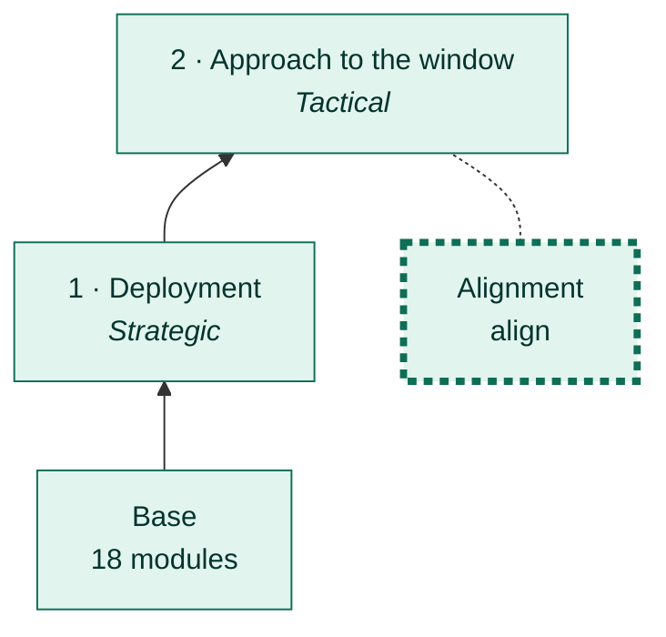
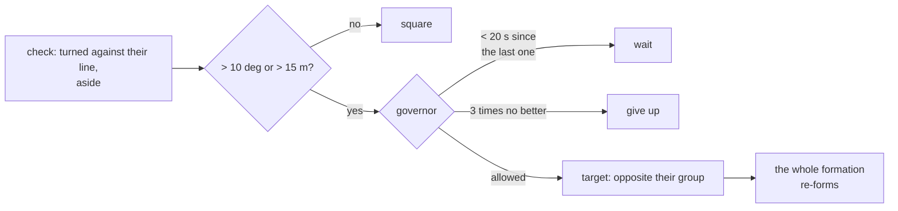

# Alignment

[← Back](README.md) · [Documentation](../README.md) › [AI tree](README.md) › Alignment · [Русский](../../ru/tree/align.md)

A branch of the approach: stand square opposite the enemy's main group so the wall faces their front.

## Place in the tree

<!-- generated:tree:here:align -->

<!-- /generated -->

## Card

<!-- generated:tree:card:align -->
| | |
|---|---|
| What it does | Turn to the enemy in place, never aside: from afar towards its centre (20 deg), within 270 m square to its front (10 deg) |
| Starts when | turned more than allowed |
| Without it | no alignment: the army steps along its own facing |
| Switch | `align` (on) |
| Kind, level | branch, Tactical |
| Grows from | [Approach to the window](approach.md) |
| Modules | [alignment](../apps/alignment.md), [battlefield](../apps/battlefield.md), [vision](../apps/vision.md) |
| Status | done |
<!-- /generated -->

## How it works

## How we align (since 28.09.2026, task 26)

Before, the army stood on the line the enemy **looks** along: it turned and walked aside. Against the
game's AI that became a chase: it turns to face our army by itself, 6–15 deg a burst, while its centre
stays (0.1–3.4 m); we shifted aside, it turned to us, we were "crooked" again. In 2 battles of 4 the army
was led onto rocks. See the [card, in Russian](../../ru/architecture/tasks/align-chase.md).

Now (`apps.alignment`, `line = 'front'`) it is **a turn in place only, never a shift aside**:

| Where we are | What we align with | Tolerance |
|---|---|---|
| farther than 270 m from their centre | their centre | 20 deg: a narrow lane is walked along, not across |
| nearer than 270 m | square to their front (the window needs our line along theirs) | 10 deg |
| a march to a point (no enemy) | the field's axis, turning and shifting as before | 10 deg and 15 m |

As our centre does not move aside, the game's AI does not start turning. The old alignment is
`line = 'enemy_facing'`.

| Battle `window_game`, game, x20 | Before | After |
|---|---|---|
| Aside at deployment | 245–344 m | 0 |
| Alignments before the stop line | 5–6 | 1 (a turn at 209 m) |
| "No place" | 2 battles of 4 | 0 |
| To the stop line | 595–620 s | 384–398 s (4 battles) |

## Checks

- `tests/apps/alignment/`; branch off = no alignment: `tests/tools/test_tree_branches.py`.

Modules: [alignment](../apps/alignment.md) · [battlefield](../apps/battlefield.md) · [vision](../apps/vision.md).
