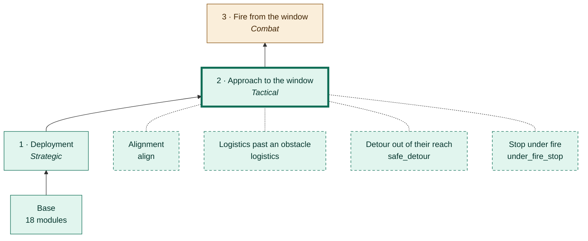
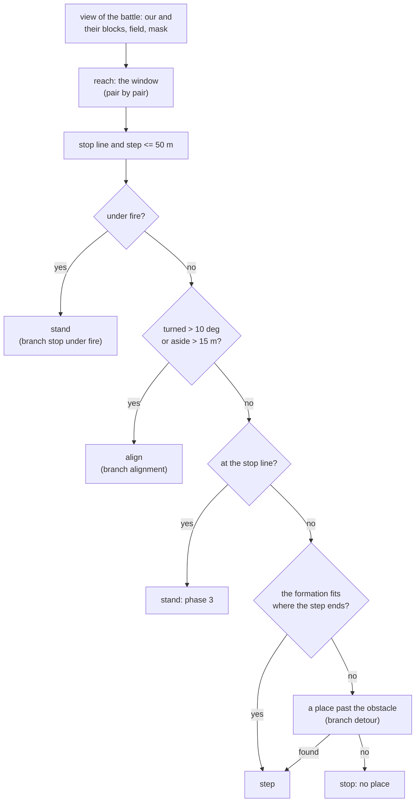
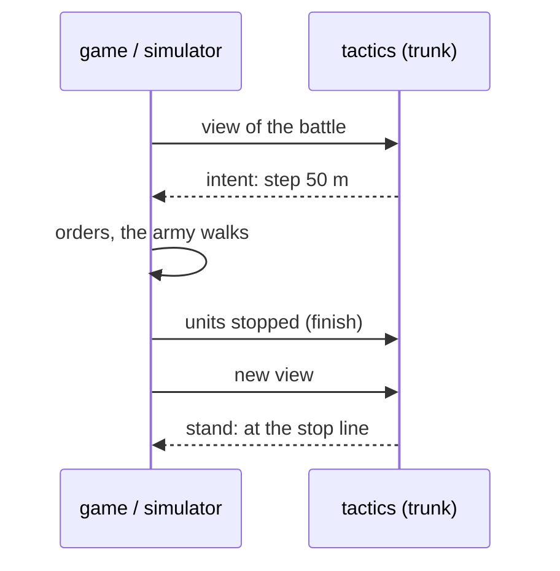
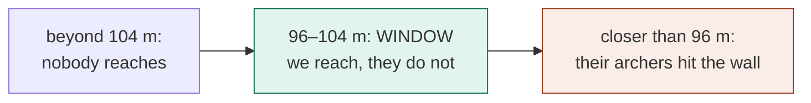
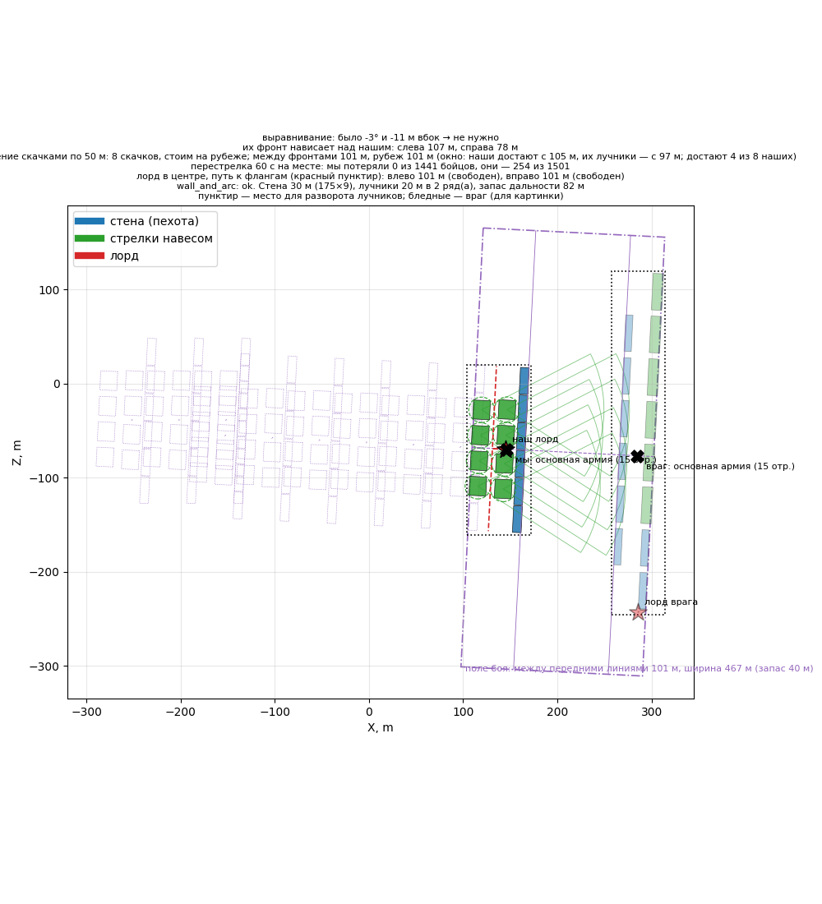

# Phase 2 · Approach to the window

[← Back](README.md) · [Documentation](../README.md) › [AI tree](README.md) › Approach to the window · [Русский](../../ru/tree/approach.md)

Step up and stand in the **window**: our first echelon reaches their infantry,
their archers do not reach our wall. The trunk `tactics` decides — the same in battle and in the simulation.

## Place in the tree

<!-- generated:tree:here:approach -->

<!-- /generated -->

## Card

<!-- generated:tree:card:approach -->
| | |
|---|---|
| What it does | In 50 m steps to the window: our archers reach them, theirs do not reach us; one action at a time; the formation is carried whole, a rock in the way — a step aside |
| Starts when | the army is deployed, the enemy is seen |
| Without it | the army stands where it was deployed |
| Switch | `approach` (on) |
| Kind, level | phase, Tactical |
| Grows from | [Deployment](deploy.md) |
| Modules | [tactics](../apps/tactics.md), [approach](../apps/approach.md), [reach](../apps/reach.md), [battlefield](../apps/battlefield.md), [vision](../apps/vision.md), [mask](../apps/mask.md) |
| Status | done |
<!-- /generated -->

## How it works

## Example

Simulation of the test armies in the open (the enemy stands as the game's AI did in the
test battle): 8 steps, stands 100.7 m from their front, window 96.7–104.7 m; 60 s of fire — us 0, them −254.

In battle (x20): the window from the real blocks — ours reach from 100 m, their archers
from 95 m; in the window, 59 s — us 0, them −96…−149. The game's AI does not stand
still: it re-forms as we come, and its spearmen charge after about 100 s (phases 3–5).

Watch this battle in motion, the game and the simulation side by side: [battle viewer](../launch/viewer.md).

## Checks

- `tests/apps/reach/`, `tests/apps/approach/`, `tests/apps/tactics/`; golden runs (15 armies);
- branch off = the army stands where deployed: `tests/tools/test_tree_branches.py`;
- battle: `window_game` (4 battles 28.09.2026).

Modules: [tactics](../apps/tactics.md) · [approach](../apps/approach.md) · [reach](../apps/reach.md) · [battlefield](../apps/battlefield.md) · [vision](../apps/vision.md) · [mask](../apps/mask.md).
