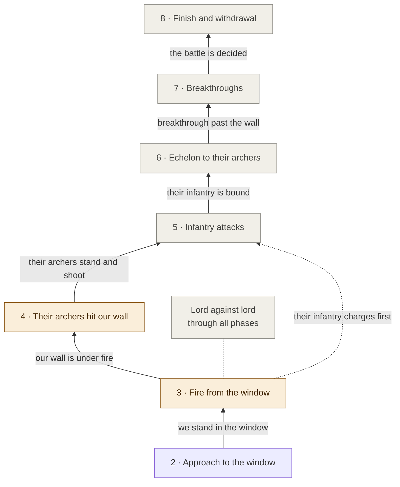

# Combat level · phases 3–8

[← Back](README.md) · [Documentation](../README.md) › [AI tree](README.md) › Combat level · [Русский](../../ru/tree/combat.md)

The phases after we stand in the window. Mostly the plan of the battle theory for
now; each phase has its starting condition and what the game has shown.

## 3 · Fire from the window

<!-- generated:tree:card:fire -->
| | |
|---|---|
| What it does | The first echelon shoots their infantry, the second is silent, the wall stands; wait until the enemy changes the picture |
| Starts when | we stand in the window |
| Without it | — |
| Switch | comes with the node |
| Kind, level | phase, Combat |
| Grows from | [Approach to the window](approach.md) |
| Modules | [missile](../apps/missile.md), [reach](../apps/reach.md) |
| Status | started |
<!-- /generated -->

From the game (4 battles, 28.09.2026):

| What the game's AI does | When |
|---|---|
| re-forms: some units 16–23 m forward, some 14–28 m back | fronts 189–196 m apart |
| the first spearmen unit charges | after 102–104 s |
| 2–3 more units and the lord | after 156–190 s |

In the window, 59 s: them −96…−149, us 0. The simulation says −254 — its damage is
1.7–2.6 times too high for now ([damage model](../apps/missile.md)).

## 4 · Their archers hit our wall

<!-- generated:tree:card:their_archers -->
| | |
|---|---|
| What it does | Their archers came up and hit our infantry; our first echelon does not reach them |
| Starts when | our wall is under fire |
| Without it | — |
| Switch | comes with the node |
| Kind, level | phase, Combat |
| Grows from | [Fire from the window](combat.md#3) |
| Modules | [tactics](../apps/tactics.md) |
| Status | started |
<!-- /generated -->

## 5 · Infantry attacks

<!-- generated:tree:card:infantry_attack -->
| | |
|---|---|
| What it does | The wall attacks their infantry or meets its charge, freeing room behind |
| Starts when | their archers stand and shoot |
| Without it | — |
| Switch | comes with the node |
| Kind, level | phase, Combat |
| Grows from | [Their archers hit our wall](combat.md#4) |
| Modules | — |
| Status | planned |
<!-- /generated -->

## 6 · Echelon to their archers

<!-- generated:tree:card:echelon_step -->
| | |
|---|---|
| What it does | The first echelon steps about 13 m forward and hits their archers |
| Starts when | their infantry is bound in melee |
| Without it | — |
| Switch | comes with the node |
| Kind, level | phase, Combat |
| Grows from | [Infantry attacks](combat.md#5) |
| Modules | — |
| Status | planned |
<!-- /generated -->

## 7 · Breakthroughs

<!-- generated:tree:card:breakthroughs -->
| | |
|---|---|
| What it does | The second echelon turns to a breakthrough past our wall |
| Starts when | a breakthrough past our wall |
| Without it | — |
| Switch | comes with the node |
| Kind, level | phase, Combat |
| Grows from | [Echelon to their archers](combat.md#6) |
| Modules | — |
| Status | planned |
<!-- /generated -->

## 8 · Finish and withdrawal

<!-- generated:tree:card:finish -->
| | |
|---|---|
| What it does | Later |
| Starts when | the battle is decided |
| Without it | — |
| Switch | comes with the node |
| Kind, level | phase, Combat |
| Grows from | [Breakthroughs](combat.md#7) |
| Modules | — |
| Status | planned |
<!-- /generated -->

## Lord against lord

<!-- generated:tree:card:lord_vs_lord -->
| | |
|---|---|
| What it does | Our lord binds their armoured lord from the centre, through all the combat phases |
| Starts when | their lord joins the fight |
| Without it | — |
| Switch | comes with the node |
| Kind, level | parallel branch, Combat |
| Grows from | [Fire from the window](combat.md#3) |
| Modules | — |
| Status | planned |
<!-- /generated -->

Their lord is armoured and we have nothing armour-piercing: our lord leaves the
centre and binds him. Until their lord joins, ours stays in the centre.
