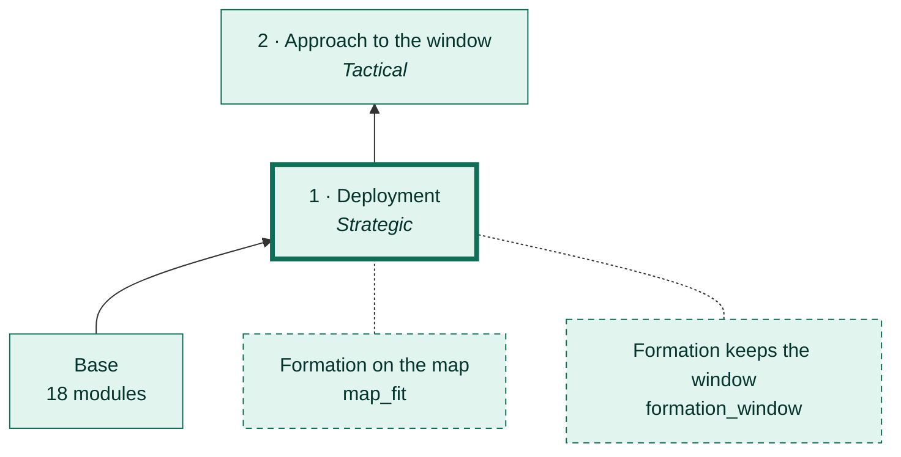
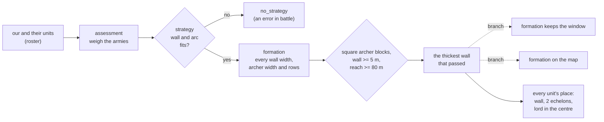
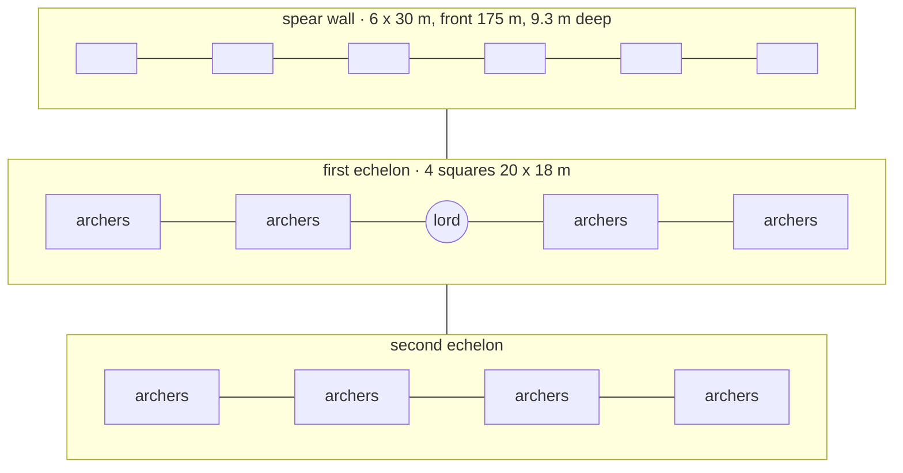

# Phase 1 · Deployment

[← Back](README.md) · [Documentation](../README.md) › [AI tree](README.md) › Deployment · [Русский](../../ru/tree/deploy.md)

The first phase and the tree's root: from the armies pick a strategy and place the formation.

## Place in the tree

<!-- generated:tree:here:deploy -->

<!-- /generated -->

## Card

<!-- generated:tree:card:deploy -->
| | |
|---|---|
| What it does | Weighs the armies, picks a strategy and places the formation: a spear wall, archers in two echelons, the lord in the centre |
| Starts when | the battle starts |
| Without it | the tree's root, cannot be off |
| Switch | — |
| Kind, level | phase, Strategic |
| Grows from | — |
| Modules | [plan](../apps/plan.md), [assessment](../apps/assessment.md), [strategy](../apps/strategy.md), [formation](../apps/formation.md) |
| Status | done |
<!-- /generated -->

## How it works

The lord stands in the centre, in a 10 m passage between the halves of the first
archer row: his job is to bind the armoured enemy lord, and from the centre every
flank is closer.

## Example

The test army (a lord, 6 spearmen, 8 archers) on the test battle's map (labels in Russian):

| What | Value |
|---|---|
| Wall | 6 x 30 m: front 175 m, 9.3 m deep |
| First echelon | its middle 21.3 m behind the wall's front |
| Lord's passage | 10 m planned, 11.7 m by the soldiers in battle |
| Lord | 0.1 m from the plan in battle; the way to a flank 101 m, clear |

## Checks

- `tests/apps/formation/` — 565 mixes of 2 to 20 units; `tests/apps/strategy/`, `tests/apps/plan/`;
- golden simulator runs (`tests/golden/`);
- battle 28.09.2026: all 15 units 0.5–2.4 m from the plan, held 60 s.

Modules: [plan](../apps/plan.md) · [assessment](../apps/assessment.md) · [strategy](../apps/strategy.md) · [formation](../apps/formation.md).
