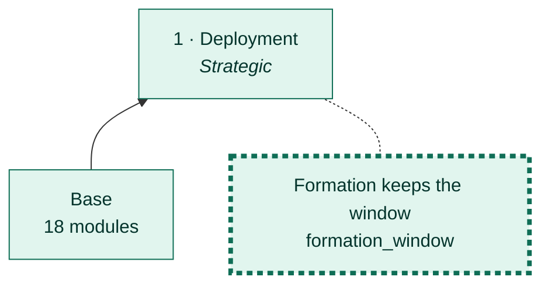
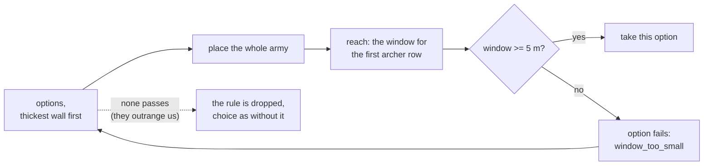
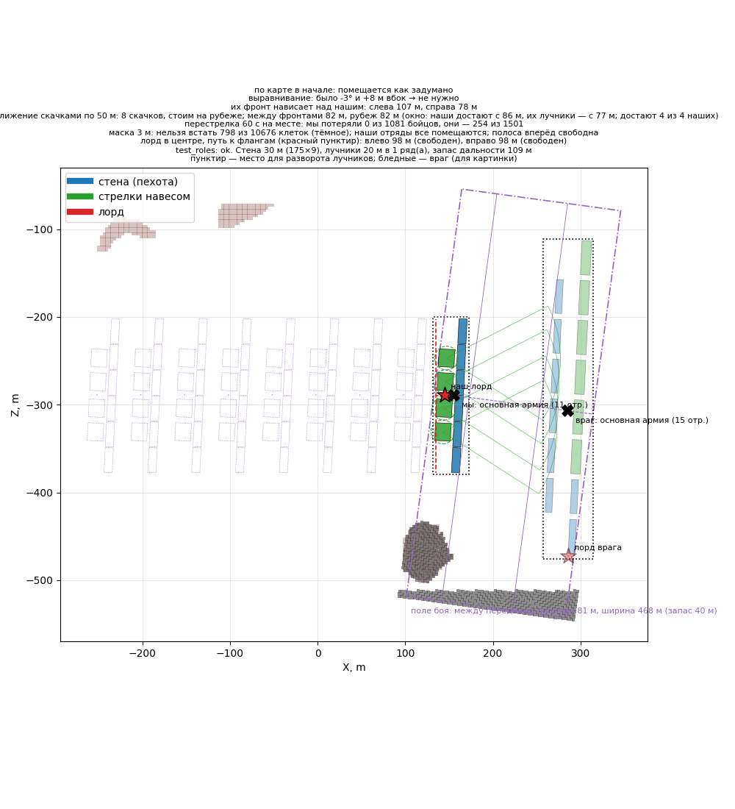

# Formation keeps the window

[← Back](README.md) · [Documentation](../README.md) › [AI tree](README.md) › Formation keeps the window · [Русский](../../ru/tree/formation_window.md)

A branch of deployment: the wall no thicker than the window allows. A thick wall
pushes our archers back from the front, while their shooters reach our wall from the same distance.

## Place in the tree

<!-- generated:tree:here:formation_window -->

<!-- /generated -->

## Card

<!-- generated:tree:card:formation_window -->
| | |
|---|---|
| What it does | The wall no thicker than the window against the enemy we see allows (>= 5 m) |
| Starts when | the enemy is seen |
| Without it | the thickest wall; the window is not checked |
| Switch | `formation_window` (on) |
| Kind, level | branch, Strategic |
| Grows from | [Deployment](deploy.md) |
| Modules | [formation](../apps/formation.md), [reach](../apps/reach.md) |
| Status | done |
<!-- /generated -->

## How it works

| Spearmen width | Wall (front x depth) | Ours reach from | Their archers from | Window |
|---|---|---|---|---|
| 15 m | 91 x 18.7 m | 94.3 m | 95.6 m | none |
| 20 m | 115 x 14.9 m | 98.1 m | 95.6 m | 2.5 m |
| **30 m** | **175 x 9.3 m** | **103.7 m** | **95.6 m** | **8.1 m** |
| 40 m | 237 x 7.7 m | 105.3 m | 95.6 m | 9.7 m |

Against the game's AI in the test battle (their archers about 32 m behind their front).

## Example

6 spearmen and 4 archers: without the branch — a 15 m wall and no window; with it — a 30 m wall, an 8 m window.

## Checks

- `tests/apps/formation/test_services.py`; branch off = the thickest wall: `tests/tools/test_tree_branches.py`;
- battle 28.09.2026 (`window_game_few`): the wall re-planned to 30 m once the enemy stood in lines; in the window, 59 s — us −12, them −55.

Modules: [formation](../apps/formation.md) · [reach](../apps/reach.md).
