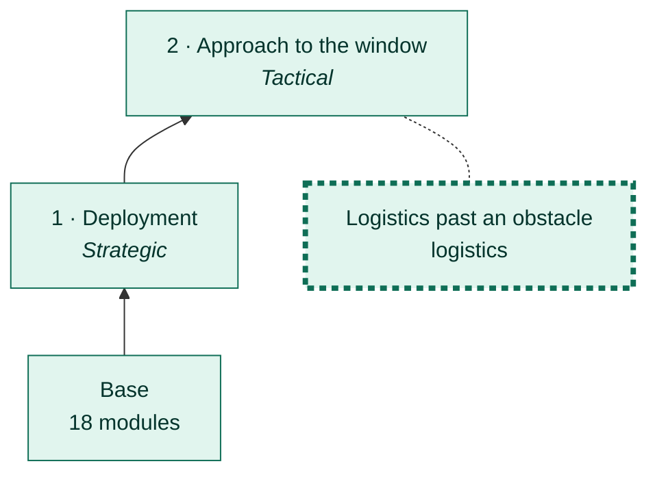
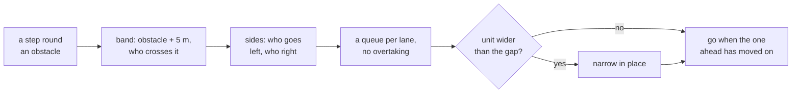
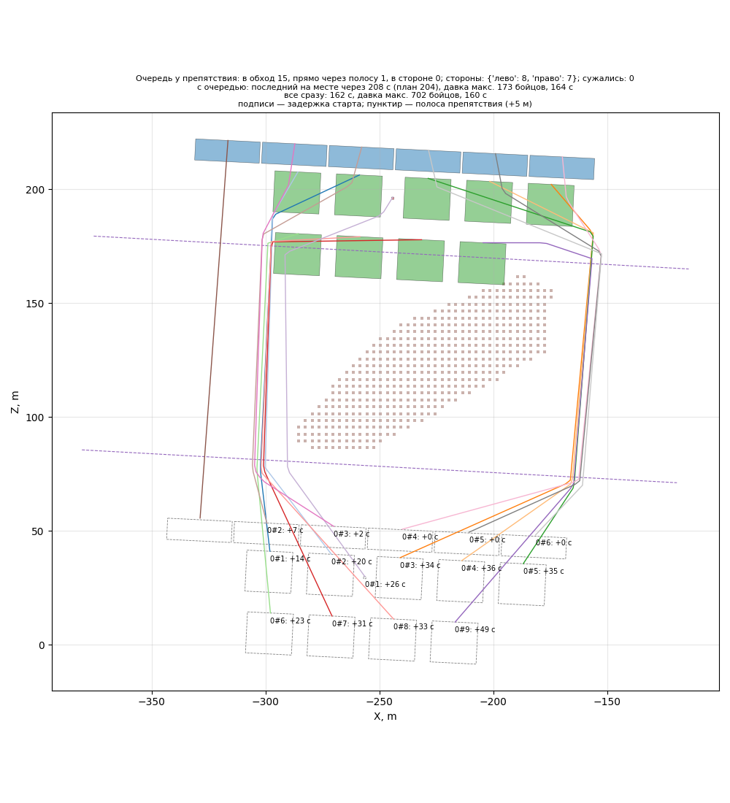

# Logistics past an obstacle

[← Back](README.md) · [Documentation](../README.md) › [AI tree](README.md) › Logistics · [Русский](../../ru/tree/logistics.md)

A branch of the approach: when a step walks round an obstacle, units pass it in
queues, not in a crowd. **Off** by default — the engine walks round by itself.

## Place in the tree

<!-- generated:tree:here:logistics -->

<!-- /generated -->

## Card

<!-- generated:tree:card:logistics -->
| | |
|---|---|
| What it does | Queues past an obstacle: who goes round, which side, in which order and width |
| Starts when | a step walks round an obstacle |
| Without it | the engine walks the units round an obstacle by itself |
| Switch | `logistics` (off) |
| Kind, level | branch, Tactical |
| Grows from | [Approach to the window](approach.md) |
| Modules | [logistics](../apps/logistics.md), [mask](../apps/mask.md) |
| Status | done |
<!-- /generated -->

## How it works

## Example

A long wall at a rock (16 units): queues on both sides, no crowding.

In motion, with the queue and all at once side by side: `python -m tools.viewer logistics rock_march_wide` — [battle viewer](../launch/viewer.md#round-an-obstacle-in-queues).

## Checks

- `tests/apps/logistics/`; battle 27.09.2026: 5 kinds of ground, Skaven too; backlog #18.

Modules: [logistics](../apps/logistics.md) · [mask](../apps/mask.md).
