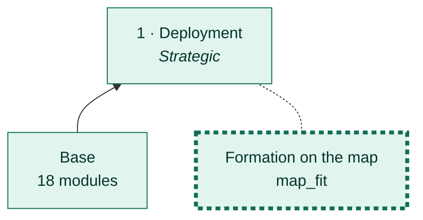
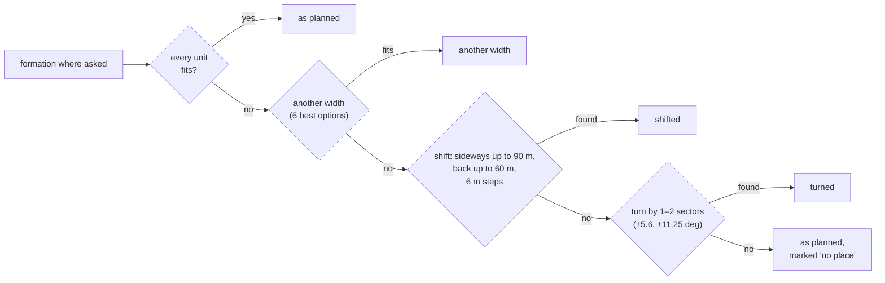
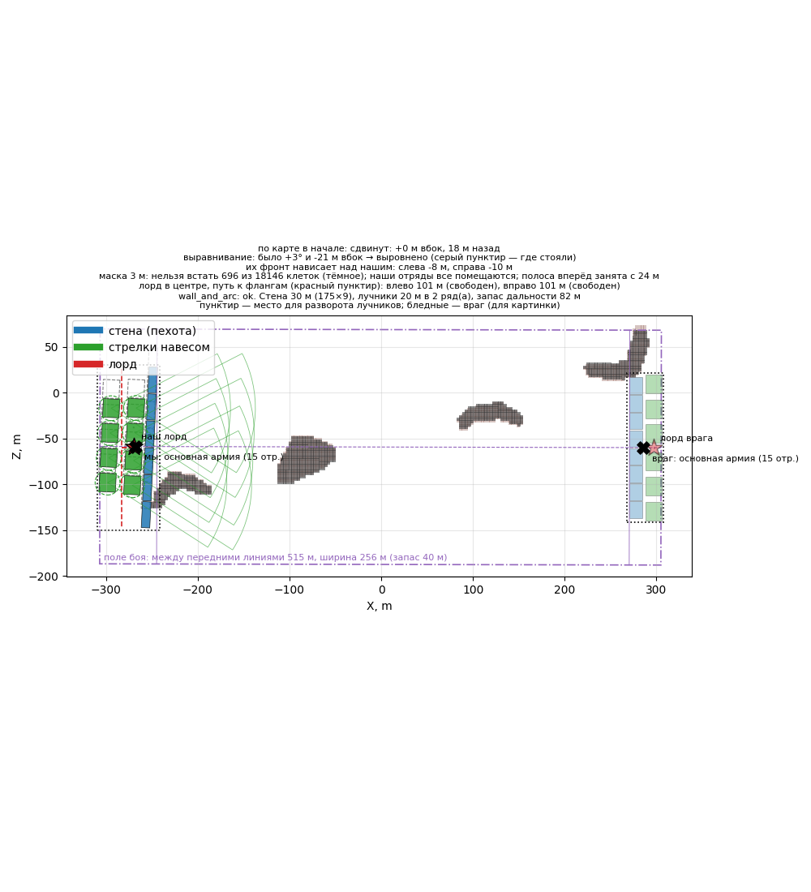

# Formation on the map

[← Back](README.md) · [Documentation](../README.md) › [AI tree](README.md) › Formation on the map · [Русский](../../ru/tree/map_fit.md)

A branch of deployment: the formation does not stand on rocks. On a rock the
engine sets a unit crooked (up to 18 m off, facing 172 deg instead of 90 — measured 28.09.2026).

## Place in the tree

<!-- generated:tree:here:map_fit -->

<!-- /generated -->

## Card

<!-- generated:tree:card:map_fit -->
| | |
|---|---|
| What it does | When the formation does not fit on the rocks: another width, a shift sideways and back, a turn by a sector |
| Starts when | a captured map (the mask) is given |
| Without it | the formation stands where asked; the map is not considered |
| Switch | `map_fit` (on) |
| Kind, level | branch, Strategic |
| Grows from | [Deployment](deploy.md) |
| Modules | [formation](../apps/formation.md), [mask](../apps/mask.md) |
| Status | done |
<!-- /generated -->

## How it works

## Example

The test battle: part of the formation would stand on a rock — it moved 18 m back and fits.

## Checks

- `tests/apps/formation/test_fit.py`; branch off = the formation without the map: `tests/tools/test_tree_branches.py`;
- battle 28.09.2026: 15 units 0.5–1.0 m from the plan, none on a rock.

Modules: [formation](../apps/formation.md) · [mask](../apps/mask.md).
