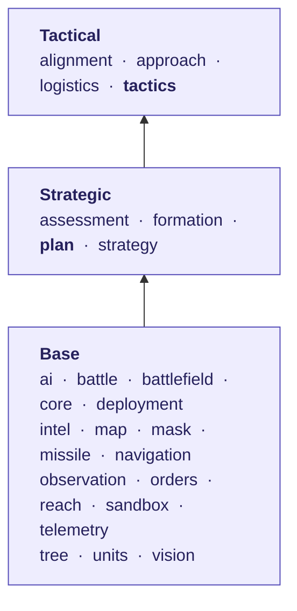

# Module map

[← Back](README.md) · [Documentation](../README.md) › [AI tree](README.md) › Module map · [Русский](../../ru/tree/modules.md)

Which code modules sit on which level and who uses whom. Arrows point up — from
a level to the one built on it.

<!-- generated:tree:modules -->

| Module | Level | Uses | Used by |
|---|---|---|---|
| [ai](../apps/ai.md) | Base | — | sandbox |
| [battle](../apps/battle.md) | Base | — | — |
| [battlefield](../apps/battlefield.md) | Base | — | alignment, logistics, mask |
| [core](../apps/core.md) | Base | — | all |
| [deployment](../apps/deployment.md) | Base | orders, units | — |
| [intel](../apps/intel.md) | Base | — | observation |
| [map](../apps/map.md) | Base | — | mask, navigation |
| [mask](../apps/mask.md) | Base | battlefield, map | tactics |
| [missile](../apps/missile.md) | Base | reach | — |
| [navigation](../apps/navigation.md) | Base | map | — |
| [observation](../apps/observation.md) | Base | intel, units | — |
| [orders](../apps/orders.md) | Base | units | deployment, plan, sandbox |
| [reach](../apps/reach.md) | Base | — | formation, missile, tactics |
| [sandbox](../apps/sandbox.md) | Base | ai, orders | — |
| [telemetry](../apps/telemetry.md) | Base | — | — |
| [tree](../apps/tree.md) | Base | — | plan, tactics |
| [units](../apps/units.md) | Base | — | deployment, observation, orders |
| [vision](../apps/vision.md) | Base | — | — |
| [assessment](../apps/assessment.md) | Strategic | — | plan |
| [formation](../apps/formation.md) | Strategic | reach | plan |
| **[plan](../apps/plan.md)** (the level's trunk) | Strategic | assessment, formation, orders, strategy, tree | — |
| [strategy](../apps/strategy.md) | Strategic | — | plan |
| [alignment](../apps/alignment.md) | Tactical | battlefield | tactics |
| [approach](../apps/approach.md) | Tactical | — | tactics |
| [logistics](../apps/logistics.md) | Tactical | battlefield | — |
| **[tactics](../apps/tactics.md)** (the level's trunk) | Tactical | alignment, approach, mask, reach, tree | — |
<!-- /generated -->

## Level rules

| Level | What is there | Who may call it |
|---|---|---|
| Base | engine, data, rules of the game: `orders`, `units`, `map`, `mask`, `vision`, `reach`, `missile`, `tree`… | everything above |
| Strategic | phase 1: `assessment`, `strategy`, `formation`; trunk — `plan` | tactical and combat |
| Tactical | phase 2: `alignment`, `approach`, `logistics`; trunk — `tactics` | combat |
| Combat | phases 3–8 (ahead) | — |

- **Dependencies only go down.** A module never calls a level above it.
- **On one level** only the level's **trunk** (`plan`, `tactics`) calls its nodes, so
  nodes are not tied to each other and switch off one by one.
- **Pure code** (`services`, `contract`, `data`) never touches the game; only `adapter` does.
- **Unit keys and measurements** live only in data modules (`data.lua`, `data/`).

`tests/architecture/` checks all of it; the levels are in `tools/architecture.py`.
Every module — [modules](../apps/README.md).
