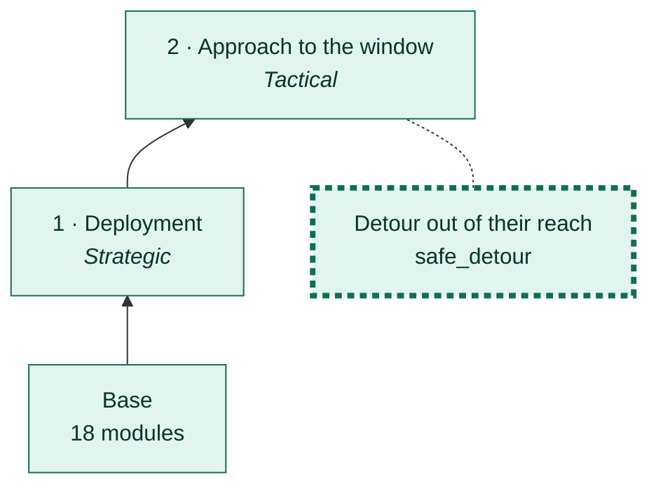
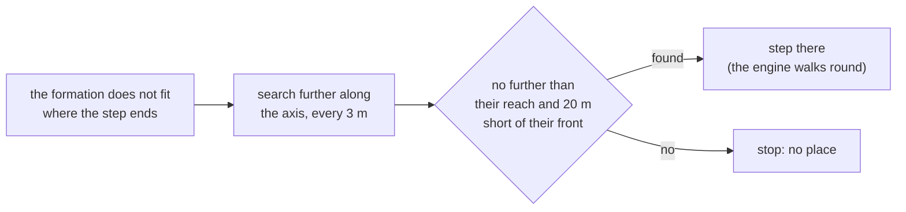

# Detour out of their reach

[← Back](README.md) · [Documentation](../README.md) › [AI tree](README.md) › Detour out of their reach · [Русский](../../ru/tree/safe_detour.md)

A branch of the approach: when the formation does not fit where a step ends, a
place past the obstacle is searched **only where their shooters do not reach**.

## Place in the tree

<!-- generated:tree:here:safe_detour -->

<!-- /generated -->

## Card

<!-- generated:tree:card:safe_detour -->
| | |
|---|---|
| What it does | A place past an obstacle is searched only out of their shooters' reach |
| Starts when | the formation does not fit where the step ends |
| Without it | a place past an obstacle is searched up to 20 m short of their front |
| Switch | `safe_detour` (on) |
| Kind, level | branch, Tactical |
| Grows from | [Approach to the window](approach.md) |
| Modules | [tactics](../apps/tactics.md), [approach](../apps/approach.md), [reach](../apps/reach.md) |
| Status | done |
<!-- /generated -->

## How it works

## Example

A rock across the way, close to them (`rock_attack`):

| With the branch: stop before the rock | Without: past the rock, under their archers |
|---|---|
|  |  |

## Checks

- branch off = the old behaviour (past the rock): `tests/tools/test_tree_branches.py`; golden `rock_attack`, `rock_attack_wide`.

Modules: [tactics](../apps/tactics.md) · [approach](../apps/approach.md) · [reach](../apps/reach.md).
