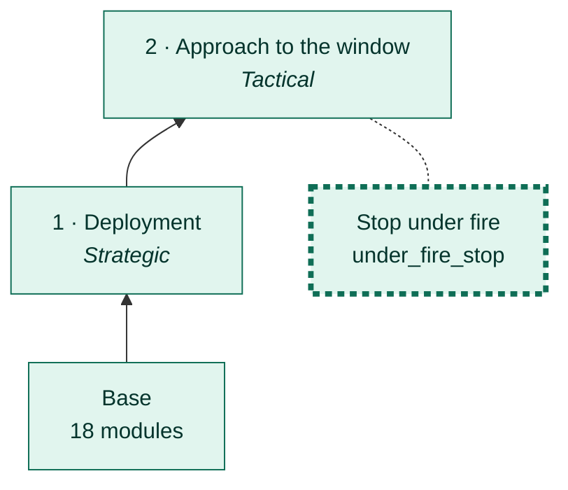
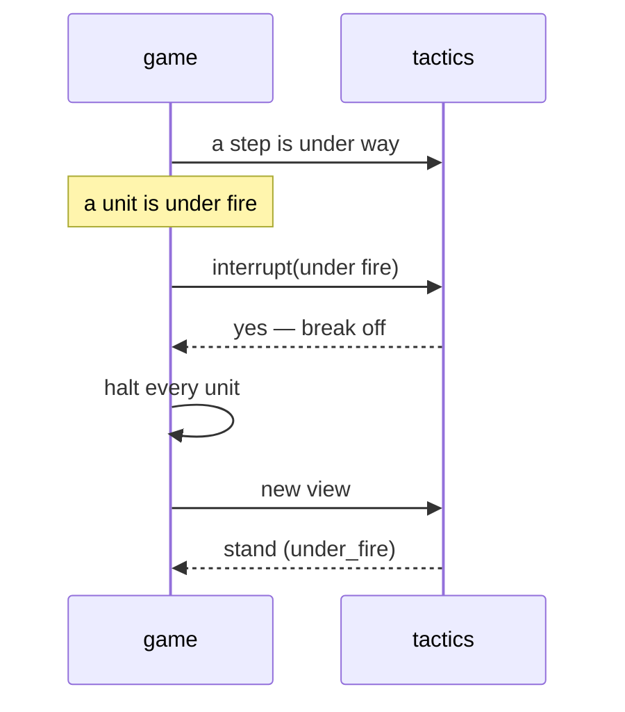

# Stop under fire

[← Back](README.md) · [Documentation](../README.md) › [AI tree](README.md) › Stop under fire · [Русский](../../ru/tree/under_fire_stop.md)

A branch of the approach, the only exception to "one action at a time": if a unit
of ours is under fire, the manoeuvre is broken off and nothing new is started — the battle phases decide.

## Place in the tree

<!-- generated:tree:here:under_fire_stop -->

<!-- /generated -->

## Card

<!-- generated:tree:card:under_fire_stop -->
| | |
|---|---|
| What it does | Under fire a manoeuvre is broken off and nothing new is started |
| Starts when | a unit of ours is under missile attack |
| Without it | one action at a time even under fire |
| Switch | `under_fire_stop` (on) |
| Kind, level | branch, Tactical |
| Grows from | [Approach to the window](approach.md) |
| Modules | [tactics](../apps/tactics.md), [approach](../apps/approach.md) |
| Status | done |
<!-- /generated -->

## How it works

## Example

| | Without the branch | With it |
|---|---|---|
| A manoeuvre under fire | waited 6 min for it to end | broken off at once |
| Result | the army was beaten | us −26, them −75 in 59 s |

## Checks

- `tests/apps/approach/`, `tests/apps/tactics/`; branch off = one action at a time: `tests/tools/test_tree_branches.py`.

Modules: [tactics](../apps/tactics.md) · [approach](../apps/approach.md).
