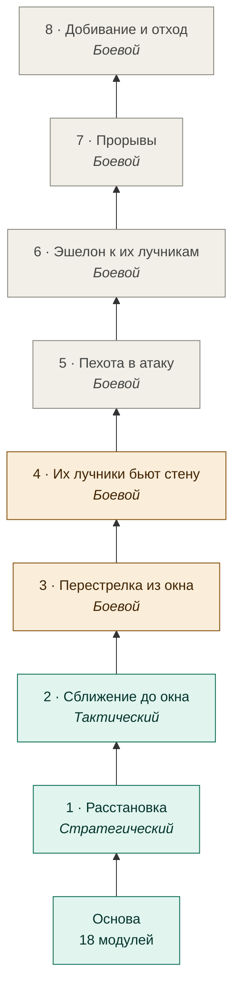

# Документация

[← Назад](../../README.md) · [Проект](../../README.md) · **Русский** | [English](../en/README.md)

## Дерево ИИ — начните отсюда

Всё, что делает боевой ИИ, по фазам и веткам, со схемами и примерами — **[Дерево ИИ](tree/README.md)**.

<!-- generated:tree:trunk -->

<!-- /generated -->

- [Все узлы и переключатели](tree/README.md#все-узлы) · [Карта модулей по уровням](tree/modules.md) · [Как вести документацию](architecture/documentation.md)

## Архитектура

- [Устройство проекта и слои](architecture/overview.md) — папки, слои приложения, правила зависимостей, поток тика.
- [Список приложений](architecture/apps.md) — что делает каждое приложение и откуда оно перенесено.
- [Архитектура ИИ: исследование и проект](architecture/ai-design.md) — рабочий черновик: требования, исследование, уровни решений, структура кода.
- [Задача: отряды идут строем](architecture/tasks/obstacles.md) — отложена; карточка с данными и выводами.
- [Стратегии](architecture/strategies.md) — список стратегий боя и система выбора между ними.
- [Будущие задачи](architecture/tasks/backlog.md) — что решили сделать потом и что по ним уже известно.
- [Ошибки и неизвестные значения](architecture/error_handling.md) — `known/unknown`, коды ошибок, защита колбэков.

## Окружение и запуск

- [Установка и настройка](environment/setup.md) — Python, `.venv`, `config/local.json`, путь к игре.
- [Сборка pack](launch/build.md) — цели `duel`, `arena`, `map-capture`, бандлер модулей, формат PFH5.
- [Запуск боя и результаты](launch/run.md) — launcher, правила безопасности, где лежат результаты, мод True Sight.
- [Проигрыватель боя](launch/viewer.md) — бой из игры и симуляции на странице в реальном времени: слои, наборы, рядом на общих часах.

## Тестирование

- [Тесты без игры](testing/tests.md) — pytest + lupa, поддельный `bm`, как писать тесты.
- [Симулятор](testing/simulator.md) — бой без игры: та же логика, ходьба как у движка, сверка с игрой.

## Приложения (`src/apps`)

| Приложение | Назначение |
|---|---|
| [core](apps/core.md) | Проверки значений, JSON, коды ошибок, время |
| [battle](apps/battle.md) | Стороны, армии, отряды, роли атакующего/защитника |
| [map](apps/map.md) | Рамка радара, сетка, высоты, грунт, объекты |
| [navigation](apps/navigation.md) | Достижимость точек для конкретного отряда |
| [units](apps/units.md) | Состояние своих отрядов, дальность стрельбы, ширина строя |
| [intel](apps/intel.md) | Видимость врагов и последняя известная позиция |
| [orders](apps/orders.md) | Контракт команд и проверенные вызовы приказов |
| [deployment](apps/deployment.md) | Начальная расстановка `deployment-placement-v2` |
| [ai](apps/ai.md) | Профили, контракт решений, политики |
| [observation](apps/observation.md) | Сводка одной стороны — вход ИИ без скрытых данных |
| [sandbox](apps/sandbox.md) | Загрузка внешних политик с ограничениями |
| [telemetry](apps/telemetry.md) | JSONL-события, файлы состояния, послебоевые снимки |
| [Точки входа](apps/entries.md) | `duel`, `arena`, `map_capture` — сборка приложений в бой |

## Знания об игре

- [Что проверено в WH3](game/README.md) — карта, отряды, каталог карт.
- [Каталог показателей](game/readouts.md) — что можно собирать об отрядах и бое, что уже собираем.
- [Визуальный атлас](game/atlas.md) — главные изображения исследований.

## Исследования

- [Архив исследований](research/README.md) — отчёты по данным карты, запуску, доказательства и старые скрипты.
