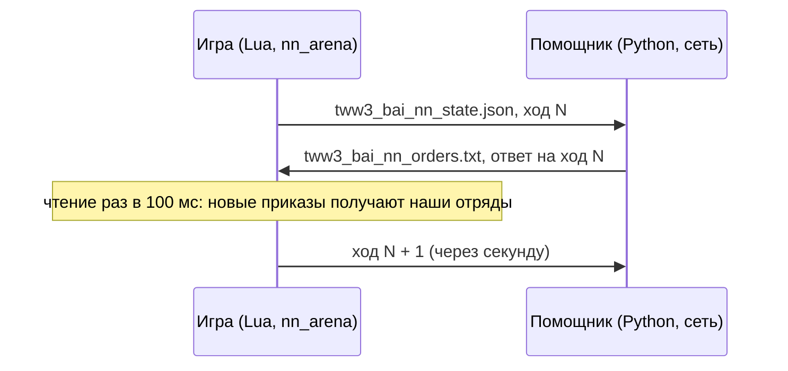

# bridge

[← Назад](README.md) · [Документация](../README.md) · [Приложения](../architecture/apps.md) · [English](../../en/apps/bridge.md)

Мост к нейросети: нашей стороной настоящего боя командует сеть в программе-помощнике вне игры
(`tools/nn/companion/`). Игра и помощник общаются через два файла в папке игры. Код:
`src/apps/bridge/`. Как запустить и смотреть: [смотреть бой сети](../launch/watch.md).



## Как это работает

- На каждом **решении** (`decide_ms`, по умолчанию 1 с времени боя) игра пишет состояние всех
  отрядов обеих сторон со следующим **номером хода**.
- Помощник строит из него вход сети. То, чего не увидел бы человек, скрывается там же (сводка
  стороны, [вход сети](../training/model.md)): игра пишет всё, сводка помощника прячет лишнее.
- **Точка приказа** (`ox`, `oz` наших отрядов): помощник заменяет показание игры точкой, как её
  даёт симулятор (`exchange.order_points`, по отданным им приказам): у стоящего отряда — его же
  место, у атакующего — цель, у движения — точка движения. `ordered_position` игры для движения
  тоже точка, но для стояния и атаки — ~10 м от самого отряда (проверка it2: медиана 9,8 м от
  отряда, а не у цели). С таким входом сеть не узнавала свой действующий приказ и решала заново:
  прогон записей проверки через сеть вне игры дал те же 15,6 смены приказа на отрядо-минуту, что в
  игре (и с выбором по вероятностям, и по максимуму — значит, дело не в мосте); симулятор с точкой
  как в игре дал 30 вместо своих 5,5. Записи (`nn_sample`) хранят сырое значение игры.
- **Бег** (`f`): помощник заменяет показание игры признаком, как его даёт симулятор
  (`exchange.running_by_speed`): отряд движется (`mv`) и быстрее своего шага (паспорт) + 0,3 м/с,
  скорость — между прошлым состоянием и этим; в первом состоянии боя никто не бежит. `f` игры — это
  `unit:is_moving_fast()`, режим бега отряда, а не его скорость: в проверке из 8 боёв он
  включён в 74 % отрядо-секунд, когда отряд стоит (< 0,3 м/с) в рукопашной, и в 99 % рукопашных секунд
  ИИ игры; у симулятора `f` включён в 3-4 % рукопашных секунд. По скорости отряды ИИ игры в рукопашной
  бегут 9 % времени, как в симуляторе. Записи хранят сырое значение игры (повтор берёт его как приказ
  бежать).
- **Цель** (`t` наших отрядов, вход сети `has_target`): помощник заменяет показание игры целью, как её
  даёт симулятор (`exchange.engaged_targets`): цель есть ровно тогда, когда отряд дерётся или стреляет (цель
  движка). Дерущийся получает ту цель, что в симуляторе: ближайшего стоящего врага, которого касается
  (прямоугольники строёв по паспорту и ширине из раскладки, края ближе 2,5 м внахлёст, у одиночки — 1 м,
  ещё 2 м, если кто-то из двоих уже в рукопашной: `contact.reach_m`, `lord_reach_m`, `hold_m`); если по этой
  геометрии он не касается никого, а игра говорит «рукопашная» — цель движка, если это живой враг, иначе
  ближайший враг. Раньше дерущийся брал цель движка, а в игре это цель приказа атаки (держится ~25 с), а не
  тот, с кем он дерётся: скрипт `ai_like` за врага «видел» свой отряд в бою с нашим стрелком, на которого его
  послал, и держал приказ (62 % переназначений держались 5 с, в двойнике 7 %, `build/bench2/o_revert_p1.txt`).
  Тот же вход читает и сторона сети (`loop.Brain`) — исправлено для обеих. `t` игры — цель движка: цель
  приказа атаки с момента приказа (99 % свободных отрядов под атакой), а у большинства отрядов в
  рукопашной под удержанием (74 %) или движением (100 %) её нет. В проверке тот же сдвиг,
  внесённый в симулятор, снизил размен сети против `ai_like` на 0,105 за бой и сдвинул её приказы к
  смеси игры (удержание 0,73 -> 0,63, атака 0,17 -> 0,24, движение 0,10 -> 0,13; в игре 0,61 / 0,23 /
  0,16). Записи хранят сырое значение игры.
- Помощник отвечает приказами на этот ход. Игра читает файл раз в 100 мс времени боя
  (`poll_ms`) и отдаёт каждому нашему отряду его приказ.
- **Повторно отдаётся только изменившийся приказ**: другой вид, другая цель, бег вместо шага или
  точка дальше 5 м от прежней. Иначе отряд каждую секунду заново начинал бы путь.
- **Нет ответа к следующему решению** — действуют прежние приказы; событие `nn_miss`.
  Опоздавший ответ (на прежний ход) всё равно берётся; `lag` в событии говорит, насколько он опоздал.
- **Бегущие, разбитые и погибшие отряды приказов не получают**: ими управляет игра. Помощник не
  пишет для них строки (HOLD сети для отряда, который приказов не принимает, — лишь заполнитель), а
  мост не берёт приказ из ответа на состояние, в котором отряд был не в строю (`down_at`; считается в
  `skipped`). Без этого HOLD-заполнитель доставался отрядам, собравшимся между состоянием и ответом, и
  останавливал их: первый приказ после 42 из 102 сборов в одной проверке.
- **Собравшийся отряд продолжает свой приказ.** Движок теряет приказ побежавшего отряда; симулятор
  его хранит, и отряд продолжает его в тот же миг, как соберётся. Поэтому мост хранит приказ, который
  был у отряда в момент бегства, и отдаёт его снова сразу, как отряд снова в строю (проверка на
  каждом опросе; событие `nn_rally`, считается в `nn_regiven`); атака на цель, которой больше нет,
  становится «стоять», как в симуляторе. Без этого отряд стоит до следующего ответа сети, а сеть,
  видя его стоящим далеко от цели, часто оставляла его стоять (прогон записей вне игры: HOLD
  0,41-0,43 у стоящего, 0,11-0,12, если он виден идущим к цели, как в симуляторе).
- **Чего мост не меняет:** отряд под «стоять» вдали от врага так и стоит. Сеть (`test5/it6/m40`)
  держит свой отряд под HOLD без врага рядом на HOLD (вне игры: 0,999-1,0; точка приказа на враге:
  атака 0,82-0,98; мораль, усталость и здоровье ничего не меняют), а собираются отряды в 75-255 м от
  ближайшего врага. В проверке из 8 боёв: из 102 сборов 37 кончились стоянием 30 с и дольше
  (17 стояли и до бегства); 48 % решений по собравшимся отрядам — HOLD (из них 78 % без дела) против
  10 % у ни разу не бежавших. В симуляторе та же привычка, слабее: собравшиеся отряды под HOLD 24 %
  своего времени, из него 38 % без дела (6 боёв против ai_like). Это дело обучения, не моста.
- **Стрелок под «стоять» стреляет как в симуляторе.** В симуляторе стоящий стрелок
  бьёт ближайшего врага в дальности (и в ближний бой тоже). Огонь по выбору игры — нет: остановленный
  стрелок сам берёт цель, часто чуть дальше дальности, держит её и стоит (проверка it4, 8 боёв:
  стоящие стрелки с врагом в дальности по мерке симулятора стреляли в течение 10 с в 40 % секунд под
  «стоять», 98 % под приказом атаки, 90–97 % у ИИ игры; один отряд пращников простоял 155 с с полным
  боезапасом). Поэтому раз в решение мост выбирает цель каждому стоящему стрелку
  (`services.hold_target`: ближайший стоящий видимый враг в пределах дальности между центрами,
  `HOLD_REACH_M` = 0, иначе ближайший бегущий; цель дальше дальности движок заставляет идти вперёд, а стрелок
  симулятора под «стоять» не ходит никогда — с прежними 10 м стрелки `ai_like` под «стоять» сдвигались больше
  чем на 4 м за 3 с в 17 % времени, `build/audit_orders`; выбранная цель держится, пока подходит) и даёт её как цель
  приказа атаки, шагом, с тем же надзором (`fire_freely`, `missile_duty`). Стоящий стрелок, который
  пошёл к цели и идёт `HOLD_WALK` = 2 решения, останавливается и стреляет по выбору `FREE_MIN`
  решений (`services.hold_guard`): «стоять» не ходит. Событие `nn_hold` (`aim`, `none`, `halt`);
  `nn_hold_aims`, `nn_hold_halts` в итоге.
- **Приказ, потерянный движком, отдаётся снова.** Движок забывает приказ атаки (или движения)
  отряда после схватки, в которую того втянуло: отряд стоит там, где схватка кончилась, а мост
  считает приказ действующим и тот же приказ не отдаёт (проверка it5: наш лорд под приказом атаки
  пращников в 80–170 м простоял 92 с после того, как отбился от вражеского лорда, в другой раз 14 с).
  Поэтому отряд под приказом атаки в ближнем бою, чья цель дальше `STALL_M` = 20 м (между центрами),
  или под приказом движения, чья точка дальше `STALL_POINT_M` = 15 м, который стоит — не идёт, не
  в рукопашной, не стреляет, не теряет здоровье — `STALL_AFTER` = 3 решения, получает приказ снова
  (`services.order_stalled`; атаку стрелка ведёт его надзор). Событие `nn_stall`; `nn_stalls` в итоге.
- **Журнал компаньона считает отряды без приказов как `out`.** Сеть даёт мёртвым, бегущим и
  рассеянным отрядам HOLD (игра им ничего не даёт); строка «hold 15 attack 5» в конце боя проверки —
  это ~13 таких отрядов. Настоящая доля «стоять» у управляемых отрядов в проверке it4 — 7,6 %
  (оценка в симуляторе 5,5 %).
- **Стрелок, который не может стрелять по своей цели, отпускается стрелять по своему выбору.** В
  игре стрелок с явной целью, в которую он не может попасть (цель в рукопашной с нашими, не видна),
  стоит и другую цель не берёт: в одном бою проверки 722 отрядо-секунды с целью в рукопашной и 149
  со свободной целью в досягаемости; доля стрельбы наших лучников 0,39–0,80 против 0,94–0,99 у
  пращников ИИ игры. Поэтому:
  - приказ атаки на цель, которая стоит в рукопашной в досягаемости стрелка (центр к центру),
    отдаётся как стрельба по выбору, а не как явная цель (`services.fire_freely`);
  - на каждом решении мост проверяет каждого стрелка с приказом атаки (`services.missile_duty`):
    стоит без дела (не идёт, не в рукопашной, не стреляет, есть боезапас) `RELEASE_AFTER` = 4
    решения — отпускается стрелять по выбору. Счёт идёт и через новые цели сети: она меняет цель
    стрелка раз в ~5 с, и счёт, начинавшийся заново с каждым приказом, до 4 не доходил (первая
    попытка в игре: осталось 742 отрядо-секунды без дела);
  - стрельба по выбору — это `halt()` + `fire_at_will(true)`: цель выбирает игра, как у её
    собственных стрелков. Приказанная цель отдаётся снова, когда она вышла из рукопашной, не
    раньше чем через `FREE_MIN` = 10 решений (событие `nn_duty`). Приказ сети всё это время тот
    же: тот же приказ ещё раз новым не считается. Если движок остался без подходящей цели,
    раньше срабатывает восстановление `nn_reaim`, описанное ниже.

  В игре, без этих правил и с ними (бой 4 проверки, зерно 1000900008; каждый раз другой сэмплированный бой):

  | | До | После |
  |---|---|---|
  | Наши лучники в движении под приказом атаки с бегом = 1 | 1,46 м/с (медиана) | 3,01 м/с |
  | Доля стрельбы наших лучников после первого выстрела | 0,59 (0,41–0,80) | 0,75 (0,38–0,97) |
  | Без дела под приказом атаки (стоит, есть боезапас, не стреляет), отрядо-с на секунду боя | 1,43 | 0,78 |
  | Первый приказ после сбора | до 77 с (128 с в бою 2) | за 0,4 с; 0 секунд без дела |

- **Стрелку, который уже стреляет по своей цели, она снова не отдаётся.** В игре любой приказ
  сбрасывает прицеливание стрелка: отряд, стрелявший в предыдущие 3 с, стоящий с врагом в
  досягаемости, получив приказ атаки, стреляет в 0,35 / 0,26 следующих 10 с (стрелы / пращи) против
  0,47 / 0,42 без приказа (задача симулятора 2, 04.10.2026). На цели (`services.on_target`): стоит
  (не идёт, не в рукопашной), цель движка (поле строки `t`) — этот отряд, и он стреляет сейчас или
  стрелял за последние `FIRE_RECENT` = 3 решения (флаг стрельбы между залпами гаснет на 1–3 с: 104
  из 116 разрывов). Тогда:
  - атака (сети, `resume` дела стрелка, цель стоящего стрелка) на этот отряд движку ничего не
    отдаёт (статус `kept`, событие `nn_aim_kept`); одна сменившаяся отметка бега тоже не отдаётся;
  - HOLD оставляет цель движка целью стоящего стрелка вместо `halt()`, если `hold_target` выбрал бы
    её же (событие `nn_hold` `keep`); стоящий стрелок без цели берёт отряд, по которому стреляет,
    пока тот подходит;
  - атака на цель в рукопашной в досягаемости (стрельба по выбору) не останавливает стрелка,
    который уже стреляет стоя (`services.firing`; событие `nn_duty` `free_kept`);
  - когда движок ушёл с этой цели (другая цель, нет стрельбы `FIRE_RECENT` решений), приказ
    отдаётся по-настоящему (событие `nn_duty` `engine_off`).

  Проверка 20261004-071805 (8 боёв, 210 стрелко-минут), её записанные приказы через эти правила
  офлайн: приказов нашим стоящим стрелкам, пока они стреляют, 1,53 на стрелко-минуту → 1,03 (бои
  04.10 днём, 139 стрелко-минут: 2,38 → 1,44); проверка ухода с цели добавляет 0,01. Всех приказов
  движку нашим стрелкам 14,7 → 14,2 на стрелко-минуту: 77 % из них — новые точки движения стрелкам,
  которые уже идут (точка сети движется вместе с отрядом, > 5 м в секунду), прицеливания они не
  касаются; стреляющим стрелкам остаётся собственный выбор сети (другая цель 0,44, движение 0,39,
  новая цель стоящего стрелка 0,13 в минуту), который симулятор штрафует с задачи 2
  (`missile.aim_reset_on_order`).

- **Стрелок без цели получает явную цель за 3 решения.** Под ATTACK или HOLD мост считает
  решения, когда отряд в строю с боезапасом, не в рукопашной, не стреляет и у движка нет
  подходящей цели. Через `REAIM_AFTER` = 3 решения (не более 3 с при обычном `decide_ms = 1000`)
  выбирается цель сети, если она видна и в досягаемости, иначе ближайший видимый живой,
  не разбитый враг; бегущего врага тоже можно обстреливать. Дальность — строго между центрами,
  без прибавки `HOLD_REACH_M`. Стрелка, который идёт к своей приказанной цели (цель атаки стоит дальше
  дальности), мост не трогает — так стрелок симулятора идёт под атакой, пока цель не окажется в дальности;
  раньше мост через 3 решения останавливал его и давал ближайшего врага (6,9 раза за бой у сети,
  `build/audit_orders`). При отсутствии врага счёт сбрасывается. Смена целей сети счёт
  не сбрасывает. Явный `attack_ranged` обходит `fire_freely`, даже если враг ещё в рукопашной:
  `melee(false)`, `fire_at_will(true)`, `attack_unit(враг, true, бег)` задают движку цель для
  разворота и стрельбы. Для HOLD бег выключен. Восстановление действует и во время паузы
  после остановки идущего стрелка; прежняя проверка ходьбы остаётся. Уже стреляющий отряд и
  его действующая цель между залпами сохраняются. Если движок не принял цель, повтор возможен
  только через следующие 3 решения. Приказы MOVE и WITHDRAW сохраняют своё поведение.
- **ATTACK с нулевым боезапасом — рукопашная атака.** Новый приказ сразу вызывает
  `melee(true)`, `attack_unit(враг, false, true)`. Если боезапас закончился при действующей
  атаке, мост на следующем решении убирает стрелковый надзор и отдаёт эту же атаку врукопашную,
  даже при неизменном ATTACK или ответе KEEP. Дальше действуют обычные `nn_rally` и `nn_stall`.
  Каждый такой приказ отмечается `nn_empty_melee`; восстановление цели — `nn_reaim`.

Приказы отдаются проверенными вызовами [orders](orders.md):

| Приказ | Вызовы движка |
|---|---|
| `hold` | `halt()`, `fire_at_will(true)`; затем стрелку цель выбирает мост (ниже) |
| `move` | `fire_at_will(true)`, `goto_location(точка, бег)` |
| `withdraw` | `fire_at_will(true)`, `goto_location(точка, true)` — бегом из боя |
| `attack` | стрелок с боезапасом: `attack_ranged(uc, враг, бег, true)` — `melee(false)`, `fire_at_will(true)`, `attack_unit(враг, true, бег)`; остальные, включая стрелка с боезапасом 0: `attack_melee` — `melee(true)`, `attack_unit(враг, false, бег)` — бегом или шагом, как в приказе (раньше всегда бегом); действующая атака переключается при исчерпании боезапаса |
| восстановление цели ATTACK / HOLD | `nn_reaim`: явный `attack_ranged` через 3 решения без подходящей цели, даже по врагу в рукопашной; HOLD — шагом |
| `keep` | ничего: действует прежний приказ; отряд, у которого приказа ещё не было, стоит как взят |

Все отряды нашей стороны с начала боя под управлением скрипта (`take_control`). До первого ответа
они стоят и стреляют по своему выбору.

**Способности.** Сеть сама решает, когда её лорд применяет способность, как игрок. Строка ответа
`ability <отряд> <ключ>` применяется один раз и сразу, рядом с приказом отряда:

- отряд должен стоять (не бежит, не разбит, не погиб) и `unit:can_perform_special_ability(key)`
  должна ответить «да»; тогда `uc:perform_special_ability(key, unit)` — на самого лорда (на себя:
  сети предлагаются только способности без выбора цели; вызов проверен в бою,
  [команды](../game/units/commands.md));
- каждая просьба пишется в журнал (`nn_ability`: `used`, `not_ready`, `down`, `unknown_unit`,
  `error`);
- в состоянии есть `abilities_used` (последнее применение каждой способности, мс боя) и у каждого
  отряда обеих сторон `fx`: фазы, действующие на нём сейчас, как их показывает его карточка (CCO
  `ActiveEffectList.At(i).PhaseRecordContext.Key`, проверено в бою,
  [состояния](../game/units/states.md)). Помощник считает таймеры от применения и паспорта
  (действует `active_s`, снова готова через `recharge_s`; `config/nn/abilities.json`) и верит
  карточке больше, чем счёту: применение, чьей фазы нет на лорде через 1,5 с, не сработало (снова
  готова). Способность врага показывается действующей, пока её фаза на отряде и отряд виден.
- раз в решение, только изменения: `nn_ability_ready` (`can_perform_special_ability` каждой своей
  активной способности) и `nn_effects` (действующие на отряде фазы).

**В игре** (запуск `20261001-105336`: арена `whole_emp_v_skv`, ×3, 240 с боя,
нормальная сложность, необученная сеть `build/nn-train/random.pt` с новой головой способностей):

| Что | Итог |
|---|---|
| Применения | 6 просьб, 6 `used`, отказов 0, ошибок Lua нет: Stand Your Ground в 1,2, 111,2, 221,2 с; Foe Seeker в 2,1, 88,2, 176,2 с |
| Карточка нашего Генерала (`fx`) | фаза появляется к следующему состоянию (≤ 1 с) и исчезает через 18 с (Stand Your Ground: 2,0 → 20,0 с) и 25 с (Foe Seeker: 3,0 → 28,0 с) — `active_s` паспортов |
| Перезарядка | счёт помощника попросил снова через 86 с (Foe Seeker, паспорт 25 + 60) и 110 с (Stand Your Ground, 18 + 90) после первого применения; каждое сработало |
| `can_perform_special_ability` | **true весь бой**, и пока действует, и на перезарядке: значит «у лорда есть», а не «готова». Поэтому мост не может отказать в применении на перезарядке; готовность решают счёт помощника и карточка |
| Карточки врага | читаются: Strength in Numbers видна на каждом отряде скавенов с 1 с. Вождь весь бой стоял за своей армией и ничего не применял, так что действующую способность врага увидеть не довелось |
| Пассивные на карточке | Hold the Line видна у Генерала; Single Entity и Scurry Away не видны никогда (условные) |

## Файлы

Оба файла пишутся сначала во временный (`.tmp`) и потом переименовываются: читающий не увидит
половину файла. Windows не переименовывает поверх существующего файла, поэтому игра сначала
удаляет старый; на этот миг файла нет, помощник ждёт. Если переименовать не удалось, игра пишет
файл на месте; помощник тогда просто читает ещё раз, пока JSON не целый.

**Состояние** `tww3_bai_nn_state.json` (игра → помощник), JSON:

| Поле | Что это |
|---|---|
| `batch` | Метка боя; новый бой — память сети в помощнике начинается заново |
| `move` | Номер хода: 1, 2, 3… |
| `t` | Время боя от начала, мс |
| `done` | `true` в последнем состоянии, в конце боя |
| `attacker` | Сторона, которая атакует (2 — атакует ИИ игры) |
| `factions` | `{own, enemy}` |
| `decide_ms` | Время между решениями, мс |
| `units` | Все отряды: поля записанного `nn_sample` ([nn_arena](entries.md#nn_arena)) и ещё `side`, `key` (ключ отряда), `v` (виден другой стороне) и `fx` (ключи действующих на нём фаз; нет, если карточку не прочесть); без полей только для записи `sv`, `pcr`, `phr`, `mge` (и `bop` записи): `nn_arena` читает их для калибровки симулятора, не для сети |
| `abilities_used` | `{отряд: {ключ способности: мс боя её последнего применения мостом}}` (`{}` до первого) |

**Приказы** `tww3_bai_nn_orders.txt` (помощник → игра), текст, строка на отряд:

```
tww3_bai_nn_orders 1
move 17
batch 20260930T203912-nn-12
think_ms 2.7
unit own_lord hold
unit own_spear_1 move -120.5 33.2 1
unit own_spear_2 attack enemy_spear_3 0
unit own_archer_1 withdraw -300.0 0.0 1
unit own_archer_2 keep
ability own_lord wh_main_character_abilities_stand_your_ground
end
```

`move` / `withdraw`: точка x, z в метрах и бег 1 / 0; `attack`: скрипт-имя врага и бег;
`keep`: нового приказа нет (сеть решила продолжать прежний); `ability`: отряд и ключ
способности, которую применить сейчас (строк сколько угодно; файл без них — как раньше, формат
остаётся `tww3_bai_nn_orders 1`).
Без последней строки `end` игра ничего не берёт. Отряд без строки сохраняет свой приказ.

## Враг под скриптом симулятора

Чтобы отделить разницу движка от разницы противника, врагом в игре может командовать тот же скрипт, против
которого сеть учится в симуляторе (`ai_like`, `tools/nn/train/opponents.py`): `tools.build nn-arena --own-ai
net --enemy-ai ai_like` (в сборке `enemy_ai = 'companion'`, `enemy_script = 'ai_like'`). Тогда:

- `nn_arena` снимает вражескую армию с ИИ игры и запускает **второй мост** для стороны 2 со своими файлами:
  `tww3_bai_nn_state_enemy.json` и `tww3_bai_nn_orders_enemy.txt` (тот же формат). Состояние то же и в тот же
  момент, что у нашего моста (строки читаются один раз на решение), плюс `control: 2`, `script` и `layout`
  (слот и ширина фронта каждого отряда из сборки: ширины и лорды — как у двойника). Правила те же, что у
  нашей стороны: бегущими управляет игра, приказ после сбора, стрелки, повтор брошенного приказа,
  способности через `perform_special_ability`. События второго моста — `en_*` вместо `nn_*`, в `result` —
  счётчики `en_*`.
- Помощник (`--enemy-script ai_like`, `tools/nn/companion/script.py`) на каждом ходу отвечает обоим: сначала
  сети, потом скрипту. Скрипт видит всё, как в симуляторе: состояние игры кладётся на состояние
  симулятора, собранное один раз на бой (`sim/scenario.build`: те же слоты, паспорта, ширины). Чего игра не
  даёт, считается как в симуляторе: `r` = бежит или рассеян; `target` — враг, с которым дерётся или в
  которого стреляет; приказ в силе и его точка (`order_kind`, `order_target`, `ox`, `oz`) — свои приказы
  скрипта и приказы сети в силе до этого хода; скорость `vx`, `vz` — по двум последним состояниям;
  `contact_s` (с перерывами короче `contact.reset_s`) и `rout_s` — по флагам игры.
- Способности лорда врага — по правилу ИИ игры из симулятора (`sim/abilities.py`): готова (счёт помощника по
  применениям моста и карточке), не выключена, её условие (`melee`, `near`, `waver`, `ready`) и
  `friends_min`. Условие `losing` в игре прочесть нечем — никогда (сейчас его нет ни у одной).

Проверка без игры (`tests/tools/test_nn_companion_script.py`): бой в симуляторе ходами пишется так, как
его пишет мост; приказы помощника стороне 2 сравниваются с `ai_like` на самом состоянии симулятора — 3
зерна по 240 с: вид приказа совпал в 99,2 / 100 / 100 %, цель атаки в 100 / 100 / 99,9 %, точка и бег
движения — в 100 %. Расхождения — обход с фланга (точка движения против атаки) там, где скорость и часы
схватки игры видны раз в секунду.

Проверочный бой в игре (зерно 1000900014, сеть it20 против `ai_like`, ×20): обе стороны управлялись весь
бой; враг (атакует) шёл линией (центр 168 → 14 м за 90 с), схватка с 62 с, лорд применил Foe-Seeker и
Stand Your Ground 11 раз, отказов нет; 714 ходов, пропуск ответа 1; ожидание ответа врагу 400 мс боя
(медиана) против 300 у сети — его ответ пишется после ответа сети. Победил `ai_like`.

## services — чистые правила

| Функция | Что делает |
|---|---|
| `parse_orders(text)` | Файл приказов → `{move, batch, think_ms, orders, abilities}` или `nil` и причина (`incomplete`, `bad kind`, `ability without a unit or a key`…) |
| `changed(old, new)` | Другой ли приказ (вид, цель, бег, точка дальше `REPEAT_M` = 5 м) |
| `state_document(meta, move, t, units, done, used)` | Состояние как таблица для JSON (`used` → `abilities_used`) |
| `active_effects(read)` | Ключи фаз, действующих на отряде, с его карточки (`read(field)` → значение CcoBattleUnit) или `nil`, если список не прочесть |
| `real_ms(a, b)` | Миллисекунды между двумя замерами `os.clock()` |
| `fire_freely(me, target, range)` | Отдать атаку как стрельбу по выбору: цель стоит в рукопашной в досягаемости |
| `shooter_idle(row)` | Стрелок стоит без дела: стоит, не идёт, не в рукопашной, не стреляет, есть боезапас |
| `missile_duty(duty, me, target)` | Одно решение для стрелка с приказом атаки: `release`, `resume` или `nil` (`RELEASE_AFTER`, `FREE_MIN`) |
| `firing(me, recent)` | Стреляет стоя: на ногах, не идёт, не в рукопашной, флаг стрельбы сейчас или за `FIRE_RECENT` решений (`recent`) |
| `on_target(me, target, recent)` | `firing`, и цель движка (`t`) — этот отряд: отдать её снова — сбросить прицеливание |
| `reaim_target(watch, me, rows, range, preferred, recent)` | После `REAIM_AFTER` = 3 решений без подходящей цели: цель сети в досягаемости (даже бегущая), иначе ближайший стоящий враг, бегущий — только если стоящих в досягаемости нет (как `choose_target` симулятора); текущая цель движка сохраняется, если она не бежит при стоящем враге в досягаемости; раньше брался ближайший враг, даже бегущий, и стрелки обеих сторон в игре (сети и `ai_like`) переводились на бегущую толпу; `nil`, если вмешательство не нужно; счёт в `watch.n` |

## exchange_adapter — файлы

`write(path, text)` (временный файл, удаление, переименование; возвращает `renamed` или
`direct`), `read(path)`, `remove(path)`.

## adapter — мост

`start(opts)` берёт наши отряды под управление, удаляет файлы прежнего боя и возвращает
`decide()`, `poll()`, `finish()`, `stats()`. `opts.cco(unit, field)` (необязательно) читает
карточку отряда: с ним у каждой строки есть `fx`. Их вызывает по своим таймерам точка входа
[nn_arena](entries.md#nn_arena) с `--own-ai net`.

## События

| Событие | Поля |
|---|---|
| `nn_orders` | `move`, `lag` (сколько ходов записано после него), `wait_model_ms` и `wait_real_ms` (от записи состояния до приказов), `think_ms` (время сети в помощнике), `orders` (отданные: `u`, `k`, `x`, `z`, `tg`, `run`, `status`: `given`, `kept` — стрелку на этой цели ничего не отдано, `unknown_target`), `kept` (тот же приказ ещё раз: не отдан), `keeps` (отряды с `keep`), `skipped` (приказы отрядам не в строю сейчас или в состоянии, на которое ответ) |
| `nn_rally` | `u`, `k`, `x`, `z`, `tg`, `run`, `status` — приказ, который был у отряда при бегстве, отданный снова при сборе (`hold`, если цели атаки больше нет) |
| `nn_duty` | `u`, `action` (`free` — атака на цель в рукопашной отдана как стрельба по выбору, `free_kept` — то же, стрелок уже стреляет стоя: без остановки, `release` — без дела: стрелять по выбору, `resume` — снова приказанная цель, `engine_off` — оставленная цель отдана по-настоящему), `tg` |
| `nn_aim_kept` | `u`, `tg` — атака на отряд, по которому стрелок уже стреляет: ничего не отдано |
| `nn_reaim` | `u`, `k` (`attack`, `hold`), `tg` — явная цель вместо отсутствующей или неподходящей цели движка |
| `nn_empty_melee` | `u`, `tg` — рукопашная атака стрелка с нулевым боезапасом |
| `nn_miss` | `move` без ответа к следующему решению, `answered` |
| `nn_hold` | `u`, `action` (`aim`, `none`, `halt`, `keep` — HOLD оставил цель движка целью стрелка, без остановки), `tg` — цель стоящего стрелка |
| `nn_stall` | `u`, `k` (`attack`, `move`, `withdraw`), `tg` — потерянный движком приказ, отданный снова |
| `nn_ability` | `move`, `u`, `key`, `status`: `used`, `not_ready` (`can_perform_special_ability` ответила «нет»: в игре только если способности нет), `down` (отряд не стоит), `unknown_unit` (не наш), `error` |
| `nn_ability_ready` | `u`, `key`, `ready` (`can_perform_special_ability`), при изменении |
| `nn_effects` | `u`, `fx` (фазы на отряде или `unknown`), при изменении |
| `result` (дополнено) | `nn_moves`, `nn_answered`, `nn_missed`, `nn_orders_given`, `nn_keeps`, `nn_bad_files`, `nn_write_mode`, `nn_regiven` (приказы, отданные снова при сборе), `nn_released`, `nn_resumed`, `nn_abilities_used`, `nn_abilities_refused`, `nn_hold_aims`, `nn_hold_halts`, `nn_stalls`, `nn_reaims`, `nn_empty_melees`, `nn_aims_kept` (не отданные приказы: стрелок уже был на этой цели) |

В `result` также входят `nn_reaims` и `nn_empty_melees` — число этих вмешательств. Проверка
`tools/nn/gate.py` переносит их в `battles[].nn.reaims` и `battles[].nn.empty_melees`.

Тесты: `tests/entries/test_bridge_recovery.py` (явная цель за 3 с под ATTACK/HOLD, запасная
цель, пауза после ходьбы, сохранение стрельбы, нулевой боезапас и обычное восстановление атаки);
`tests/apps/bridge/test_bridge.py` (файл приказов так, как его читает игра; что считается
новым приказом, дело стрелка), `tests/entries/test_entries.py` (`test_net_...`: состояние, ответ,
отданные приказы, пропуск, последнее состояние; атака стрелка бегом, бегство и сбор, стрелок отпущен
и взят обратно), `tests/entries/test_bridge_abilities.py` (строки способностей, действующие
эффекты с карточки, одно применение, отказ, когда не готова, отряд не стоит или не наш; применения
в состоянии; стоящий стрелок нацелен, стрелку, который стреляет по своей цели, атака и HOLD ничего не отдают, а приказ отдаётся, когда движок ушёл с цели, стреляющий стоя стрелок не останавливается для стрельбы по выбору, потерянная атака отдана снова, собравшийся отряд продолжает свой
приказ и не получает HOLD-заполнитель), `tests/tools/test_nn_companion.py` (сторона помощника, таймеры
и строки способностей, нет строки для отрядов, которые приказов не принимают).
