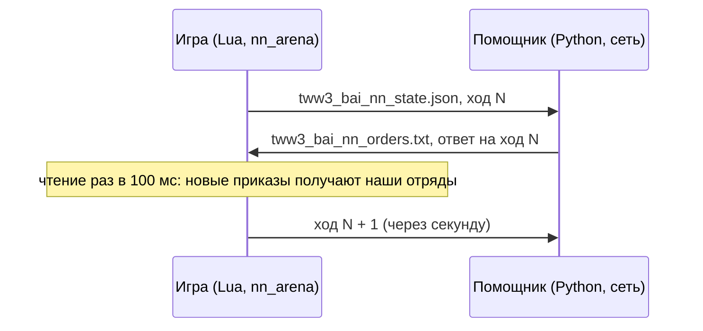

# bridge

[← Назад](README.md) · [Документация](../README.md) · [Приложения](../architecture/apps.md) · [English](../../en/apps/bridge.md)

Мост к нейросети: нашей стороной настоящего боя командует сеть в программе-помощнике вне игры
(`tools/nn/companion/`). Игра и помощник общаются через два файла в папке игры. Код:
`src/apps/bridge/`. Как запустить и смотреть: [смотреть бой сети](../launch/watch.md).



## Как это работает

- На каждом **решении** (`decide_ms`, по умолчанию 1 с времени боя) игра пишет состояние всех
  отрядов обеих сторон со следующим **номером хода**.
- Помощник строит из него вход сети. То, чего не увидел бы человек, скрывается там же (сводка
  стороны, [вход сети](../training/model.md)): игра пишет всё, сводка помощника прячет лишнее.
- Помощник отвечает приказами на этот ход. Игра читает файл раз в 100 мс времени боя
  (`poll_ms`) и отдаёт каждому нашему отряду его приказ.
- **Повторно отдаётся только изменившийся приказ**: другой вид, другая цель, бег вместо шага или
  точка дальше 5 м от прежней. Иначе отряд каждую секунду заново начинал бы путь.
- **Нет ответа к следующему решению** — действуют прежние приказы; событие `nn_miss`.
  Опоздавший ответ (на прежний ход) всё равно берётся; `lag` в событии говорит, насколько он опоздал.
- Бегущие, разбитые и погибшие отряды приказов не получают: ими управляет игра.

Приказы отдаются проверенными вызовами [orders](orders.md):

| Приказ | Вызовы движка |
|---|---|
| `hold` | `halt()`, `fire_at_will(true)` |
| `move` | `fire_at_will(true)`, `goto_location(точка, бег)` |
| `withdraw` | `fire_at_will(true)`, `goto_location(точка, true)` — бегом из боя |
| `attack` | стрелок с боезапасом: `attack_ranged`; остальные: `attack_melee` |
| `keep` | ничего: действует прежний приказ; отряд, у которого приказа ещё не было, стоит как взят |

Все отряды нашей стороны с начала боя под управлением скрипта (`take_control`). До первого ответа
они стоят и стреляют по своему выбору.

## Файлы

Оба файла пишутся сначала во временный (`.tmp`) и потом переименовываются: читающий не увидит
половину файла. Windows не переименовывает поверх существующего файла, поэтому игра сначала
удаляет старый; на этот миг файла нет, помощник ждёт. Если переименовать не удалось, игра пишет
файл на месте; помощник тогда просто читает ещё раз, пока JSON не целый.

**Состояние** `tww3_bai_nn_state.json` (игра → помощник), JSON:

| Поле | Что это |
|---|---|
| `batch` | Метка боя; новый бой — память сети в помощнике начинается заново |
| `move` | Номер хода: 1, 2, 3… |
| `t` | Время боя от начала, мс |
| `done` | `true` в последнем состоянии, в конце боя |
| `attacker` | Сторона, которая атакует (2 — атакует ИИ игры) |
| `factions` | `{own, enemy}` |
| `decide_ms` | Время между решениями, мс |
| `units` | Все отряды: поля записанного `nn_sample` ([nn_arena](entries.md#nn_arena)) и ещё `side`, `key` (ключ отряда), `v` (виден другой стороне) |

**Приказы** `tww3_bai_nn_orders.txt` (помощник → игра), текст, строка на отряд:

```
tww3_bai_nn_orders 1
move 17
batch 20260930T203912-nn-12
think_ms 2.7
unit own_lord hold
unit own_spear_1 move -120.5 33.2 1
unit own_spear_2 attack enemy_spear_3 0
unit own_archer_1 withdraw -300.0 0.0 1
unit own_archer_2 keep
end
```

`move` / `withdraw`: точка x, z в метрах и бег 1 / 0; `attack`: скрипт-имя врага и бег;
`keep`: нового приказа нет (сеть решила продолжать прежний).
Без последней строки `end` игра ничего не берёт. Отряд без строки сохраняет свой приказ.

## services — чистые правила

| Функция | Что делает |
|---|---|
| `parse_orders(text)` | Файл приказов → `{move, batch, think_ms, orders}` или `nil` и причина (`incomplete`, `bad kind`…) |
| `changed(old, new)` | Другой ли приказ (вид, цель, бег, точка дальше `REPEAT_M` = 5 м) |
| `state_document(meta, move, t, units, done)` | Состояние как таблица для JSON |
| `real_ms(a, b)` | Миллисекунды между двумя замерами `os.clock()` |

## exchange_adapter — файлы

`write(path, text)` (временный файл, удаление, переименование; возвращает `renamed` или
`direct`), `read(path)`, `remove(path)`.

## adapter — мост

`start(opts)` берёт наши отряды под управление, удаляет файлы прежнего боя и возвращает
`decide()`, `poll()`, `finish()`, `stats()`. Их вызывает по своим таймерам точка входа
[nn_arena](entries.md#nn_arena) с `--own-ai net`.

## События

| Событие | Поля |
|---|---|
| `nn_orders` | `move`, `lag` (сколько ходов записано после него), `wait_model_ms` и `wait_real_ms` (от записи состояния до приказов), `think_ms` (время сети в помощнике), `orders` (отданные: `u`, `k`, `x`, `z`, `tg`, `run`, `status`), `kept` (тот же приказ ещё раз: не отдан), `keeps` (отряды с `keep`), `skipped` |
| `nn_miss` | `move` без ответа к следующему решению, `answered` |
| `result` (дополнено) | `nn_moves`, `nn_answered`, `nn_missed`, `nn_orders_given`, `nn_keeps`, `nn_bad_files`, `nn_write_mode` |

Тесты: `tests/apps/bridge/test_bridge.py` (файл приказов так, как его читает игра; что считается
новым приказом), `tests/entries/test_entries.py` (`test_net_...`: состояние, ответ, отданные
приказы, пропуск, последнее состояние), `tests/tools/test_nn_companion.py` (сторона помощника).
