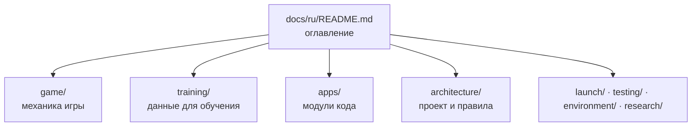
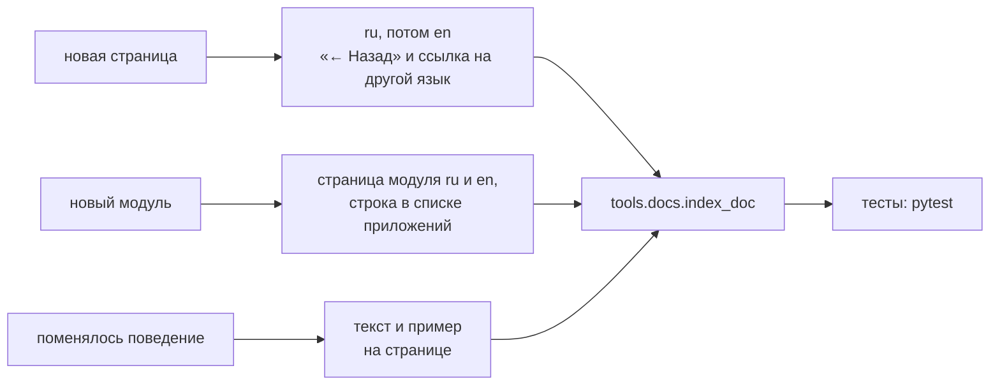

# Как устроена и как ведётся документация

[← Назад](README.md) · [Документация](../README.md) › [Архитектура](README.md) › Документация · [English](../../en/architecture/documentation.md)

Правила обязательны (решение пользователя 28.09.2026) и проверяются тестом
`tests/docs/`. Цель — чтобы человеку было удобно читать: короткие страницы,
простой язык, схемы и таблицы вместо стен текста, всегда понятно, где ты и как вернуться.

## Устройство



- **Два языка — зеркало.** `docs/ru/…` и `docs/en/…` с одинаковыми путями.
  Русская страница — главная: сначала пишем её, потом английскую. Только на
  русском — архив исследований `research/` (список в тесте).
- **Вложенность — папки.** В каждой папке есть хаб `README.md`: что в разделе и
  ссылки на страницы. Раздел в разделе — вложенная папка со своим хабом.
- **Ссылки только на то, что есть.** Ссылка на удалённую страницу или картинку —
  ошибка теста.

## Навигация — строка сверху

Третья строка каждой страницы (после заголовка):

```text
[← Назад](родитель) · [Документация](корень) › [Раздел](хаб) › Страница · [English](зеркало)
```

- **«← Назад»** ведёт к родителю — хабу папки (у хаба — к хабу уровнем выше),
  как кнопка «назад» в браузере, только всегда в одно и то же место.
- **Крошки** `›` показывают вложенность; последняя — текущая страница без ссылки.
- **Язык** — ссылка на ту же страницу на другом языке.

## Схемы и примеры

| Что показать | Чем | Правило |
|---|---|---|
| Шаги, условия, кто что вызывает | Mermaid `flowchart LR` / `TB` | ромб — условие, прямоугольник — действие |
| Порядок во времени (игра ↔ скрипт) | Mermaid `sequenceDiagram` | — |
| Настоящий бой, строй, карта | PNG из игры в `docs/assets/<раздел>/` или рядом с исследованием | подпись: откуда, какой прогон |
| Числа | таблица | единицы в заголовке столбца |

Страница модуля — коротко: что, зачем, как; пример (числа из прогона, вызов или
картинка). Выходные данные разборов (json, csv) в Git не кладём — только картинки и текст.

## Что генерируется, а что пишется

Список страниц в хабе **генерируется** из заголовков страниц и их первого
предложения — иначе устареет:

| Блок | Откуда | Где |
|---|---|---|
| `docs:index` — список страниц папки и её подпапок | заголовок и первое предложение каждой страницы | хабы `README.md` |

Блок стоит между `<!-- generated:docs:index -->` и `<!-- /generated -->`; руками
внутри не правят. Обновить: `python -m tools.docs.index_doc`. Остальное пишется руками.

Хабы без такого блока пишутся целиком руками, потому что им нужен свой порядок и
пояснения: корень `docs/<язык>/README.md`, `game/map/`, `game/units/catalog/`,
`research/` и `training/`. В них ссылки на страницы и хабы разделов ставим сами и
проверяем при каждой новой странице.

## Когда что обновлять



## Что проверяет тест (`tests/docs/`)

- у каждой страницы есть зеркало на другом языке (кроме `research/`);
- у каждой страницы есть «← Назад», и ссылка ведёт на существующий файл;
- все относительные ссылки и картинки существуют;
- сгенерированные блоки совпадают со страницами;
- у каждого модуля `src/apps` есть страница на обоих языках.
