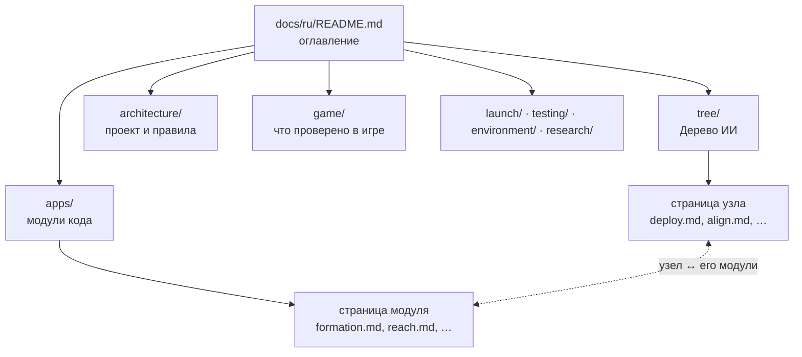
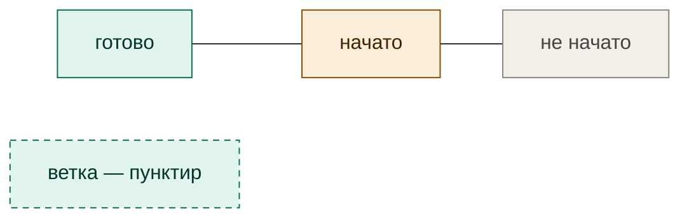
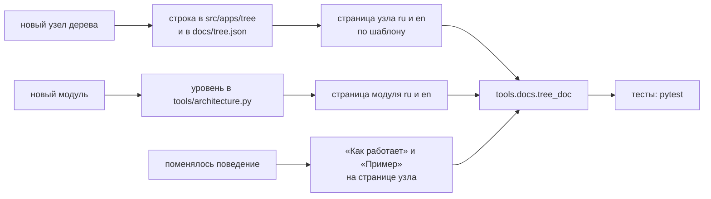

# Как устроена и как ведётся документация

[← Назад](README.md) · [Документация](../README.md) › [Архитектура](README.md) › Документация · [English](../../en/architecture/documentation.md)

Правила обязательны (решение пользователя 28.09.2026) и проверяются тестом
`tests/docs/`. Цель — чтобы человеку было удобно читать: короткие страницы,
схемы вместо стен текста, всегда понятно, где ты и как вернуться.

## Устройство



- **Два языка — зеркало.** `docs/ru/…` и `docs/en/…` с одинаковыми путями.
  Справочные страницы (дерево, модули, игра, запуск, тесты, окружение) есть на
  обоих языках. Рабочие черновики — только на русском, по явному списку в
  тесте: `architecture/ai-design.md`, `architecture/battle-theory.md`,
  `architecture/strategies.md`, `architecture/tasks/`, `research/`.
- **Вложенность — папки.** В каждой папке есть хаб `README.md`: что в разделе и
  ссылки на страницы. Раздел в разделе — вложенная папка со своим хабом.
- **Дерево ИИ** (`tree/`) — главная карта: что делает ИИ, по фазам и веткам.
  **Модули** (`apps/`) — как устроен код. Страница узла ссылается на свои
  модули, страница модуля — на узлы, которым служит.

## Навигация — строка сверху

Третья строка каждой страницы (после заголовка):

```text
[← Назад](родитель) · [Документация](корень) › [Раздел](хаб) › Страница · [English](зеркало)
```

- **«← Назад»** ведёт к родителю — хабу папки (у хаба — к хабу уровнем выше),
  как кнопка «назад» в браузере, только всегда в одно и то же место.
- **Крошки** `›` показывают вложенность; последняя — текущая страница без ссылки.
- **Язык** — ссылка на ту же страницу на другом языке (если она есть).

## Схемы и примеры — больше картинок, меньше текста

| Что показать | Чем | Правило |
|---|---|---|
| Дерево, уровни, «кто из чего растёт» | Mermaid `flowchart BT` (снизу вверх) | фаза — сплошная стрелка вверх; ветка — пунктирная связь и пунктирная рамка |
| Как узел работает, шаги, условия | Mermaid `flowchart LR` / `TB` | ромб — условие, прямоугольник — действие |
| Порядок во времени (игра ↔ скрипт) | Mermaid `sequenceDiagram` | — |
| Настоящий бой, строй, карта | PNG из симулятора или игры в `docs/assets/<раздел>/` | подпись: откуда, какой прогон |
| Числа | таблица | единицы в заголовке столбца |

**Цвета статуса** (одни на всех схемах): зелёный — готово, жёлтый — начато,
серый — не начато; толстая рамка — «вы здесь».



Каждая страница узла и модуля — **минимум одна схема и один пример** (числа из
прогона или картинка). Текст — коротко: что, зачем, как; подробности — в схеме.

## Что генерируется, а что пишется

Всё, что можно взять из кода, **генерируется** — иначе устареет.

| Блок | Откуда | Где |
|---|---|---|
| `tree:diagram` — всё дерево | `src/apps/tree` + `docs/tree.json` | хаб дерева |
| `tree:table` — все узлы | то же | хаб дерева |
| `tree:here:<узел>` — узел на своём месте | то же | страница узла |
| `tree:card:<узел>` — карточка узла | то же | страница узла |
| `tree:modules` — модули по уровням и зависимости | `tools/architecture.py` + `require` в коде | `tree/modules.md` |
| `docs:index` — список страниц папки | заголовки страниц | хабы |

Блок стоит между `<!-- generated:ИМЯ -->` и `<!-- /generated -->`; руками внутри
не правят. Обновить: `python -m tools.docs.tree_doc`.

**Карточка узла** (генерируется): что делает · когда начинается · что без него ·
переключатель · вид и уровень · из чего растёт · модули · статус. Пишутся руками:
«Как работает» (схема), «Пример» (числа или картинка), «Проверки» (какие тесты и
игровые прогоны его держат).

## Когда что обновлять



## Что проверяет тест (`tests/docs/`)

- у каждой страницы есть зеркало на другом языке (кроме списка рабочих черновиков);
- у каждой страницы есть «← Назад», и ссылка ведёт на существующий файл;
- все относительные ссылки и картинки существуют;
- сгенерированные блоки совпадают с кодом;
- у каждого модуля есть страница на обоих языках, у каждого узла дерева — страница
  с карточкой и схемой «где в дереве»; страница модуля узла ссылается на узел.
