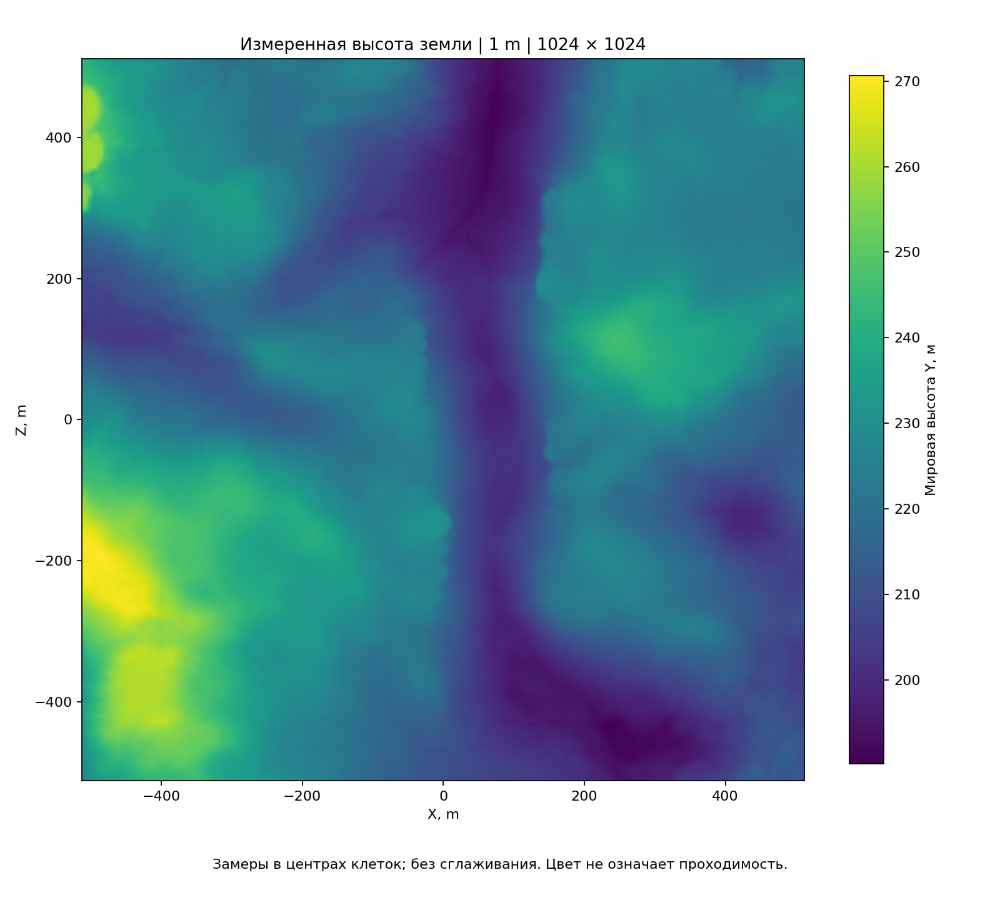

# Визуальный атлас

[Знания об игре](README.md) · [English](../../en/game/atlas.md)

## Карты

### Moorlands Route

Подробно: [Moorlands Route](maps/moorlands-route.md).

### Высоты Кислева

Методика и ограничения: [высоты](map/heights.md).

### Сетка и маршрут

Подробно: [границы](map/boundaries.md), [дискретизация](map/sampling.md),
[равнины Кислева](../research/map-data/kislev-plains-check.md).

### Вода, проходы и мосты

Подробно: [вода и грунт](map/water-ground.md), [проходы](map/passages.md),
[мосты](map/bridges.md).

### Лес и объекты

Подробно: [растительность](map/vegetation.md), [объекты](map/objects.md).

### Уклоны

Подробно: [уклоны](map/slopes.md).

## Отряды

### Состояние и мораль

Подробно: [показатели](units/state-sensors.md), [поля](units/state-fields.md),
[состояния](units/states.md).

### Команды и преследование

Подробно: [команды](units/commands.md), [доказательства](units/evidence.md).

### Построения

Подробно: [расстановка](units/deployment.md), [дальность стрельбы](units/missile-range.md).
