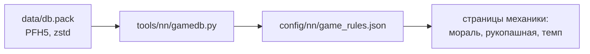

# База игры

[← Назад](README.md) · [Документация](../README.md) › [Знания об игре](README.md) › База игры · [English](../../en/game/database.md)

Правила боя лежат в базе игры: мораль, усталость, шанс попасть, лидерство,
стрелы. Мы читаем их прямо из файлов игры, чтобы не угадывать числа.

**Формулы — в движке, числа — в базе.** Например, в базе есть 35, 8 и 90, а то,
что шанс попасть = 35 + атака − защита в пределах 8–90 %, — это как движок
использует эти числа. Поэтому каждую формулу сверяем с записями боёв
([мораль](units/morale.md), [рукопашная](units/melee.md)).

## Где лежит

- Файл: `<папка игры>/data/db.pack`.
- Формат: PFH5 — тот же, что у наших pack ([сборка](../launch/build.md)), но
  записи сжаты zstd: 4 байта — размер без сжатия, потом кадр zstd.
- Нужен Python 3.14 и новее (модуль `compression.zstd`).

## Как прочитать

```bash
py -3.14 -m tools.nn.gamedb
```

`tools/nn/gamedb.py` находит игру по `config/local.json`, читает нужные таблицы и
пишет `config/nn/game_rules.json`. Проверено на v9.0.1, сборка 50381
(30.09.2026).



## Какие таблицы

| Таблица | Что в ней | В `game_rules.json` |
|---|---|---|
| `_kv_rules_tables` | правила боя: шанс попасть, удар раз в 4 с, броня, фланг и тыл, натиск, щиты, стрелы, сложность | `battle`, 276 ключей |
| `_kv_morale_tables` | мораль: аура лорда, его смерть, потери, фланги, обстрел, схватка, пороги, таймеры, сложность | `morale`, 131 ключ |
| `_kv_fatigue_tables` | усталость: сколько даёт каждое занятие, пороги | `fatigue`, 29 ключей |
| `land_units_tables` | атака, защита и лидерство отрядов арены | `units`, 3 отряда |
| `unit_experience_bonuses_tables` | что даёт ранг: лидерство, атака, защита, меткость, перезарядка | `experience_bonus`, 5 строк |
| `unit_experience_thresholds_tables` | опыт для рангов 1–9 | `experience_levels`, 9 строк |
| `projectiles_tables`, `missile_weapons_tables` | оружие отряда и его снаряд: дальность, урон, перезарядка | нет — стрела лучников прочитана отдельно 30.09.2026 ([урон стрелами](units/missile-damage.md)) |

`_source` в файле — путь к прочитанному `db.pack`.

## Как устроены таблицы

- **Ключ — значение** (`_kv_*`): заголовок, число строк (4 байта), затем строки
  «имя (длина 2 байта + UTF-8) — число float32».
- **`land_units_tables`**: после ключа отряда, байта-флага и двух строк (скелет,
  вид крови) идут три int32 — атака, защита, лидерство.
- **`unit_experience_bonuses_tables`**: показатель, int32-флаг и два float32
  `a`, `b` на ранг. Для лидерства `b` = 1,06 — столько даёт один ранг.
- **`unit_experience_thresholds_tables`**: имя уровня и int32 — опыт.

## Не проверено

- Что значат ключи, которые не встретились в записях боёв (их много).
- Таблицы других фракций и отрядов: `gamedb.py` берёт только три отряда арены.
