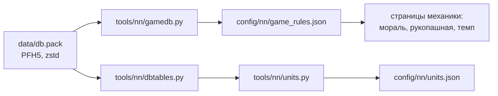

# База игры

[← Назад](README.md) · [Документация](../README.md) › [Знания об игре](README.md) › База игры · [English](../../en/game/database.md)

Правила боя лежат в базе игры: мораль, усталость, шанс попасть, лидерство,
стрелы. Мы читаем их прямо из файлов игры, чтобы не угадывать числа.

**Формулы — в движке, числа — в базе.** Например, в базе есть 35, 8 и 90, а то,
что шанс попасть = 35 + атака − защита в пределах 8–90 %, — это как движок
использует эти числа. Поэтому каждую формулу сверяем с записями боёв
([мораль](units/morale.md), [рукопашная](units/melee.md)).

## Где лежит

- Файл: `<папка игры>/data/db.pack`.
- Формат: PFH5 — тот же, что у наших pack ([сборка](../launch/build.md)), но
  записи сжаты zstd: 4 байта — размер без сжатия, потом кадр zstd.
- Нужен Python 3.14 и новее (модуль `compression.zstd`).

## Как прочитать

```bash
py -3.14 -m tools.nn.gamedb     # правила → config/nn/game_rules.json
py -3.14 -m tools.nn.units      # отряды  → config/nn/units.json
```

Оба находят игру по `config/local.json`. `tools/nn/gamedb.py` пишет правила
боя, `tools/nn/units.py` — [паспорта отрядов](../training/units.md). Таблицы
отрядов читает `tools/nn/dbtables.py`. Проверено на v9.0.1, сборка 50381
(30.09.2026).



## Какие таблицы

| Таблица | Что в ней | Куда |
|---|---|---|
| `_kv_rules_tables` | правила боя: шанс попасть, удар раз в 4 с, броня, фланг и тыл, натиск, щиты, стрелы, сложность | `game_rules.json`: `battle`, 276 ключей |
| `_kv_morale_tables` | мораль: аура лорда, его смерть, потери, фланги, обстрел, схватка, пороги, таймеры, сложность | `game_rules.json`: `morale`, 131 ключ |
| `_kv_fatigue_tables` | усталость: сколько даёт каждое занятие, пороги | `game_rules.json`: `fatigue`, 29 ключей |
| `unit_experience_bonuses_tables` | что даёт ранг: лидерство, атака, защита, меткость, перезарядка | `game_rules.json`: `experience_bonus`, 5 строк |
| `unit_experience_thresholds_tables` | опыт для рангов 1–9 | `game_rules.json`: `experience_levels`, 9 строк |
| `main_units_tables` | отряд, как его нанимают: бойцов, цена, ссылка на `land_units` | `units.json` |
| `land_units_tables` | отряд в бою: атака, защита, лидерство, натиск, броня, щит, оружие, снаряды, фигура | `units.json`; атака, защита, лидерство трёх отрядов арены ещё и в `game_rules.json` (`units`) |
| `battle_entities_tables` | фигура бойца: здоровье, масса, скорости, рост, класс размера | `units.json` |
| `melee_weapons_tables` | оружие ближнего боя: урон, пробивающий урон, бонусы, удар по нескольким | `units.json` |
| `missile_weapons_tables` | стрелковое оружие → его снаряд | `units.json` |
| `projectiles_tables` | снаряд: дальность, урон, перезарядка, полёт | `units.json` |
| `unit_armour_types_tables` | броня: ключ → число | `units.json` |
| `unit_shield_types_tables` | щит: ключ → шанс отбить стрелу | `units.json` |
| `unit_spacings_tables` | шаблон строя (`land_units.spacing`): шаг по фронту и в глубину, разброс, хаотичный строй | `units.json` (`spacing`) |
| `unit_attributes_to_groups_junctions_tables` | свойства отряда (`expendable`, `encourages`…) | `units.json` |
| `land_units_to_unit_abilites_junctions_tables` | способности отряда (ключи) | `units.json` |

`_source` в файлах — путь к прочитанному `db.pack`.

## Как устроены таблицы

- **Ключ — значение** (`_kv_*`): заголовок, число строк (4 байта), затем строки
  «имя (длина 2 байта + UTF-8) — число float32».
- **Остальные таблицы**: заголовок с номером версии, один байт, число строк
  (4 байта), затем строки одна за другой. Строка — одна и та же
  последовательность полей: int32, float32, флаг (1 байт), текст (длина 2 байта +
  UTF-8) и необязательный текст (флаг, затем текст, если флаг 1). Схемы внутри
  нет: порядок и типы полей мы подобрали сами.
- Подобранные схемы — `LAYOUTS` в `tools/nn/dbtables.py`. Каждая читает
  **всю** таблицу до последнего байта; каждый текст — читаемый текст, каждый
  флаг — 0 или 1. Если игра обновит таблицу и схема перестанет подходить,
  чтение остановится с ошибкой (версия, лишние байты или «не текст»), а не
  прочитает сдвинутые числа.

| Таблица | Версия | Полей | Строк |
|---|---:|---:|---:|
| `land_units` | 54 | 60 | 2679 |
| `main_units` | 7 | 45 | 2802 |
| `battle_entities` | 39 | 58 | 1339 |
| `melee_weapons` | 25 | 20 | 1280 |
| `missile_weapons` | 12 | 6 | 863 |
| `projectiles` | 53 | 58 | 1093 |
| `unit_armour_types` | 6 | 4 | 106 |
| `unit_shield_types` | 6 | 5 | 24 |
| `unit_spacings` | 7 | 19 | 164 |
| `unit_attributes_to_groups_junctions` | 2 | 3 | 8559 |
| `land_units_to_unit_abilites_junctions` | 1 | 3 | 9686 |

- **Имена полей.** У `land_units` и `main_units` — имена самой игры: все 60 и 45
  столбцов трёх отрядов Империи совпали с расшифровкой по схеме от 26.09.2026
  (локальный архив `research/evidence/units/empire-20260926`). Прежнее чтение
  `land_units` «три числа после ключа и двух строк» заменено чтением всей
  таблицы.
- В остальных таблицах имена дали мы. Проверены по карточкам отрядов в бою:
  здоровье, масса, шаг и бег (`battle_entities`), урон и пробивающий урон
  (`melee_weapons`, `projectiles`), дальность и перезарядка снаряда, число брони
  ([паспорта отрядов](../training/units.md#сверка-с-карточками)).
- Выведены по значениям, в бою не проверены: разгон, торможение, скорость
  натиска, радиус, рост, класс размера (`battle_entities`); бонусы против больших
  и пехоты, время между ударами, удар по нескольким (`melee_weapons`); полёт
  снаряда (`projectiles`); шанс щита (`unit_shield_types`); шаг сомкнутого строя (`unit_spacings`: девять
  чисел стоят до ключа — так таблица читается до последнего байта; первые три — шаг по фронту h, разброс, шаг
  в глубину v; сверены с ростером: фронт игры (ряды − 1) × h с точностью ~1 %, рядов = floor(ширина / h)). Почему так —
  [что выведено нами](../training/units.md#что-выведено-нами).
- Поля, смысла которых мы не знаем, названы по номеру: `f07`, `f12`…
- **`unit_experience_bonuses_tables`**: показатель, int32-флаг и два float32
  `a`, `b` на ранг. Для лидерства `b` = 1,06 — столько даёт один ранг.
- **`unit_experience_thresholds_tables`**: имя уровня и int32 — опыт.

## Не проверено

- Что значат ключи, которые не встретились в записях боёв (их много).
- Столбцы, названные нами по значениям (выше), и столбцы `f<номер>`.
- Бонус снарядов против больших и пехоты: столбца не нашли
  ([паспорта отрядов](../training/units.md#чего-нет-и-почему)).
- Что делают способности и свойства: таблицы `special_ability_*` не разобраны.
