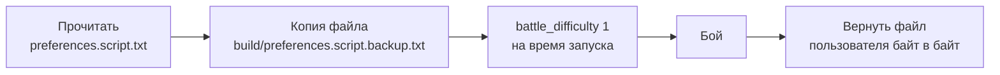

# Сложность боя

[← Назад](README.md) · [Документация](../README.md) › [Знания об игре](README.md) › Сложность боя · [English](../../en/game/difficulty.md)

**Все бои против ИИ игры — на нормальной сложности** (решение пользователя
30.09.2026). На более высокой сложности ИИ игры получает бонусы, и бой
перестаёт быть честным.

## Где задаётся

Файл `%APPDATA%\The Creative Assembly\Warhammer3\scripts\preferences.script.txt`,
строка `battle_difficulty`:

| Значение | 0 | 1 | 2 | 3 | 4 |
|---|---|---|---|---|---|
| Сложность | лёгкая | **нормальная** | высокая | очень высокая | легендарная |

У пользователя в своей игре стоит 3 — «очень высокая».

## Что даёт ИИ высокая сложность

Числа из базы игры ([база игры](database.md), `config/nn/game_rules.json`,
30.09.2026):

| Таблица | Ключ | Значение |
|---|---|---|
| `_kv_morale_tables` | `difficulty_modifier_player_easy` / `_normal` / `_hard` / `_very_hard` | +4 / 0 / −2 / −4 очка морали игроку |
| `_kv_morale_tables` | `difficulty_modifier_ai_extra_multiplier_high` / `_low` | 0,8 / 0,4 |
| `_kv_rules_tables` | `difficulty_mod_ai_reload_extra_multiplier_high` / `_low` | 2,0 / 1,0 — ИИ перезаряжается быстрее |
| `_kv_rules_tables` | `difficulty_mod_ai_normal_multiplier` / `_hard_multiplier` | 0,5 / 0,75 |
| `_kv_rules_tables` | `difficulty_mod_ai_min_stats_range` / `_max_stats_range` | 0,9 / 1,1 |

Как движок применяет множители, база не говорит (формулы — в движке).

**Что видно в записях боёв.** По `MoralePercent` в начале боя сложность не
отличить. Записи арены 30.09.2026 (18 боёв на нормальной, 19 на «очень
высокой»), через 2 с после начала, одинаковы на обеих сложностях:

| Отряд | У нас | У ИИ игры |
|---|---|---|
| Лорд | 1,057 | 1,057 |
| Копейщики | 1,067 | 1,067, у части отрядов 1,1 |
| Лучники | 1,08 | обычно 1,12 |

Разница между сторонами за первые 14 с тоже одинакова на обеих сложностях.
Как бонусы сложности меняют бой, по записям пока не видно
([мораль](units/morale.md)).

## Как это держит launcher

- Launcher ставит `battle_difficulty 1` только на время своего запуска и после
  боя возвращает файл пользователя байт в байт.
- Если запуск прервался, копия остаётся в `build/preferences.script.backup.txt`,
  и следующий запуск сначала возвращает её.
- `launch.json` запуска хранит `battle_difficulty` и `user_battle_difficulty`,
  `status.json` — `preferences_restored`.

Подробнее — [запуск боя](../launch/run.md#честная-сложность).

## Как проверить честность по данным

- Единственная проверка — поле `battle_difficulty` = 1 в `launch.json` запуска
  (`tools.nn.gamedata.difficulty()`). Запуски, где этого поля нет, шли до
  правила — на «очень высокой» (3). По морали в начале боя честный бой от
  нечестного не отличить (см. выше).
- Загрузчик арены берёт только честные бои: `tools.nn.gamedata.runs()`
  (`fair_only=True` по умолчанию; [данные для обучения](../training/README.md)).

## Кто побеждает

Бои арены 30.09.2026 (`build/nn-arena/runs`, `python -m tools.nn.gamedata`):
планировщик CA за нашу сторону против ИИ игры, армии одинаковые
([штатный ИИ игры](game-ai.md)). «Время вышло» — наш предел 900 с игры (`--timeout 900`), победителя нет.

| Сложность | Мы нападаем, ИИ игры обороняется | Мы обороняемся, ИИ игры нападает |
|---|---|---|
| Нормальная (18 боёв) | 10 боёв: ИИ игры победил 9, время вышло 1 | 8 боёв: мы победили 6, ИИ игры 1, время вышло 1 |
| Очень высокая (19 боёв) | 10 боёв: ИИ игры победил 9, мы 1 | 9 боёв: ИИ игры победил 7, мы 2 |

На нормальной сложности **почти всегда побеждает защитник**. На «очень высокой»
ИИ игры выигрывает и в нападении.
