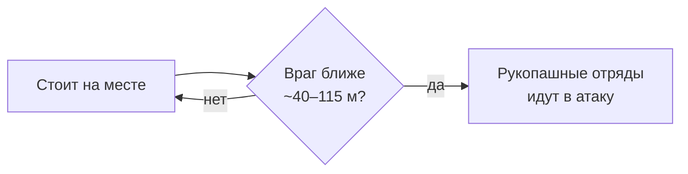

# Штатный ИИ игры в бою

[← Назад](README.md) · [Документация](../README.md) › [Знания об игре](README.md) › Штатный ИИ игры · [English](../../en/game/game-ai.md)

Как ведёт бой ИИ самой игры. Почти все наблюдения — из боёв арены 30.09.2026:
первые 13 честных боёв на нормальной сложности, одинаковые армии (лорд,
4 копейщика, 2 лучника Империи), пустая ровная карта
([Crossroads flat](maps/crossroads-flat.md)). Поворот обороны к нападающему,
расстановка обороны и её ответ на сближение — из боёв 27–28.09.2026
([ниже](#ии-игры-в-обороне-поворачивается-к-нам)); что CA сами рассказывали о
своём ИИ — [в конце](#что-ca-публиковали-о-своём-ии).

## Два ИИ

- **ИИ игры** — боевой ИИ движка. Он ведёт сторону, которой не управляет
  скрипт (в арене — сторона 2).
- **Планировщик CA** — `script_ai_planner` из библиотеки скриптов CA
  (`lib_battle_script_ai_planner.lua`). Он отдаёт отряды тому же ИИ движка,
  но с задачей: «атаковать армию врага» или «оборонять место». Им мы ведём свою
  сторону в записях ([orders](../apps/orders.md)).

Кто нападает, а кто обороняется, задаёт файл боя: защитник — союз, который
побеждает, когда время вышло ([нападающий и защитник](battle-roles.md)).

## ИИ игры в обороне

Держит своё место; его рукопашные отряды бросаются в атаку, когда враг подходит
примерно на 40–115 м.

## ИИ игры в обороне поворачивается к нам

Четыре боя 28.09.2026 на [The Moorlands Route](maps/moorlands-route.md), прогоны
`20260928-145558`, `-150511`, `-150819`, `-151022`, ×20. ИИ игры обороняется
(лорд, 8 копейщиков, 6 лучников Империи), наша армия (лорд, 6 копейщиков,
8 лучников) подходит к нему. Сложность «очень высокая»: бои шли до правила о
[честной сложности](difficulty.md). Отряды врага записаны раз в 2 с.

| Что | Число |
|---|---|
| На расстановке | смотрит на 238°, а мы стоим на 90° |
| Через минуту, к началу сближения | уже смотрит на нашу армию: отклонение 3,6° на 556 м |
| Когда мы в 180–270 м (между центрами армий) | поворачивается к нам рывками по 10–36 с, на 6–15° за рывок |
| Между рывками | стоит 32–174 с |
| Центр его армии за рывок | сдвигается всего на 0,1–3,4 м: он поворачивается на месте |
| Весь поворот за бой | 278° → 318°, на 40°, каждый раз к нам |
| Бой, где наша армия не двигалась (`20260928-151022`) | не повернулся ни разу за 250 с |

Итак, обороняясь, ИИ игры держит место, но поворачивает строй к нападающему,
пока тот движется. Куда он смотрит на расстановке, о бое ничего не говорит:
через минуту он уже смотрит на нас.

## Как ИИ игры расставляется и отвечает на сближение в обороне

Прогоны `enemy-layout` 27–28.09.2026: шесть составов от 5 до 20 отрядов; после
расстановки ИИ игры получает задачу «оборонять место, где встал»
(`script_ai_planner:defend_position`, радиус 80 м). Реакция на сближение — один
бой 28.09.2026 на ровной полосе. Сложность «очень высокая»: бои шли до правила о
[честной сложности](difficulty.md). Подробно —
[разбор enemy-layout](../../../research/analysis/enemy-layout/README.md).

| Что | Число |
|---|---|
| Строй | линии: копейщики впереди, лучники во второй линии; отряды одной линии бок о бок, зазор 2–6 м |
| Между линиями | около 20 м (20,2–21,5 м во всех шести составах) |
| После задачи «обороняй» | армия выходит вперёд примерно на 35 м и стоит |
| Наш фронт подошёл примерно на 101 м (наши лучники ещё не стреляли) | вся его армия за ≈ 10 с шагнула вперёд на 15–28 м (лучники — на 4–21 м) и встала |
| Ещё через 30–60 с | два отряда копейщиков пошли в атаку примерно со 110 м |

Заметка 29.09.2026 о прежних боях на «очень высокой» (прогоны в ней не названы;
заметка — в прежнем документе `docs/ru/architecture/battle-theory.md`, его
можно прочитать в истории Git, коммит `242c3b1`): рукопашные отряды обороны шли
в атаку по одному, с разбросом до 50 с.

## ИИ игры в нападении

- Бежит вперёд всей армией сразу.
- Каждый отряд копейщиков берёт врага напротив себя.
- Лорд идёт на вражеского лорда.
- Лучники останавливаются примерно в 130 м (их дальность) и стреляют.
- Собравшиеся после бегства отряды снова ведёт в бой.
- Под стрелами его отряды стоят без дела только 0–3 % времени обстрела.

## Лорд ИИ игры в поединке

Сильнее ли лорд под ИИ игры простого лорда? Нет. Замер 06.10.2026, нормальная сложность, мод True Sight
([lord_ai](../apps/entries.md#lord_ai), `build/lord-ai/`): два лорда одного типа одни на поле, наш —
под одним приказом атаки без способностей, чужой — под ИИ игры (6 боёв на тип) или под тем же приказом
(контроль, 4 боя на тип). Темп — потеря здоровья лорда за секунду, пока оба в рукопашной и ни один не
бежит, %/с.

| | Генерал Империи | Военачальник скавенов |
|---|---|---|
| Чужой по нашему: ИИ / контроль | 0,71 / 0,70 — **1,02** [0,83; 1,25] | 0,26 / 0,34 — **0,75** [0,57; 0,99] |
| Первые 30 с дуэли: ИИ / контроль | 0,69 / 0,75 — 0,93 [0,53; 1,96] | 0,35 / 0,43 — 0,81 [0,41; 1,66] |
| Наш по чужому: ИИ / контроль | 0,60 / 0,63 — 0,94 | 0,28 / 0,23 — 1,22 |
| Секунд дуэли: ИИ / контроль | 627 / 454 | 1449 / 868 |
| Способности ИИ | только «Искатель врага» (скорость ×1,25): 0–1 с после контакта, снова сразу, как готова (через 85–86 с); «Стоять насмерть» — ни разу | только «Крысиная доблесть» (скорость ×1,25, +8 морали): 0–1 с после контакта, снова каждые 77–78 с; «Смертельный натиск» и «Сплотиться» — ни разу |

В скобках — 95 % интервал бутстрепа по боям. Оба типа вместе: 0,87 [0,73; 1,04].

- **Показатели те же.** Карточка лорда ИИ (CCO `UnitDetailsContext.StatList`) в начале боя совпадает с
  нашей до числа: уровень 1, опыт 0, здоровье 4068; Генерал — броня 85, атака 55, защита 45, урон 430,
  натиск 40, мораль 70; Вождь — 90, 50, 55, 400, 35, 60. Нормальная сложность показатели ИИ не меняет.
  Дальше карточка меняется одинаково у ИИ и у контроля (усталость, мораль, «Держать строй!» +5 к
  защите). Карточка в CCO обновляется раз в ~40 с, поэтому короткий бафф по ней не поймать — способности
  видно по активным эффектам (`nn_effects`); `can_perform_special_ability` у отряда ИИ всё время true.
- **Способности ИИ — только скоростные.** Урон они не прибавляют, и темп по нашему с ними тот же
  (Генерал 0,70 с «Искателем», Вождь 0,33 с «Доблестью»).
- **Поведение.** Вождь ИИ чаще выходит из рукопашной и входит снова (5,2 раза за бой, у контроля 1,5),
  и в итоге бьёт слабее. В тыл нашему лорду ИИ не заходит (доля секунд с угрозой тылу ≤ 0,01).

**Что это значит для симулятора.** Лишние ×1,4 урона лорда ИИ по лорду сети в боях проверки — не
преимущество ИИ. Тот же поединок в симуляторе (повтор этих 20 боёв, 8 копий каждого): Генерал против
Генерала 0,38–0,40 %/с в обе стороны против 0,60–0,71 в игре (×0,56–0,63), Вождь против Вождя 0,33–0,36
против 0,23–0,34 (совпадает). Значит, занижен урон лорда Империи по лорду в рукопашной, у кого бы он ни
был под управлением (`build/lord-ai/simduel.json`).

## Слабости планировщика CA и наши исправления

Нашли в записях арены, исправили в `apps/orders/planner_adapter.lua`
([orders](../apps/orders.md)):

| Слабость | Как было | Исправление |
|---|---|---|
| Отряд побежал и собрался — планировщик его больше не ведёт | стоял без дела до конца боя | `check_rallies()`: вынуть отряд из планировщика, вернуть и повторить последний приказ |
| Отряд стоит без дела под стрелами: не идёт, нет цели, не в рукопашной, теряет здоровье | 15–75 % времени обстрела (у ИИ игры 0–3 %) | `check_idle()`: через 6 с — назад в планировщик; если снова стоит 6 с под обстрелом, но не раньше чем через 15 с после первого толчка, — свой планировщик с приказом атаковать ближайшего врага |

## Кто побеждает

На нормальной сложности почти всегда побеждает защитник — и когда обороняется
ИИ игры, и когда планировщик CA. Числа — [сложность боя](difficulty.md#кто-побеждает).

## Что CA публиковали о своём ИИ

Не наши замеры — открытые рассказы разработчиков (пересказ из прежнего
документа о замысле ИИ `docs/ru/architecture/ai-design.md`, коммит `242c3b1`). Полезно для обучения нейросети: что уже делает ИИ игры и
от чего предостерегают сами CA.

- **Уровни.** ИИ Total War разделён на уровень отряда (держать строй и
  позицию) и уровень боя (группировать отряды, выбирать строи и цели); над ними
  армия и кампания.
- **Планирование по целям (GOAP)** в Empire: Total War (2009): ИИ держит
  несколько целей сразу (атаковать отряд и прикрывать фланг), переоценивает их по
  обстановке и после отвлечения возвращается к прерванной цели.
- **Урок CA:** ИИ Empire бывал «парализован нерешительностью» — цели спорили
  друг с другом, и ИИ метался между ними.
- **Обученная модель исхода схватки 1 на 1:** по ней автобой считает итог, а
  боевой ИИ решает, вступать в бой или отходить (AIIDE).
- **ИИ осад** в Total War: Warhammer (GDC 2016) — отдельный ИИ верхнего уровня с
  ролями и обязанностями отрядов и разбором угроз для защитника.

Источники:

- [The Road To War — The AI of Total War (Part 1)](https://www.gamedeveloper.com/programming/the-road-to-war-the-ai-of-total-war-part-1-)
- [Evolution of War — The AI of Total War (Part 2)](https://www.gamedeveloper.com/design/evolution-of-war-the-ai-of-total-war-part-2-)
- [Learning Combat Outcomes in Creative Assembly's Total War (AIIDE)](https://ojs.aaai.org/index.php/AIIDE/article/view/36830)
- [Siege Battle AI in Total War: Warhammer (GDC 2016)](https://gdcvault.com/browse/gdc-16/play/1023363)

## Не проверено

Другие армии, карты с укрытиями и высотами, конница, артиллерия.
