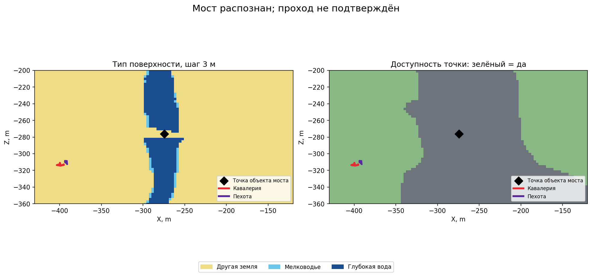

# Как распознать мост и что показала проверка высоты

[Инструкция по карте](README.md) · [English](../../../en/game/map/bridges.md) · [Объекты](objects.md) · [Проверенные броды](passages.md)

## Получение моста

На полевом ландшафте Катая с явно заданной позицией участка `(0.578125,0.5)` игра вернула **2 696 объектов**. Один из них — `cth_bridge_110m_01` с категорией `bridge`. Тип боя — `land_normal`, `IsSiege=false`. Поселение не загружалось. Такой выбор участка не доказывает совпадение с конкретной картой из стандартного меню.

Точка размещения моста: примерно **X −274,438, Y 150,675, Z −276,252 м**. Высота его указанного центра — **139,601 м**. Это координаты объекта, а не проверенные высота настила или концы моста.

В отдельном списке CCO оказался один объект. `IsBridge=true`, категория и положение совпали с обычной записью моста. Имя там локализованное — `Мост`, а не постоянный ключ. Остальные тысячи декораций в этот список не попали.

[Модуль объектов](../../../../src/apps/map/) читает оба списка:

```lua
local rows, next_index, done, total = objects.read_structure_contexts(common, 0, 64)
-- Индексы CCO идут от нуля и не совпадают с номерами обычного списка.
```

В записи сохранены имя, категория, признак моста, признаки разрушения и стрелкового оружия, `CanUpdateAbilities`, тексты локального/общего эффекта, число способностей и координаты X/Y/Z/W. Пустые строки и нули сохраняются как есть. Тексты зависят от языка игры и не являются формулами бонусов. Обёртка проверена прямыми вызовами; обычный список в том же запуске совпал по **всем 2 696 записям**.

`Проверка` (локальный архив: `research/evidence/map/field-20260925/bridge-check/bridge-validation.json`) · `Исходный лог` (локальный архив: `research/evidence/map/field-20260925/bridge-check/tww3_bai_map_capture_events.jsonl.gz`) · `Сценарий` (локальный архив: `research/evidence/map/field-20260925/bridge-check/map_probe.xml`)

## Найденный мост ещё не означает рабочую переправу

Под точкой размещения моста `get_terrain_height` вернул **113,147 м** — другое значение, чем обе высоты объекта. Вокруг снята сетка 61 × 61 с шагом 3 м. Каждая точка проверена на трёх высотах: её рельефа, центра моста и точки размещения моста. Получилось **11 163 запроса** для каждого записанного свойства.

На разных высотах **ни один** тип земли, ответ о свободном прямоугольнике или доступности точки для двух отрядов не изменился. В точке моста оставались `grass`, ограничение и недоступность. Это не доказательство, что игра всегда игнорирует Y; в этом опыте смена Y не дала отдельный слой настила.

Кавалерии и пехоте дали по два приказа: к середине моста и на противоположный берег. **Все четыре этапа закончились по тайм-ауту примерно 120 игровых секунд. Проход по мосту не подтверждён.** Точку на другом берегу запрос считал доступной, но этого оказалось недостаточно для фактического прохода из места переноса отряда. Причина не отделена от особенностей выбранного участка, навигации и размещения строя.

Мост можно обозначить как объект. Пока нельзя добавлять по нему рабочую связь берегов, придумывать концы, считать размер по `110m` в имени или использовать высоту объекта как высоту прохода. Подтверждённые переходы между берегами — три отдельно [проверенных брода](passages.md).



## Полученные поля эффектов

У этого моста тексты эффектов пустые, `CanUpdateAbilities=false`, способностей — ноль. Чтение полей проверено, действующая аура — нет. Это не говорит об отсутствии эффектов у всех других полевых сооружений.

`Сбор всей карты` (локальный архив: `research/evidence/map/field-20260925/bridge-navigation/summary.json`) и его `CSV` (локальный архив: `research/evidence/map/field-20260925/bridge-navigation/tww3_bai_map_capture_grid.csv.gz`) — отдельный опыт от локальных трёх слоёв. У них разные начала сеток и наборы точек.
