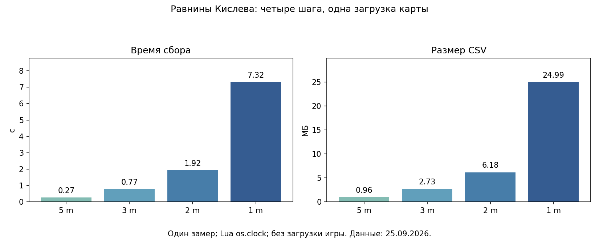

# Доказательства, иллюстрации и пределы вывода

[← Назад](README.md) · [Инструкция по карте](README.md) · [English](../../../en/game/map/evidence.md)

Отдельная [инструкция по высотам](heights.md) содержит карту высот 1 м, устройство
числовой таблицы и воспроизведение без игры. Её цвета означают мировую Y,
а не ответы об ограничениях на приведённых ниже схемах.

Измерения 25.09.2026 на локально установленной ванильной игре с нашими отдельными
диагностическими pack. Подробные ранние отчёты на русском; исходные CSV/JSONL/XML
и хеши — общие доказательства для обеих языковых версий.

## Наглядные материалы

В разделе [леса и деревьев](vegetation.md) находятся две отдельные матрицы 3 м,
метод чтения точек из ресурсов и пределы проверки. Зелёный там обозначает
либо тип земли «лес», либо точки размещения выбранных моделей деревьев.

На простой сетке 50 м зелёный — положительный ответ, красный — отрицательный,
синий — за измеренной рамкой, жёлтый — записанный путь. Жёлтый перекрывает исходный
цвет и не показывает измеренную площадь строя.

[Четыре размера клеток](../../../../research/evidence/map-data/kislev-scales-evidence/comparison.png) ·
[Одинаковый увеличенный фрагмент](../../../../research/evidence/map-data/kislev-scales-evidence/comparison-zoom.png) ·
Полные карты: [5 м](../../../../research/evidence/map-data/kislev-scales-evidence/route-5m.png),
[3 м](../../../../research/evidence/map-data/kislev-scales-evidence/route-3m.png),
[2 м](../../../../research/evidence/map-data/kislev-scales-evidence/route-2m.png),
[1 м](../../../../research/evidence/map-data/kislev-scales-evidence/route-1m.png).

Графики построены по исходному опыту с четырьмя шагами. Эти времена не переносить
на другой запускной скрипт и не считать гарантией производительности.

## Указатель доказательств

| Проверенный результат | Сохранённые данные |
|---|---|
| Объект моста подтверждён, проход не подтверждён | [Bridge check](bridges.md), `raw validation` (локальный архив: `research/evidence/map/field-20260925/bridge-check/bridge-validation.json`) |
| Готовый сборщик: совпали 116 964 строки и 2 696 объектов | `Validation` (локальный архив: `research/evidence/map/field-20260925/feature-runner/validation.json`) |
| Мелководье, глубокая вода и полная сетка доступности двух отрядов | [Раздел воды](water-ground.md), `исходная сетка` (локальный архив: `research/evidence/map/field-20260925/cathay-navigation/tww3_bai_map_capture_grid.csv.gz`) |
| Три кандидата в броды пройдены двумя отрядами | `Проверка проходов` (локальный архив: `research/evidence/map/field-20260925/cathay-crossings/summary.json`), [метод](passages.md) |
| Модули объектов и доступности совпали с прямыми запросами | `Сравнение в игре` (локальный архив: `research/evidence/map/field-20260925/module-validation/validation.json`), `хеши полевых замеров` (локальный архив: `research/evidence/map/field-20260925/hashes.json`) |
| Расчётные уклоны и соседние перепады по высотам Кислева | `Сводка` (локальный архив: `research/evidence/map/slopes-kislev-20260925/summary.json`), `проверка вычислений` (локальный архив: `research/evidence/map/slopes-kislev-20260925/validation.json`) |
| Лесная сетка Кислева 3 м и 5 168 точек деревьев из ресурсов, сопоставленных с высотами | `Сводка` (локальный архив: `research/evidence/map/forest-trees-20260925/summary.json`), [матрицы](vegetation.md), `хеши` (локальный архив: `research/evidence/map/forest-trees-20260925/hashes.json`), `закрытие игры` (локальный архив: `research/evidence/map/forest-trees-20260925/cleanup.json`) |
| Рамка Crossroads 1536 × 1536 м | `Сводка и 30 точек` (локальный архив: `research/evidence/map-data/crossroads-radar-evidence/summary.json`) |
| Рамка Кислева 1024 × 1024 м и 900 клеток поверхности | `Сводка` (локальный архив: `research/evidence/map-data/kislev-plains-evidence/summary.json`), `CSV` (локальный архив: `research/evidence/map-data/kislev-plains-evidence/grid.csv`) |
| Ручной путь согласуется с рамкой, но не доказывает точный край | `Результат сопоставления` (локальный архив: `research/evidence/map-data/kislev-plains-evidence/path-summary.json`) |
| Четыре подробные сетки, время, объём и различия | `Сводка` (локальный архив: `research/evidence/map-data/kislev-scales-evidence/summary.json`), `события` (локальный архив: `research/evidence/map-data/kislev-scales-evidence/tww3_bai_kislev_scales_events.jsonl`) |
| Выделенный модуль повторил все 42 025 клеток исходной сетки 5 м | `Сравнение` (локальный архив: `research/evidence/map/module-check-20260925/comparison.json`), `хеши исходников` (локальный архив: `research/evidence/map/module-check-20260925/manifest.json`), `закрытие` (локальный архив: `research/evidence/map/module-check-20260925/cleanup.json`) |

Исходные подробные сетки, gzip CSV: `5 м` (локальный архив: `research/evidence/map-data/kislev-scales-evidence/grid-5m.csv.gz`),
`3 м` (локальный архив: `research/evidence/map-data/kislev-scales-evidence/grid-3m.csv.gz`),
`2 м` (локальный архив: `research/evidence/map-data/kislev-scales-evidence/grid-2m.csv.gz`),
`1 м` (локальный архив: `research/evidence/map-data/kislev-scales-evidence/grid-1m.csv.gz`).
Поля: `ix,iz,height,clear,ground_id`. Тип земли расшифровывается по сводке именно
этого опыта; начало (−512,−512), шаг указан в имени файла и событиях.
Выделенный сборщик пишет явные X/Z и строковый тип земли.

## Что не доказано

- Универсальные точные границы движения и поведение на других типах карт.
- Полная геометрия земли, контуры препятствий, список объектов или навигационная сетка движка.
- Причина отрицательного ответа; доступность и достаточная ширина пути для строя.
- Минимальное внутреннее разрешение земли, навигация в воздухе и многоуровневые поверхности.
- Перенос данных между catchment, улучшениями карты, условиями окружения и версиями игры.

На входе запрошен `catchment_04`; в экспорте Кислева записан tile-position
`(0.5625,0.4375)`, применённый catchment не назван. Зоны расстановки и освещение
заданы тестом. Результат относится к загруженному сценарию, а не подтверждает
полное совпадение с каждым стандартным вариантом карты из меню.

Не определять карту только по названию и не считать сохранённые данные всегда
пригодными. Хранить входной и экспортированный XML, хеши кода/pack, рамку,
параметры сетки, сырые ответы, время и условия игры. Совпадение 900 точек проверило
повтор этого опыта, но не стало универсальным алгоритмом проверки кеша.
