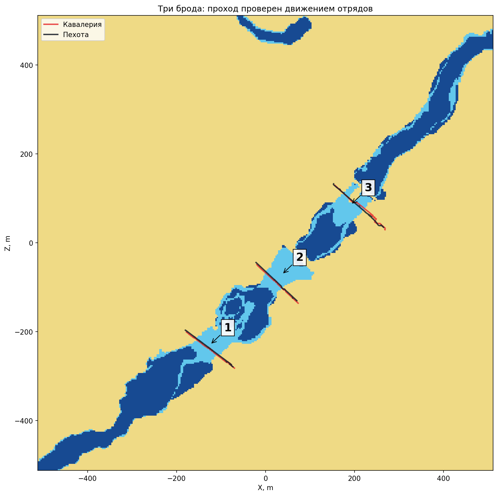

# Доступность точек и проверенные броды

[← Назад](README.md) · [Инструкция по карте](README.md) · [English](../../../en/game/map/passages.md) · [Данные воды](water-ground.md)

## Проверка для конкретного отряда

`unit:can_reach_position(vector)` проверен на крылатых уланах и коссарах. **Во время расстановки ответы другие:** большинство точек отвергаются, а после начала боя многие становятся доступны. Свою позицию оба отряда считали доступной в обеих фазах. Результат расстановки нельзя использовать как обычную карту движения.

[Lua-модуль](../../../../src/apps/navigation/) требует фазу `Deployed`, список отрядов и уже снятые клетки поверхности:

```lua
local result = reachability.read_cells(bm, battle_vector, {cavalry, infantry}, cells)
-- result[i].reachable[j]: доступность точки i для отряда j.
-- Вне рамки: inside_radar=false, таблица reachable пустая.
```

Модуль проверен в игре на **203 точках для обоих отрядов**: ответы совпали с прямыми запросами. Отдельно снята вся сетка 3 м: **116 281 центр внутри рамки**, по **70 199 доступных точек** для каждого отряда. Различий между двумя масками нет. Опрос, запись CSV и паузы между пакетами заняли **2,456 с** по часам Lua; это без загрузки и исходного сбора поверхности. Полная сетка снята на паузе после расстановки.

`Полная сетка` (локальный архив: `research/evidence/map/field-20260925/cathay-navigation/tww3_bai_map_capture_grid.csv.gz`) · `События замера` (локальный архив: `research/evidence/map/field-20260925/cathay-navigation/tww3_bai_map_capture_events.jsonl.gz`) · `Проверка модуля` (локальный архив: `research/evidence/map/field-20260925/module-validation/validation.json`)

Ответ относится к конкретному отряду, его положению и условиям боя. Он не даёт маршрут, не проверяет прямой отрезок, не сообщает ширину строя и не гарантирует короткий путь. Работа для летающих, очень крупных юнитов и артиллерии не доказана. При изменении условий данные нужно перепроверять.

## Как найдены броды

[Инструмент](../../../../tools/analysis/passages.py) выделяет связные доступные участки суши и мелководья. Соседями считаются четыре клетки по сторонам; срезать угол по диагонали нельзя. Кандидат в переправу — связный участок мелководья, касающийся двух участков суши минимум по 100 клеток. Число 100 — наш фильтр мелких островков, а не правило игры.

Найдены **три соединения** между берегами размером **30 818 и 38 158 клеток**. В них **368, 519 и 292** центра мелководья. Островок из 44 клеток отдельным крупным берегом не считается. Это способ находить переходы между областями; он пока не находит все сухопутные узкие проходы и не измеряет их точную ширину.

Затем оба полных отряда провели через каждый кандидат в одном загруженном бою при запрошенной скорости x20. **Все шесть путей содержат исходный берег, мелководье и противоположный сухой берег. Потерь нет.** Записана точка отряда, а не путь каждого бойца.



Первоначальное условие «подойти ближе 8 м к цели» сработало для пехоты. Кавалерия пересекла воду и остановилась примерно в 12 м от координаты приказа: условие завершилось по тайм-ауту. Эти три тайм-аута сохранены, а пересечение реки подтверждено отдельно по пути. Перенос отряда к следующему старту применяется не мгновенно; старые первые точки исключены до первого наблюдения на исходном берегу.

`Результат и ограничения` (локальный архив: `research/evidence/map/field-20260925/cathay-crossings/summary.json`) · `Исходные пути` (локальный архив: `research/evidence/map/field-20260925/cathay-crossings/tww3_bai_map_capture_events.jsonl.gz`) · `Старты и цели` (локальный архив: `research/evidence/map/field-20260925/cathay-navigation/ford-movement-cases.json`) · `Связные области` (локальный архив: `research/evidence/map/field-20260925/cathay-navigation/connections.json`)

## Повтор без игры

```powershell
python tools/map-capture/passages.py --csv docs/map/evidence/field-20260925/cathay-navigation/tww3_bai_map_capture_grid.csv.gz --step 3 --output tmp/map-research/passages
```

Проверяются полная сетка без повторов и соответствие координат шагу. В `components.npz` — номера участков суши/мелководья (−1 вне этого слоя) и пересечение доступности выбранных отрядов. В `connections.json` — хеши, параметры, фильтр, номера и границы областей. Выделенный инструмент повторил размеры и номера всех трёх соединений.

Соседние доступные точки сами по себе не гарантируют свободный отрезок между ними или достаточную ширину для строя. Поэтому сначала получаем кандидата, затем проверяем движение. Мост и землю под ним нельзя одновременно описать одной высотой. Позже физический мост [получен через обычный список и CCO](bridges.md), но проход по нему не удался. Положительный ответ о точке не гарантировал движение из места переноса строя. Универсальное измерение ширины узких проходов пока не подтверждено.
