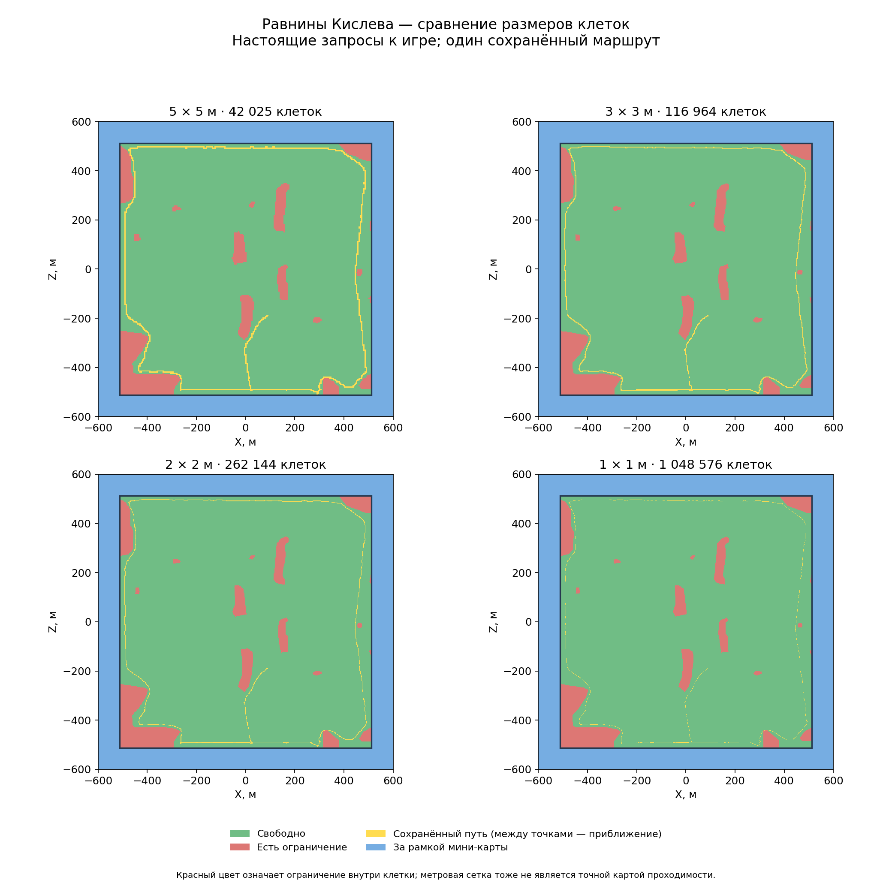

# Сбор поверхности и размер клетки

[Инструкция по карте](README.md) · [English](../../../en/game/map/sampling.md)

Для каждой клетки опрашиваем её центр на местной высоте:

```lua
local height = bm:get_terrain_height(x, z)
local p = battle_vector:new()
p:set_x(x); p:set_y(height); p:set_z(z)
local clear = bm:is_area_clear(p, 0, step, step, false)
local ground = bm:ground_type(p)
```

Именно такие вызовы проверены в опытах. `height` — число, `ground` — строка,
`clear` — логическое значение. Получали `grass`, `forest`, `mud`, `rock`,
`sharp_stones`, `snow`, а на Crossroads ещё `sand`. Это наблюдённый, не исчерпывающий список.

## Значение клетки

Высота и тип земли измерены **в центре**. Запрос ограничений касается целого
квадрата выбранного размера. `false` означает наличие ограничения внутри,
не раскрывая причину или контур. Это не доказательство непроходимости всей клетки.
`true` не гарантирует доступность для определённого строя, прострел или безопасность.

На старой сетке 50 м путь прошёл через 23 клетки с отрицательным ответом для
полного квадрата. Поэтому мы уточняем сетку, а не считаем крупные красные клетки
сплошными препятствиями. Запросы возвращают данные и за рамкой мини-карты;
самостоятельно границу они не определяют.

## Измерения: одна загруженная карта Кислева

| Шаг | Клетки | Сбор по Lua `os.clock` | CSV | CSV gzip |
|---|---:|---:|---:|---:|
| 5 м | 42 025 | 0.267 с | 0.96 МБ | 0.31 МБ |
| 3 м | 116 964 | 0.770 с | 2.73 МБ | 0.86 МБ |
| 2 м | 262 144 | 1.921 с | 6.18 МБ | 1.83 МБ |
| 1 м | 1 048 576 | 7.319 с | 24.99 МБ | 7.59 МБ |

Один последовательный замер каждого шага, пауза на расстановке, по 4096 клеток
за порцию. Время включает запросы, формирование/запись CSV и промежутки вызовов;
не включает загрузку, последующее сжатие и рисунки. Это не проверка нагрузки
на кадр во время боя. Четыре сетки — около 11 с, запуск процесса до сохранения
результатов — 97.886 с. Разности `os.time` оказались нулевыми и непригодными для замера.

Сетка 2 м совпадает с метровой по ответам ограничений на 99.796% площади рамки
и собирается в 3.81 раза быстрее. Это согласие данных, не точность навигации 99.8%.
Относительно 1 м изменяется 0.781% площади при шаге 5 м, 0.393% при 3 м и 0.204%
при 2 м. Основной наблюдаемый выигрыш — уточнение контуров.

**2 м — рекомендация для следующего прототипа**, не утверждённый вход нейросети.
Разовый сбор 1 м доступен; постоянный повтор миллиона запросов опытом не обоснован.
Времена относятся к исходному измерительному скрипту, а не гарантируют скорость
любой следующей версии выделенного модуля.



Зелёный — `true`, красный — `false`, синий — за рамкой, жёлтый — прежний путь.
Жёлтая линия соединяет позиции с максимальным промежутком 24.987 м. Уменьшение
клеток не повышает точность старой записи маршрута.

[Одинаковый увеличенный фрагмент](../../../../research/evidence/map-data/kislev-scales-evidence/comparison-zoom.png)
и [подробные результаты](../../research/map-data/kislev-scales-check.md).
