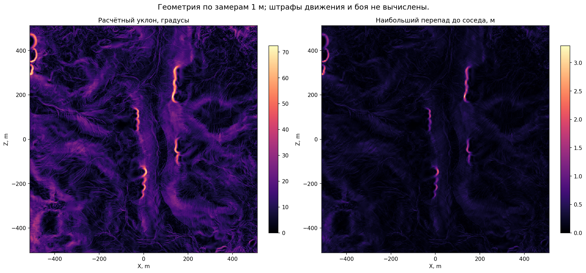

# Склоны и перепады высоты

[← Назад](README.md) · [Инструкция по карте](README.md) · [English](../../../en/game/map/slopes.md) · [Исходные высоты](heights.md)

По полученным от игры высотам теперь рассчитываем уклон в градусах и перепады между соседними точками. Игра для этого не запускается. Это описание геометрии: штрафы скорости, усталости и боя таким способом не определяются.

## Что сохраняем

- Уклон в градусах: насколько круто поверхность поднимается около точки.
- Изменение высоты вдоль X и Z, в метрах подъёма на метр пути. Знак показывает направление подъёма.
- Перепад до следующей точки по X/Z, со знаком.
- Самый большой абсолютный перепад до четырёх соседних точек.

Для шага `s`: изменение по X равно `(высота справа − высота слева)/(2*s)`, по Z — аналогично. Уклон равен `atan(sqrt(gx²+gz²))`, переведённому в градусы. Направленный уклон по единичному направлению `(dx,dz)` оценивается как `atan(gx*dx+gz*dz)`.

У внешнего ряда и столбца нет всех соседей: там сохраняем `NaN`, а не ноль. На остром гребне центральный расчёт может дать нулевой уклон, поэтому отдельно сохраняем перепады до соседей. Между точками поверхность может отличаться от такой оценки.

## Результат на Кислеве

Исходная проверенная сетка — **1024 × 1024**, шаг **1 м**. Для центрального расчёта сравниваются точки на расстоянии **2 м** друг от друга.

| Величина | Результат |
|---|---:|
| Медианный расчётный уклон | 9,462° |
| 95% значений не превышают | 21,052° |
| Наибольший расчётный уклон | 72,445° |
| Наибольший перепад соседних замеров | 3,29956 м на 1 м по горизонтали |
| Краевые клетки без расчёта | 4 092 |



`Числовые массивы` (локальный архив: `research/evidence/map/slopes-kislev-20260925/slopes.npz`) · `Сводка и хеши` (локальный архив: `research/evidence/map/slopes-kislev-20260925/summary.json`) · `Проверка вычислений` (локальный архив: `research/evidence/map/slopes-kislev-20260925/validation.json`)

В NPZ: `gradient_x`, `gradient_z`, `slope_degrees`, `max_neighbor_delta_m`, `delta_x_m`, `delta_z_m`. Первые четыре имеют размер карты. У `delta_x_m` на столбец меньше, у `delta_z_m` на строку меньше. Индексы `[iz,ix]`.

## Как воспроизвести

Сначала выполнить [сборку карты высот](heights.md), затем:

```bash
.venv/Scripts/python -m tools.analysis.slopes --height build/map-research/heightmap-1m/height.npy --metadata build/map-research/heightmap-1m/heightmap.json --output build/map-research/slopes
```

[Инструмент](../../../../tools/analysis/slopes.py) проверяет хеш и размеры исходной матрицы. Расчёт проверен на плоскости с заранее известным наклоном, горизонтальной поверхности, резком гребне, краях и пропущенных данных.

Не считать большие значения доказательством непроходимости. Не определять по ним скорость, усталость, урон или видимость. Одно значение высоты не описывает одновременно мост и землю под ним; данные действуют для сохранённого сценария и шага сетки.
