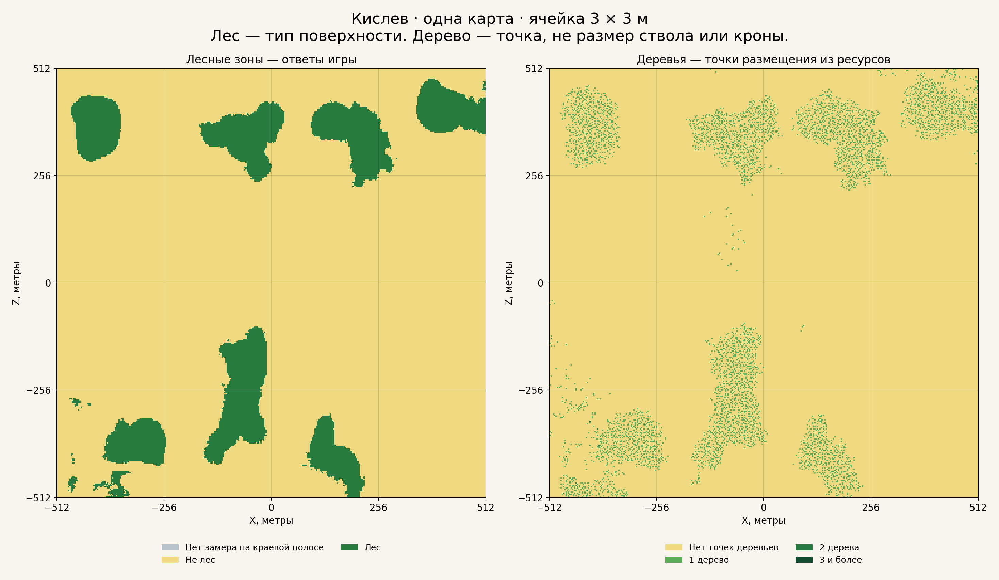

# Лесные зоны и отдельные деревья

[← Назад](README.md) · [Инструкция по карте](README.md) · [English — primary](../../../en/game/map/vegetation.md)

25 сентября 2026 года. Официальная карта Кислева, прежний сценарий `map_capture.xml`. Один запуск игры; после получения данных игра автоматически закрыта. Бой и влияние леса на отряды не проверялись.

Здесь зафиксирован выполненный замер и его ограничения. Лес читается через Lua. Точки деревьев получены из ресурсов конкретного сценария; универсальный способ получать деревья на любой карте ещё не готов.

## Что показано

**Лес:** игра через Lua сообщает тип земли в центре каждой клетки. Зелёный — ответ `forest`, жёлтый — другой тип земли. Это не означает, что вся жёлтая территория проходима или покрыта травой. Получено **14 380** лесных клеток. Результат полностью совпал с прежним замером.

**Деревья:** из файла размещения растительности карты прочитаны **5 168** точек выбранных моделей деревьев. Зелёная клетка содержит одну или несколько таких точек. Точка не описывает размер ствола, кроны или препятствия. Исключены кусты, упавшие брёвна, ветки и камни; включены сломанные деревья и варианты берёз с `totem` в названии. Проверки столкновений с ними не было.

Деревья занимают **5 155** клеток; максимум — две точки на клетку. **1 446** точек находятся вне земли типа `forest`. Поэтому лесную зону и отдельные деревья сохраняем раздельно.

## Размеры и файлы

Шаг **3 × 3 м**, матрицы **342 × 342**. Границы изображения — измеренная рамка радара X/Z от −512 до +512 м. Это не новая проверка стены, ограничивающей движение.

Последний ряд и столбец обрезаны до 1 м. Их стандартные центры оказались за рамкой, поэтому в лесной матрице эта узкая полоса помечена неизвестной. В матрице деревьев считаются только точки внутри рамки.

- `forest-3m.csv.gz` (локальный архив: `research/evidence/map/forest-trees-20260925/forest-3m.csv.gz`): 1 — лес, 0 — другой тип земли, −1 — неизвестно.
- `trees-3m.csv.gz` (локальный архив: `research/evidence/map/forest-trees-20260925/trees-3m.csv.gz`): число точек деревьев в клетке.
- Файлы `.npy` содержат те же матрицы. Порядок индексов `[iz, ix]`; первая строка — у нижнего края по Z.
- `tree-points.csv.gz` (локальный архив: `research/evidence/map/forest-trees-20260925/tree-points.csv.gz`): отдельные координаты и модели.
- [forest-3m.png](../../../../research/evidence/map/forest-trees-20260925/forest-3m.png), [trees-3m.png](../../../../research/evidence/map/forest-trees-20260925/trees-3m.png), [comparison-3m.png](../../../../research/evidence/map/forest-trees-20260925/comparison-3m.png): изображения.
- `summary.json` (локальный архив: `research/evidence/map/forest-trees-20260925/summary.json`): численные результаты и ограничения.

## Как проверяли деревья

Прямой Lua-метод, возвращающий список деревьев, не найден. Координаты взяты из `ksl.tree_list.bin` внутри `tile074.pack`. Формат проверен по RPFM; обратная упаковка дала исходные байты без изменений.

Привязка для этого сценария: X и Z файла минус 3072 м, Y плюс 100 м. Её подобрали по совпадению с уже снятым рельефом. Затем в игре запросили высоту земли во всех 5 168 точках. У **99,75%** расхождение с высотой размещения меньше метра; медианное абсолютное расхождение — **12 см**.

Это подтверждает согласование с рельефом. Это ещё не независимая проверка положения каждого видимого дерева, полноты списка или его коллизии.

Снятие всей сетки заняло **0,964 с** по часам Lua, проверка точек деревьев с записью лога — **0,745 с**. Полный запуск с загрузкой — **88,08 с**. Эти значения нельзя считать отдельным замером скорости получения только леса.

Не проверены: размеры стволов и крон, столкновения, влияние на отряды, разрушение деревьев, полный охват всех способов размещения и перенос на другие карты. Не использовать матрицу деревьев как карту непроходимости.

## Воспроизведение без игры

Из сохранённой исходной сетки: 1 при `ground == "forest"`, 0 при другом типе; −1, если `inside_radar == 0`. Для каждой сохранённой точки дерева внутри `[−512,512)` по X/Z увеличить значение в клетке `[floor((z+512)/3), floor((x+512)/3)]`. Это восстанавливает обе матрицы без запуска игры.

Рядом с результатами сохранены исходные ответы Lua, код замера, входной и выгруженный XML, выбор моделей, хеш исходного ресурса и подтверждение закрытия игры. Python-файлы — архив исходного эксперимента с его локальными входами, а не готовые универсальные команды запуска. Повтор замера деревьев требует этого специального скрипта и подходящих ресурсов игры; обычный сборщик поверхности деревья не извлекает.

Точный формат двоичного файла и внешний источник приведены в английской версии.

## Сохранённые доказательства

`tww3_bai_map_capture_grid.csv.gz` (локальный архив: `research/evidence/map/forest-trees-20260925/tww3_bai_map_capture_grid.csv.gz`) · `tww3_bai_map_capture_events.jsonl.gz` (локальный архив: `research/evidence/map/forest-trees-20260925/tww3_bai_map_capture_events.jsonl.gz`) · `capture.lua` (локальный архив: `research/evidence/map/forest-trees-20260925/capture.lua`) · `reader.lua` (локальный архив: `research/evidence/map/forest-trees-20260925/reader.lua`) · `map_probe.xml` (локальный архив: `research/evidence/map/forest-trees-20260925/map_probe.xml`) · `tww3_bai_map_capture_ready.xml` (локальный архив: `research/evidence/map/forest-trees-20260925/tww3_bai_map_capture_ready.xml`) · `model-selection.json` (локальный архив: `research/evidence/map/forest-trees-20260925/model-selection.json`) · `provenance.json` (локальный архив: `research/evidence/map/forest-trees-20260925/provenance.json`) · `manifest.json` (локальный архив: `research/evidence/map/forest-trees-20260925/manifest.json`) · `launch.json` (локальный архив: `research/evidence/map/forest-trees-20260925/launch.json`) · `status.json` (локальный архив: `research/evidence/map/forest-trees-20260925/status.json`) · `cleanup.json` (локальный архив: `research/evidence/map/forest-trees-20260925/cleanup.json`) · `hashes.json` (локальный архив: `research/evidence/map/forest-trees-20260925/hashes.json`)

`Decoder/build snapshot` (локальный архив: `research/evidence/map/forest-trees-20260925/source-snapshots/build_probe.py`) · `Analysis snapshot` (локальный архив: `research/evidence/map/forest-trees-20260925/source-snapshots/analyze.py`)
