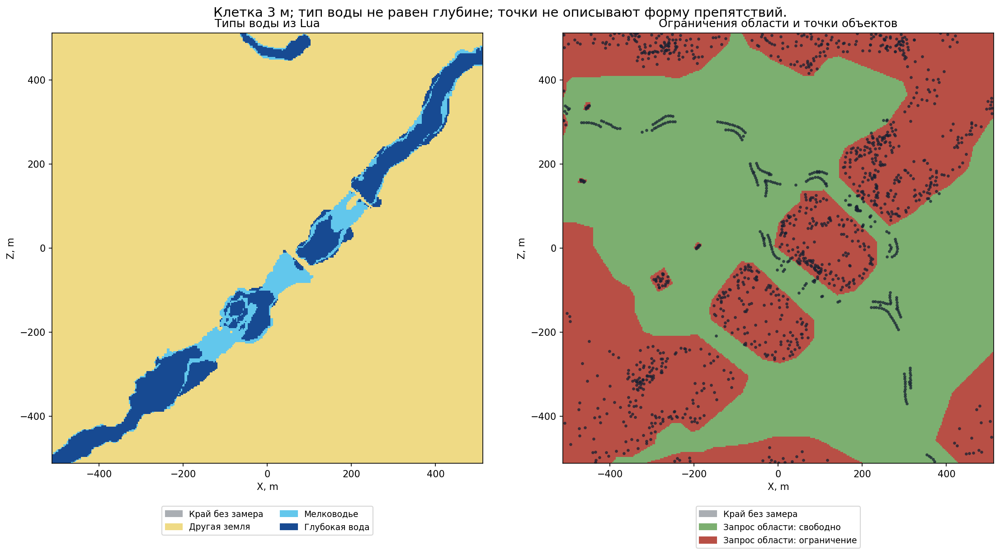

# Вода и модификаторы поверхности

[Инструкция по карте](README.md) · [English](../../../en/game/map/water-ground.md) · [Движение и переправы](passages.md)

## Что удалось получить

На официальной полевой карте Катая Lua вернул два разных ответа: **`shallow_water` — мелководье**, **`deep_water` — глубокая вода**. Используется прежний запрос `bm:ground_type(position)`; Y берётся через `bm:get_terrain_height(x,z)`.

Это название типа поверхности. Оно не сообщает глубину в метрах, уровень воды, течение или название реки.

Запрошен вариант `wh3_cth_farms_and_rivers_01_01`, `catchment_01`, позиция `(0.5,0.5)`. Фактически загруженный вариант зафиксирован в `экспортированном XML` (локальный архив: `research/evidence/map/field-20260925/cathay-navigation/tww3_bai_map_capture_ready.xml`). Проверка относится к нему, а не ко всем вариантам карты из меню. Версия игры: `v9.0.0 Build 50218.4334952`; пометка `(modded)` связана с диагностическим пакетом. Это полевой бой, без осады и поселения.

В рамке 1024 × 1024 м, шаг 3 м:

| Тип | Центров клеток | Доступно каждому из двух проверенных отрядов |
|---|---:|---:|
| Мелководье | 3 306 | 1 179 |
| Глубокая вода | 7 522 | 0 |

Проверены 60 крылатых уланов и 120 коссаров после расстановки. Это результат для этих отрядов, их исходных позиций и этого боя. Не считать любое мелководье проходимым, а любой ответ `deep_water` на всех картах — непроходимым. Узкая краевая полоса без замера помечена неизвестной.

`Матрицы и высоты` (локальный архив: `research/evidence/map/field-20260925/cathay-navigation/surface-masks.npz`) · `Все исходные запросы` (локальный архив: `research/evidence/map/field-20260925/cathay-navigation/tww3_bai_map_capture_grid.csv.gz`) · `Сводка` (локальный архив: `research/evidence/map/field-20260925/cathay-navigation/summary.json`)

В NPZ слой `water[iz,ix]`: −1 неизвестно, 0 другая земля, 1 мелководье, 2 глубокая вода. Слой `restricted`: −1 неизвестно, 0 положительный ответ области, 1 ограничение области. `height` — мировая высота Y. Это три разные характеристики.

На отдельно проверенном [участке с мостом](bridges.md) **14 центров с `deep_water` получили ответ «да»** для обоих отрядов. Значит, нельзя заменить слой доступности правилом «любая глубокая вода недоступна». Движение через эти 14 точек не проверялось.

## Каменистая земля и кустарник

`rock` уже был получен на Кислеве. На полевой карте лесных эльфов повторно получены **1 080** таких точек внутри рамки. `sharp_stones` — другой тип. Каменистая поверхность не описывает отдельный валун.

`scrub` присутствует в таблицах игры, но в снятых сетках Кислева, Катая и лесных эльфов не встретился. В проверенной таблице он связан с группой текстур `wefcity`. Это не доказывает, что каждый куст создаёт такой тип земли. Поселение ради этой проверки не запускалось. **Рабочая карта `scrub` пока не подтверждена.**

## Числа из таблиц игры

Таблицы установленного `db.pack` прочитаны и собраны обратно без изменения байтов. В них есть следующие записи:

| Поверхность | Параметр и группа | Множитель |
|---|---|---:|
| `deep_water` | Скорость, группа не указана | 0,7 |
| `rock`, `scrub` | Скорость, группа не указана | 0,95 |
| `rock`, `scrub` | Скорость, `ethereal` | 1,0 |
| `shallow_water` | Скорость, `small`, `small_forest_strider`, `elves_wef` | 0,8 |
| `shallow_water` | Атака, `aquatic_small`, `aquatic_large` | 1,2 |
| `shallow_water` | Атака, `small`, `small_forest_strider`, `elves_wef` | 0,8 |
| `shallow_water` | Защита, `aquatic_small`, `aquatic_large` | 1,2 |

Значения float32 округлены для чтения. Найденные строки `sharp_stones` содержат 1,0.

**Это проверенные записи файлов, а не замер итоговой скорости или силы отряда.** Ещё не проверены выбор группы, свойства отряда, доля бойцов на поверхности и порядок применения множителей. Полной проверки всех переопределений таблиц пакетами нет.

`Полные записи модификаторов и хеш` (локальный архив: `research/evidence/map/field-20260925/static-records/ground_type_to_stat_effects_tables.json`) · `Типы земли` (локальный архив: `research/evidence/map/field-20260925/static-records/ground_types_tables.json`) · `Группы` (локальный архив: `research/evidence/map/field-20260925/static-records/ground_type_stat_effect_groups_tables.json`) · `Связь с текстурами` (локальный архив: `research/evidence/map/field-20260925/static-records/ground_type_to_texture_groups_tables.json`)
