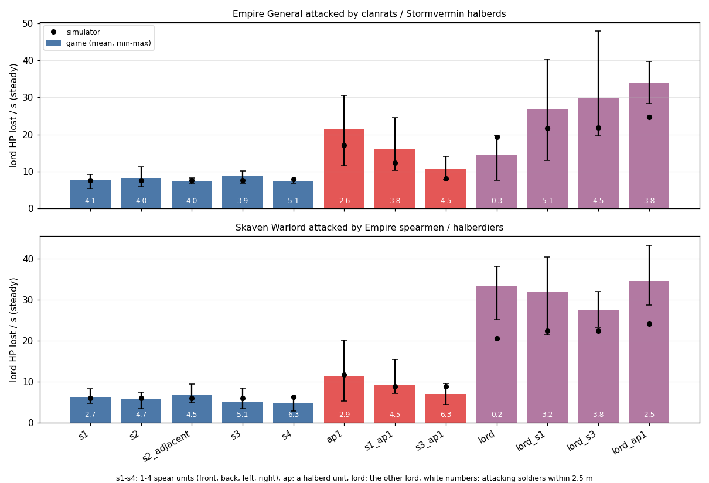

# Лорд в окружении

[← Назад](README.md) · [Документация](../../README.md) › [Знания об игре](../README.md) › [Отряды](README.md) › Лорд в окружении · [English](../../../en/game/units/lord-swarm.md)

Сколько теряет лорд, когда его атакуют от одного до четырёх отрядов пехоты с разных сторон, и что
добавляют бронебойный отряд или вражеский лорд. Вопрос пользователя (01.10.2026): урон наносят
бойцы, которые дошли до лорда и дерутся, а не весь отряд, поэтому окружить его четырьмя отрядами
может быть почти бесполезно. Измерено 01.10.2026 в 3 боях
[зонда «лорд в окружении»](../../apps/entries.md#lord_swarm), нормальная сложность, ×20, игра v9.0.1.

## Коротко

- **Число отрядов не важно.** Лорд, стоящий в кольце из 1, 2, 3 или 4 отрядов копейщиков,
  теряет одинаково: генерал Империи 7,8 / 8,3 / 8,7 / 7,4 HP/с против копейщиков-кланкрыс,
  военачальник скавенов 6,2 / 5,8 / 5,1 / 4,8 против копейщиков Империи.
- **В 2,5 м от него стоят 4–5 вражеских бойцов** (7–10 в 3 м), сколько бы отрядов ни нападало;
  отряды делят это кольцо.
- **Сторона не важна.** Копейщики со спины или с фланга ранят его так же, как спереди (только
  спереди 7,8, спереди и сзади 8,3, спереди и с фланга 7,4 у генерала).
- **Бронебойный урон идёт по своей доле кольца.** Алебарды штурмкрысов одни снимают с генерала
  21,5 HP/с (в 2,8 раза больше копейщиков-кланкрыс); с одним отрядом копейщиков 16,1, с тремя
  10,7 — среднее собственных темпов отрядов (15 и 11). Против военачальника: алебардисты одни
  11,2 (в 1,8 раза больше копейщиков), с одним отрядом копейщиков 9,3, с тремя 7,0.
- **Вражеский лорд сверху — другое дело.** Лорд против лорда шумит (один удар ~230 HP): генерал
  теряет от военачальника 14,3 HP/с, военачальник от генерала 33,3. С добавленной пехотой потеря
  примерно равна сумме лорда и пехоты (27–34 HP/с), но разброс ±10 HP/с.

## Как измеряли

На плоской карте MP Crossroads две полосы в 600 м друг от друга: генерала Империи атакуют
копейщики-кланкрысы (160 бойцов, фронт 30 м) и алебарды штурмкрысов, военачальника скавенов —
копейщики Империи (120 бойцов) и алебардисты. Обе стороны держит скрипт, все бесстрашны, поэтому
лорды не применяют способностей (пассивное «Держать строй» у генерала остаётся). Попытка
переносит нападающих на 20 м от лорда, лицом к нему, спереди, сзади, слева или справа; через 3 с
им приказано атаковать его, а ему — стоять (отбивается он сам). Попытка кончается через 40 с
после его первого контакта. Между попытками все отряды лечатся, усталость падает до десятой;
8 отрядов копейщиков на сторону сменяют друг друга, так что каждый дерётся в немногих попытках.
Темп считается с 15 с после контакта (натиск уже прошёл) до конца.

| Бой | Раскладки | Повторов |
|---|---|---|
| `20261001-101343` | 8 раскладок пехоты, обе полосы сразу | 2 |
| `20261001-102111` | другой лорд один, с 1 или 3 отрядами копейщиков, с отрядом алебард | 3 |
| `20261001-102508` | 8 раскладок пехоты | 3 |

## Результаты

Устойчивый темп потери здоровья лорда (среднее, мин.–макс. по повторам) и бойцы нападающих в
2,5 м от него (среднее посекундных подсчётов).

| Нападающие | Генерал: HP/с | бойцов ≤2,5 м | Военачальник: HP/с | бойцов ≤2,5 м |
|---|---:|---:|---:|---:|
| 1 отряд копейщиков, спереди | 7,8 (5,4–9,2) | 4,1 | 6,2 (4,6–8,2) | 2,7 |
| 2: спереди, сзади | 8,3 (6,0–11,2) | 4,0 | 5,8 (3,5–7,4) | 4,7 |
| 2: спереди, слева | 7,4 (6,8–8,3) | 4,0 | 6,8 (4,8–9,4) | 4,5 |
| 3: спереди, слева, справа | 8,7 (6,9–10,1) | 3,9 | 5,1 (3,4–8,4) | 5,1 |
| 4: со всех сторон | 7,4 (6,8–8,0) | 5,1 | 4,8 (2,9–6,3) | 6,3 |
| алебарды, спереди | 21,5 (11,6–30,6) | 2,6 | 11,2 (5,3–20,1) | 2,9 |
| копейщики спереди, алебарды сзади | 16,1 (10,4–24,5) | 3,8 | 9,3 (7,2–15,4) | 4,5 |
| 3 отряда копейщиков, алебарды сзади | 10,7 (8,0–14,0) | 4,5 | 7,0 (4,4–9,6) | 6,3 |
| другой лорд | 14,3 (7,7–19,7) | — | 33,3 (25,1–38,1) | — |
| лорд + 1 отряд копейщиков | 26,9 (13,0–40,3) | 5,1 | 31,8 (21,4–40,4) | 3,2 |
| лорд + 3 отряда копейщиков | 29,8 (19,6–47,9) | 4,5 | 27,6 (23,3–31,9) | 3,8 |
| лорд + алебарды | 34,0 (28,3–39,6) | 3,8 | 34,5 (28,7–43,3) | 2,5 |

Раскладки пехоты: 5 повторов; раскладки с лордом: 3. Каждый нападающий отряд 85–100 % времени
сообщает `is_in_melee`, даже когда у лорда стоит один его боец: флаг ничего не говорит о том,
сколько его бойцов бьёт лорда. Лорд убивает 0,3–0,5 бойца в секунду при любой раскладке.

## Данные по бойцам: что даёт игра

- **Скриптовый API CA** (`battle_unit`, `unitcontroller`, `script_unit` в `data_script.pack`)
  читает только отряд целиком: живые бойцы, здоровье, `is_in_melee`, убитые, место, направление.
- **По бойцу** есть только CCO-список `CcoBattleUnit.ManList` (`EntityList`) из
  `CcoBattleEntity`: его поля (имена зарегистрированы в исполняемом файле игры) — `Position`,
  жив ли, `IsMan` / `IsEngine`, перезарядка (`IsReloading`, `ReloadPercent`,
  `ReloadRemainingTime`), запись сущности и отряд. Здоровья, цели, боевого состояния и убитых у
  бойца нет.
- **По отряду** в CCO есть `HealthValue` (здоровье в HP), `NumKills`, `IsInMelee`,
  `DamageInflictedRecently`; `DamageDealt` у боевого отряда в этой сборке ничего не возвращает.
- Поэтому зонд каждые 0,2 с игрового времени читает здоровье, бойцов, убитых, флаг рукопашной и
  место каждого отряда, а каждую 1 с — место каждого бойца нападающих и считает тех, кто в
  1,5–6 м от лорда. Кто из них бьёт, прочитать нельзя.

## В симуляторе

`tools/nn/sim/melee.py`, `config/nn/sim.json` `contact` ([симулятор](../../training/simulator.md)):

- лорда бьют всего не больше `lord_max_attackers` = 9 бойцов, сколько бы отрядов его ни
  окружало, отряды в контакте делят это число; их темпы складываются (старое правило брало
  сильнейший отряд и 0,35 остальных);
- `lord_direction` = 0: фланг и тыл не повышают шанс попасть по лорду;
- вражеский лорд среди нападающих сохраняет свой удар (раньше ограничение вытесняло его вместе с
  пехотой, и лорд, которого бьют лорд и три отряда, терял вдвое меньше, чем от одного лорда);
- `lord_rival_others` = 0,35: когда на нём и вражеский лорд, пехота идёт с долей 0,35 (по целым
  боям; попытки зонда с лордом дают 0,7 ± 0,5);
- `lord_incidental` = 0,4: отряд с приказом атаковать другого врага бьёт лорда, которого лишь
  касается, с долей 0,4 (целые бои: 1,7 HP/с против 4,1, когда лорд — его цель).

## Ограничения

- По одному типу лорда на сторону, только пехота с копьями и алебардами; без кавалерии, монстров,
  других лордов.
- Лордов держит скрипт: в настоящем бою ИИ игры применяет способности («Стоять насмерть»,
  «Смертельный натиск»), лорд двигается и устаёт.
- Темп лорда против лорда несимметричен и шумит (генерал по военачальнику 33 HP/с, обратно 14) и
  не объясняется числами базы (оба ~20 HP/с по правилу).
- Данные: `build/lord-swarm/runs/` (не в Git); `python -m tools.nn.lord_swarm` печатает таблицу,
  `--sim` — симулятор на тех же попытках (нужен torch: `bash tools/nn/dock.sh tools.nn.lord_swarm --sim`).
