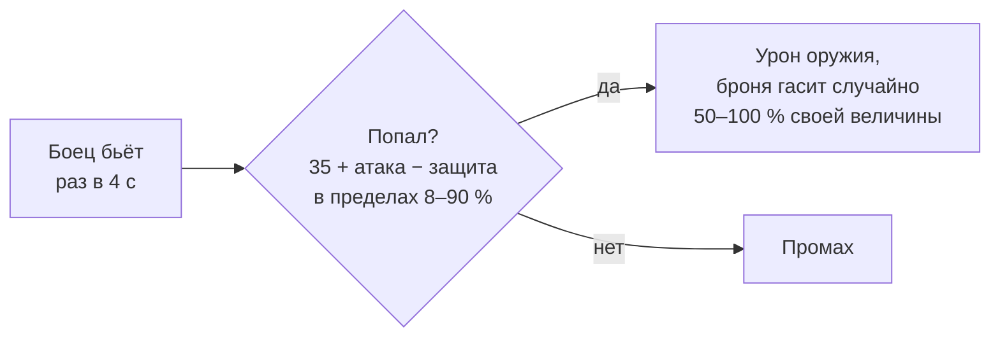

# Рукопашная

[← Назад](README.md) · [Документация](../../README.md) › [Знания об игре](../README.md) › [Отряды](README.md) › Рукопашная · [English](../../../en/game/units/melee.md)

Как игра считает удары в ближнем бою и сколько бойцов на самом деле дерётся.
Источники:

- таблица правил боя `_kv_rules_tables` и `land_units_tables` из базы игры
  (прочитаны 30.09.2026, [база игры](../database.md), `config/nn/game_rules.json`);
- карточки отрядов из боя ([ростер](roster.md), `data/roster/`);
- первые 13 честных боёв арены 30.09.2026 (`20260930-130637` … `-132200`,
  нормальная сложность), 7522 с записей; ещё 5 боёв записаны после разбора
  ([данные для обучения](../../training/README.md)).

Игра v9.0.1, сборка 50381.

## Правило из базы

| Правило | Значение | Ключ в `_kv_rules_tables` |
|---|---|---|
| Шанс попасть | 35 + атака − защита | `melee_hit_chance_base` 35 |
| Пределы шанса | 8–90 % | `melee_hit_chance_min`, `_max` |
| Удар | раз в 4 с | `melee_attack_interval` 4 |
| Броня | гасит случайно 50–100 % своей величины | `armour_roll_lower_cap` 0,5 |
| Защита при ударе во фланг / в тыл | ×0,6 / ×0,3 | `melee_defence_direction_penalty_coefficient_flank`, `_rear` |
| Натиск | спадает за 13 с | `charge_decay_duration` 13 |
| Бонус защиты строя | 5 (когда именно действует, не проверено) | `melee_defence_formed_attack_bonus` |
| Щит | держит удары до 60° от фронта | `shield_defence_angle_melee` 60 |

Сама формула зашита в движке; в базе только числа. Совпадение формулы с боем
проверено по записям (ниже).

## Отряды арены

Атака, защита — `land_units_tables`; урон оружия и броня — карточка из боя
([ростер](roster.md)).

| Отряд | Атака | Защита | Урон оружия | Броня |
|---|---:|---:|---:|---:|
| Генерал Империи | 55 | 45 | 430 | 85 |
| Копейщики (без щитов) | 20 | 34 | 25 | 30 |
| Лучники (без щитов) | 14 | 17 | 24 | 20 |

Шанс попасть по формуле (расчёт, не замер):

| Кто бьёт → кого | В лоб | Во фланг | В тыл |
|---|---:|---:|---:|
| Копейщики → копейщики | 21 % | 35 % | 45 % |
| Лорд → копейщики | 56 % | 70 % | 80 % |
| Копейщики → лорд | 10 % | 28 % | 42 % |
| Копейщики → лучники | 38 % | 45 % | 50 % |
| Лучники → копейщики | 15 % | 29 % | 39 % |

## Что показали записи

- **Дерутся не все.** Если считать, что бьёт каждый боец, формула сильно
  завышает потери пехоты против пехоты. С записанной потерей здоровья она
  совпадает, когда одновременно дерутся 13–18 % бойцов пехотного отряда
  (0,13 — по полю цели, 0,176 — по тому, где отряды касаются). Для 120
  копейщиков это примерно 16–21 боец.
- **Лорд.** Пары с лордом совпадают с формулой, если лорд бьёт как один боец, а
  одного бойца (лорда) достают до ~8 врагов (отношение записи к расчёту
  0,84–1,2). Прямой замер — [лорд в окружении](lord-swarm.md): в 2,5 м от лорда стоят 4–5
  вражеских бойцов, и 1, 2, 3 или 4 отряда вокруг снимают с него одинаково HP/с.

## Натиск: замер 29.09.2026

Зонд на [The Moorlands Route](../maps/moorlands-route.md) (юг, открытое место),
4 прогона `20260929-111203` … `-111923`, 16 полос. В каждой полосе два отряда
копейщиков Империи (по 120 бойцов, фронт 30 м) начинают в 80 м друг от друга.
Нападающий бежит на защитника (3,27 м/с). Защитник по режиму стоит, бежит
навстречу, когда до врага 45 м или 15 м, или оба бегут сразу. Режимы меняли
полосы от прогона к прогону. Сложность «очень высокая»: замер был до правила о
[честной сложности](../difficulty.md).

Бойцов потеряно за первые 40 с после касания, в среднем:

| Защитник | Полос | Защитник | Нападающий |
|---|---:|---:|---:|
| стоит | 4 | 7,5 | 1,25 |
| бежит навстречу с 45 м | 4 | 7,5 | 6,75 |
| бежит навстречу с 15 м | 4 | 9 | 8 |
| оба бегут сразу | 4 | 8,5 | 4,75 |

- Кто принимает натиск стоя, теряет больше: 7,5 бойца против 1,25.
- Кто бежит навстречу, уравнивает потери: 8,25 против 7,4 в среднем по 8 полосам.
- Даже когда бегут оба, нападающий теряет меньше. Нападающий — сторона ИИ, у
  которой на этой сложности бонусы; причина не проверена.

Оговорки: по 4 полосы на режим, только копейщики против копейщиков, одна карта,
разница в несколько бойцов. Точка входа зонда в Git не попала. Остались только
локальная сборка `build/charge-probe/` и сводка
`research/analysis/charge-probe/summary.json` (данные не в Git). Исходный код
зонда целиком лежит в собранном скрипте
`build/charge-probe/tww3_bai_charge_probe.lua` — модуль `entries.charge_probe`
(со строки 877); настройки полос — в `build/charge-probe/manifest.json`. Папка
`build/` не в Git: если её очистить, код зонда пропадёт.

## Не проверено

- Как именно броня и урон, пробивающий броню, делят удар.
- Натиск: сколько он добавляет по правилам, на честной сложности, у других
  отрядов и на других картах (выше — только малый замер).
- Щиты в рукопашной (у копейщиков и лучников арены щитов нет).
