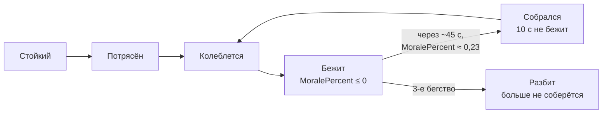

# Мораль

[← Назад](README.md) · [Документация](../../README.md) › [Знания об игре](../README.md) › [Отряды](README.md) › Мораль · [English](../../../en/game/units/morale.md)

Мораль решает, когда отряд бежит. Здесь правила из базы игры и то, что показали
записи боёв. Источники:

- таблицы базы игры `_kv_morale_tables`, `land_units_tables`,
  `unit_experience_bonuses_tables`, `unit_experience_thresholds_tables`
  (прочитаны 30.09.2026, [база игры](../database.md), `config/nn/game_rules.json`);
- первые 13 честных боёв арены 30.09.2026 (`20260930-130637` … `-132200`,
  нормальная сложность), 7522 с записей; ещё 5 боёв записаны после разбора
  ([данные для обучения](../../training/README.md)).

Игра v9.0.1, сборка 50381.

## Коротко

- Мораль — это очки. Основа — лидерство отряда, к нему прибавляются и
  вычитаются эффекты из таблицы ниже.
- Игра показывает `MoralePercent` — текущая мораль, делённая на действующее
  лидерство отряда. Его можно читать из Lua: `cco.MoralePercent`
  ([поля состояния](state-fields.md)).
- Отряд бежит, когда `MoralePercent` падает до 0.

Пороги состояний из базы (`ums_<состояние>_threshold_lower` / `_upper`), числа
как есть:

| Состояние | Нижний порог | Верхний порог |
|---|---:|---:|
| `impetuous` — неудержим | 1,1 | — |
| `eager` — рвётся в бой | 0,9 | 1,1 |
| `confident` — уверен | 0,65 | 1,0 |
| `steady` — стойкий | 30 | 0,8 |
| `shaken` — потрясён | 12 | 32 |
| `wavering` — колеблется | 0 | 16 |
| `broken` — бежит | −50 | 0 |

**В каких единицах эти пороги, не проверено.** Рядом стоят целые (0, 12, 16,
30, 32, −50) и дроби (0,65–1,1), а у стойкого верхний порог 0,8 меньше нижнего
30. Возможно, часть порогов — в очках, часть — в долях `MoralePercent`; с
записями их не сверяли. Соседние полосы заходят друг на друга.

## Лидерство

Из `land_units_tables` (отряды арены, ранг 0):

| Отряд | Лидерство | Действующее лидерство по записям |
|---|---:|---:|
| Генерал Империи (`wh_main_emp_cha_general_0`) | 70 | 77 |
| Копейщики (`wh_main_emp_inf_spearmen_0`) | 60 | 73 |
| Лучники (`wh2_dlc13_emp_inf_archers_0`) | 50 | 63 |

- Каждый ранг опыта даёт **+1,06** лидерства (`unit_experience_bonuses_tables`,
  `stat_morale`).
- Опыт для рангов 1–9 (`unit_experience_thresholds_tables`): 700, 1500, 2400,
  3400, 4600, 7000, 10600, 15500, 22000.
- Все отряды арены — ранг 0 (`<unit_experience level="0"/>` в сценарии).

## Что меняет мораль

Все числа — очки морали из `_kv_morale_tables`.

| Причина | Очки |
|---|---:|
| Лорд рядом: в радиусе 70 м | +4 |
| Лорд погиб: сначала вся армия | −16 |
| Лорд погиб: потом вся армия надолго | −10 |
| Лорд недавно бежал | −16 |
| Атака во фланг / в тыл | −6 / −14 |
| Открыт один фланг / несколько | −3 / −6 |
| Фланги прикрыты | +5 |
| Под обстрелом | −5 |
| Выигрывает схватку: чуть / да / сильно | +3 / +6 / +8 |
| Проигрывает схватку: да / сильно | −3 / −8 |
| Сильный враг рядом (по его боевой силе) | от −3 до −24 |
| Очень устал / измотан | −2 / −6 |
| Сложность «очень высокая» — у игрока | −4 ([сложность](../difficulty.md)) |

Бегущие свои отряды в пределах 100 м тоже снижают мораль (вес 3).

**Потери за весь бой** — доля потерянного здоровья (в таблице включено
«считать по здоровью, а не по бойцам»):

| Потеряно | 10 % | 20 % | 30 % | 40 % | 50 % | 60 % | 70 % | 80 % | 90 % |
|---|---|---|---|---|---|---|---|---|---|
| Очки | −2 | −4 | −7 | −11 | −16 | −22 | −32 | −47 | −74 |

**Недавние потери:**

| Потеряно недавно | 6 % | 10 % | 15 % | 33 % | 50 % |
|---|---|---|---|---|---|
| Очки | −6 | −12 | −20 | −44 | −80 |

Сколько секунд считается «недавно», таблица не говорит.

**Таймеры:** после третьего бегства отряд разбит (`shatter_after_rout_count` 3);
собравшийся отряд 10 с не может снова побежать (`post_rally_no_rout_timer`);
`waver_base_timeout` 25 с; мораль меняется плавно (`percent_update_per_tick` 0,15).

## Что показали записи

13 боёв арены, нормальная сложность, 30.09.2026:

- **Правила объясняют запись.** Правила из базы объясняют записанный
  `MoralePercent` стоящих отрядов с r² = 0,80 (82 395 замеров), если действующее
  лидерство — 77 у лорда, 73 у копейщиков, 63 у лучников. Подгонке ещё нужен
  начальный запас сверх лидерства: у нас 6/6/11 очков, у ИИ игры 13/6/7
  (лорд/копейщики/лучники). Это подобранное число, не правило игры. В записи
  через 2 с после начала `MoralePercent` у лордов обеих сторон одинаковый
  (1,057), у копейщиков — 1,067 (у части копейщиков ИИ игры 1,1). У лучников
  он разный: у нас 1,08, у ИИ игры обычно 1,12. На «очень высокой» сложности
  (19 боёв) картина та же ([сложность](../difficulty.md)).
- **Бегство.** Отряд бежит, когда `MoralePercent` доходит до 0 (медиана перед
  бегством 0,00). Здоровья у него в этот момент — медиана 19 % (от 9 до 43 % в
  80 % бегств).
- **Сбор.** Бегущий отряд собирается через 45 с (медиана; 25–83 с), когда
  `MoralePercent` поднимается примерно до 0,23.
- **Сколько.** 243 бегства и 132 сбора за 13 боёв — около 19 бегств и 10 сборов
  за бой. Отряды часто бегут и собираются по нескольку раз; победитель долго
  гонит бегущих, бой идёт 350–900 с игрового времени.

## Как читать

- `cco.MoralePercent` — число; бывает больше 1, а под натиском уходит ниже 0
  (в опыте до −1,78, [показатели состояния](state-sensors.md)). Не обрезать до
  0–1.
- `cco.MoraleState`, `is_wavering()`, `is_routing()`, `is_shattered()` —
  состояние и признаки ([поля состояния](state-fields.md)).
- Число морали в карточке, `cco.card.stat_morale.Value` / `ValueBase`, в бою
  меняется (от −72 до 75, [поля состояния](state-fields.md); на расстановке
  карточка показывает 0, [ростер](roster.md)). Как оно связано с действующим
  лидерством, не установлено. Поэтому очки морали и действующее лидерство
  считаем из `MoralePercent` и таблиц выше.

## Не проверено

- Как именно движок складывает эффекты: формула в движке, в базе только числа.
- Ранги выше 0, другие отряды и фракции.
- В таблице есть ещё `charge_bonus` 15, `shatter_after_first_rout_if_casulties_higher_than`
  0,05 и `…_second_rout_…` 0,1 — их смысл не проверяли.
