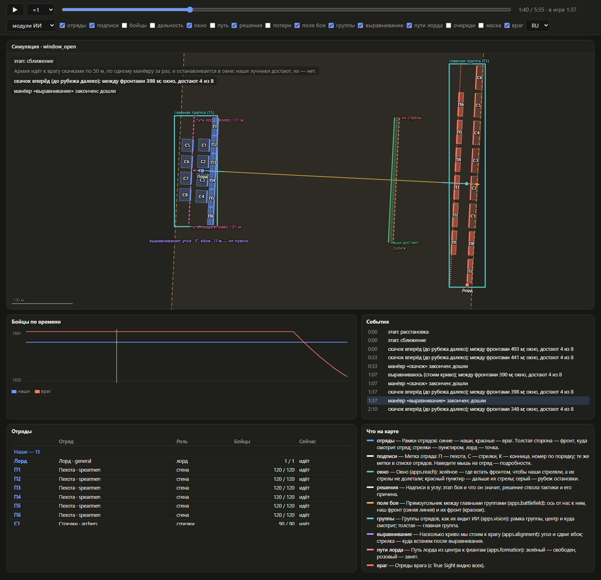
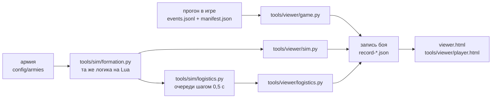

# Проигрыватель боя

[← Назад](README.md) · [Документация](../README.md) › [Запуск](README.md) › Проигрыватель боя · [English](../../en/launch/viewer.md)

Бой из игры или из симуляции проигрывается на веб-странице в реальном времени: пауза, скорость, перемотка, слои на выбор, что видели модули ИИ.



*Симуляция `window_open`, набор «модули ИИ». Жёлтый пунктир — поле боя между главными группами
(`apps.battlefield`), стрелка — его ось. Бирюзовые рамки — группы, как их видит ИИ (`apps.vision`), толстая —
главная. Розовый пунктир — пути лорда к флангам (`apps.formation`). Фиолетовая подпись — выравнивание
(`apps.alignment`). Зелёная и красная линии — окно (`apps.reach`). У каждого отряда метка: П — пехота,
С — стрелки. Внизу — события, список отрядов и что значит каждый слой.*

## Как запустить

```bash
python -m tools.viewer sim window_open --preset modules
```

| Команда | Что делает |
|---|---|
| `sim <армия>` | симуляция армии из `config/armies/` → `record-sim.json` и `viewer.html` |
| `game <прогон>` | запись игрового прогона `build/<цель>/runs/<прогон>` → `record-game.json` и `viewer.html` |
| `compare <прогон> [--army]` | игра и симуляция её армии рядом, на общих часах |
| `logistics <армия>` | каждый скачок армии в обход препятствия: с очередью и все сразу рядом, страница на скачок (`step-1.html`, …) |
| `page <запись.json> … --out <файл>` | любые записи рядом на одной странице |

Общие флаги:
- `--out DIR` — куда писать. По умолчанию `research/analysis/viewer/<имя>/`, в Git эта папка не попадает.
- `--preset approach|modules|fire|logistics|debug` — набор слоёв при открытии.
- `--lang ru|en` — язык при открытии; на странице есть переключатель RU/EN.

Для игры есть ещё `--idle-s 5`: отрезки, где ничего не двигалось дольше этого времени, сжимаются до секунды.

`viewer.html` — один файл: записи лежат внутри, сервер не нужен, страница открывается двойным щелчком.

## Что на странице

| Часть | Что показывает |
|---|---|
| Карта | отряды и слои; у каждого отряда метка: П1…П6 — пехота, С1…С8 — стрелки, К — конница, «Лорд» |
| Подписи в углу | этап боя, **что он значит** простыми словами, решение ствола тактики и его причина, конец манёвра |
| Подсказка | наведите мышь на отряд: тип, название, сторона, роль, бойцы, идёт или стоит, дальность, стрелы, место в очереди |
| Отряды | кто участвует: все отряды обеих сторон с меткой, типом, ролью, бойцами сейчас и что делают; строка подсвечивает отряд на карте |
| Что на карте | объяснение каждого включённого слоя с его цветом |
| График | бойцы сторон по времени; у очередей — давка и бойцы на камнях |
| События | все события по времени; щелчок перематывает к событию |

## Управление

| Что | Как |
|---|---|
| Пуск и пауза | кнопка ▶ или пробел |
| Скорость | ×0.5 … ×20; ×1 — настоящее время боя |
| Перемотка | ползунок, ← и → на 5 с, щелчок по графику или по событию |
| Приблизить, сдвинуть | колесо мыши, перетаскивание; двойной щелчок — весь бой |
| Язык | RU / EN справа вверху |
| Ссылка на момент | `viewer.html#preset=fire&t=300&lang=en` — набор, секунда, язык |

## Слои и наборы

| Слой | Что рисует | Модуль или источник |
|---|---|---|
| отряды | рамки отрядов, толстая сторона — фронт; стрелки пунктиром, лорд — точка | центр, направление, ширина; глубина — из форм отряда |
| подписи | метка отряда (П1, С3, Лорд); у очередей — «+N с», сколько ждать | тип по классу отряда |
| бойцы | точки бойцов | игра: снимки `soldiers_dm`; симуляция и враг: ровно по рамке |
| дальность | дуги первой стрелы перед стрелками | `apps.reach.first_arrow_m` (130 м → 126 м) |
| окно | где встанет наш фронт: «наши достают», «их стрелы», рубеж | `apps.reach.window` в решении ствола |
| путь | след центра армии, точки решений, цель скачка | кадры и решения |
| решения | этап и его смысл, решение и причина, конец манёвра | `apps.tactics` |
| потери | «−n» над отрядом; красный круг — терял бойцов за последние 3 с | бойцы в кадрах |
| поле боя | прямоугольник между главными группами, ось, наш и их фронт | `apps.battlefield` |
| группы | рамки групп, центр, куда смотрит; главная — толстая | `apps.vision` |
| выравнивание | угол и сдвиг вбок, нужно ли; стрелка — куда встанем | `apps.alignment` |
| пути лорда | путь лорда из центра к флангам, длина, свободен ли | `apps.formation` |
| очереди | полоса препятствия, след отряда: слева, справа или прямо | `apps.logistics` |
| маска | клетки 3 м, где встать нельзя | `apps.mask` |
| враг | отряды врага (с True Sight видно всех) | прогон или расстановка врага |

| Набор | Слои |
|---|---|
| сближение (`approach`) | отряды, подписи, путь, окно, решения, враг, поле боя |
| модули ИИ (`modules`) | отряды, подписи, поле боя, группы, выравнивание, пути лорда, окно, решения, враг |
| перестрелка (`fire`) | отряды, подписи, бойцы, дальность, окно, потери, решения, враг |
| очереди (`logistics`) | отряды, подписи, очереди, маска, решения |
| всё (`debug`) | все слои |

Что видели модули, запись хранит на каждое решение: поле боя и группы — в начале сближения и после
каждого манёвра. Поэтому при перемотке видно, как они менялись. В игровых прогонах поле боя и выравнивание
пока пишутся только на расстановке.

## Обход препятствия очередями

```bash
python -m tools.viewer logistics rock_march_wide
```


*Длинная стена (16 отрядов) обходит скалу. Слева — с очередью (`apps.logistics`): отряды проходят по одному,
у стрелков под меткой «+N с» — сколько им ждать. Справа — все сразу: отряды сбиваются у скалы. На графике —
давка (бойцы двух отрядов ближе 1 м) и бойцы на камнях; сплошная — с очередью, штрих — все сразу.*

Здесь движение настоящее, а не прыжком: `tools/sim/logistics.py` ведёт каждый отряд шагом 0,5 с по приказам
диспетчера из `apps.logistics`, как в бою. Кадр пишется раз в секунду. Врага в этой записи нет, он в очереди
не участвует.

## Игра и симуляция рядом

```bash
python -m tools.viewer compare build/formation-probe/runs/20260928-150819
```


*Один бой (`window_game`) на общих часах: слева прогон в игре, справа симуляция. В игре армия ещё
выравнивается, потому что враг перестраивается (задача № 26). В симуляции армия уже идёт скачками к окну.*


*Перестрелка того же боя. Сплошные линии на графике — игра, штрих — симуляция. Симуляция убивает
заметно больше, чем игра: урон стрелами ещё предстоит сверить (фаза 3).*

## Запись боя

Один JSON на бой, одинаковый для игры, симуляции и очередей (`tools/viewer/record.py`, версия 2). Всё, что
читает человек, записано на двух языках: `{"ru": …, "en": …}`.

```text
format, version        "tww3-battle-record", 2
meta                   source (game | sim | logistics), name, title{ru,en}, army, strategy, skipped, duration_ms
units                  id (сторона:имя), side, role (wall | arc | lord), kind (класс), key, title,
                       type{ru,en}, tag{ru,en}, men_max, range_m, reach_m
frames[]               t_ms (часы проигрывателя), game_ms (часы боя),
                       units[]: id, x, z (центр блока), bearing, front_m, depth_m, men, moving, ammo
soldiers{id: [...]}    снимки бойцов: t_ms, pts — [поперёк, вперёд, …] в дециметрах в системе отряда
events[]               stage | decision | manoeuvre | note: t_ms, text{ru,en}; у решения — gap_m, stop_gap_m, advance_m, window
overlays[]             что видели модули: field | groups | alignment | routes | logistics, t_ms и данные;
                       действует до следующего того же вида
series[]               линии графика: name{ru,en}, points [[t_ms, значение], …]
mask                   рамка сетки и строки клеток ('#' — нельзя встать) или null
```



**Игра.** Кадры — из всех событий с отрядами (`stage_snapshot`, `approach_sample`, `approach_manoeuvre`,
`hold_sample`), примерно раз в 2 с. Если в событии нет врага, берётся последнее, где он был. Между кадрами
страница двигает отряды равномерно.

**Симуляция.** Каждый манёвр идёт по времени, как у движка ([ходок](../testing/simulator.md#ходьба-как-в-игре):
в обход камней, отряд смотрит, куда идёт). Кадр — раз в секунду. Враг стоит на месте, как штатный ИИ в
тестовой битве. Перестрелка (`fire_s` в армии) — кадр в секунду из `apps.missile`.

**Метки отрядов** строятся по классу отряда (`inf_mel`, `inf_mis`, `cav…`, `com`), а не по ключам:
подходят любые армии. Номер идёт по порядку внутри стороны и типа.

## Проверки

`tests/tools/test_viewer.py`:
- **Игровой прогон.** Маленький прогон превращается в правильную запись. Враг переносится в кадры, где его не было. Глубина отряда берётся из его формы. Простой вырезается. Бойцы лежат в системе отряда. Решение хранит окно и шаг.
- **Модули в игре.** Поле боя и выравнивание из игры становятся слоями.
- **Отряды и языки.** У отрядов есть тип, метка и название. Всё, что читает человек, записано на двух языках; проверка ловит текст на одном языке.
- **Симуляция.** Запись того же формата. Манёвр длится своё время ходьбы. Центры блоков такие же, как в игре. Поле боя и группы есть в начале и после каждого манёвра. Путь лорда начинается там, где стоит лорд.
- **Обход препятствия.** Две записи: с очередью (кто-то ждёт) и все сразу (никто не ждёт). Кадр раз в секунду, врага нет.
- **Страница.** Несёт записи внутри и открывается без сервера.
