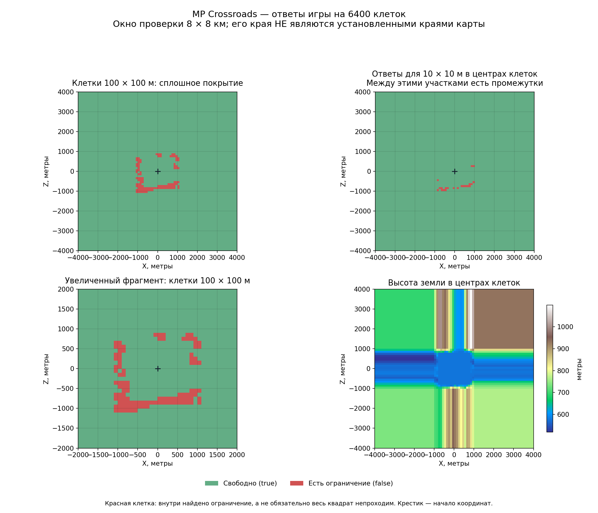

# MP Crossroads: сплошная сетка запросов

Проверено 25.09.2026. **В ответах `is_area_clear` замкнутой прямоугольной
границы вокруг начала координат нет. В высотах обнаружена прямоугольная
особенность около X/Z = ±1000 м, но её связь с игровыми границами не установлена.**

## Условия и полнота

Один запуск `mp_crossroads_flat`, по одному отряду коссаров с каждой стороны.
Сценарий аналогичен [первой проверке](crossroads-live-check.md), без
явно заданного `playable_area`. Запрошен `catchment_03`; факт применения
именно этого слоя по-прежнему не подтверждён экспортом.

Замеры в расстановке (`Deployment`), без приказов отрядам. Скорость x20 запрошена,
но при загрузке получено x1. Графика минимальная, размер отрядов Ultra.
Общий запуск с загрузкой и завершением — 96,25 секунды. Сетка измерялась
с 18:08:15 до 18:08:22 UTC, примерно 7 секунд по секундным отметкам журнала.
После сохранения результатов закрыт только тестовый процесс, удалены его
отдельные pack и modlist. Обычный боевой стенд не менялся.

Выбранное окно X/Z от −4000 до +4000 м разделено на 80 × 80 квадратов по
100 × 100 м: **6400 клеток без промежутков**. Это наш диапазон запросов,
не установленный размер карты. Координаты центров: −3950 … +3950, шаг 100 м.
В каждом центре выполнены:

1. Запрос высоты земли.
2. Проверка всего квадрата 100 × 100 м.
3. Проверка квадрата 10 × 10 м в том же центре.
4. Запрос типа поверхности.

Y в обеих проверках — высота земли именно в этом центре, а не высота начала
координат, как в [предыдущем опыте больших областей](crossroads-large-area-check.md).
Bearing = 0, is_naval = false. Перед вызовами сохранялись параметры для
диагностики возможного сбоя. Все 12 800 проверок областей, 6400 запросов высоты
и 6400 запросов поверхности завершились; ошибок и краша не было.

## Ограничения участков

| Проверка | Свободно | Есть ограничение |
|---|---:|---:|
| Вся клетка 100 × 100 м | 6292 | 108 |
| Центр 10 × 10 м | 6379 | 21 |

Все красные большие клетки находятся в пределах X от −1100 до +1100 м,
Z от −1100 до +900 м. Они образуют семь групп при соединении по общей стороне.
**Ровной замкнутой рамки вокруг начала координат нет.** Зелёная группа,
содержащая четыре клетки около `(0,0)`, связана с краями выбранного окна и
содержит 6291 клетку. Отдельно есть одна зелёная клетка, окружённая красными;
это не граница всей карты.

У 87 красных больших клеток маленький центральный участок зелёный.
Обратных случаев нет. Это согласуется с тем, что большой квадрат может
зацепить ограничение вдали от центра.

Цвет отражает **ответ запроса**, а не доказанную возможность пройти отрядом.
Красный не означает, что весь квадрат занят препятствием. Зелёный за пределами
предполагаемого поля не доказывает доступность этой земли для отряда.
На схеме маленьких проверок цвет клетки показывает результат только
центрального квадрата 10 × 10 м; между такими квадратами есть промежутки 90 м.

## Прямоугольная особенность высот

Все измеренные столбцы при X ≤ −1050 м полностью совпадают друг с другом по
высотам, а столбец X = −950 м уже отличается. Аналогично справа: столбцы
X ≥ +1050 м совпадают, X = +950 м отличается. То же наблюдается для строк Z.
Сравнение выполнено по всем 80 значениям каждой строки/столбца.

Получается прямоугольный рисунок повторяющихся крайних значений. На нашей
выборке изменение поведения лежит между −1050 и −950 м и между +950 и +1050 м
по каждой оси. **Это интервалы наблюдения, а не измеренные координаты сторон.**

Возможное объяснение — запрос высоты за пределами хранимого рельефа использует
крайние значения. Это гипотеза, не подтверждённое устройство движка. Она не
доказывает, что граница рельефа совпадает с разрешённой областью боя.
Диапазон полученных высот: 518,531 … 1099,032 м. В отличие от первоначальных
25 точек, расширенная выборка не имеет одинаковой высоты.

## Вывод и следующий отдельный опыт

По `is_area_clear` искомая рамка не обнаружена. Дальнейшее равномерное
расширение этой же сетки сейчас не обосновано: внешние клетки уже зелёные.

Есть более конкретная зацепка: уточнить переход к повторению высот около
±1000 м и затем сопоставить его с фактическими пределами движения отряда.
Оба шага ещё не выполнены. В утверждённые входы нейросети границы не добавляем.

## Данные

- `Все клетки в CSV` (локальный архив: `research/evidence/map-data/crossroads-grid-evidence/grid.csv`).
- `Сводка, группы клеток и интервалы повторения высот` (локальный архив: `research/evidence/map-data/crossroads-grid-evidence/summary.json`).
- `Исходный журнал` (локальный архив: `research/evidence/map-data/crossroads-grid-evidence/tww3_bai_grid_probe_events.jsonl`).
- `Хеши файлов` (локальный архив: `research/evidence/map-data/crossroads-grid-evidence/hashes.json`).
- `Входной XML` (локальный архив: `research/evidence/map-data/crossroads-grid-evidence/map_probe.xml`).
- `Экспорт игры` (локальный архив: `research/evidence/map-data/crossroads-grid-evidence/tww3_bai_grid_probe_ready.xml`).
- [SVG для увеличения](../../../../research/evidence/map-data/crossroads-grid-evidence/grid.svg).

Исследовательские скрипты остаются в игнорируемой `tmp/map-research/grid-probe/`.
