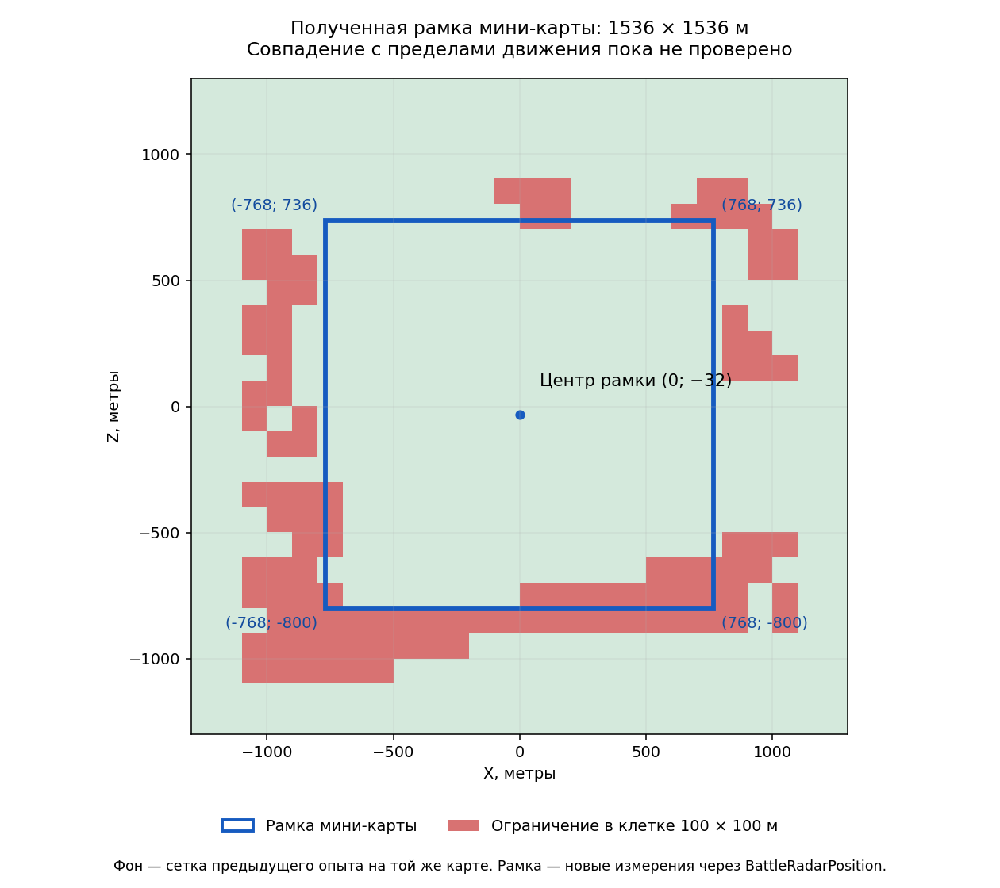

# MP Crossroads: рамка мини-карты получена из игры

[← Назад](README.md) · [Документация](../../README.md)

Проверено 25.09.2026, один запуск 1 на 1.
**`BattleRadarPosition` работает из Lua. Для этого боя восстановлена и
проверена рамка мини-карты 1536 × 1536 м. Совпадение с пределами движения
отряда ещё не проверено.**



## Полученные значения

| Параметр | Метры |
|---|---:|
| Минимальный X | −768 |
| Максимальный X | +768 |
| Минимальный Z | −800 |
| Максимальный Z | +736 |
| Ширина и глубина | 1536 × 1536 |
| Центр X/Z | (0, −32) |

Это результат запросов текущего боя, а не значения из DB или предположение
о центре `(0,0)`. Эти числа нельзя считать постоянными для других карт/боёв.

## Проверенный вызов Lua

```lua
local u, v = common.get_context_value(
    "BattleRadarPosition(ToVector4(100,0,0,0))"
)
-- В этом запуске: u = 0.56510418653488, v = 0.47916668653488.
```

Vector4 возвращается в Lua **четырьмя отдельными числами**, не одной таблицей.
Первые два — координаты мини-карты; также работает обращение `.x`/`.y`
внутри выражения. Это поведение непосредственно записано в журнале.

Из трёх неколлинеарных мировых точек `(0,0)`, `(100,0)`, `(0,100)` построено
двумерное преобразование. Оно дало приблизительные углы, близкие к целым
значениям таблицы. Эти целые координаты затем **отдельно отправлены в игру**:

| X/Z | Получено u/v |
|---|---|
| (−768, −800) | (0, 1) |
| (+768, −800) | (1, 1) |
| (+768, +736) | (1, 0) |
| (−768, +736) | (0, 0) |
| (0, −32) | (0.5, 0.5) |

Для этого опыта преобразование описывается формулами:

```
u = (X + 768) / 1536
v = (736 - Z) / 1536
```

Это описание измеренного результата. В рабочем ИИ коэффициенты нужно получать
заново из запросов, а не закреплять эти числа в коде.

## Контрольные проверки

- Выполнено 117 запросов контекстов, включая 30 мировых точек/вариантов высоты.
  Все вызовы завершились без ошибки; все 30 ответов соответствуют формуле.
- Проверены точки на метр внутри и снаружи каждой стороны. Снаружи получены
  отрицательные значения или значения больше 1. Обрезания ответа к 0–1 нет
  на этой выборке. Также проверены удалённые точки до ±1200 м.
- Изменения Y от 0 до 600 и 1200 м в проверенных точках не изменили результат.
  Четвёртый компонент входного Vector4 = 0 и 1 в повторных проверках также
  не изменил соответствующие ответы.
- Повторная точка спустя примерно 43 секунды дала тот же ответ.
- Максимальное отклонение от приведённой формулы около 0,000061 м после
  обратного пересчёта. **Это численная согласованность преобразования,
  не измеренная точность физической границы боя.**

Фаза — `Deployment`, активный бой не запускался. Масштаб и поворот мини-карты
не менялись; другие этапы боя, карты и мультиплеер не испытывались.

## Положения отрядов: отдельное ограничение

У обоих отрядов успешно прочитаны `CcoBattleUnit.Position` и `RadarPosition`
по `unique_ui_id`. Однако разные представления позиции не полностью совпадают.

У первого отряда обратный перевод RadarPosition почти совпал с Lua
`unit:position()`. У второго при таком сравнении X/Z отличаются примерно
на 4,69/3,86 м. CCO Position также отличается от Lua position. Причина
(точка привязки, обновление интерфейса или движение при расстановке) не установлена.
Поэтому позиции отрядов не использовались для расчёта рамки или доказательства
её физической доступности. Все значения сохранены в сводке без подмены.

## Что доказано и что остаётся

Доказаны доступ к функции из Lua и численная рамка её координат 0–1 в этом бою.
Это даёт реальный ограниченный диапазон для дальнейшего исследования карты.

Не доказано, что отряд остановится именно на этой рамке. Сопоставление с
реальными приказами остаётся следующим опытом. Нельзя объявлять `0≤u,v≤1`
универсальной проверкой допустимости приказа до такого сопоставления.
Размер формации и препятствия могут ограничить положение центра отряда раньше.

Никаких новых утверждённых входов нейросети не добавлено.

## Запуск и доказательства

Ресурс `mp_crossroads_flat`, запрос `catchment_03`, по одному отряду коссаров.
XML без `playable_area`; тестовые зоны расстановки 200 × 120 м сохранены.
Графика минимальная, размер отрядов Ultra. Запрошено x20; при расстановке x1.
Общее время процесса около 169 секунд, включая загрузку и ожидание
дополнительных запросов. Во втором пакете запросов карта не перезагружалась.
После `probe_done` закрыт только тестовый процесс и удалены его pack, modlist
и файл запросов. Обычный боевой стенд не менялся.

- `Все запросы и ответы` (локальный архив: `research/evidence/map-data/crossroads-radar-evidence/tww3_bai_radar_probe_events.jsonl`).
- `Сводка, 30 точек и позиции отрядов` (локальный архив: `research/evidence/map-data/crossroads-radar-evidence/summary.json`).
- `Дополнительные запросы в том же процессе` (локальный архив: `research/evidence/map-data/crossroads-radar-evidence/tww3_bai_radar_probe_requests.tsv`).
- `Экспорт игры` (локальный архив: `research/evidence/map-data/crossroads-radar-evidence/tww3_bai_radar_probe_ready.xml`).
- `Входной XML` (локальный архив: `research/evidence/map-data/crossroads-radar-evidence/map_probe.xml`).
- `Хеши` (локальный архив: `research/evidence/map-data/crossroads-radar-evidence/hashes.json`).
- [Схема SVG](../../../../research/evidence/map-data/crossroads-radar-evidence/radar-frame.svg).

Фон схемы взят из предыдущей сетки на той же карте, а не измерен повторно в
этом запуске. Исследовательские скрипты: `tmp/map-research/radar-probe/`.

Предшествующее [интернет-исследование](map-edges-internet-research.md)
содержит документацию и исходную гипотезу.
