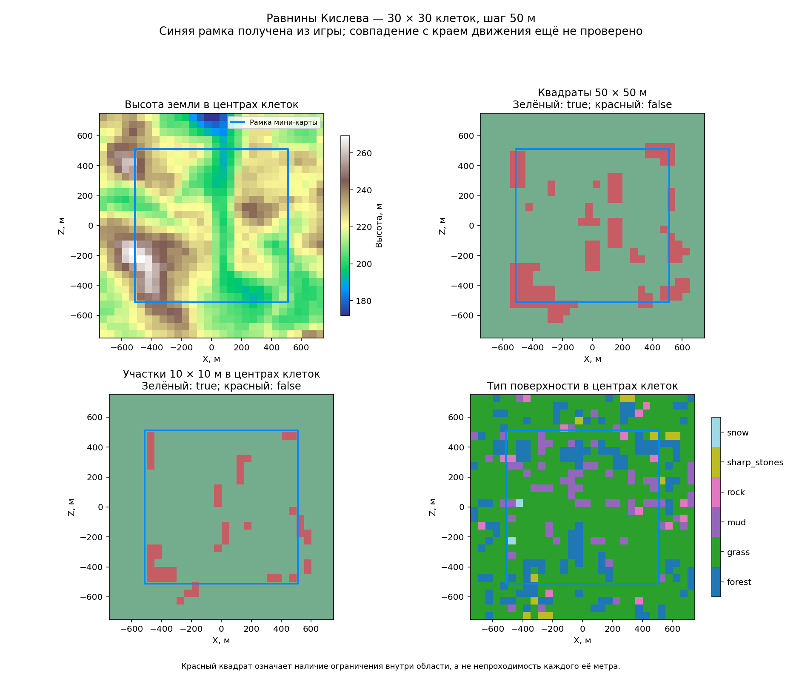

# Равнины Кислева: рамка мини-карты и сетка поверхности

[← Назад](README.md) · [Документация](../../README.md)

Дата: 25.09.2026. Успешный запуск: `run-20260925-213750`.

Загружен штатный ландшафт `wh3_main_macro_ksl_plains_01`. Запись игры
`wh3_kislev_plains_01_04` принадлежит Creative Assembly, тип `classic`, без осадных
стен и большого поселения. Это наш сценарий на официальном ландшафте, а не
подтверждённая копия всех настроек одноимённого боя из меню.

## Что измерено

`BattleRadarPosition(ToVector4(x,0,z,0))` дал преобразование:

```text
u = 0.5 + X / 1024
v = 0.5 - Z / 1024
```

Из него получена рамка X = −512…+512 м, Z = −512…+512 м, размер **1024 × 1024 м**.
Все четыре вычисленных угла отдельно переданы игре: ответы точно совпали с
углами мини-карты `(0,0)`, `(1,0)`, `(1,1)`, `(0,1)` в записанной точности.
Это проверка преобразования координат, **ещё не доказательство края движения**.

Сетка покрывает X/Z = −750…+750 м: **30 × 30 = 900 клеток**, шаг 50 м.
Она специально выходит за рамку мини-карты. В каждой клетке получены:

- высота и тип земли в центре;
- `is_area_clear` для квадрата 50 × 50 м на местной высоте;
- тот же запрос для участка 10 × 10 м в центре;
- координаты центра на мини-карте.

Всего выполнено 1800 запросов областей. Ошибок в успешном запуске нет.
Среди 900 больших квадратов 782 получили `true`, 118 — `false`.
Среди маленьких участков отрицательный ответ получен в 48 точках.

У 400 клеток центр внутри рамки; среди них 68 больших квадратов получили `false`.
У 500 клеток центр снаружи; **450 из них получили `true`**. Поэтому считать
ответ «свободно» признаком нахождения внутри игрового поля нельзя.
На изображении нет сплошной запрещённой рамки, отделяющей внутренние клетки от внешних.

Высоты во всём окне: 172.095…269.296 м. Типы земли: `grass` — 668 центров,
`forest` — 136, `mud` — 67, `rock` — 15, `sharp_stones` — 12, `snow` — 2.
Это точечные измерения, а не подробная форма всех объектов внутри клетки.



## Условия и ограничения

Один отряд крылатых уланов (60 моделей) у пользователя, один отряд коссаров
(120 моделей) у противника. Противник удерживается скриптом, стрельба выключена,
ему включена неуязвимость. Управление кавалерией остаётся у пользователя.
После сетки включена скорость x20; фактическая скорость и положение отряда
пишутся в журнал с запрошенным интервалом 100 мс реального времени.

Входной XML не задаёт `playable_area`, но задаёт зоны расстановки 200 × 120 м.
Запрошен `catchment_04` и tile-position `(0.5,0.5)`. Игра экспортировала
tile-position `(0.5625,0.4375)`, без названия catchment. Точное соответствие
выбранному catchment отдельно не установлено. Освещение теста переопределено.
Измеренные числа относятся к фактически загруженному бою.

Первая попытка на этом ландшафте остановила диагностический Lua-скрипт:
в игровом окружении отсутствует `math.huge`. Игра не вылетела, но сетка, запись
пути и x20 ещё не включились. После исправления выполнен отдельный успешный
запуск, данные попыток не смешивались.

## Результат ручного проезда

Пользователь провёл кавалерию возле всех четырёх сторон и поставил игру на паузу.
Сохранён снимок журнала до 18:41:07 UTC: 1088 последовательных записей позиции,
без пропусков номеров и ошибок скрипта. В 872 записях скорость равна 20,
в 213 — 0 (пауза), в первых трёх — 1 (переход из расстановки).

| Сторона рамки | Координата рамки, м | Ближайшая записанная координата отряда, м | Осталось до рамки, м |
|---|---:|---:|---:|
| X минимум | −512 | −491.32 | 20.68 |
| X максимум | +512 | +491.85 | 20.15 |
| Z минимум | −512 | −508.27 | 3.73 |
| Z максимум | +512 | +496.70 | 15.30 |

Все 1088 позиций и все записанные точки приказов находятся внутри рамки.
Маршрут проходит близко к каждой стороне, но не покрывает весь периметр:
например, в нижнем левом углу он существенно отступает внутрь.
Поэтому таблица показывает ближайшее приближение к стороне, а не расстояние
вдоль всей её длины и не точность метода измерения границ.

**Результат согласуется с рамкой мини-карты 1024 × 1024 м. Точный предел движения
этим опытом не установлен.** Отступ может зависеть от размера и ориентации строя,
выбранной точки приказа и ограничений поверхности. Мы записывали позицию отряда,
а не край каждого всадника. Отвергнутые игрой щелчки за границей не записывались.
Нельзя заявлять ни универсальный отступ 20 м, ни гарантированную ошибку метода 4–21 м.

Маршрут посетил 93 клетки нашей сетки. В 23 из них запрос полного квадрата
50 × 50 м ранее вернул `false`. Это наглядно показывает, что такую клетку нельзя
целиком объявлять непроходимой: внутри может быть доступный путь рядом с ограничением.
В 14 посещённых клетках `false` вернул и запрос 10 × 10 м в центре, но это не
доказывает проход через сам проверенный маленький квадрат — отряд мог пройти
через другую часть большой клетки. Строй и его отдельные модели здесь не измерялись.

На изображении видны отступы от рамки возле красных областей, особенно снизу
слева. Это пространственное совпадение; отделить обход препятствия от выбранного
пользователем маршрута по этой записи нельзя.


Упрощённая карта по запросу пользователя: зелёный — положительный ответ для
клетки, красный — отрицательный, жёлтый — одна из 93 клеток с записанной позицией
кавалерии, синий — за рамкой мини-карты. Жёлтый перекрывает исходный цвет клетки;
он не означает, что вся клетка или весь строй были проходимы. Синяя область
отрезана по точным координатам рамки ±512 м, включая частичные крайние клетки.


Проверка выполнена на одной карте, в одном сценарии, одним видом кавалерии.
Данные позволяют использовать рамку как проверенный ориентир этого опыта,
но не подтверждают точные границы перемещения на всех картах игры.

## Доказательства

- `Исходные измерения и начало записи пути` (локальный архив: `research/evidence/map-data/kislev-plains-evidence/tww3_bai_kislev_edge_events.jsonl`).
- `Снимок полного ручного проезда` (локальный архив: `research/evidence/map-data/kislev-plains-evidence/manual-complete.jsonl`).
- `Путь CSV` (локальный архив: `research/evidence/map-data/kislev-plains-evidence/path.csv`), `сопоставление с клетками` (локальный архив: `research/evidence/map-data/kislev-plains-evidence/path-grid.csv`), `сводка проезда` (локальный архив: `research/evidence/map-data/kislev-plains-evidence/path-summary.json`).
- `Сетка CSV` (локальный архив: `research/evidence/map-data/kislev-plains-evidence/grid.csv`), `числовая сводка` (локальный архив: `research/evidence/map-data/kislev-plains-evidence/summary.json`).
- `Экспорт загруженного боя` (локальный архив: `research/evidence/map-data/kislev-plains-evidence/tww3_bai_kislev_edge_ready.xml`).
- `Запись штатной карты из базы игры` (локальный архив: `research/evidence/map-data/kislev-plains-evidence/official-map-record.json`).
- `Контрольные суммы файлов` (локальный архив: `research/evidence/map-data/kislev-plains-evidence/hashes.json`).

Утверждённые входы нейросети не изменены. Сырые продолжающиеся записи и код опыта
находятся в игнорируемой папке `tmp/map-research/kislev-edge-run/` и в журнале игры
`tww3_bai_kislev_edge_events.jsonl`; сохранённый здесь журнал — снимок, не живая запись.
