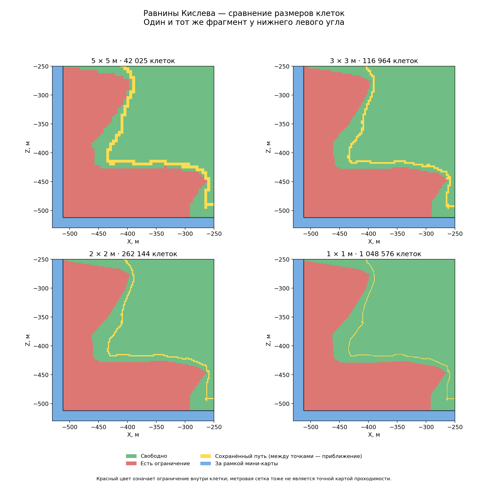

# Равнины Кислева: сравнение клеток 5, 3, 2 и 1 м

25.09.2026. Один запуск игры, один загруженный бой, четыре последовательных замера.
Запуск `run-20260925-214913`. Использован тот же входной сценарий, что и для
ручного проезда; изменился только путь диагностического скрипта.

## Измеренная стоимость

| Клетка | Число клеток | Сбор по `os.clock`, с | CSV, МБ | CSV gzip, МБ |
|---|---:|---:|---:|---:|
| 5 × 5 м | 42 025 | 0.267 | 0.96 | 0.31 |
| 3 × 3 м | 116 964 | 0.770 | 2.73 | 0.86 |
| 2 × 2 м | 262 144 | 1.921 | 6.18 | 1.83 |
| 1 × 1 м | 1 048 576 | 7.319 | 24.99 | 7.59 |

МБ — десятичные. Время включает запросы, создание векторов, сериализацию CSV,
запись порциями по 4096 клеток и интервалы между вызовами. Сжатие и построение
изображений выполнялись позже и в таблицу времени не включены. Высота, тип земли
и проверка области — три обращения к игре на клетку: всего **4 409 127** обращений
для четырёх сеток, сверх предварительной проверки старых точек.

Сумма четырёх замеров по `os.clock` — 10.277 с; вместе с короткими промежутками
между сетками — примерно 11 с по строкам `os.date` в журнале. Внешний PowerShell
зафиксировал **97.886 с** от запуска процесса до получения и копирования результатов,
то есть большая часть общего ожидания снова пришлась на загрузку игры и карты.

**Это один замер каждого размера, не серия испытаний производительности.**
Порядок: 5 → 3 → 2 → 1 м. Бой остановлен на расстановке; активный бой и другие
карты могут дать другую стоимость. Детальные доли секунды взяты из игрового
`os.clock`, а не из независимого высокоточного секундомера. Дополнительный
`os.time` во всех стадиях дал нулевые разности, хотя `os.date` менялся: этот
показатель в данном окружении непригоден и не означает нулевую стоимость.

## Что изменилось в данных

Все 900 точек старой сетки повторно проверены: высоты совпали без различий,
тип поверхности совпал, ответы для квадратов 50 × 50 м совпали. Рамка мини-карты
снова дала X/Z = −512…+512 м; проверены начало координат, две опорные точки и
четыре угла. Таким образом, перенос старого маршрута в новые координаты обоснован.

| Клетка | Доля площади, окрашенная красным | Доля площади с другим цветом относительно сетки 1 м |
|---|---:|---:|
| Предыдущая 50 м | 18.185% | 10.586% |
| 5 м | 8.381% | 0.781% |
| 3 м | 7.992% | 0.393% |
| 2 м | 7.803% | 0.204% |
| 1 м | 7.600% | — |

Для сравнения каждый центр метровой клетки сопоставлен с содержащей его крупной
клеткой. У сеток 5, 3 и 2 м все расхождения с метровой здесь имеют вид
«крупная красная, метровая зелёная». То есть основной эффект уменьшения клетки —
сужение грубых красных полос возле контуров ограничений. Сетка 2 м согласуется
с метровой по цвету на 99.796% площади и собирается в 3.81 раза быстрее.
**Это согласие двух наборов ответов API, а не точность навигации 99.8%.**

В сравнении типов поверхности расхождение относительно метровых центров:
5 м — 7.124%, 3 м — 4.480%, 2 м — 0%. Средняя абсолютная разница высот при
таком сопоставлении: 0.225 м, 0.130 м и 0.088 м соответственно. Нулевое расхождение
типов земли между 2 и 1 м на этой карте не доказывает универсальную внутреннюю
сетку игры размером 2 м.

## Путь кавалерии

Повторного проезда не было. Использованы те же 1088 записанных позиций из успешного
ручного опыта. Для жёлтых клеток соседние позиции соединены прямыми отрезками.
Максимальный промежуток между соседними записанными позициями — **24.987 м**.
Следовательно, метровая ширина жёлтой линии не означает метровую точность
восстановления фактического движения: поворот между отсчётами мог быть другим.
Жёлтый цвет не описывает площадь всего строя и перекрывает исходный цвет клетки.

Полные изображения: [5 м](../../../../research/evidence/map-data/kislev-scales-evidence/route-5m.png),
[3 м](../../../../research/evidence/map-data/kislev-scales-evidence/route-3m.png), [2 м](../../../../research/evidence/map-data/kislev-scales-evidence/route-2m.png),
[1 м](../../../../research/evidence/map-data/kislev-scales-evidence/route-1m.png).

## Вывод и ограничения

Для следующего прототипа разумная отправная точка — сетка 2 м: большая часть
детализации метрового варианта уже есть, клеток и файлов в четыре раза меньше.
Сетка 1 м тоже практически выполнима для разового чтения карты; её результаты
можно сохранять и переиспользовать при совпадающих условиях. Полный повторный
опрос миллиона клеток каждый кадр этим опытом не обоснован.

«Есть ограничение» не равно непроходимости каждого метра клетки. Ни один из этих
шагов не превращает `is_area_clear` в проверку полного пути конкретного строя.
Метровая сетка — самый подробный проверенный здесь вариант, а не доказанный
минимальный размер данных игры и не эталон истинной проходимости.

Начало всех сеток — (−512,−512). Сторона 1024 м делится на 1 и 2, но не на 3 и 5.
Поэтому последние клетки 5 м доходят до +513 м, а клетки 3 м — до +514 м.
Синим скрыта часть вне рамки; для процентов площади крайние клетки обрезаны
математически по рамке. Сам запрос к игре выполнялся для целого квадрата.
На краю результат может отражать и ограничение в той небольшой внешней части.

Новых утверждённых входов нейросети этот опыт не добавляет.

## Доказательства и воспроизведение

- `Сводка и метрики` (локальный архив: `research/evidence/map-data/kislev-scales-evidence/summary.json`).
- `Журнал измерений` (локальный архив: `research/evidence/map-data/kislev-scales-evidence/tww3_bai_kislev_scales_events.jsonl`).
- `Внешний замер запуска` (локальный архив: `research/evidence/map-data/kislev-scales-evidence/status.json`).
- `Завершение тестового процесса и удаление служебных pack/modlist` (локальный архив: `research/evidence/map-data/kislev-scales-evidence/cleanup.json`).
- `Экспорт загруженного боя` (локальный архив: `research/evidence/map-data/kislev-scales-evidence/tww3_bai_kislev_scales_ready.xml`).
- Сжатые исходные таблицы: `5 м` (локальный архив: `research/evidence/map-data/kislev-scales-evidence/grid-5m.csv.gz`),
  `3 м` (локальный архив: `research/evidence/map-data/kislev-scales-evidence/grid-3m.csv.gz`), `2 м` (локальный архив: `research/evidence/map-data/kislev-scales-evidence/grid-2m.csv.gz`),
  `1 м` (локальный архив: `research/evidence/map-data/kislev-scales-evidence/grid-1m.csv.gz`).
- `Исходный путь` (локальный архив: `research/evidence/map-data/kislev-scales-evidence/path.csv`), `контрольные суммы` (локальный архив: `research/evidence/map-data/kislev-scales-evidence/hashes.json`).
- `Измерительный Lua` (локальный архив: `research/evidence/map-data/kislev-scales-evidence/probe.lua`),
  `900 опорных точек, добавляемых перед Lua` (локальный архив: `research/evidence/map-data/kislev-scales-evidence/anchors.lua`).

Столбцы CSV: `ix,iz,height,clear,ground_id`. Центр клетки:
`x=-512+(ix+0.5)*step`, `z=-512+(iz+0.5)*step`. `clear` — 0 или 1;
расшифровка `ground_id` находится в `summary.json` и событиях `ground_type`.
Контрольные суммы несжатых CSV также сохранены в сводке. Измерительный код и
сырые несжатые результаты остаются в `tmp/map-research/kislev-scales/`.
