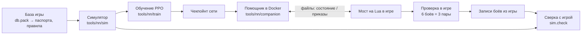

# Сводка проекта

[← Назад](README.md) · [Документация](README.md) › Сводка проекта · [English](../en/summary.md)

Эта страница — короткая карта всего проекта: что он делает, из каких частей состоит, в каком
состоянии каждая часть и где читать подробности. Её читают первой после потери контекста;
подробные страницы — только по текущей задаче. Цифры здесь — последние на момент правки;
свежие числа шага обучения даёт карточка прогона (`tools.ops.card`), свежие числа проверки в
игре — `build/nn-gate/<время>/summary.json`.

## Что за проект

Нейросеть, которая командует армией в боях Total War: WARHAMMER III. Сеть учится с нуля в нашем
симуляторе боя (PyTorch, тысячи боёв сразу на видеокарте), а потом играет настоящие бои в игре
против ИИ игры на нормальной сложности. Сейчас в боях две фракции: Империя и скавены, ровная
пустая карта, лорд и до 19 отрядов у стороны (отрядов в пулах 21 и 2 лорда: с 07.10 третья волна — аркебузиры
и арбалетчики Империи, кланокрысы, штормокрысы и Ночные бегуны со звёздами у скавенов, [паспорта](training/units.md#аркебузиры-арбалетчики-кланокрысы-штормокрысы-звёзды)). Цель — сеть, которая выигрывает у ИИ игры ≥ 97 %
боёв и играет «по характеру» фракции ([замысел и готовность](training/network.md)).

Главная проблема сейчас: **в симуляторе сеть сильнее наших скриптов, а в игре проигрывает все
бои**. Значит, симулятор ещё заметно расходится с игрой, и сеть учит то, что в игре не работает.
Поэтому работа идёт кругом: правка симулятора по самому большому замеренному расхождению →
обучение до плато → 6 боёв в игре → разбор записей → следующая правка.

## Симулятор боя

**Что делает.** Играет бой как игра: каждый отряд — один объект (бойцы, здоровье, место,
направление, мораль, усталость, снаряды), а не каждый солдат. Шаг — 0,5 с (такт морали игры).
В шаге: приказы, касание отрядов, эффекты и способности, удары и выстрелы, потери, мораль,
усталость, движение, конец боя (сторона без стоящих отрядов проиграла; через 60 минут
побеждает защитник). Скорость: ~590 боёв в секунду на RTX 5070 Ti (4096 боёв сразу).

**Откуда числа.** Сначала база игры (`config/nn/game_rules.json`, паспорта отрядов
`config/nn/units.json`, эффекты `config/nn/effects.json`, способности `config/nn/abilities.json`).
Где игра ведёт себя иначе, число подогнано под замеры, а причина записана в
`config/nn/sim.json`. Любая правка `config/nn` или `tools/nn/sim` меняет «версию симулятора»:
следующая проверка заново играет бои скриптов — базы и проверочные скрипты учений, ~8 мин на процессоре
параллельно с боями сети (`tools/nn/train/refs.py`; заранее, пока идёт прошлый шаг, —
`tools.ops.baselines --run`), если «канарейка» (первые 32 пары базы) не примет старые.

**Что уже моделируется:** скорости, строй (шаг каждого отряда по шаблону строя из базы), касание и выход
из рукопашной (по приказу уйти стрелков держат 5 с; отряд без стрел уходит, если за ним не гонятся; **погоня** —
отряд с приказом атаки на уходящего идёт следом и бьёт его, так что догоняемый в касании до окна 24 с, как в
игре), преследование бегущих.
**Рукопашная — по формулам игры** (ядро рукопашной): шанс попасть 35 + атака − защита с весом 1 у всех
(промах стоит 0,5 с: у бойца p / (p × интервал + 0,5) попаданий в секунду), урон — бронебойный целиком +
обычный за вычетом броска брони, лишний урон сверх здоровья бойца пропадает (сглаженно), убитые в рукопашной —
**пул раненых** (раненых среди живых не больше, чем бойцов в касании × недобитое здоровье; остальное — целые
бойцы), убитые от снарядов — попадания поровну по живым, у каждого своё здоровье, удар лорда делится на 4 и задевает в среднем 2,07 бойца, фланг и тыл — защита ×0,6 / ×0,3 (фланг — враг
дальше 45° от фронта, тыл — дальше 135°, по CA), натиск — только бонус натиска по приказу атаки с разбега к цели,
13 с на своих часах, отражение натиска копейщиками ×2 на 3,9 с (без доли «стоять»); натиска нет в цель, которая
уже дерётся с нашими (путь перекрыт своими); подогнанных «наклона 0,1», «удара натиска» и «ввода бойцов» больше
нет. Ядро рукопашной 2 (правила игры, без подгонок): **первый удар** — отряд, вошедший в бой на ходу или натиском,
и стоящий отряд, до которого дошли, бьют один раз сразу каждым бойцом в касании (интервал идёт только после
удара); **рывок натиска** — с любым приказом атаки, и шагом, последние 30 м (лорды 35) на скорости натиска из
базы; начальная перезарядка способностей из базы. Строй под «стоять» и под «идти» в касании бьёт с долей 0,5
(подобрано по зонду рукопашной: правила темпа нет). Стрельба по правилам игры ([проба стрельбы](game/units/missile-probe.md), 10 боёв): залпы раз в цикл (лучники 10 с = база, праща 11,5, бегуны 10,2, ополчение 10,8 — замер), дальность от центра до центра, дуга огня ±30° (ополчение ±35°) у каждого бойца, без поворота при стрельбе по готовности, 3 с после смены цели и после взятия цели «из ничего», перецеливание: боец, чья цель погибла, целится заново, и залп ждёт; попадания — модель разброса из базы без подгонки (разброс в плоскости поперёк линии огня, зона калибровки — площадь в м²; проба: ошибка 0,096 против 0,171 с прежним подогнанным k 1,1), щит только от стрелкового оружия, линия огня с модом True Sight; огонь по своим и разлёт (разлёт — из той же модели разброса по бойцам соседей: куча ловит промахи, как в игре), свои строи стоят друг в друге, не расталкиваются, отряды у одной стороны цели делят её длину, лорды (их бьют не
больше 6,5 бойцов, собираются за 20 с, только если лорд сам вбежал в строй; лорд без приказа бьёт целиком; лорд хрупкий, как в игре: своя аура ему не достаётся, в рукопашной он всегда
«проигрывает» (−3), снаряды в рукопашной бьют его целиком; устаёт по базе (+19 за тик), Foe-Seeker восстанавливает 1 %
максимума бодрости в секунду; «Раны» — через 5 с после 25 % здоровья скорость ×0,9, урон ×0,8 до конца боя; поединок
лордов: Генерал против Генерала ×0,8 от игры, Вождь против Вождя ×1,2), мораль со всеми главными слагаемыми по правилам игры (окна потерь 4 с и 60 с и «под обстрелом» 15 с; по пробе морали 06.10: фланг / тыл −6 / −14, пока бьют; «фланги прикрыты» +5 — враг дальше 146 м или свои с обеих сторон; натиск +15 блоками 6 + 6 с; перевес и стрельбой, с 10 % потерь; сильный враг — дороже в 3 раза; мораль бегущего идёт к цели, сбор — ни одного живого врага (и бегущего) ближе 95 м, бегство не меньше 18 с и так 7 с подряд (замер записей), [симулятор](training/simulator.md#мораль-по-правилам-игры-проба-морали);
гибель лорда — армии −16 на 45 с, потом −10;
его бегство на поле — только аура), бегство, сбор, разгром отряда по правилам базы (дно морали −50 — всегда; на 1-м /
2-м бегстве — при здоровье меньше 0,05 / 0,10; на 3-м бегстве), разгром армии (−120; сила — боевой потенциал из базы:
melee_cp + потенциал способностей + missile_cp по запасу снарядов, × здоровье — как записанный `strategic_value`),
поворот на ходу со скоростью поворота модели из базы (строй разворачивается кругом на месте, бежит, куда смотрит),
выход из рукопашной с окном 24 с из базы (кто всё ещё в касании, бросает приказ и дерётся), побежавший из рукопашной ещё 7 с в касании и разгоняется (записи: флаг 7 с, потери 0,77 стоящего), бегущий в толпе тормозится (записи: свой / два своих рядом — 0,68 / 0,43 бега), флаги угрозы флангам,
усталость, врождённые эффекты отрядов (Strength of the Penitent — сам, как готов, в рукопашной; его 3 с перезарядки
стоят, только пока отряд в рукопашной выигрывает; ауры — и от бегущего лорда, и на бегущих; край — центр — центр 35 м, проба T-E2),
способности лордов (ИИ игры применяет их по замеренному правилу: скоростные — в рукопашной,
«Стоять насмерть» — только рядом со своими, «Смертельный натиск» — никогда; «Стоять насмерть» накладывается при
касте — получившие держат 18 с где угодно, «Сплотиться» — аура за лордом; поле базы `update_targets`).

**Усталость** (включена последней правкой): 10 тиков в секунду; рукопашная утомляет только
отряд с приказом атаки (одиночка +19 за тик из базы, отряд 13,7 — замер; натиск +34 у всех только первые 2 с после удара натиска), стрельба 7,5, шаг 3,4, отдых −18; Foe-Seeker −300 очков/с, пока действует.
Доля измотанных (повтор 204 записей): свои 14,9 % (игра 17,3 %), враг 25,8 % (игра 28,6 %); у лордов
13,6 / 25,3 % (игра 22,0 / 22,9 %).

**Сверка с игрой** (`python -m tools.nn.sim.check`, ~12 мин на 8 ядрах процессора): каждый записанный бой
из игры переигрывается в симуляторе по записанным приказам 19 раз со сдвигом начала до 2 м и меряется тем же
кодом, что игра. 19 копий — прогноз симулятора. Главный счёт — **доля значений игры внутри 90 % интервала
копий** (`tools/nn/simskill.py`): у симулятора, совпадающего с игрой вместе с её шумом, 90 %. Рядом навык
CRPSS (насколько копии лучше «типичного значения игры»: 0 — не лучше, 100 % — точно) и прежние счёты;
в скобках — до правил стрельбы, рукопашной и целого боя ([как считается, худшие величины, ошибки прежнего
счёта](training/simulator.md#счёт-сверки-симулятор-как-прогноз)). Набор записей заморожен.

| Семейство | Внутри 90 % | Навык | Прежний счёт |
|---|---:|---:|---|
| Механика: пары отрядов и стрельба (18 записей) | 22 % (до правил стрельбы, рукопашной и целого боя 20 %) | −65 % (−69 %) | 27 / 54 в пределах 20 % (до проб P1–P4 28; до этих правил 25, без повторов 23 / 48; до правки натиска 24; до ядра рукопашной 51; ядро 2 — 37; стрельба по правилам — 29; мораль по правилам — 24) |
| Бои ИИ игры против себя (28) | 43 % (35 %) | −37 % (−52 %) | тот же победитель 15 / 26 (до стрелков, отпущенных с бегущих, 39 % / −41 %; до проб P1–P4 16; до этих правил 16; до ядра 20, ядро 21, ядро 2 и стрельба — 18, мораль — 16, движение и лорды — 15) |
| Бои сети против ИИ игры (170) | 40 % (40 %) | +23 % (+24 %) | тот же победитель 134 / 169 (до стрелков, отпущенных с бегущих, 137 и +24 %; до убитых от стрел поровну 132; до проб P1–P4 139; до этих правил 139; до ядра 126, ядро 127, ядро 2 и стрельба — 132, движение и лорды — 137) |
| Ворота: сеть сама против ai_like (10 боёв, 8 копий) | 80 % (80 %) | +7 % (+7 %) | — |

Пробы P1–P4 и целого боя (`build/probes7`, 12 боёв в игре): дальность пистолей по шеренгам, сбор без ожидания 7 с, приказ «идти» сквозь врага — не выход из боя; до них механика 22 % / −68 %, бои ИИ игры 37 % / −31 %, бои сети 37 % / +22 %; без правила выхода бои ИИ игры 39 % / −35 %, бои сети 38 % / +22 %. Убитые от стрел — попадания поровну по живым (`kills.missile_uniform`, `build/open2`): до них бои ИИ игры 36 % / −42 %, бои сети 39 % / +23 %, механика та же.

По пачкам (стрельба; рукопашная и целый бой) и худшие величины —
[счёт по правкам](training/simulator.md#счёт-по-правкам-стрельбы-рукопашной-и-целого-боя). Доверительные
интервалы до правок: механика 14–26, бои ИИ игры 30–41, бои сети 38–43, ворота 76–84.

Недобор до 90 % — в основном от того, что копии слишком похожи: их разброс втрое меньше промаха (в механике
в сто раз): игра шумит, симулятор считает средние. Счёт «тот же победитель» у боёв-монеток — шум: тот же
код на видеокарте и процессоре даёт разные бои.

Механика упала с 51 до 37 не из-за победителей (все 12 пар — как в игре), а по темпам: первые 15 с касания
строя в игре сильнее правила (цель теряет 499–764 HP, правило даёт 396–446; прежде это покрывал подогнанный
«удар натиска»), лорды по одному отряду бьют на 13–31 % сильнее игры, их пары кончаются раньше. Зонд
рукопашной (11 боёв в игре, тот же сценарий в симуляторе) нашёл, где разница: залп в первую секунду касания
натиском, дальше темп как у правила; атака и бегом, и шагом последние ~30 м идёт на скорости натиска; бонус
против пехоты действует по пешему лорду. Ядро рукопашной 2 внесло это правилами: первая секунда натиска в
симуляторе 107–429 HP (было 27–86, игра 78–300), атака шагом — натиск. Рывок натиска стоил трёх целых боёв ИИ
игры (Скавены против Империи: без рывка 8 из 10, с ним 5) — в целых боях рывка перед касанием не видно; OPEN.
Остальные расхождения — OPEN ([рукопашная](game/mechanics/melee.md#проверка-в-игре-зонд-рукопашной)). Потери Империи в целых боях
через 60 / 120 / 180 с стали как в игре: 0,25 / 0,43 / 0,55 (игра 0,25 / 0,41 / 0,53; было 0,32 / 0,51 / 0,63).
Приказ атаки на цель вне касания (край дальше 10 м) отряду в схватке — выход из боя, как «отойти» (`contact.attack_leave`; в игре такой отряд бьёт 0,01–0,03 убитых в секунду против 0,27–0,40): двойник 24 боёв против `ai_like` — победы v2 16 → 6 и 16 → 3 из 32, grid_s46 16 → 16 (в игре 0 / 0 / 3 из 8) ([рукопашная](game/mechanics/melee.md#проверка-в-игре-зонд-рукопашной)).
Новый приказ в схватке (проба `fresh`): атака, данная в схватке, 24 с бьёт только свою цель (`contact.fresh_incidental` 0), к близкой цели вне касания отряд идёт шагом, точка прочь от врага — выход от 1 м и держится до окна 24 с: двойник 8 боёв it1 — урон в рукопашной 0,439 → 0,428 (игра 0,447), новая атака на близкую цель 0,38 → 0,23 убитых в секунду (игра 0,20); «держать» и «идти» в схватке — OPEN ([рукопашная](game/mechanics/melee.md#проверка-в-игре-зонд-рукопашной)).
«Идти», данное в схватке, — выход из боя в любую сторону, и сквозь врага (`contact.move_melee_leave`, проба `meleeorders`: 7 полос, 0 HP за 5–20 с): двойник 8 боёв it3 — «идти» в схватке 0,12 → 0,03 убитых в секунду (игра 0,02), победы 19 → 14 из 32 (игра 2 из 8); «держать» в схватке — OPEN.
Темп рукопашной во времени (пробы `reform`, `reform2`) — OPEN: в игре начальная волна (касающихся 43 / 21 / 13, потом 10–12; удар каждого в начале слабее — темп ×2,6 при касающихся ×3,4), урон держится на числе касающихся (~0,42 живых при малом числе), снижают его потери бьющего, а не цели; глубина строя важна только в начале; в симуляторе бойцов в бою по ширине строя и волны нет. Правило «волна» оценено и не взято: близко к подгонке, двойник 8 боёв it3 почти не сдвигается (победы 14 → 13 из 32, бегства врага 1,33 → 1,18 при игре 0,84) ([рукопашная](game/mechanics/melee.md#что-осталось-непонятным)).

**Повтор ворот** — бои проверки в игре, переигранные в симуляторе (обе стороны по записи).
Обмен золотом на момент конца боя в игре: игра −0,26…−0,41, симулятор −0,05…−0,24 на тех же
боях. **Симулятор слишком добр к сети** — это главный измеренный разрыв.

**Что известно как несовпадение с игрой** (подробно —
[«Чего нет»](training/simulator.md#чего-нет)):

- армия ИИ игры в симуляторе бежит чаще (двойник 8 боёв it3: 1,3 бегства на отряд против 0,8), а наша армия
  теряет меньше (0,67 против 0,80): члены морали совпадают с игрой (регрессия по 404 тыс. секунд), разница — в
  ходе боя: побитые отряды ИИ в рукопашной теряют здоровье быстрее, около бегущих в игре дольше остаются враги
  (через 8 с после бегства цели в 20 м от неё 0,57 атаковавших против 0,16), к сборам в игре враг дальше (121 м
  против 96); выход бегущего из боя и погоня `ai_like` — по записям, а эти разрывы — OPEN;
- стрелки в бою стреляют медленнее, чем на стрельбище (0,05–0,07 снаряда на бойца в секунду
  против 0,087–0,091 в симуляторе до дуги у каждого бойца и паузы смены цели; пропуск залпов, пока цель редеет, —
  теперь перецеливание); попадания по поредевшей цели в игре падают сильнее модели (лучники по рабам: модель 0,73
  на выстрел, игра 0,50 — проба P1); бегущая на стрелка цель получает ×1,2 на выстрел (P3); дальность пистолей по
  каждому бойцу (P2) — открыты;
- вражеский лорд ломается слишком легко (97 % боёв против 25 %), а наши лорды падают на
  130–145 с раньше, чем в игре;
- в игре схватки короткие и часто прерываются (медиана 17 с), в симуляторе — нет (21–112 с);
  что запускает выход из рукопашной, неизвестно;
- мораль у самого касания и признаки открытых флангов совпадают не полностью;
- разгром армии: сила по боевому потенциалу ловит начало в записях в ту же секунду в 0,94 случаев, но в повторе
  разгром к концу боя наступает в 0,15 боёв против 0,96 в игре — проигрывающая армия в повторе теряет здоровье
  слишком медленно в последние две минуты;
- выход из рукопашной: уходящий без погони в симуляторе вне касания через ~2 с после приказа (игра ~4–4,5 с:
  строй при развороте кругом поворачивается как прямоугольник); держит ли стрелков 5 с погоня — открыто;
  строй «лицом» на 90° на ходу в игре трогается медленнее (перестроение);
  Варлорд на приказе «лицом» поворачивается 75 °/с при 180 в базе; отряд в рукопашной устаёт ~110–120 очков/с
  первые 50 с, потом ~210/с, натиск утомляет и до касания;
- собравшиеся отряды снова бегут через 10 / 45 с после сбора в 0,11 / 0,40 случаев (игра 0,07 / 0,23; до правила
  сбора из пробы морали — 0,37 / 0,49); бегств за бой меньше, чем в игре (16,8 против 22,5); правки рукопашной и
  целого боя ещё снизили бегства и сборы в боях сети (бегств на отряд 0,93, игра 1,30) — причина меряется; свои
  часы сбора в игре (пики длины бегства на 18–19 и 36–37 с) — открыты (проба T-E);
- мораль: уровень «проигрыша» в рукопашной и шкала «сильного врага» (Генерал у рабов −9, у нас −3) — открыты;
- рукопашная: «Стоять насмерть», бои с флагеллантами (обе стороны бьют ×1,4–2 правила), пара копейщиков
  планировщика CA — пробы P1–P3; даёт ли вход в чужую схватку бонус натиска — проба; секторы фланга у CA — по
  каждому бойцу, у нас ступень для отряда;
- задержка приказов в игре 0,6–0,8 с в малых боях, в симуляторе 0,36 с;
- вторая волна отрядов (флагелланты, двуручники, ополчение, скавенрабы, щитовые кланкрысы,
  ночные бегуны) не сверена с записями; третья волна сверена пробой стрельбы ([итоги](game/units/missile-probe.md#итоги-третьей-волны-игра--симулятор-до--после-правок)):
  перезарядка аркебуз и звёзд и стрельба звёзд назад на ходу — по замеру; дальность аркебуз — правило центра, доля пуль
  по своим в схватке — замер 0,08; огонь мимо своих — по дуге пули (ствол 1,5 м и прицел 0,8 м — замер 16 дорожек;
  свои ловят пули ниже голов); открыто — ополчение и звёзды бьют и стоящую цель на 20 м дальше дальности (полтемпа),
  точка прицела по цели другого роста;
- не моделируются: рельеф, лес, видимость (`vis` всегда истина), кавалерия, монстры, магия,
  полёт, артиллерия, ранги опыта. Окно потерь подогнано, а не взято из базы
  ([таблица расхождений](game/mechanics/README.md#расхождения-с-нашим-симулятором)).

Ждёт включения: атакующий во фланг по своему фронту (верно для одиночного атакующего, но
ухудшает ранний размен и ломает учение `counter`).

Подробно: [симулятор](training/simulator.md) · [паспорта отрядов](training/units.md) ·
[замеры в игре](training/measurements.md) · [механика игры](game/mechanics/README.md) ·
[база игры](game/database.md) · [реестр показателей наших отрядов](game/units/indicators.md) (правило игры и
статус в симуляторе для каждого показателя; новый отряд добавляет туда свои).

## Сеть

Одна сеть на все фракции и обе роли (атака или оборона — это вход). Видит только то, что видел
бы человек: свои отряды целиком, врагов — пока они видны, и только состояние их морали, без
точного процента. Каждый отряд — «токен» (строка из 155 чисел: паспорт из базы, состояние,
эффекты, дуга огня, действующий приказ и сколько он идёт). Дальше: общий кодировщик → 3 слоя внимания с поправкой на расстояние → память (GRU)
→ «головы» на каждый свой отряд: вид приказа (держать / идти / атаковать / отойти /
продолжать), точка (16 направлений × 8 расстояний от отряда; опция `--grid 32` — клетка сетки 32 × 32
по карте, против дрейфа), цель (указатель на врага), бег,
способность. Время до конца боя сеть не видит никогда. Размеры: `small` 0,85 млн весов, `wide`
3,23 млн. Цепочка сейчас на `wide`; её получили из обученной `small` расширением, а не с нуля.
Новая база `v2` (`--preset v2 --reward v2`, с нуля, 3,51 млн): та же основа + сектора карты 16 × 16, которые видят
отряды, головы цепочкой (вид → цель → сектор → клетка 25 м → срок) и обязательство держать приказ 2–16 с (события
обрывают срок), «глаза» (вспомогательные головы на правде симулятора: потери своих, угроза врагов, опасность секторов — их предсказания идут обратно в сеть); на ~8 % медленнее `wide` ([подробно](training/model.md#вариант-v2-сектора-карты-цепочка-голов-обязательство)).

Подробно: [вход и устройство](training/model.md) · [замысел](training/network.md).

## Обучение

**Как идёт.** PPO в схеме MAPPO: каждый отряд — агент, все отряды стороны делят её
преимущество, критик (оценщик позиции) видит всё поле и в игру не идёт. 1024 боя сразу,
решение раз в секунду, приказы доходят в среднем через 0,36 с, как в игре. Скорость ~9 900 с
боя в секунду обучения. Бои — [случайные армии](training/armies.md): равный бюджет (±5 %), лорд
и 0–19 отрядов, ¾ армий по шаблонам ИИ игры (доли — по группам шаблонов игры, правило `group` с 07.10), разброс
чисел ±15 %; редкие богатые бои выше `budget_max` — опция `budget_rare` (выключена).

**Награда:** победа ±1; обмен золотом на каждом шаге (золото врага, уничтоженное нами, минус
своё, к бюджету; потеря отряда считается один раз, по худшему состоянию); падение лорда 0,3
(рассеянный лорд считается погибшим); цена простоя нападающему, растущая, пока он не наносит
урон; мелкие цены за смену приказа и цели (против дёрганья).

**Противники** (доли цепочки): `nearest` 35 %, `ai_like` 30 % (скрипт, подогнанный под ИИ
игры по 110 боям), `hold_shoot` 15 %, прошлые версии 10 %, `hold` 5 %, сам с собой 5 %. ИИ
игры в обучении не участвует: он независимая проверка.

**Цепочка.** Каждый шаг начинается с последнего чекпойнта прошлого шага. Поводок (штраф KL 0,03
за уход от начала шага) сдвигается вперёд каждые 600 с: без поводка обучение разваливается.
Шаг 20–25 минут, проверка каждые 5–10 минут; проверка «до» не играется заново — это последняя
проверка прошлого шага (та же сеть, тот же код; [скорость шага](training/workflow.md#скорость-шага)).
Постоянные опции — в `config/train-chain.json`
(сейчас ещё учения 20 % боёв и учитель только кайтинга в обычных боях, `--teach-normal kiting`; учитель
учений выключен: [пробовали и отказались](training/training.md#учитель-учений-в-цепочке)). Команду шага
строит `tools.ops.step`, итог шага показывает `tools.ops.card` ([рабочий процесс](training/workflow.md)).
Что считать в проверках, выбирает профиль метрик (`--profile`): всегда рейтинг, золото пар и гибель
полководца, остальное (учения, перенос, живость, усталость, ёмкость) — по вопросу прогона
([профили метрик](training/workflow.md#профили-метрик)).

**Честные метрики** (фракции неравны, поэтому голая доля побед мало говорит о сети):

| Метрика | Что значит | Направление |
|---|---|---|
| Рейтинг (логит) | одна подгонка по всем боям с поправкой на пару фракций и роль; 0 — наравне, +0,4 ≈ 60 % | больше — лучше |
| Золото пары | каждый бой играется дважды с обменом армий; (уничтоженное нами − уничтоженное противником) / бюджет | плюс — мы меняемся лучше теми же армиями |
| Обмен | то же как множитель | больше 1 — лучше |

Последний законченный шаг до новой усталости (`s5_threat`, 20 мин): рейтинг +0,47 ± 0,11,
золото пары против `ai_like` +0,14 (обмен ×1,22), против `nearest` +0,16, против `hold_shoot`
+0,19; свой лорд гибнет в 0,28 боёв. Следующий шаг (`s6_fatigue`) — первый на новой
усталости; версия симулятора сменилась, поэтому бои скриптов переиграны.

Подробно: [обучение](training/training.md) · [рабочий процесс](training/workflow.md).

## Учения

Учение — бои на одно умение. **Рамка** — условие боя; каждый бой внутри неё рождается из зерна
(составы, расстояния, место на карте). Враг учения — скрипт.

- **Проверка рамки** (`drills/verify.py`): наивный скрипт должен ясно проигрывать (≤ 0,25
  побед), скрипт с умением — ясно выигрывать (≥ 0,75). В `READY` только прошедшие:
  `kiting` (стрелки отбегают от пехоты), `counter` (идти на того, кого бьёшь), `hold_fire` (не
  стрелять в схватку вокруг вражеского лорда). Обучаются по умолчанию `kiting` и `hold_fire`:
  `counter` в обычных боях вредит. `pincer`, `defend`, `reserve` не готовы.
- **Три вида рамок:** чистая, широкая (больше посторонних отрядов) и встроенная (ситуация
  внутри обычного боя — чтобы сеть не отличала учение от обычного боя).
- **Учитель:** скрипт с умением размечает действия, к потере PPO добавляется слабое
  подражание. Режим `auto` включает его ровно настолько, насколько сеть отстаёт от скрипта, и
  выключает, когда догнала. `teach-normal` делает то же в обычных боях — по разрыву переноса.
- **Перенос в обычные бои** (`drills/transfer.py`): выиграть учение мало, умение нужно
  применять в обычном бою. Доля применения — больше лучше; доля ошибки — меньше лучше; рядом
  эталон `ai_like`.
- **Учение `direct_fire`** (стрелки прямой наводки — ополчение, аркебузиры, бегущие ночью со звёздами: место с
  чистой линией огня мимо своих, бить обходящих нашу пехоту, не выходить туда, куда раньше добежит свободный враг).
  Только встроенная рамка; решение учителя — оценщик по правилам симулятора (цена огня с места и сбоку, опасность
  места). В обычных боях симулятора подмена приказов стрелкам сети на решения оценщика: обмен +0,022 ± 0,009 за бой.
  Не в `READY`: включается опцией шага (`--drill-weights` с `direct_fire`, `--teach-normal kiting,direct_fire`); у
  его учителя свой эталон (доля применения 0,6), потолок 0,05, метки «идти» и «стоять и стрелять» поровну по смыслу, стоп по падению
  рейтинга на 0,15 и по росту доли ошибки на 0,1. Оценщик тяжёлый: перенос учения меряется только в финальной
  оценке шага, учитель считает его только на размечаемых боях. Проверка рамки на 64 боях (процессор): skilled − naive +0,027 ± 0,058 —
  ещё не пройдена, нужен прогон на видеокарте.

Сейчас (`s5_threat`): учения выиграны (kiting 0,95, counter 1,00, hold_fire 0,84). Доля
применения в обычных боях: kiting 0,46 против 0,70 у `ai_like` (до учителя было 0,003),
counter 0,43 против 0,54, hold_fire 0,83 против 0,31 (здесь сеть лучше эталона).

Подробно: [учения](training/training.md#учения).

## Мост и помощник: как сеть играет в игре

- **Мост** — Lua внутри игры (`src`, точка входа `nn_arena`). Раз в секунду боя пишет
  состояние всех отрядов в файл и каждые 100 мс проверяет файл приказов. Файлы пишутся во
  временный и переименовываются, поэтому никто не прочтёт половину файла.
- **Помощник** (`tools/nn/companion`, в Docker-контейнере `snake-ai-trainer`) читает
  состояние, приводит его к виду симулятора (точка приказа, бег, цель), строит вход одной
  стороны, гоняет сеть и пишет приказы. От состояния до приказов ~40 мс при скорости ×20,
  без пропусков.
- **Что делает сеть:** держать, идти, отойти, атаковать цель, бег, способности лорда. Бегущими
  и разбитыми отрядами управляет игра. Мост сам переотдаёт приказ после сбора и при
  застревании, перенацеливает стрелков, отправляет стрелков без снарядов в рукопашную.
- **Запуск боя:** сборка пакета (`tools.build`), launcher ставит **нормальную** сложность и
  возвращает настройки игрока байт в байт; один бой на запуск игры (~2 мин с загрузкой).
  Мод True Sight обязателен.

Подробно: [мост](apps/bridge.md) · [смотреть бой сети](launch/watch.md) ·
[запуск](launch/run.md) · [сборка](launch/build.md) · [модули в игре](apps/README.md) ·
[устройство проекта](architecture/overview.md).

## Проверка в игре (ворота)

Сеть против ИИ игры на нормальной сложности; армии из генератора на проверочных зёрнах, которых
сеть не видела. Бои идут **парами**: то же зерно дважды, во втором бою сеть берёт армию
противника. После каждого плато — **6 боёв = 3 пары** (`tools/launcher/gate.ps1 -Battles 6`;
одна из пар — большой бой скавенов с Империей). Как читать пару: 2–0 — сеть умнее ИИ обеими
армиями; 1–1 — решает армия, смотрим золото пары; 0–2 — ИИ лучше обеими армиями, разбираем
записи. Золото пары считается по конечному состоянию отрядов × цена из паспорта.

Последние ворота — все три **0 из 6**, все пары проиграны обе:

| Ворота | Чекпойнт | Победы | Золото пары (95 %) | Обмен |
|---|---|---:|---:|---:|
| 20261004-230630 | `s2_turn100/m15` | 0 / 6 | −0,62 (−1,01…−0,23) | ×0,41 |
| 20261005-031306 | `s3_incid/m20` | 0 / 6 | −0,69 (−0,94…−0,43) | ×0,37 |
| 20261005-071054 | `s4_collapse/m5` | 0 / 6 | −0,65 (−0,82…−0,48) | ×0,39 |

То есть ИИ игры теми же армиями меняется примерно в 2,5 раза лучше. Записи этих ворот —
основа поиска расхождений симулятора (повтор ворот выше). После ворот `tools.ops.gapcard` переигрывает
их бои в симуляторе с тех же стартов (сеть против `ai_like`) и печатает таблицу «игра / симулятор» с
пометкой расхождений за шумом ([карточка разрыва](training/workflow.md#карточка-разрыва-игра--симулятор-toolsopsgapcardpy)).
В ней же потери и обмен за 30 с до конца боя и «своя армия уничтожена к концу» (правило базы игры): в игре
сеть к концу почти всегда разбита (0,96 боя), в симуляторе редко (0,10) — главный разрыв в золоте.

Подробно: [проверка в игре](launch/gate.md) · [штатный ИИ игры](game/game-ai.md) ·
[сложность](game/difficulty.md).

## Где что лежит

| Что | Где |
|---|---|
| Правила работы | `CLAUDE.md` в корне |
| Код в игре (Lua) | `src/apps`, `src/entries`; тесты без игры — `tests/` (pytest + lupa) |
| Симулятор, обучение, сеть, помощник | `tools/nn/sim`, `tools/nn/train`, `tools/nn/model`, `tools/nn/companion` |
| Числа симулятора | `config/nn/` (входит в версию симулятора) |
| Опции цепочки | `config/train-chain.json` (вне версии) |
| Прогоны, чекпойнты, базы скриптов | `build/nn-train/` (не в Git) |
| Ворота | `build/nn-gate/<время>/summary.json` (не в Git) |
| Инструменты оркестратора | `tools/ops`: `step`, `card`, `gapcard`, `leftovers`, `wait.sh` |

Все разделы документации: [оглавление](README.md) · [данные для обучения](training/README.md) ·
[знания об игре](game/README.md) · [архив исследований](research/README.md).
