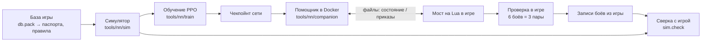

# Сводка проекта

[← Назад](README.md) · [Документация](README.md) › Сводка проекта · [English](../en/summary.md)

Эта страница — короткая карта всего проекта: что он делает, из каких частей состоит, в каком
состоянии каждая часть и где читать подробности. Её читают первой после потери контекста;
подробные страницы — только по текущей задаче. Цифры здесь — последние на момент правки;
свежие числа шага обучения даёт карточка прогона (`tools.ops.card`), свежие числа проверки в
игре — `build/nn-gate/<время>/summary.json`.

## Что за проект

Нейросеть, которая командует армией в боях Total War: WARHAMMER III. Сеть учится с нуля в нашем
симуляторе боя (PyTorch, тысячи боёв сразу на видеокарте), а потом играет настоящие бои в игре
против ИИ игры на нормальной сложности. Сейчас в боях две фракции: Империя и скавены, ровная
пустая карта, лорд и до 19 отрядов у стороны. Цель — сеть, которая выигрывает у ИИ игры ≥ 97 %
боёв и играет «по характеру» фракции ([замысел и готовность](training/network.md)).

Главная проблема сейчас: **в симуляторе сеть сильнее наших скриптов, а в игре проигрывает все
бои**. Значит, симулятор ещё заметно расходится с игрой, и сеть учит то, что в игре не работает.
Поэтому работа идёт кругом: правка симулятора по самому большому замеренному расхождению →
обучение до плато → 6 боёв в игре → разбор записей → следующая правка.

## Симулятор боя

**Что делает.** Играет бой как игра: каждый отряд — один объект (бойцы, здоровье, место,
направление, мораль, усталость, снаряды), а не каждый солдат. Шаг — 0,5 с (такт морали игры).
В шаге: приказы, касание отрядов, эффекты и способности, удары и выстрелы, потери, мораль,
усталость, движение, конец боя (сторона без стоящих отрядов проиграла; через 60 минут
побеждает защитник). Скорость: ~590 боёв в секунду на RTX 5070 Ti (4096 боёв сразу).

**Откуда числа.** Сначала база игры (`config/nn/game_rules.json`, паспорта отрядов
`config/nn/units.json`, эффекты `config/nn/effects.json`, способности `config/nn/abilities.json`).
Где игра ведёт себя иначе, число подогнано под замеры, а причина записана в
`config/nn/sim.json`. Любая правка `config/nn` или `tools/nn/sim` меняет «версию симулятора»:
следующая проверка заново играет бои скриптов — базы и проверочные скрипты учений, ~8 мин на процессоре
параллельно с боями сети (`tools/nn/train/refs.py`; заранее, пока идёт прошлый шаг, —
`tools.ops.baselines --run`), если «канарейка» (первые 32 пары базы) не примет старые.

**Что уже моделируется:** скорости, строй (шаг каждого отряда по шаблону строя из базы), касание и выход
из рукопашной (по приказу уйти отряд без стрел держат 20 с, стрелков 5 с, как в игре), преследование бегущих.
**Рукопашная — по формулам игры** (ядро рукопашной): шанс попасть 35 + атака − защита с весом 1 у всех
(промах стоит 0,5 с: у бойца p / (p × интервал + 0,5) попаданий в секунду), урон — бронебойный целиком +
обычный за вычетом броска брони, лишний урон сверх здоровья бойца пропадает (сглаженно), удар лорда делится на
4 и задевает в среднем 2,07 бойца, фланг и тыл — защита ×0,6 / ×0,3, натиск — только бонус натиска по приказу
атаки с разбега, 13 с на своих часах, отражение натиска копейщиками ×2 на 3,9 с; подогнанных «наклона 0,1»,
«удара натиска» и «ввода бойцов» больше нет. Стрельба залпами, огонь по своим и разлёт, лорды (их бьют не
больше 6,5 бойцов, собираются за 20 с; лорд хрупкий, как в игре: своя аура ему не достаётся, в рукопашной он всегда
«проигрывает» (−3), снаряды в рукопашной бьют его целиком, устаёт медленнее отряда; поединок
лордов: Генерал против Генерала ×0,8 от игры, Вождь против Вождя ×1,2), мораль со всеми главными слагаемыми (окна потерь 4 с и 60 с и «под обстрелом» 15 с — как в игре;
гибель лорда — армии −16 на 45 с, потом −10;
его бегство на поле — только аура), бегство, сбор, разгром армии (−120 по
стратегической силе из базы), флаги угрозы флангам, усталость, врождённые эффекты отрядов,
способности лордов (ИИ игры применяет их по замеренному правилу: скоростные — в рукопашной,
«Стоять насмерть» — только рядом со своими, «Смертельный натиск» — никогда).

**Усталость** (включена последней правкой): 10 тиков в секунду; рукопашная утомляет только
отряд с приказом атаки (одиночка 15 за тик, отряд 13,7; натиск +34 у всех только первые 2 с после удара натиска), стрельба 7,5, шаг 3,4, отдых −18.
Доля измотанных (повтор 204 записей): свои 14,9 % (игра 17,3 %), враг 25,8 % (игра 28,6 %); у лордов
13,6 / 25,3 % (игра 22,0 / 22,9 %).

**Сверка с игрой** (`python -m tools.nn.sim.check`): каждый записанный бой из игры
переигрывается в симуляторе по записанным приказам (8 копий со сдвигом начала до 2 м, итог по
большинству) и меряется тем же кодом, что игра. Набор записей заморожен. Три счёта, больше —
лучше:

| Счёт | Сейчас |
|---|---:|
| Механика: пары отрядов и стрельба в пределах 20 % от игры | 37 / 54 (до ядра рукопашной 51) |
| Тот же победитель: бои ИИ игры против себя | 21 / 26 (до ядра 20) |
| Тот же победитель: бои сети против ИИ игры (записей теперь 165) | 127 / 165 (до ядра 126) |

Механика упала с 51 до 37 не из-за победителей (все 12 пар — как в игре), а по темпам: первые 15 с касания
строя в игре сильнее правила (цель теряет 499–764 HP, правило даёт 396–446; прежде это покрывал подогнанный
«удар натиска»), лорды по одному отряду бьют на 13–31 % сильнее игры, их пары кончаются раньше. Ответ —
опыты в игре ([симулятор](training/simulator.md#механика-пары-и-стрельба)). Потери Империи в целых боях
через 60 / 120 / 180 с стали как в игре: 0,25 / 0,43 / 0,55 (игра 0,25 / 0,41 / 0,53; было 0,32 / 0,51 / 0,63).

**Повтор ворот** — бои проверки в игре, переигранные в симуляторе (обе стороны по записи).
Обмен золотом на момент конца боя в игре: игра −0,26…−0,41, симулятор −0,05…−0,24 на тех же
боях. **Симулятор слишком добр к сети** — это главный измеренный разрыв.

**Что известно как несовпадение с игрой** (подробно —
[«Чего нет»](training/simulator.md#чего-нет)):

- армия ИИ игры в симуляторе бежит вдвое чаще (1,9 раза за бой против 0,92): она теряет в
  рукопашной больше здоровья (0,45 против 0,38);
- стрелки в бою стреляют медленнее, чем на стрельбище (0,05–0,07 снаряда на бойца в секунду
  против 0,087–0,091 в симуляторе);
- вражеский лорд ломается слишком легко (97 % боёв против 25 %), а наши лорды падают на
  130–145 с раньше, чем в игре;
- в игре схватки короткие и часто прерываются (медиана 17 с), в симуляторе — нет (21–112 с);
  что запускает выход из рукопашной, неизвестно;
- мораль у самого касания и признаки открытых флангов совпадают не полностью;
- разгром армии находит 58 из 65 начал в записях, но в свободном бою время сдвигается;
- собравшиеся отряды снова бегут почти все ровно через 10 с после сбора (в игре — постепенно);
  правило «сбор у цели морали» это чинит, но собирает на треть меньше отрядов — выключено;
- задержка приказов в игре 0,6–0,8 с в малых боях, в симуляторе 0,36 с;
- вторая волна отрядов (флагелланты, двуручники, ополчение, скавенрабы, щитовые кланкрысы,
  ночные бегуны) не сверена с записями;
- не моделируются: рельеф, лес, видимость (`vis` всегда истина), кавалерия, монстры, магия,
  полёт, артиллерия, ранги опыта. Окно потерь подогнано, а не взято из базы
  ([таблица расхождений](game/mechanics/README.md#расхождения-с-нашим-симулятором)).

Ждёт включения: атакующий во фланг по своему фронту (верно для одиночного атакующего, но
ухудшает ранний размен и ломает учение `counter`).

Подробно: [симулятор](training/simulator.md) · [паспорта отрядов](training/units.md) ·
[замеры в игре](training/measurements.md) · [механика игры](game/mechanics/README.md) ·
[база игры](game/database.md) · [реестр показателей наших отрядов](game/units/indicators.md) (правило игры и
статус в симуляторе для каждого показателя; новый отряд добавляет туда свои).

## Сеть

Одна сеть на все фракции и обе роли (атака или оборона — это вход). Видит только то, что видел
бы человек: свои отряды целиком, врагов — пока они видны, и только состояние их морали, без
точного процента. Каждый отряд — «токен» (строка из 149 чисел: паспорт из базы, состояние,
эффекты). Дальше: общий кодировщик → 3 слоя внимания с поправкой на расстояние → память (GRU)
→ «головы» на каждый свой отряд: вид приказа (держать / идти / атаковать / отойти /
продолжать), точка (16 направлений × 8 расстояний), цель (указатель на врага), бег,
способность. Время до конца боя сеть не видит никогда. Размеры: `small` 0,85 млн весов, `wide`
3,23 млн. Цепочка сейчас на `wide`; её получили из обученной `small` расширением, а не с нуля.

Подробно: [вход и устройство](training/model.md) · [замысел](training/network.md).

## Обучение

**Как идёт.** PPO в схеме MAPPO: каждый отряд — агент, все отряды стороны делят её
преимущество, критик (оценщик позиции) видит всё поле и в игру не идёт. 1024 боя сразу,
решение раз в секунду, приказы доходят в среднем через 0,36 с, как в игре. Скорость ~9 900 с
боя в секунду обучения. Бои — [случайные армии](training/armies.md): равный бюджет (±5 %), лорд
и 0–19 отрядов, ¾ армий по шаблонам ИИ игры, разброс чисел ±15 %.

**Награда:** победа ±1; обмен золотом на каждом шаге (золото врага, уничтоженное нами, минус
своё, к бюджету; потеря отряда считается один раз, по худшему состоянию); падение лорда 0,3
(рассеянный лорд считается погибшим); цена простоя нападающему, растущая, пока он не наносит
урон; мелкие цены за смену приказа и цели (против дёрганья).

**Противники** (доли цепочки): `nearest` 35 %, `ai_like` 30 % (скрипт, подогнанный под ИИ
игры по 110 боям), `hold_shoot` 15 %, прошлые версии 10 %, `hold` 5 %, сам с собой 5 %. ИИ
игры в обучении не участвует: он независимая проверка.

**Цепочка.** Каждый шаг начинается с последнего чекпойнта прошлого шага. Поводок (штраф KL 0,03
за уход от начала шага) сдвигается вперёд каждые 600 с: без поводка обучение разваливается.
Шаг 20–25 минут, проверка каждые 5–10 минут; проверка «до» не играется заново — это последняя
проверка прошлого шага (та же сеть, тот же код; [скорость шага](training/workflow.md#скорость-шага)).
Постоянные опции — в `config/train-chain.json`
(сейчас ещё учения 20 % боёв и учитель только кайтинга в обычных боях, `--teach-normal kiting`; учитель
учений выключен: [пробовали и отказались](training/training.md#учитель-учений-в-цепочке)). Команду шага
строит `tools.ops.step`, итог шага показывает `tools.ops.card` ([рабочий процесс](training/workflow.md)).
Что считать в проверках, выбирает профиль метрик (`--profile`): всегда рейтинг, золото пар и гибель
полководца, остальное (учения, перенос, живость, усталость, ёмкость) — по вопросу прогона
([профили метрик](training/workflow.md#профили-метрик)).

**Честные метрики** (фракции неравны, поэтому голая доля побед мало говорит о сети):

| Метрика | Что значит | Направление |
|---|---|---|
| Рейтинг (логит) | одна подгонка по всем боям с поправкой на пару фракций и роль; 0 — наравне, +0,4 ≈ 60 % | больше — лучше |
| Золото пары | каждый бой играется дважды с обменом армий; (уничтоженное нами − уничтоженное противником) / бюджет | плюс — мы меняемся лучше теми же армиями |
| Обмен | то же как множитель | больше 1 — лучше |

Последний законченный шаг до новой усталости (`s5_threat`, 20 мин): рейтинг +0,47 ± 0,11,
золото пары против `ai_like` +0,14 (обмен ×1,22), против `nearest` +0,16, против `hold_shoot`
+0,19; свой лорд гибнет в 0,28 боёв. Следующий шаг (`s6_fatigue`) — первый на новой
усталости; версия симулятора сменилась, поэтому бои скриптов переиграны.

Подробно: [обучение](training/training.md) · [рабочий процесс](training/workflow.md).

## Учения

Учение — бои на одно умение. **Рамка** — условие боя; каждый бой внутри неё рождается из зерна
(составы, расстояния, место на карте). Враг учения — скрипт.

- **Проверка рамки** (`drills/verify.py`): наивный скрипт должен ясно проигрывать (≤ 0,25
  побед), скрипт с умением — ясно выигрывать (≥ 0,75). В `READY` только прошедшие:
  `kiting` (стрелки отбегают от пехоты), `counter` (идти на того, кого бьёшь), `hold_fire` (не
  стрелять в схватку вокруг вражеского лорда). Обучаются по умолчанию `kiting` и `hold_fire`:
  `counter` в обычных боях вредит. `pincer`, `defend`, `reserve` не готовы.
- **Три вида рамок:** чистая, широкая (больше посторонних отрядов) и встроенная (ситуация
  внутри обычного боя — чтобы сеть не отличала учение от обычного боя).
- **Учитель:** скрипт с умением размечает действия, к потере PPO добавляется слабое
  подражание. Режим `auto` включает его ровно настолько, насколько сеть отстаёт от скрипта, и
  выключает, когда догнала. `teach-normal` делает то же в обычных боях — по разрыву переноса.
- **Перенос в обычные бои** (`drills/transfer.py`): выиграть учение мало, умение нужно
  применять в обычном бою. Доля применения — больше лучше; доля ошибки — меньше лучше; рядом
  эталон `ai_like`.

Сейчас (`s5_threat`): учения выиграны (kiting 0,95, counter 1,00, hold_fire 0,84). Доля
применения в обычных боях: kiting 0,46 против 0,70 у `ai_like` (до учителя было 0,003),
counter 0,43 против 0,54, hold_fire 0,83 против 0,31 (здесь сеть лучше эталона).

Подробно: [учения](training/training.md#учения).

## Мост и помощник: как сеть играет в игре

- **Мост** — Lua внутри игры (`src`, точка входа `nn_arena`). Раз в секунду боя пишет
  состояние всех отрядов в файл и каждые 100 мс проверяет файл приказов. Файлы пишутся во
  временный и переименовываются, поэтому никто не прочтёт половину файла.
- **Помощник** (`tools/nn/companion`, в Docker-контейнере `snake-ai-trainer`) читает
  состояние, приводит его к виду симулятора (точка приказа, бег, цель), строит вход одной
  стороны, гоняет сеть и пишет приказы. От состояния до приказов ~40 мс при скорости ×20,
  без пропусков.
- **Что делает сеть:** держать, идти, отойти, атаковать цель, бег, способности лорда. Бегущими
  и разбитыми отрядами управляет игра. Мост сам переотдаёт приказ после сбора и при
  застревании, перенацеливает стрелков, отправляет стрелков без снарядов в рукопашную.
- **Запуск боя:** сборка пакета (`tools.build`), launcher ставит **нормальную** сложность и
  возвращает настройки игрока байт в байт; один бой на запуск игры (~2 мин с загрузкой).
  Мод True Sight обязателен.

Подробно: [мост](apps/bridge.md) · [смотреть бой сети](launch/watch.md) ·
[запуск](launch/run.md) · [сборка](launch/build.md) · [модули в игре](apps/README.md) ·
[устройство проекта](architecture/overview.md).

## Проверка в игре (ворота)

Сеть против ИИ игры на нормальной сложности; армии из генератора на проверочных зёрнах, которых
сеть не видела. Бои идут **парами**: то же зерно дважды, во втором бою сеть берёт армию
противника. После каждого плато — **6 боёв = 3 пары** (`tools/launcher/gate.ps1 -Battles 6`;
одна из пар — большой бой скавенов с Империей). Как читать пару: 2–0 — сеть умнее ИИ обеими
армиями; 1–1 — решает армия, смотрим золото пары; 0–2 — ИИ лучше обеими армиями, разбираем
записи. Золото пары считается по конечному состоянию отрядов × цена из паспорта.

Последние ворота — все три **0 из 6**, все пары проиграны обе:

| Ворота | Чекпойнт | Победы | Золото пары (95 %) | Обмен |
|---|---|---:|---:|---:|
| 20261004-230630 | `s2_turn100/m15` | 0 / 6 | −0,62 (−1,01…−0,23) | ×0,41 |
| 20261005-031306 | `s3_incid/m20` | 0 / 6 | −0,69 (−0,94…−0,43) | ×0,37 |
| 20261005-071054 | `s4_collapse/m5` | 0 / 6 | −0,65 (−0,82…−0,48) | ×0,39 |

То есть ИИ игры теми же армиями меняется примерно в 2,5 раза лучше. Записи этих ворот —
основа поиска расхождений симулятора (повтор ворот выше). После ворот `tools.ops.gapcard` переигрывает
их бои в симуляторе с тех же стартов (сеть против `ai_like`) и печатает таблицу «игра / симулятор» с
пометкой расхождений за шумом ([карточка разрыва](training/workflow.md#карточка-разрыва-игра--симулятор-toolsopsgapcardpy)).
В ней же потери и обмен за 30 с до конца боя и «своя армия уничтожена к концу» (правило базы игры): в игре
сеть к концу почти всегда разбита (0,96 боя), в симуляторе редко (0,10) — главный разрыв в золоте.

Подробно: [проверка в игре](launch/gate.md) · [штатный ИИ игры](game/game-ai.md) ·
[сложность](game/difficulty.md).

## Где что лежит

| Что | Где |
|---|---|
| Правила работы | `CLAUDE.md` в корне |
| Код в игре (Lua) | `src/apps`, `src/entries`; тесты без игры — `tests/` (pytest + lupa) |
| Симулятор, обучение, сеть, помощник | `tools/nn/sim`, `tools/nn/train`, `tools/nn/model`, `tools/nn/companion` |
| Числа симулятора | `config/nn/` (входит в версию симулятора) |
| Опции цепочки | `config/train-chain.json` (вне версии) |
| Прогоны, чекпойнты, базы скриптов | `build/nn-train/` (не в Git) |
| Ворота | `build/nn-gate/<время>/summary.json` (не в Git) |
| Инструменты оркестратора | `tools/ops`: `step`, `card`, `gapcard`, `leftovers`, `wait.sh` |

Все разделы документации: [оглавление](README.md) · [данные для обучения](training/README.md) ·
[знания об игре](game/README.md) · [архив исследований](research/README.md).
