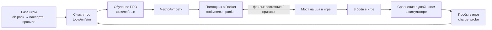

# Сводка проекта

[← Назад](README.md) · [Документация](README.md) › Сводка проекта · [English](../en/summary.md)

Короткая карта проекта: что он делает, из каких частей состоит, в каком состоянии каждая часть и
где читать подробности. Её читают первой после потери контекста; подробные страницы — только по
текущей задаче. Свежие цифры итерации — в её логах (`build/steps/`, `build/compare/`), здесь — главные.

## Что за проект

Нейросеть, которая командует армией в боях Total War: WARHAMMER III. Сеть учится с нуля в нашем
симуляторе боя (PyTorch, тысячи боёв сразу на видеокарте), а потом играет настоящие бои в игре против
ИИ игры на нормальной сложности. Сейчас две фракции — Империя и скавены, ровная пустая карта, лорд и до
19 отрядов у стороны (в пулах 21 отряд и 2 лорда, [паспорта](training/units.md)). Цель — сеть, которая
выигрывает у ИИ игры ≥ 97 % боёв и играет «по характеру» фракции ([замысел и готовность](training/network.md#готовность)).

## Где мы сейчас

- **В игре сеть почти всегда проигрывает:** 0–3 победы из 8 на каждой итерации (последние пять: 0, 1, 1, 1, 0).
  Те же 8 боёв в симуляторе («двойник»: те же армии, сеть против скрипта `ai_like`) — 4–4,5 из 8. Значит,
  симулятор всё ещё добрее к сети, чем игра, и сеть учит то, что в игре не работает.
- **Где разрыв:** почти весь — в паре «сеть за Империю против скавенов ИИ»: двойник 23,75 очка из 24, игра 4
  из 24. Найденная причина: потрёпанный отряд (здоровье меньше половины) в симуляторе теряет здоровье в
  рукопашной в 1,2–1,8 раза быстрее, чем в игре. Её разбирает проба `dmgmelee`.
- **Бегства:** наши отряды в игре бегут в 1,6–1,8 раза чаще, чем в двойнике; отряды ИИ — в 0,5–0,7 раза от двойника.
- **Симулятор на записях игры** (повтор 72 боёв, ниже): кривые потерь совпали, остались бегства и сборы.

## Рабочий круг

Одна итерация — около часа обучения и боёв; между итерациями — правка симулятора по самой большой дыре.

| Шаг | Что | Как |
|---|---|---|
| 1. Обучение | 30 мин от прошлой сети, без проверок в симуляторе | `bash build/steps/v2_iter.sh NAME 30 INIT` (переживает падение: следующая попытка с `latest.pt`) |
| 2. Бои в игре | 8 боёв: 3 проверочных зерна + армии прогона 20261007-091416, каждое дважды с обменом армий | `build/steps/watch_set8.ps1 -Ckpt build/v2/itN.pt` |
| 3. Двойник | те же 8 стартов в симуляторе (сеть против `ai_like`, 4 копии); таблица «игра / двойник» и 3–5 самых больших разрывов поведения | `bash build/steps/compare_set.sh N` → `build/compare/set_vs_twin.py` |
| 4. Проба | самый большой разрыв ставится одной механикой в игре и в симуляторе одинаково (полосы отрядов, всё записано) | `tools/nn/charge_probe.py` + `src/entries/charge_probe.lua`, планы `--plan` ([зонд](apps/entries.md#charge_probe--зонд-рукопашной-одна-механика-игра-и-симулятор-одинаково)) |
| 5. Правка симулятора | правило игры по пробе, за переключателем в `config/nn/sim.json` | агент; сразу тест |
| 6. Повтор 72 боёв | бои наборов в игре, переигранные в симуляторе по записанным приказам обеих сторон, 19 копий; навык и смещение по каждой величине | `build/shotgap/replay72.py`, `build/shotgap/replay_card.py` |

Скрипты круга лежат в `build/` (не в Git). Бои против ИИ игры — только на «Нормальной».

## Симулятор боя

**Что делает.** Каждый отряд — один объект (бойцы, здоровье, место, направление, мораль, усталость,
снаряды), а не каждый солдат. Шаг 0,5 с (такт морали игры). Бой кончен, когда у стороны нет стоящих
отрядов; через 60 минут побеждает защитник. ~590 боёв в секунду на RTX 5070 Ti (4096 сразу).

**Откуда числа.** База игры (`config/nn/game_rules.json`, паспорта `units.json`, эффекты `effects.json`,
способности `abilities.json`), формулы сообщества, замеры проб в игре. Каждое правило — переключатель в
`config/nn/sim.json` с причиной. Любая правка `config/nn` или `tools/nn/sim` меняет версию симулятора
(`tools/nn/train/version.py`).

**Что моделируется** (подробно — [механика и откуда числа](training/simulator.md#механика-и-откуда-числа)):

- **Рукопашная по формулам игры:** шанс попасть 35 + атака − защита (вес 1), промах стоит 0,5 с; урон —
  бронебойный целиком + обычный за вычетом броска брони; пул раненых; фланг / тыл — защита ×0,6 / ×0,3;
  натиск с разбега и рывок на скорости натиска; первый удар при входе в бой; начальная волна схватки
  (`melee.wave`); потрёпанный строй не смыкается — до врага достаёт только часть бойцов
  (`melee.front_fill_ranks` 1,5: проба `dmgmelee`, раньше отряд на 30 % бил в 1,6–1,9 раза сильнее игры);
  случайные удары (`noise.blows`: в повторе и двойнике включены, в обучении нет).
- **Выход из рукопашной и приказы в схватке:** окно 24 с из базы (и для лорда); «идти» в схватке — выход в любую сторону;
  атака на цель вне касания — выход; новая атака в схватке 24 с бьёт только свою цель; уходящего без погони
  держат 2 с; погоня — без рывка натиска.
- **Стрельба по правилам игры:** дальность от центра до центра, дуга огня у каждого бойца, модель разброса
  из базы без подгонки, разлёт по соседям, огонь мимо своих по дуге пули, стрельба на ходу (ополчение,
  звёзды); стрелки в рукопашной бьют слабо, как в игре; новый приказ или цель: навесной огонь (стрелы, болты,
  пращи) молчит 8,5 с при любой перезарядке, каждый приказ запускает окно заново; ружья и звёзды бьют сразу
  (пробы `retarget`, `retarget2`, `retarget3`); стрелы и болты по цели, потерявшей треть бойцов, — цикл
  перезарядка + 3,3 с.
- **Мораль по правилам игры:** окна потерь 4 / 60 с, «под обстрелом», фланг / тыл, «фланги прикрыты»,
  натиск, перевес, «проигрываю схватку» (−3 / −8 по соотношению сил, как в базе), сильный враг, гибель
  лорда (−16 на 45 с, потом −10), разгром отряда и армии; сбор — измеренный процесс (`morale.rally_hazard`:
  шанс в секунду по расстоянию до ближайшего врага у бегущих с моралью выше 0; снят на том же условии, по 360 записям игры).
- **Бегство:** первые 7 с бегущий остаётся в касании; тормозится в толпе; уходит от погони под углом;
  вдали от врагов бежит прочь от всех стоящих врагов (вес 1 / расстояние), к своему краю — только когда
  стоящих нет ([куда бежит бегущий](training/simulator.md#куда-бежит-бегущий)).
- **Лорды:** хрупкие, как в игре (своя аура не действует, в рукопашной всегда «проигрывают»), удар
  делится на 4 бойца, поединок лордов по формуле игры, способности (ИИ игры применяет их по замеренному
  правилу), «Раны».
- **Усталость** по базе (10 тиков в секунду, рукопашная утомляет по приказу атаки; натиск +34 на подходе рывком, без
  доплаты после удара; в рукопашной без атаки — готовность; стрельба 11,4 — замер), врождённые эффекты
  отрядов, разворот со скоростью поворота из базы, строй по шаблону из базы.
- **Не моделируются:** рельеф, лес, видимость, кавалерия, монстры, магия, полёт, артиллерия, опыт.

**Сверка с игрой.** Записанный бой переигрывается по записанным приказам 19 раз со сдвигом начала до 2 м;
копии — прогноз, запись игры — исход. Главный счёт — **доля значений игры внутри 90 % интервала копий**
(у совпадающего с игрой симулятора 90 %), рядом **навык** CRPSS (0 — не лучше «типичного значения игры»,
больше — лучше) ([как считается](training/simulator.md#счёт-сверки-симулятор-как-прогноз)). Общая сверка —
`python -m tools.nn.sim.check` ([сверка](training/simulator.md#сверка-с-игрой)); в круге — повтор 72 боёв
наборов сети.

**Повтор 72 боёв** (бои сети против ИИ игры из наборов итераций):

| Величина | Симулятор | Игра |
|---|---:|---:|
| Навык, медиана по величинам | ≈ 0 % (было −24 %) | — |
| Потери нашей стороны через 60 / 120 / 180 с после первого контакта | 0,24 / 0,39 / 0,51 | 0,235 / 0,42 / 0,55 |
| Бегства на отряд | 0,79 | 1,19 |
| Сборы на отряд | 0,40 | 0,60 |

**Известные расхождения** (подробно — [«Чего нет»](training/simulator.md#чего-нет)):

- потрёпанный отряд в рукопашной теряет здоровье быстрее игры (проба `dmgmelee` разбирается);
- бегств и сборов меньше, чем в игре; в двойнике наши бегут реже, чем в игре, отряды ИИ — чаще;
- «фланги прикрыты» в игре растёт за ~45 с (+1…+7), в симуляторе +5 сразу (проба `rallysecure`);
- задержка приказов в игре 0,6–0,8 с в малых боях, в симуляторе 0,36 с;
- вторая волна отрядов сверена с записями не вся.

Пробы и что каждая дала — на страницах [симулятора](training/simulator.md) и
[рукопашной](game/mechanics/melee.md#проверка-в-игре-зонд-рукопашной); неудачные правила —
[«Пробовали и отказались»](training/simulator.md#пробовали-и-отказались).

Подробно: [симулятор](training/simulator.md) · [паспорта отрядов](training/units.md) ·
[замеры в игре](training/measurements.md) · [механика игры](game/mechanics/README.md) ·
[база игры](game/database.md) · [реестр показателей отрядов](game/units/indicators.md).

## Сеть v2

Одна сеть на обе фракции и обе роли (атака или оборона — вход). Видит только то, что видел бы человек:
свои отряды целиком, врагов — пока видны, и только состояние их морали
([правило видимости](training/model.md#правило-ии-видит-только-то-что-видит-человек)). Время до конца боя
не видит никогда. Пресет `v2`, 3,51 млн весов, учится с нуля
([подробно](training/model.md#вариант-v2-сектора-карты-цепочка-голов-обязательство)):

- **Токены отрядов** (по 155 чисел: паспорт, состояние, эффекты, дуга огня, действующий приказ) → 3 слоя
  внимания с поправкой на расстояние → память GRU.
- **Сектора карты** 16 × 16 по 100 м: сила и число своих и видимых врагов, бегущие, край карты; отряды
  смотрят на сектора отдельным слоем внимания.
- **Головы цепочкой:** вид приказа (держать / идти / атаковать / отойти / продолжать) → цель → сектор →
  клетка 25 м → срок. Выбор — приёмом Гумбеля (без `torch.multinomial`), логиты с мягким потолком
  (30 × tanh(x / 30)).
- **Обязательство:** каждый новый приказ держится 2 / 4 / 8 / 16 с; срок обрывают события (рукопашная,
  угроза флангу, цель погибла или бежит, свой лорд погиб).
- **«Глаза»:** вспомогательные головы учатся на правде симулятора (свои потери за 10 / 30 с, угроза врага,
  опасность сектора), их предсказания идут обратно в сеть.

Старые пресеты `small` / `wide` и их чекпойнты работают, но не учатся.

Подробно: [вход и устройство](training/model.md) · [замысел](training/network.md).

## Обучение

**Как идёт.** PPO в схеме MAPPO: каждый отряд — агент, отряды стороны делят её преимущество, критик видит
всё поле и в игру не идёт. 1024 боя сразу, решение раз в секунду, приказы доходят через 0,36 с.
Скорость v2 с глазами ~3 300–3 900 секунд боя в секунду обучения. Бои — [случайные армии](training/armies.md):
равный бюджет, лорд и 0–19 отрядов, ¾ армий по шаблонам ИИ игры, разброс чисел ±15 %.

**Награда v2** (`--reward v2`): победа / поражение + обмен золотом (золото уничтоженного врага минус своё,
к бюджету) + цена смены приказа 0,006 («продолжать» и повтор бесплатны)
([награда](training/training.md#награда)).

**Противники** (`--mix`): сам с собой 0,2, прошлые версии 0,3 (пул 12), `ai_like` 0,3 (скрипт по образцу ИИ
игры), `nearest` 0,2 (все бегом на ближайшего) ([противники](training/training.md#бои-и-противники)); скрипты
решают в такте игры — раз в 1 с, приказ приходит с той же задержкой, что у сети. ИИ игры
в обучении не участвует — он независимая проверка.

**Выключено:** учителя и учения. Учения (`kiting`, `counter`, `hold_fire`, `direct_fire` и др.) остались в
коде, но v2 их не использует ([учения](training/training.md#учения)).

Цепочка шагов с проверками в симуляторе (`tools.ops.step`, `test5`, `tools.ops.card`,
`config/train-chain.json`) осталась, но в круге v2 не используется: сеть меряется боями в игре
([рабочий процесс](training/workflow.md)).

Подробно: [обучение](training/training.md).

## Мост и помощник: как сеть играет в игре

- **Мост** — Lua внутри игры (`src`, точка входа `nn_arena`). Раз в секунду боя пишет состояние всех
  отрядов в файл, каждые 100 мс читает файл приказов (файлы пишутся во временный и переименовываются).
- **Помощник** (`tools/nn/companion`, Docker-контейнер `snake-ai-trainer`) приводит состояние к виду
  симулятора, строит вход стороны, гоняет сеть (с тем же обязательством, что в обучении) и пишет приказы;
  ~40 мс от состояния до приказов при скорости ×20.
- **Сеть отдаёт:** держать, идти, отойти, атаковать цель, бег, способности лорда. Бегущими отрядами
  управляет игра.
- **Враг под `ai_like`:** врагом в игре может командовать скрипт симулятора, против которого учится
  сеть (`--enemy-ai ai_like`, второй мост и тот же помощник): остаётся только разница движка
  ([мост](apps/bridge.md#враг-под-скриптом-симулятора)).
- **Запуск боя:** сборка пакета (`tools.build nn-arena`), launcher ставит нормальную сложность и
  возвращает настройки игрока; один бой на запуск игры (~2 мин). Мод True Sight обязателен.

Подробно: [мост](apps/bridge.md) · [смотреть бой сети](launch/watch.md) · [запуск](launch/run.md) ·
[сборка](launch/build.md) · [модули в игре](apps/README.md) · [устройство проекта](architecture/overview.md).

## Проверка в игре

Рабочая проверка — **набор из 8 боёв** после каждой итерации (`watch_set8.ps1`, выше): 4 пары, в каждой
сеть играет обеими армиями (2–0 — сеть умнее ИИ обеими армиями; 1–1 — решает армия; 0–2 — ИИ лучше).
Набор сразу сравнивается с двойником — главный источник дыр симулятора. Общий инструмент проверки — `tools/launcher/gate.ps1` (пары на проверочных зёрнах,
итог в `build/nn-gate/<время>/summary.json`) и карточка разрыва `tools.ops.gapcard`
([карточка разрыва](training/workflow.md#карточка-разрыва-игра--симулятор-toolsopsgapcardpy)).

Подробно: [проверка в игре](launch/gate.md) · [штатный ИИ игры](game/game-ai.md) ·
[сложность](game/difficulty.md).

## Где что лежит

| Что | Где |
|---|---|
| Правила работы | `CLAUDE.md` в корне |
| Код в игре (Lua) | `src/apps`, `src/entries`; тесты без игры — `tests/` (pytest + lupa) |
| Симулятор, обучение, сеть, помощник | `tools/nn/sim`, `tools/nn/train`, `tools/nn/model`, `tools/nn/companion` |
| Числа и правила симулятора | `config/nn/` (входит в версию симулятора), переключатели — `config/nn/sim.json` |
| Пробы в игре | `tools/nn/charge_probe.py`, `src/entries/charge_probe.lua` |
| Скрипты круга | `build/steps/v2_iter.sh`, `watch_set8.ps1`, `compare_set.sh`; `build/compare/`, `build/shotgap/` (не в Git) |
| Сети итераций | `build/v2/itN.pt`, прогоны — `build/nn-train/runs/` (не в Git) |
| Записи боёв в игре | `build/nn-arena/runs/<время>/` (не в Git) |
| Инструменты оркестратора | `tools/ops`: `leftovers`, `wait.sh`, `baselines`, `gapcard`, `step`, `card` |

Все разделы документации: [оглавление](README.md) · [данные для обучения](training/README.md) ·
[знания об игре](game/README.md) · [архив исследований](research/README.md).
