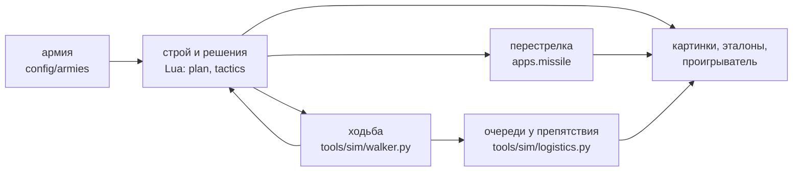

# Симулятор

[← Назад](README.md) · [Документация](../README.md) › [Тесты](README.md) › Симулятор · [English](../../en/testing/simulator.md)

Бой без игры: та же логика ИИ на Lua, а вместо движка — упрощённая модель, настроенная по замерам в игре.



| Часть | Что делает | Где |
|---|---|---|
| Строй, сближение, окно | тот же код, что в бою: `apps.plan`, `apps.tactics`, `apps.reach` | `tools/sim/formation.py` |
| Враг | стоит, как штатный ИИ в обороне тестовой битвы | `tools/sim/enemy.py` |
| Карта | клетки 3 м снятой карты: где можно встать | `tools/sim/mapgrid.py` |
| **Ходьба** | как движок: путь в обход препятствий, отряд смотрит, куда идёт, строй мнётся у края | `tools/sim/walker.py` |
| Очереди | приказы диспетчера `apps.logistics` по времени, давка | `tools/sim/logistics.py` |
| Стрелы | `apps.missile` раз в секунду | `Planner.fire` |

## Ходьба как в игре

С 28.09.2026 (задача № 27) каждый манёвр — и скачок сближения, и выравнивание, и очереди — **идёт по
времени**, шагом 0,5 с. До этого манёвр был прыжком, и отряды проходили сквозь скалы.

| Что | Как в ходоке | Откуда число |
|---|---|---|
| Путь | прямо, если свободно; иначе в обход по клеткам 3 м с запасом в полширины отряда. Если короткий путь теснее, он выигрывает, как у движка | игра: пути у скал |
| Куда смотрит | туда, куда идёт; на месте — поворот к приказанному | игра: медиана 3–4° |
| Поворот | 20°/с | игра: 90% поворотов до 15–20°/с |
| Скорость | 1,3 м/с | игра: медиана на ходу |
| Доводка | 8 с на месте после прихода | игра: 53 скачка, 9,7 с + d / 1,37 м/с |
| Бойцы у края | боец, попавший на камень, сдвигается на ближайшую свободную клетку | так движок сминает строй |
| Приказ на камень | отряд встаёт у ближайшего свободного края | — |
| Отряды друг с другом | не толкаются; давка считается | ограничение |

**Сверка с игрой:** шаг в обход на 5 местностях — [отчёт](../../../research/analysis/walker/README.md).
Пути похожи: длиннее прямой в 1,1–1,3 раза, как в игре. Время — 6 шагов из 9 в пределах ±15%.


*Шаг в обход скалы, только движок. Серые линии — пути отрядов в игре, синие — в симуляции.*

## Как запустить

```bash
python -m tools.sim.formation rock_march_wide
```

| Команда | Что |
|---|---|
| `python -m tools.sim.formation <армия>` | строй, сближение, перестрелка — картинка `plan.png` |
| `python -m tools.sim.logistics <армия>` | шаг в обход очередями и все сразу — `walk_1.png` |
| `python -m tools.sim.golden` | сравнить с эталонами (`--update` — записать новые) |
| `python -m tools.analysis.walker_game` | ходьба симулятора против игры |
| `python -m tools.viewer sim <армия>` | посмотреть в движении — [проигрыватель](../launch/viewer.md) |

## Проверки

- **Физика** (`tests/tools/test_sim_physics.py`). На 7 армиях с картой, в каждом манёвре и в очередях: центр отряда ни разу не на камне, после сдвига бойцов ни одного бойца на камнях, у края сдвигается не больше 30% отряда. Ходок на придуманной карте: прямая за своё время, обход скалы, поворот по ходу, остановка у края, сдвиг бойцов.
- **Эталоны** (`tests/golden/sim/`, 15 армий). Решения сближения, **время каждого решения и манёвра**, окно, перестрелка.
- **Ветки дерева** (`tests/tools/test_tree_branches.py`). Выключенная ветка ведёт себя как её базовое поведение.
