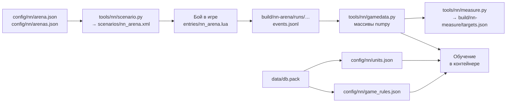

# Данные для обучения нейросети

[← Назад](../README.md) · [Документация](../README.md) › Данные для обучения · [English](../../en/training/README.md)

Позже мы хотим обучить нейросеть с нуля. Своей сети в проекте сейчас нет. Здесь —
какие данные уже можно собирать и как ими пользоваться. Какой будет сама сеть,
где она работает и когда она готова — [модель сети](network.md). Её вход и слои в коде —
[вход и устройство сети](model.md). Как она учится — [обучение](training.md).



## Арена

- `config/nn/arena.json` — пустая ровная карта [Crossroads flat](../game/maps/crossroads-flat.md);
  у каждой стороны лорд (`wh_main_emp_cha_general_0`), 4 копейщика
  (`wh_main_emp_inf_spearmen_0`, по 120) и 2 лучника (`wh2_dlc13_emp_inf_archers_0`,
  по 90) Империи. Фронты копейщиков в 350 м (две дальности лука). Сторона 1 (наша)
  на западе лицом на восток, сторона 2 (ИИ игры) на востоке лицом на запад.
- `tools/nn/scenario.py` пишет из него `scenarios/nn_arena.xml`; сборка делает это
  сама.
- Точка входа `nn_arena` ([точки входа](../apps/entries.md#nn_arena)): нашей
  стороной управляет планировщик CA — `attack` (нападает) или `defend`
  (обороняется); сторона 2 — всегда ИИ игры
  ([штатный ИИ игры](../game/game-ai.md)). Защитник — тот, кто побеждает, когда
  время вышло ([нападающий и защитник](../game/battle-roles.md)).
- `config/nn/arenas.json` — **именованные арены**, у каждой стороны своя армия:
  та же карта и зоны, что в `arena.json`, но у каждой стороны своя фракция и
  отряды, а у арены — свой разрыв. На них сделаны [замеры](measurements.md):
  пары в рукопашной, стрелки против мишени, целые бои Империи со скавенами.

## Как записать бой

```powershell
.venv/Scripts/python -m tools.build nn-arena --own-ai attack --timeout 900    # или defend
powershell -NoProfile -ExecutionPolicy Bypass -File tools/launcher/launch.ps1 -Target nn-arena
```

### Разные армии

Именованная арена — флаг `--arena`; `--own-ai hold` оставляет нашу сторону без
приказов (стоит, мишень), а ИИ игры нападает:

```powershell
.venv/Scripts/python -m tools.build nn-arena --arena whole_emp_v_skv --own-ai attack --timeout 1200
.venv/Scripts/python -m tools.build nn-arena --arena missile_archers_v_slave --own-ai hold --timeout 900
powershell -NoProfile -ExecutionPolicy Bypass -File tools/launcher/launch.ps1 -Target nn-arena
```

- Новая армия — новая запись в `config/nn/arenas.json`: `sides.own` и
  `sides.enemy`, у каждой `faction` и `units` (`slot`, `key`, `men`, `forward`,
  `lateral`, `width`, `general` у лорда). Слоты внутри стороны не повторяются;
  генерал у стороны — не больше одного (можно и без него: в парах из одного
  отряда генерала нет).
- В манифест записи попадают `arena` и `factions`; загрузчик берёт отряды оттуда.

### Время и сложность

- Один бой — около 2 минут при скорости ×20: загрузка ~90 с, сам бой 25–45 с
  (пара из двух отрядов — меньше минуты целиком).
- Сложность launcher ставит сам — нормальную ([честная сложность](../launch/run.md#честная-сложность),
  [сложность боя](../game/difficulty.md)).
- Бой кончается победой одной стороны (`completed`), нашим пределом времени игры
  (`timeout`: `--timeout 900` — 900 с, как у записанных боёв; без него сборка
  даёт 600 с), а если бой встал без потерь или вышло реальное время —
  `stalled` или `deadline`.

## Что в записи

`build/nn-arena/runs/<ГГГГММДД-ччммсс>/` — **не в Git**:

| Файл | Что |
|---|---|
| `manifest.json` | сборка и настройки: `arena`, `factions`, `own_ai`, `enemy_role`, места отрядов |
| `launch.json` | запуск, `battle_difficulty` и `user_battle_difficulty` |
| `events.jsonl` | события боя |
| `status.json` | итог запуска, `preferences_restored` |

События: `ready`, `own_ai`, `start`, `nn_sample` каждую секунду игры,
`rejoined` и `idle_kick` (исправления планировщика), `nn_final` (последний
снимок), `result` (`status`, `winner`, бойцы и здоровье сторон).

`nn_sample` — все отряды **обеих** сторон:

| Поле | Что |
|---|---|
| `n`, `side` | имя слота (`own_lord`, `enemy_spear_1`, …) и сторона |
| `x`, `z`, `b` | место (м) и направление (°) |
| `men`, `hp` | живые бойцы и доля здоровья (0–1) |
| `mp`, `ms` | `MoralePercent` и `MoraleState` ([мораль](../game/units/morale.md)) |
| `r`, `s`, `w` | бежит, разбит, колеблется |
| `m`, `mv`, `f` | в рукопашной, идёт, бежит бегом |
| `a`, `fire`, `t` | стрел осталось, стреляет, текущая цель |
| `fat`, `k` | усталость (строка), убито врагов |
| `ox`, `oz` | точка приказа |
| `lf`, `rf`, `bf` | угроза левому флангу, правому, тылу |

Это полная запись для исследования. Сети на вход — только то, что видит одна
сторона ([observation](../apps/observation.md)).

## Загрузчик

`tools/nn/gamedata.py` — только numpy, работает и вне контейнера:

```python
from tools.nn import gamedata

for run in gamedata.runs():          # только нормальная сложность
    b = gamedata.load(run)
    b.t               # секунды, [T]
    b.f["hp"]         # [T, N]: наши отряды, потом вражеские (зеркальная арена: 7 + 7 = 14)
    b.target          # [T, N]: номер цели, -1 — нет
    b.names, b.keys, b.side   # [N]: скрипт-имена, ключи отрядов, сторона 1 или 2
    b.arena, b.own_ai, b.enemy_role, b.winner, b.result
```

- Порядок отрядов — как в манифесте записи, сначала наши. В зеркальной арене:
  `lord`, `spear_1`…`spear_4`, `archer_1`, `archer_2`.
- `runs(own_ai=None, since=None, fair_only=True, arena=None)`: `fair_only`
  оставляет только бои на нормальной сложности; `arena="arena"` — только
  зеркальная арена. Записи отброшенной серии боёв (с `series.json`) не берутся.
- `python -m tools.nn.gamedata` — список боёв.

На 30.09.2026 записано 40 запусков зеркальной арены, из них 18 честных боёв с итогом. Механику
([мораль](../game/units/morale.md), [рукопашная](../game/units/melee.md) и другие
страницы ниже) разбирали по первым 13 из них: `20260930-130637` … `20260930-132200`,
7522 с записей. Ещё 5 боёв (`20260930-133202` … `20260930-133710`) записаны после
разбора; вместе все 18 — 9886 с. Потом — 28 боёв [замеров](measurements.md) на
именованных аренах (`20260930-181821` … `20260930-184908`).

## Правила игры

Числа правил — из базы игры: [база игры](../game/database.md),
`config/nn/game_rules.json` (`py -3.14 -m tools.nn.gamedb`).

Числа отрядов — [паспорта отрядов](units.md), `config/nn/units.json`
(`py -3.14 -m tools.nn.units`): бойцы, здоровье, скорость, оружие, броня, щит,
стрельба семи отрядов v1 (Империя и скавены), сверенные с карточками из боя.

Числа из боёв, с которыми будем сверять симулятор, — [замеры в игре](measurements.md)
(`python -m tools.nn.measure` → `build/nn-measure/targets.json`): рукопашная один на один,
стрельба по стоящему отряду, целые бои Империи со скавенами.

Симулятор, в котором будет учиться сеть, — [симулятор боя](simulator.md)
(`tools/nn/sim/`, `config/nn/sim.json`, `python -m tools.nn.sim.check`): тысячи боёв сразу
на видеокарте, сверенные с этими замерами и записанными боями.

Как сеть учится в нём — [обучение](training.md) (`tools/nn/train/`,
`bash tools/nn/dock.sh tools.nn.train.run`): PPO, бои против себя, прошлых версий и скриптов.

Бои, на которых она учится и проверяется, — [случайные армии](armies.md) (`tools/nn/armies/`,
`python -m tools.nn.armies`): равный бюджет (скавенам 0,8 от него), лорд и 0–19 отрядов у стороны, расстановка для
симулятора и игры.

Как сеть проверяется в игре против ИИ игры — [проверка сети в игре](../launch/gate.md)
(`tools/launcher/gate.ps1`): 4 боя из генератора на отложенных зёрнах, не меньше 3 побед.

Что известно о механике:
[мораль](../game/units/morale.md) ·
[рукопашная](../game/units/melee.md) ·
[урон стрелами](../game/units/missile-damage.md) ·
[темп и усталость](../game/units/pace.md) ·
[сложность](../game/difficulty.md) ·
[штатный ИИ игры](../game/game-ai.md) ·
[поля состояния](../game/units/state-fields.md).

## Контейнер для обучения

`tools/nn/dock.sh` запускает модуль этого репозитория в Docker-образе
`snake-ai-trainer` (PyTorch + CUDA) на видеокарте; репозиторий
монтируется в `/repo`:

```bash
bash tools/nn/dock.sh tools.nn.gamedata
```

Нужен Docker с доступом к GPU (`--gpus all`).
