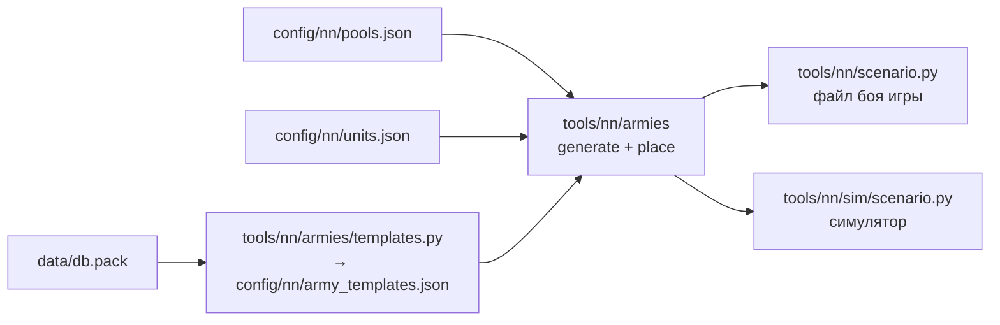

# Случайные армии

[← Назад](README.md) · [Документация](../README.md) › [Данные для обучения](README.md) › Случайные армии · [English](../../en/training/armies.md)

Генератор случайных боёв для обучения: две армии с равным бюджетом (`budget_factor`
фракции может менять её долю, см. ниже), у каждой лорд и от 0 до 19 отрядов, уже расставленные. Один и тот же бой можно сыграть и в
[симуляторе](simulator.md), и в игре. Правила — из [модели сети](network.md#армии-и-правила-боя).

## Как получить

```bash
.venv/Scripts/python -m tools.nn.armies                       # 5 примеров и сводка по 10 000 боёв
.venv/Scripts/python -m tools.nn.armies --samples 3 --xml build/nn-armies   # + файл боя игры на каждый пример
bash tools/nn/dock.sh tools.nn.armies --samples 8 --stats 0 --sim         # + бой в симуляторе (torch)
py -3.14 -m tools.nn.armies.templates                         # шаблоны армий из базы игры
```



## Файлы

| Файл | Что |
|---|---|
| `config/nn/pools.json` | отряды каждой фракции для обучения, её множитель бюджета (`budget_factor`), доля шаблонных армий (`mix`), ограничения (`caps`) |
| `config/nn/army_templates.json` | шаблоны армий фракций из базы игры (пишет `templates.py`) |
| `tools/nn/armies/pools.py` | пулы: паспорта отрядов, группы генератора, доли шаблонов (`Template`), бюджеты |
| `tools/nn/armies/generate.py` | бюджет, покупка отрядов, бой по зерну |
| `tools/nn/armies/place.py` | расстановка |
| `tools/nn/armies/export.py` | файл боя игры, формат `arenas.json`, описания армий для симулятора |
| `tests/tools/test_nn_armies.py` | тесты (уровни 1–2, только numpy) |

## Как строится бой

1. **Фракции.** Каждая сторона берёт фракцию из списка независимо, поэтому бывают и
   зеркальные бои, и бои разных фракций.
2. **Бюджет B.** Log-равномерно между «лорд подороже и самый дешёвый отряд» и тем,
   что обе фракции могут выставить в 1 лорде и 19 отрядах. Бюджет берётся заново,
   пока обе стороны не могут его потратить.
   - **Множитель бюджета.** Бюджет стороны — B × `budget_factor` её фракции / больший
     множитель из двух сторон (`config/nn/pools.json`, по умолчанию 1,0). Границы B
     учитывают множитель, поэтому обе стороны всегда могут потратить свою долю. У всех
     фракций 1,0: неравенство фракций (при равном бюджете скавены выиграли в игре все 10
     целых боёв: [замеры](measurements.md#целые-бои-империя-против-скавенов)) учитывают
     честные метрики [обучения](training.md#оценка-сети-честные-метрики) и щитовые отряды
     Империи ([паспорта отрядов](units.md#копейщики-со-щитами-и-мечники)). Скавены на 0,8
     проигрывали в симуляторе ~90% ([пробовали и отказались](training.md#скавены-на-08-бюджета)).
   - **Предел фракции.** `budget_max` в записи фракции ограничивает, сколько тратит её сторона
     (B × её доля). У скавенов 6700 — их максимум до их волны (Вождь и 19 кланокрыс-копейщиков):
     иначе Ночные бегуны (450) и кланокрысы со щитами (350) сдвинули бы все бои со скавенами к
     более богатым армиям. Их самый дешёвый отряд, скавенрабы (125), снижает наименьший бюджет
     зеркала скавенов с 675 до 650.
   - **Богатые бои** (`budget_rare` в `pools.json`: `share`, `max`; по умолчанию `share` 0 — нет, и
     генератор не тянет лишнего случайного числа, все бои как раньше). Доля `share` боёв берёт B
     log-равномерно между обычным верхом (`budget_max` и пределы фракций) и `max` (не больше, чем обе стороны
     могут выставить в 19 отрядах и лорде). Больше золота — по шаблонам больше дорогих отрядов (двуручники,
     штормокрысы); предел 20 отрядов — как в игре. Поднимать шагами: каждый шаг меняет версию симулятора
     (`config/nn`), базы скриптов играются заново ([шаги](#богатые-бои-шаги)).
3. **Покупка.** Каждая сторона тратит от 0,95 до 1 своего бюджета вместе с лордом,
   поэтому стороны с одинаковым множителем различаются не больше чем на 5%. Каждый
   отряд берётся, только если армия ещё может закончить внутри этого окна. Для этого есть таблицы numpy: что пул может
   купить за k отрядов. Поэтому сторона не срывается и не выходит за бюджет.
   - **Шаблонная армия** (75%, `mix.template`) — по одному из шаблонов фракции из базы
     игры, как их набирает ИИ. Покупает по долям шаблона, пока хватает бюджета.
     Число отрядов получается само. Есть ограничение `caps`.
   - **Случайная армия** (25%, `mix.random`) — как мог бы собрать человек, стаки тоже.
     Число отрядов берётся равномерно среди тех, что укладываются в бюджет, а
     предпочтения отрядов — случайные (Дирихле, α = 0,7): рой дешёвых, мало дорогих,
     одни стрелки. Ограничений нет.
4. **Расстановка** — ниже.

Бой определяется зерном: `battle(seed)`. Для обучения — зёрна `TRAIN_SEEDS`
(0 … 10⁹ − 1), для проверки — `EVAL_SEEDS` (10⁹ … 10⁹ + 10⁶ − 1). Диапазоны не
пересекаются, поэтому проверочные бои сеть при обучении не видит.

## Шаблоны армий из базы игры

Пропорции шаблонных армий — из генератора армий игры (`cdir_military_generator_*`,
«campaign director»). Таблицы читаются целиком до последнего байта
(`tools/nn/dbtables.decode`). Имена полей наши, по значениям.

| Таблица | Что в ней |
|---|---|
| `cdir_military_generator_template_priorities` | конфиг генератора → его шаблоны и вес (`WH_Empire` → `WH_Empire_land` … `_4`) |
| `cdir_military_generator_template_ratios` | шаблон → доля по группе отрядов (`..._melee_infantry_main_frontline_spears_high_quality` 20, …) |
| `cdir_military_generator_unit_qualities` | отряд → группа и ступень качества |
| `cdir_military_generator_unit_group_overrides` | группа → родительская группа |

- Те же шаблоны берёт и генератор сетевой игры: конфиг `WH_mp_Empire_land` ведёт на
  `WH_Empire_land` … `_4`.
- Конфиг фракции указан в `pools.json` (`generator`), по имени. Таблицу «фракция →
  конфиг» в базе не искали.
- **Как доли шаблона доходят до отрядов** (`pools.json` `template_rule`, с 07.10.2026 — `group`). Группы
  генератора — дерево: `cdir_military_generator_unit_group_overrides` даёт каждой группе родителя
  (`..._frontline_spears_high_quality` → `..._frontline_spears` → `..._frontline` → `..._main` → `melee_infantry` →
  `melee_infantry_trash`). Отряды сидят в листьях, а шаблоны спрашивают и общие группы, в которых нет ни одного
  отряда: `melee_infantry` — 54 раза во всей базе, `melee_infantry_main` — 7, `ranged_infantry_main` — 21.
  Значит, группа шаблона означает всё своё поддерево. Правило: доля группы идёт отрядам пула из её поддерева;
  если ни одного из них купить нельзя (их нет в пуле или они уже не влезают в бюджет), доля переходит к
  поддереву родителя, и так вверх; доля, которая ни до кого не дошла (артиллерия, кавалерия, монстры),
  отбрасывается, остальные нормируются. Внутри достигнутой группы — поровну.
  - Наше, не из игры: «вверх к родителю» — замена отрядов, которых нет в нашем пуле (у игры весь ростер
    фракции); «поровну» — ступень качества (`unit_qualities`, по моддерам — «приоритет найма внутри группы»)
    в числах не описана; доля проверяется на каждой покупке (если отряд уже не влезает в окно бюджета, доля
    его группы уходит выше, а не пропадает). Если ни у одного вида шаблона нет доступного отряда, отряд
    берётся равномерно из тех, что ещё влезают (рынок обязан потратить бюджет): так в армии попадают
    скавенрабы и пращники, которых шаблоны скавенов не спрашивают.
  - Прежнее правило (`template_rule: family`, до 07.10.2026; осталось как вариант): доли шаблона суммировались
    по корню цепочки (вся пехота ближнего боя — `melee_infantry_trash`, стрелковая — `ranged_infantry`) и делились
    поровну на отряды пула этого корня. Оно стирало группы «high_quality»: штормокрыса (950) получала ту же долю,
    что раб (125).
- В игре не проверено, набирает ли ИИ кампании армии ровно по этим шаблонам.

Доли шаблонов по правилу `group` (по числу отрядов, лорд не входит, когда все отряды можно купить):

| Шаблон | Копейщики | Копейщики со щитами | Мечники | Флагелланты | Двуручники | Лучники | Ополчение | Аркебузиры | Арбалетчики |
|---|---:|---:|---:|---:|---:|---:|---:|---:|---:|
| `WH_Empire_land` | 15% | 15% | 0 | 0 | 31% | 0 | 0 | 19% | 19% |
| `WH_Empire_land_2` | 17% | 17% | 0 | 8% | 25% | 2% | 2% | 15% | 15% |
| `WH_Empire_land_3` | 15% | 15% | 3% | 3% | 26% | 0 | 0 | 19% | 19% |
| `WH_Empire_land_4` | 14% | 14% | 3% | 3% | 24% | 4% | 4% | 18% | 18% |

Откуда: «копья high_quality» (у Империи в пуле их нет) → обычные копья — оба копейщика; «мечи high_quality» —
двуручники; `main_flanking` — флагелланты; `ranged_infantry_main_light_backline` — арбалетчики и аркебузиры;
лучники и ополчение (`ranged_infantry_trash`) — только через общую `ranged_infantry`; мечники
(`frontline_swords`) — только через общие `melee_infantry_main` / `melee_infantry`.

| Шаблон | Кланокрысы-копейщики | Кланокрысы | Кланокрысы со щитами | Копейщики со щитами | Штормокрысы (алебарды) | Штормокрысы (мечи, щиты) | Ночные бегуны (пращи) | Ночные бегуны (звёзды) | Рабы (оба), пращники |
|---|---:|---:|---:|---:|---:|---:|---:|---:|---:|
| `WH_Skaven_land` | 4% | 4% | 4% | 4% | 27% | 19% | 19% | 19% | 0 |
| `WH_Skaven_land_2` | 6% | 6% | 6% | 6% | 22% | 22% | 15% | 15% | 0 |
| `WH_Skaven_land_3` | 6% | 6% | 6% | 6% | 22% | 22% | 17% | 17% | 0 |
| `WH_Skaven_land_4` | 8% | 8% | 8% | 8% | 23% | 23% | 12% | 12% | 0 |
| `WH_Skaven_land_5` | 4% | 4% | 4% | 4% | 19% | 27% | 19% | 19% | 0 |

Откуда: «копья / мечи high_quality» — штормокрысы с алебардами / с мечами; `main`, `main_flanking`,
`melee_infantry` — все шесть отрядов строя (кланокрысы и штормокрысы); стрелки скавенов в шаблонах — тяжёлые
(`heavy_long_range`, `heavy_short_range`: джезайлы, ратлинги — их нет в пуле) → вверх до `ranged_infantry_main` →
Ночные бегуны (`light_skirmisher`); скавенрабы (`melee_infantry_trash`, корень) и пращники (`ranged_infantry_trash`)
не спрашиваются ни одним шаблоном скавенов.

Что получается в армиях (шаблонные армии, бюджеты как в обучении, доля отрядов):

| | Прежнее правило (`family`) | Правило `group` |
|---|---|---|
| Империя | копейщики 17%, со щитами 13%, мечники 14%, флагелланты 11%, двуручники 9%, лучники 10%, ополчение 10%, аркебузиры 8%, арбалетчики 9% | копейщики 20%, со щитами 15%, мечники 7%, флагелланты 3%, двуручники 18%, лучники 4%, ополчение 2%, аркебузиры 14%, арбалетчики 17% |
| Скавены | кланокрысы-копейщики 8%, рабы-копейщики 12%, пращники 12%, скавенрабы 16%, со щитами 8%, Ночные бегуны (пращи) 9%, кланокрысы 9%, копейщики со щитами 8%, штормокрысы 5% + 5%, Ночные бегуны (звёзды) 8% | кланокрысы-копейщики 8%, рабы-копейщики 5%, пращники 6%, скавенрабы 9%, со щитами 7%, Ночные бегуны (пращи) 11%, кланокрысы 10%, копейщики со щитами 7%, штормокрысы 13% + 13%, Ночные бегуны (звёзды) 12% |

Рабы и пращники остаются (5–9%): это добор бюджета, когда вид шаблона уже не влезает. Армии стали
дороже на отряд: в среднем 5,3 отряда у стороны против 7,3 до третьей волны (сводка ниже).

## Ограничения

`caps` в `pools.json` — только для шаблонных армий: стрелков (`inf_ranged`) не больше
60% отрядов армии, лорд считается, округление вниз, но не меньше 1. При 20 отрядах —
не больше 12, при 5 — не больше 3, у лорда с одним отрядом этот отряд может быть
стрелком.

Почему 60%: шаблоны игры дают стрелкам 23–43%. Небольшая армия может отклониться от
долей случайно, а 60% оставляют не меньше 40% армии в ближнем бою, чтобы прикрыть
стрелков. Стрелковые стаки остаются в случайных армиях — против них сеть тоже должна
уметь играть.

## Расстановка

`place.py` ставит 1–20 отрядов стороны в линии, в том же формате, что
`config/nn/arenas.json`: `forward` — к врагу, `lateral` — вправо, точка отряда — центр
его фронта.

- Спереди линии ближнего боя, за ними линии стрелков, лорд позади всех по центру.
- В линии между отрядами 6 м (как у копейщиков арены: 30 м фронта, 36 м между
  центрами). Между линиями — глубина строя плюс 15 м. Самые дорогие отряды — в
  середине линии.
- Линия не шире зоны расстановки без 5 м с краёв (300 м → 290 м: 8 отрядов по 30 м).
- Всё внутри зоны расстановки `tools/nn/scenario.py`: `forward` от 40 − 300 до 40,
  `lateral` ±150. Разрыв между сторонами — из `arena.json` (350 м). Самая глубокая
  армия (3 линии ближнего боя, 2 стрелков) кончается лордом около −140 м.
- Ширина отряда — из `pools.json` (как в аренах: копейщики и рабы 30 м, лучники 40,
  пращники 35; скавенрабы, кланокрысы со щитами и Ночные бегуны 30; аркебузиры 40, арбалетчики и остальные
  отряды третьей волны 30), иначе бойцы / `rank_depth` × 1,5 м.

## Сводка по 10 000 боёв

`python -m tools.nn.armies`, зёрна 5 … 10 004 (все `budget_factor` 1,0, в пулах третья волна, правило шаблонов
`group`, бюджет ограничен `budget_max` 7725, сторона скавенов — 6700, богатых боёв нет):

| Что | Значение |
|---|---|
| Зеркальные бои | 50% |
| Армии: шаблонные / случайные | 75% / 25% |
| Бюджет B | 651 … 7725, медиана 2528 |
| Отрядов у стороны (без лорда) | в среднем 5,3 (до третьей волны 7,3); 1–4: 52%, 5–9: 34%, 10–14: 11%, 15–18: 2%, 19: 0,5% |
| Разница цены сторон с равным бюджетом | в среднем 1,4%, не больше 5,0% |
| Цена скавенов / цена Империи | в среднем 1,004, 0,950 … 1,052 (4996 боёв) |
| У одной стороны в x раз больше отрядов | x ≥ 1,5: 37,3%; x ≥ 2: 18,7%; x ≥ 3: 5,9% |
| Доля стрелков у стороны | в среднем 31%; нет стрелков: 28%; ≥ 50%: 30%; только стрелки: 4,3% |
| Шаблонные армии Империи | копейщики 20%, со щитами 15%, мечники 7%, флагелланты 3%, двуручники 18%, лучники 4%, ополчение 2%, аркебузиры 14%, арбалетчики 17% |
| Шаблонные армии скавенов | кланокрысы-копейщики 8%, рабы-копейщики 5%, пращники 5%, скавенрабы 8%, кланокрысы со щитами 7%, Ночные бегуны (пращи) 12%, кланокрысы 8%, копейщики со щитами 7%, штормокрысы 13% + 14%, Ночные бегуны (звёзды) 12% |

### Богатые бои: шаги

Сейчас B не выше 7725 (Империя; скавены 6700): это максимум армий до второй волны. В игре свои бои
(пользовательские и сетевые) идут на средствах, которые задаёт игрок; в WH1 режим Domination поднял стартовые средства
с 9000 до 12 400 (выдержка поиска, обсуждения Steam); стандарт сетевых боёв WH3 источником не подтверждён. Армия
кампании — до 20 отрядов. Предложение: `share` 0,1 и `max` 10 000 → 12 400 → 15 000, по шагу после плато; на
каждом шаге смотреть рейтинг и золото пар (бои дороже — длиннее, обучение медленнее на бой).

Самый частый отряд Империи — копейщики без щитов (300, 20 %): доля обычных копий у них та же, что у копейщиков
со щитами, но добор бюджета, когда дорогой вид уже не влезает, чаще кончается дешёвым. Бои «много дешёвых против
мало дорогих» — в основном скавены против Империи.

Равный бюджет — не равная сила ([замеры](measurements.md): у скавенов 1601 боец против 661 у
Империи, и они выиграли все 10 целых боёв); честные метрики обучения убирают пару фракций из
оценки сети.

Восемь первых боёв прогнаны в симуляторе (`--sim`: все отряды атакуют ближайшего
врага): все закончились за 250–540 с. Если поменять стороны местами, в 13 боях из
16 побеждает та же армия.

## Для обучения

```python
from tools.nn.armies import generate, export
from tools.nn.sim import scenario

arenas = [generate.battle(seed) for seed in seeds]          # seeds из generate.TRAIN_SEEDS
armies = export.to_sim(arenas, "attack")                    # "defend": атакует сторона 2
st = scenario.build(armies, per_side=generate.MAX_UNITS + 1)
```

- `generate.generate(rng, factions=None, budget_range=None, max_units=None, sides=None)` —
  то же со своим генератором случайных чисел. `max_units=5` и `budget_range` дают
  маленькие армии (доля `--small` обучения). `factions` — список фракций, `sides` —
  фракции сторон явно.
- `per_side` должен быть 20: столько отрядов у стороны может быть.
- `export.to_sim` пишет бои во временный `arenas.json` и зовёт
  `tools/nn/sim/scenario.from_arena`. Когда `from_arena` научится брать словарь арены,
  временный файл станет не нужен.
- Бой в игре: `export.scenario_xml(arena)` — файл боя, `export.write_arenas` —
  `arenas.json`. Сборка боя: `python -m tools.build nn-arena --army-seed N` ([сборка](../launch/build.md#параметры),
  [проверка сети в игре](../launch/gate.md)).

## Новый отряд или фракция

0. Весь порядок (изучение особенностей, симулятор, входы сети, карточка, тесты):
   [как добавить отряд](units.md#как-добавить-отряд).
1. Паспорт отряда — в `config/nn/units.json` (`py -3.14 -m tools.nn.units --units …`).
2. Запись в `config/nn/pools.json`: `key`, `slot`, `width`; у новой фракции ещё
   `lord` и `generator`, а `budget_factor` — если она сильнее или слабее своей цены.
3. `py -3.14 -m tools.nn.armies.templates` — отряду нужна группа генератора.
4. Новая категория (кавалерия, монстры) — по желанию своё ограничение в `caps`.
