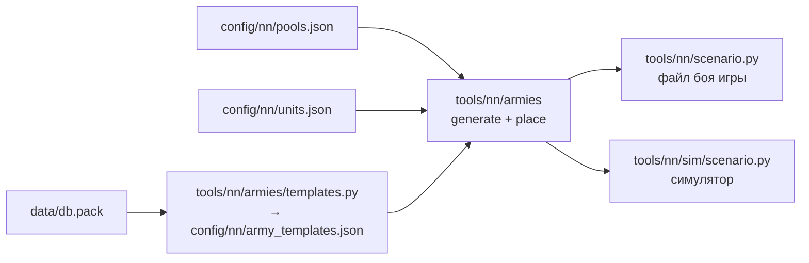

# Случайные армии

[← Назад](README.md) · [Документация](../README.md) › [Данные для обучения](README.md) › Случайные армии · [English](../../en/training/armies.md)

Генератор случайных боёв для обучения: две армии с равным бюджетом, у каждой лорд и
от 0 до 19 отрядов, уже расставленные. Один и тот же бой можно сыграть и в
[симуляторе](simulator.md), и в игре. Правила — из [модели сети](network.md#армии-и-правила-боя).

## Как получить

```bash
.venv/Scripts/python -m tools.nn.armies                       # 5 примеров и сводка по 10 000 боёв
.venv/Scripts/python -m tools.nn.armies --samples 3 --xml build/nn-armies   # + файл боя игры на каждый пример
bash tools/nn/dock.sh tools.nn.armies --samples 8 --stats 0 --sim         # + бой в симуляторе (torch)
py -3.14 -m tools.nn.armies.templates                         # шаблоны армий из базы игры
```



## Файлы

| Файл | Что |
|---|---|
| `config/nn/pools.json` | отряды каждой фракции для обучения, доля шаблонных армий (`mix`), ограничения (`caps`) |
| `config/nn/army_templates.json` | шаблоны армий фракций из базы игры (пишет `templates.py`) |
| `tools/nn/armies/pools.py` | пулы: паспорта отрядов, семейства, доли шаблонов |
| `tools/nn/armies/generate.py` | бюджет, покупка отрядов, бой по зерну |
| `tools/nn/armies/place.py` | расстановка |
| `tools/nn/armies/export.py` | файл боя игры, формат `arenas.json`, описания армий для симулятора |
| `tests/tools/test_nn_armies.py` | тесты (уровни 1–2, только numpy) |

## Как строится бой

1. **Фракции.** Каждая сторона берёт фракцию из списка независимо, поэтому бывают и
   зеркальные бои, и бои разных фракций.
2. **Бюджет B.** Log-равномерно между «лорд подороже и самый дешёвый отряд» и тем,
   что обе фракции могут выставить в 1 лорде и 19 отрядах. Бюджет берётся заново,
   пока обе стороны не могут его потратить.
3. **Покупка.** Каждая сторона тратит от 0,95·B до B вместе с лордом, поэтому
   стороны различаются не больше чем на 5%. Каждый отряд берётся, только если армия
   ещё может закончить внутри этого окна. Для этого есть таблицы numpy: что пул может
   купить за k отрядов. Поэтому сторона не срывается и не выходит за бюджет.
   - **Шаблонная армия** (75%, `mix.template`) — по одному из шаблонов фракции из базы
     игры, как их набирает ИИ. Покупает по долям шаблона, пока хватает бюджета.
     Число отрядов получается само. Есть ограничение `caps`.
   - **Случайная армия** (25%, `mix.random`) — как мог бы собрать человек, стаки тоже.
     Число отрядов берётся равномерно среди тех, что укладываются в бюджет, а
     предпочтения отрядов — случайные (Дирихле, α = 0,7): рой дешёвых, мало дорогих,
     одни стрелки. Ограничений нет.
4. **Расстановка** — ниже.

Бой определяется зерном: `battle(seed)`. Для обучения — зёрна `TRAIN_SEEDS`
(0 … 10⁹ − 1), для проверки — `EVAL_SEEDS` (10⁹ … 10⁹ + 10⁶ − 1). Диапазоны не
пересекаются, поэтому проверочные бои сеть при обучении не видит.

## Шаблоны армий из базы игры

Пропорции шаблонных армий — из генератора армий игры (`cdir_military_generator_*`,
«campaign director»). Таблицы читаются целиком до последнего байта
(`tools/nn/dbtables.decode`). Имена полей наши, по значениям.

| Таблица | Что в ней |
|---|---|
| `cdir_military_generator_template_priorities` | конфиг генератора → его шаблоны и вес (`WH_Empire` → `WH_Empire_land` … `_4`) |
| `cdir_military_generator_template_ratios` | шаблон → доля по группе отрядов (`..._melee_infantry_main_frontline_spears_high_quality` 20, …) |
| `cdir_military_generator_unit_qualities` | отряд → группа и ступень качества |
| `cdir_military_generator_unit_group_overrides` | группа → родительская группа |

- Те же шаблоны берёт и генератор сетевой игры: конфиг `WH_mp_Empire_land` ведёт на
  `WH_Empire_land` … `_4`.
- Конфиг фракции указан в `pools.json` (`generator`), по имени. Таблицу «фракция →
  конфиг» в базе не искали.
- **Семейство** группы — конец цепочки родителей: вся пехота ближнего боя сходится к
  `melee_infantry_trash`, стрелковая — к `ranged_infantry`. Доли шаблона суммируются по
  семействам, которые есть в пуле. Остальное (артиллерия, кавалерия, монстры, герои)
  отбрасывается, потом доли нормируются.
- Внутри семейства доля делится **поровну** между отрядами пула. Какой отряд семейства
  возьмёт ИИ игры, зависит от ступени качества (`tier_1_step_2` у рабов,
  `tier_1_step_4` у кланокрысов) и от того, насколько богата армия. Как генератор
  выбирает ступень, в таблицах нет. У нас дешёвое против дорогого решает бюджет.
- В игре не проверено, набирает ли ИИ кампании армии ровно по этим шаблонам. Это
  шаблоны генератора армий игры.

Доли по числу отрядов (лорд не входит), по каждому шаблону:

| Фракция | Шаблон | Копейщики | Лучники |
|---|---|---:|---:|
| Империя | `WH_Empire_land` | 62% | 38% |
| | `WH_Empire_land_2` | 67% | 33% |
| | `WH_Empire_land_3` | 62% | 38% |
| | `WH_Empire_land_4` | 57% | 43% |

| Фракция | Шаблон | Кланокрысы | Копейщики-рабы | Пращники-рабы |
|---|---|---:|---:|---:|
| Скавены | `WH_Skaven_land` | 31% | 31% | 38% |
| | `WH_Skaven_land_2` | 35% | 35% | 31% |
| | `WH_Skaven_land_3` | 33% | 33% | 33% |
| | `WH_Skaven_land_4` | 38% | 38% | 23% |
| | `WH_Skaven_land_5` | 31% | 31% | 38% |

## Ограничения

`caps` в `pools.json` — только для шаблонных армий: стрелков (`inf_ranged`) не больше
60% отрядов армии, лорд считается, округление вниз, но не меньше 1. При 20 отрядах —
не больше 12, при 5 — не больше 3, у лорда с одним отрядом этот отряд может быть
стрелком.

Почему 60%: шаблоны игры дают стрелкам 23–43%. Небольшая армия может отклониться от
долей случайно, а 60% оставляют не меньше 40% армии в ближнем бою, чтобы прикрыть
стрелков. Стрелковые стаки остаются в случайных армиях — против них сеть тоже должна
уметь играть.

## Расстановка

`place.py` ставит 1–20 отрядов стороны в линии, в том же формате, что
`config/nn/arenas.json`: `forward` — к врагу, `lateral` — вправо, точка отряда — центр
его фронта.

- Спереди линии ближнего боя, за ними линии стрелков, лорд позади всех по центру.
- В линии между отрядами 6 м (как у копейщиков арены: 30 м фронта, 36 м между
  центрами). Между линиями — глубина строя плюс 15 м. Самые дорогие отряды — в
  середине линии.
- Линия не шире зоны расстановки без 5 м с краёв (300 м → 290 м: 8 отрядов по 30 м).
- Всё внутри зоны расстановки `tools/nn/scenario.py`: `forward` от 40 − 300 до 40,
  `lateral` ±150. Разрыв между сторонами — из `arena.json` (350 м). Самая глубокая
  армия (3 линии ближнего боя, 2 стрелков) кончается лордом около −140 м.
- Ширина отряда — из `pools.json` (как в аренах: копейщики и рабы 30 м, лучники 40,
  пращники 35), иначе бойцы / `rank_depth` × 1,5 м.

## Сводка по 10 000 боёв

`python -m tools.nn.armies`, зёрна 5 … 10 004:

| Что | Значение |
|---|---|
| Зеркальные бои | 50% |
| Армии: шаблонные / случайные | 75% / 25% |
| Бюджет | 676 … 6900, медиана 2935 |
| Отрядов у стороны (без лорда) | в среднем 9,5; 1–4: 23%, 5–9: 32%, 10–14: 22%, 15–18: 14%, 19: 9% |
| Разница цены сторон | в среднем 1,5%, не больше 5,0% |
| У одной стороны в x раз больше отрядов | x ≥ 1,5: 27%; x ≥ 2: 6,1%; x ≥ 3: 0,8% |
| Доля стрелков у стороны | в среднем 33%; нет стрелков: 16%; ≥ 50%: 27%; только стрелки: 2,9% |
| Шаблонные армии Империи | копейщики 64%, лучники 36% |
| Шаблонные армии скавенов | кланокрысы 39%, рабы 32%, пращники 29% |

Равный бюджет — не равная сила ([замеры](measurements.md): у скавенов 1601 боец против
661 у Империи). Это нормально: сеть учится играть за любую сторону.

Восемь первых боёв прогнаны в симуляторе (`--sim`: все отряды атакуют ближайшего
врага): все закончились за 250–540 с. Если поменять стороны местами, в 13 боях из
16 побеждает та же армия.

## Для обучения

```python
from tools.nn.armies import generate, export
from tools.nn.sim import scenario

arenas = [generate.battle(seed) for seed in seeds]          # seeds из generate.TRAIN_SEEDS
armies = export.to_sim(arenas, "attack")                    # "defend": атакует сторона 2
st = scenario.build(armies, per_side=generate.MAX_UNITS + 1)
```

- `generate.generate(rng, factions=None, budget_range=None, max_units=None, sides=None)` —
  то же со своим генератором случайных чисел. `max_units=5` и `budget_range` дают
  маленькие армии для начала обучения. `factions` — список фракций, `sides` —
  фракции сторон явно.
- `per_side` должен быть 20: столько отрядов у стороны может быть.
- `export.to_sim` пишет бои во временный `arenas.json` и зовёт
  `tools/nn/sim/scenario.from_arena`. Когда `from_arena` научится брать словарь арены,
  временный файл станет не нужен.
- Бой в игре: `export.scenario_xml(arena)` — файл боя, `export.write_arenas` —
  `arenas.json`. Сборка боя: `python -m tools.build nn-arena --army-seed N` ([сборка](../launch/build.md#параметры),
  [проверка сети в игре](../launch/gate.md)).

## Новый отряд или фракция

1. Паспорт отряда — в `config/nn/units.json` (`py -3.14 -m tools.nn.units --units …`).
2. Запись в `config/nn/pools.json`: `key`, `slot`, `width`; у новой фракции ещё
   `lord` и `generator`.
3. `py -3.14 -m tools.nn.armies.templates` — отряду нужна группа генератора.
4. Новая категория (кавалерия, монстры) — по желанию своё ограничение в `caps`.
