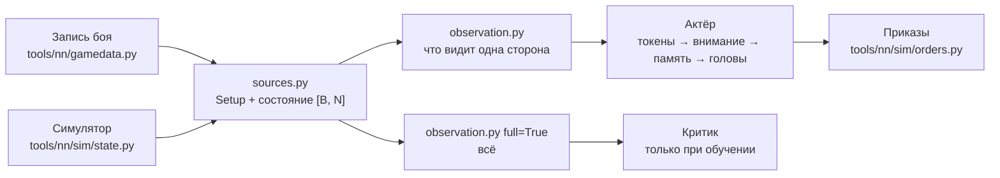
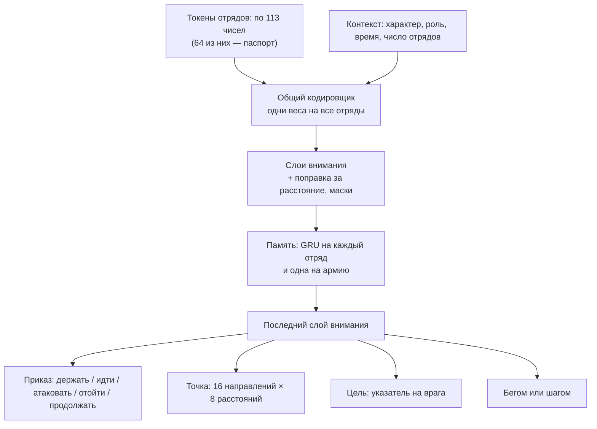

# Вход и устройство сети

[← Назад](README.md) · [Документация](../README.md) › [Данные для обучения](README.md) › Вход и устройство сети · [English](../../en/training/model.md)

Что сеть получает на вход и как она устроена — в коде, по замыслу из
[модели сети](network.md). Обучения пока нет: веса случайные. Код — `tools/nn/model/` (PyTorch; сводка стороны
работает и на обычном numpy).

## Правило: ИИ видит только то, что видит человек

`observation.observe(state, setup, side, memory)` строит вход одной стороны. Один и тот же
код берёт запись боя и пачку боёв симулятора: у обоих поля записанного `nn_sample`
([что в записи](README.md#что-в-записи)).

- **Свои отряды** — всё, и точную мораль тоже.
- **Вражеские отряды** — только пока видны: место, направление, скорость, бойцы и здоровье,
  что делают, и **состояние** морали. Точный процент морали на вход не попадает никогда
  (это проверяет тест).
- **Враг не виден** — последнее место, где его видели, и сколько секунд назад. Ни разу не
  виден — только его паспорт (армию врага показывают до боя).
- **Своя система координат.** Начало — центр карты; «вперёд» — от своей армии к армии врага
  в начале боя; «вбок» — вправо. Если повернуть мир на 180° и поменять стороны местами, вход
  не изменится (это проверяет тест). Поэтому одна сеть играет за обе стороны.
- **Видимость.** Симулятор даёт `vis` (виден другой стороне). В записях видимости нет: карта
  ровная и пустая, поэтому все отряды считаются видимыми.

### До боя (не меняется)

| Вход | Кто видит | Масштаб |
|---|---|---|
| Паспорт каждого отряда, своего и чужого ([паспорта](units.md)): бойцы, здоровье, масса, скорости, атака, защита, натиск, урон и бонусы оружия, броня, щит, лидерство, защита от урона, стрельба (дальность, снаряды, урон, перезарядка, меткость), цена, каста, размер, свойства | обе стороны | ~0–1; широкие числа (здоровье, масса, цена, урон) в логарифме; каста, размер, свойства — 0/1 |
| Ранг опыта | обе стороны | ранг / 9 |
| Характер фракции (5 чисел, `config/nn/factions.json`) | своя сторона | 0–1 как записано |
| Роль: атака или оборона | своя сторона | 0/1 |
| Уровень лорда, своего и чужого | обе | уровень / 50 |
| Размер карты | обе | м / 2000; у каждого отряда ещё расстояние до края впереди, сзади, справа и слева (м / 1000) |

Числа характера — **заглушки** (Империя и скавены); окончательные выбирает автор по лору.

### В бою (каждый отряд, каждое решение)

| Вход | Свой отряд | Враг виден | Враг не виден | Масштаб |
|---|---|---|---|---|
| Место (вперёд, вбок) | да | да | последнее известное | м / 500 |
| Направление | да | да | — | cos, sin угла к «вперёд» |
| Скорость (вперёд, вбок) | да | да | — | м/с / 5, по двум решениям |
| Бойцы, здоровье | да | да | — | доля от начала |
| Состояние морали: стоит, колеблется, бежит, разбит | да | да | — | 0/1 |
| В рукопашной, идёт, бежит бегом, стреляет | да | да | — | 0/1 |
| Расстояние до краёв карты | да | да | от последнего места | м / 1000 |
| Точная мораль (`MoralePercent`) | да | **нет** | — | / 2, не больше ±1,5 |
| Подробное состояние морали 1–7 | да | **нет** | — | 0/1 |
| Стрелы, убито врагов | да | нет | — | доля от начала; убитые / 200 |
| Усталость (6 состояний), известна ли | да | нет | — | 0/1 |
| Точка приказа, есть ли приказ, есть ли цель | да | нет | — | м / 500; 0/1 |
| Угроза левому флангу, правому, тылу | да | нет | — | 0/1 |
| Свой или чужой, виден сейчас, виден хоть раз, давность | да | да | да | 0/1; давность с / 60, не больше 1 |

Состояния морали игры 1–4 (рвётся в бой … дрогнул) у врага все — «стоит»: иначе по ним
можно узнать точную мораль.

Ещё на каждое решение: время боя (с / 3600, предел 60 минут) и число своих живых отрядов и
известных вражеских (/ 20).

Вход критика (`full=True`) заполняет все поля у всех отрядов, без видимости, и добавляет
характер врага. Он только для обучения.

## Устройство

- **Токены.** Один токен на отряд, свой и чужой, с одним кодировщиком: новый отряд сеть
  понимает по паспорту, а не по названию. Контекст (характер, роль, время) прибавляется к
  каждому токену и сам — отдельный токен.
- **Внимание** (3–4 слоя): каждый отряд «смотрит» на остальных. Маски: пустые места, свои
  погибшие отряды и враги, которых видели уничтоженными, не видны никому. Выученная поправка
  по расстоянию между двумя отрядами (16 корзин, от 0 до ~1500 м) на каждую голову внимания
  помогает понять, кто рядом. Невидимые враги остаются во внимании с последним местом.
- **Память: GRU на каждый токен**, перед последним слоем внимания. Выбрана вместо внимания
  к прошлым кадрам: цена решения не растёт с памятью; состояние — один вектор на отряд, его
  легко хранить между решениями, и оно одинаково на всех компьютерах в коопе; горизонт
  10–20 с (20–80 решений при 2–4 в секунду) сеть выучивает сама, а не задаёт буфер.
- **Головы** для каждого своего отряда, который принимает приказы (живой, не бежит):
  - вид приказа; «атаковать» — только если есть видимый живой враг; «продолжать» — нового
    приказа нет, действующий идёт дальше (сеть не дёргает отряд каждое решение);
  - точка для «идти» и «отойти»: одно из 16 направлений в системе стороны (0 — к врагу) ×
    8 расстояний от отряда, 10–400 м в логарифме, внутри карты. Корзины, а не нормальное
    распределение: у выбора может быть несколько пиков («левый фланг или правый»), он
    переживает int8, а лучшая корзина находится без случайности;
  - цель: указатель на видимого живого врага (запрос отряда против ключа каждого врага), как
    в AlphaStar;
  - бегом или шагом.
- **Добавки LoRA** на пару «фракция + роль» в слоях внимания и прямых слоях (`lora_rank`,
  по умолчанию выключены). Добавка вначале ничего не меняет; `lora.freeze_base` оставляет
  для обучения только добавки.
- **Критик** (только обучение): свой кодировщик и внимание на полном входе; средние по своим
  и по чужим отрядам и токен контекста → ценность боя для стороны.

Приказы выходят в формате симулятора (`tools/nn/sim/orders.py`): `kind`, `x`, `z`, `target`,
`run` [B, N] по местам состояния. Отряды другой стороны, погибшие и бегущие — «держать».

## Размер

`tools/nn/model/config.py`, подсчёт — `bash tools/nn/dock.sh tools.nn.model.bench`:

| Вариант | Ширина | Слоёв внимания | Актёр | Критик (только обучение) | Одна добавка LoRA, ранг 8 |
|---|---:|---:|---:|---:|---:|
| `small` | 128 | 3 | 0,78 млн | 0,69 млн | 0,05 млн |
| `target` | 512 | 4 | 14,98 млн | 20,30 млн (6 слоёв) | 0,26 млн |

## Скорость

Одно решение одной стороны, 20 на 20 отрядов, случайные веса, медиана из 50
(`bash tools/nn/dock.sh tools.nn.model.bench`, 30.09.2026). «Решение» = сводка + сеть +
выбор + приказы; «сеть» — только сама сеть.

| Где | `small`: решение / сеть | `target`: решение / сеть |
|---|---:|---:|
| Процессор, 1 поток | 3,5 / 1,4 мс | 16,9 / 14,6 мс |
| Процессор, 4 потока | 3,2 / 0,9 мс | 7,6 / 5,2 мс |
| Видеокарта RTX 5070 Ti, 1 бой | 13,3 / 2,0 мс | 12,8 / 4,6 мс |
| Видеокарта, 256 боёв сразу (обучение) | 13,0 мс (51 мкс на бой) | 28,8 мс (113 мкс на бой) |

- В игре бой один: видеокарта не быстрее процессора, она ждёт запуска множества мелких
  операций. Сеть `target` на 4 потоках процессора — ~8 мс на решение: при 4 решениях в
  секунду это ~3% времени этих потоков, видеокарта не нужна. На видеокарте та же нагрузка —
  ~5% времени, и даже тогда она почти простаивает: с большим запасом в бюджете ≤ 20%.
- При обучении видеокарта окупается: 256 боёв за 29 мс.

## Одинаковые решения в коопе: int8

В коопе каждый компьютер должен получить точно такой же приказ
([модель сети](network.md#кооператив)). Выгрузка актёра в int8 выглядит выполнимой; пока не
сделана:

- основная работа — умножения матриц (линейные слои, внимание, GRU): веса и значения в int8,
  суммы в int32 дают одинаковый результат на любом процессоре;
- LayerNorm, softmax, GELU, sigmoid и tanh нужны в целых числах (таблицы или многочлены, как
  в I-BERT, Kim и др., 2021). Это главная работа;
- головы дискретные (вид приказа, корзина точки, указатель, бег), поэтому маленькая разница
  округления меняет выбор только при точной ничьей; ничья — в пользу меньшего номера;
- случайность: выбор по целым логитам с зерном из `bm:random_number()`;
- память (состояние GRU) тоже должна храниться в целых, иначе за долгий бой она разойдётся
  между компьютерами.

## Тесты

- `tests/tools/test_nn_observation.py` (numpy, работает в `.venv`): система координат,
  масштабы, пустые места; точная мораль врага не попадает на вход; у невидимого врага только
  последнее место; симметрия сторон; порядок отрядов; записанные бои.
- `tests/tools/test_nn_model.py` (torch; в `.venv` пропускается, запускается в контейнере):
  numpy и torch дают одинаковый вход; цель — только видимый живой враг; перестановка отрядов
  переставляет выходы; память; добавки; логарифмы вероятностей; точки внутри карты; критик;
  размеры вариантов; записанные бои и состояние симулятора → приказы.

В образе `snake-ai-trainer` нет pytest. Тесты torch запускали с pytest из `.venv` (чистый
Python), подключённым через `PYTHONPATH` в контейнере.
