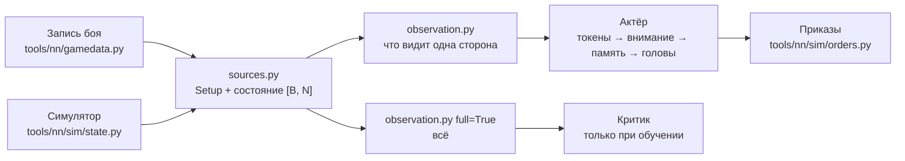
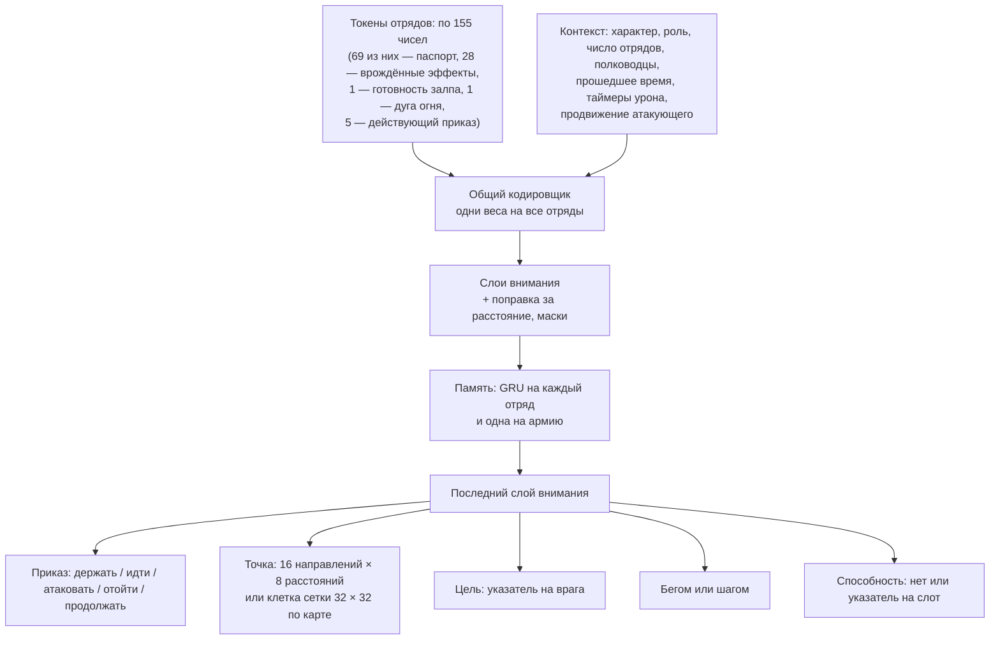
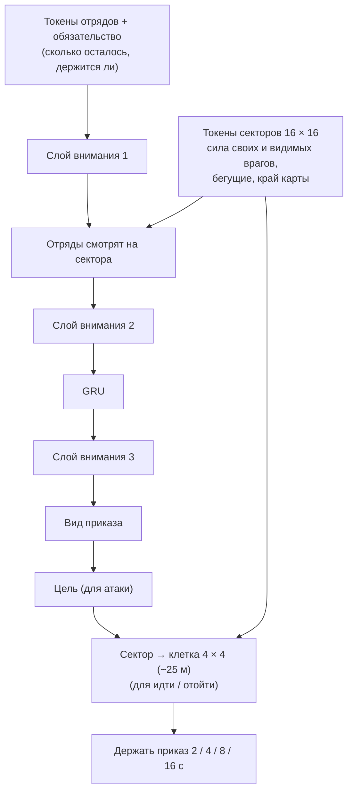

# Вход и устройство сети

[← Назад](README.md) · [Документация](../README.md) › [Данные для обучения](README.md) › Вход и устройство сети · [English](../../en/training/model.md)

Что сеть получает на вход и как она устроена — в коде, по замыслу из
[модели сети](network.md); учится она в симуляторе ([обучение](training.md)). Код — `tools/nn/model/` (PyTorch; сводка стороны
работает и на обычном numpy).



## Правило: ИИ видит только то, что видит человек

`observation.observe(state, setup, side, memory)` строит вход одной стороны. Один и тот же
код берёт запись боя и пачку боёв симулятора: у обоих поля записанного `nn_sample`
([что в записи](README.md#что-в-записи)).

- **Свои отряды** — всё, и точную мораль тоже.
- **Вражеские отряды** — только пока видны: место, направление, скорость, бойцы и здоровье,
  что делают, и **состояние** морали. Точный процент морали на вход не попадает никогда
  (это проверяет тест).
- **Враг не виден** — последнее место, где его видели, и сколько секунд назад. Ни разу не
  виден — только его паспорт (армию врага показывают до боя).
- **Своя система координат.** Начало — центр карты; «вперёд» — от своей армии к армии врага
  в начале боя; «вбок» — вправо. Если повернуть мир на 180° и поменять стороны местами, вход
  не изменится (это проверяет тест). Поэтому одна сеть играет за обе стороны.
- **Видимость.** Симулятор даёт `vis` (виден другой стороне). В записях видимости нет: карта
  ровная и пустая, поэтому все отряды считаются видимыми.

### До боя (не меняется)

| Вход | Кто видит | Масштаб |
|---|---|---|
| Паспорт каждого отряда, своего и чужого ([паспорта](units.md)): бойцы, здоровье, масса, скорости, атака, защита, натиск, урон и бонусы оружия, броня, щит, лидерство, защита от урона, стрельба (дальность, снаряды, урон, перезарядка, меткость; в конце: настильный огонь, разброс, скорость снаряда), цена, каста, размер, свойства (несокрушимый, стрельба на ходу, …) | обе стороны | ~0–1; широкие числа (здоровье, масса, цена, урон) в логарифме; каста, размер, свойства — 0/1 |
| Дуга огня (после готовности залпа; [ниже](#дуга-огня-оба-отряда)) | обе стороны | дуга в каждую сторону / 180°: 1,0 у метательных звёзд Бегущих ночью, 0,17 у луков, пращей, арбалетов, аркебуз; 0 без метательного оружия |
| Действующий приказ (конец токена; [ниже](#действующий-приказ-свои-отряды-последние-входы-токена)) | только свои | вид (держать / идти / атаковать / отойти) 0/1; сколько он действует, с / 60, не больше 1 |
| Ранг опыта | обе стороны | ранг / 9 |
| Характер фракции (5 чисел, `config/nn/factions.json`) | своя сторона | 0–1 как записано |
| Роль: атака или оборона | своя сторона | 0/1 |
| Уровень лорда, своего и чужого | обе | уровень / 50 |
| Размер карты | обе | м / 2000; у каждого отряда ещё расстояние до края впереди, сзади, справа и слева (м / 1000) |

Числа характера — **заглушки** (Империя и скавены); окончательные выбирает автор по лору.

### В бою (каждый отряд, каждое решение)

| Вход | Свой отряд | Враг виден | Враг не виден | Масштаб |
|---|---|---|---|---|
| Место (вперёд, вбок) | да | да | последнее известное | м / 500 |
| Направление | да | да | — | cos, sin угла к «вперёд» |
| Скорость (вперёд, вбок) | да | да | — | м/с / 5, по двум решениям |
| Бойцы, здоровье | да | да | — | доля от начала |
| Состояние морали: стоит, колеблется, бежит, разбит | да | да | — | 0/1 |
| В рукопашной, идёт, бежит бегом, стреляет | да | да | — | 0/1 |
| Расстояние до краёв карты | да | да | от последнего места | м / 1000 |
| Точная мораль (`MoralePercent`) | да | **нет** | — | / 2, не больше ±1,5 |
| Подробное состояние морали 1–7 | да | **нет** | — | 0/1 |
| Стрелы, убито врагов | да | нет | — | доля от начала; убитые / 200 |
| Готовность залпа: секунды с последнего уменьшения боезапаса (последнего залпа) / перезарядка по паспорту ([ниже](#готовность-залпа-свои-отряды)) | да | нет | — | 0–1; 1 до первого выстрела; 0 без метательного оружия |
| Усталость (6 состояний), известна ли | да | нет | — | 0/1 |
| Точка приказа, есть ли приказ, есть ли цель | да | нет | — | м / 500; 0/1 |
| Угроза левому флангу, правому, тылу | да | нет | — | 0/1 |
| Свой или чужой, виден сейчас, виден хоть раз, давность | да | да | да | 0/1; давность с / 60, не больше 1 |
| Недавно дрался в рукопашной, недавно бежал | да | да (если тогда был виден) | — | 1 сейчас, к 0 за 120 с; 0 — не было |

Состояния морали игры 1–4 (рвётся в бой … дрогнул) у врага все — «стоит»: иначе по ним
можно узнать точную мораль.

Ещё на каждое решение — контекст стороны:

| Вход (контекст) | Масштаб |
|---|---|
| Число своих живых отрядов и известных вражеских | / 20 |
| Убит ли свой полководец и как давно; вражеский так же | 0/1; 1 сейчас, к 0 за 120 с |
| Сколько идёт бой (точные часы для первых минут) | log(1 + с / 30) / log(21): 0,23 на 30 с, 0,59 на 150 с, 1 с 10 минут |
| Наносили ли мы уже урон; сколько секунд с нашего последнего урона | 0/1; с / 300, не больше 1 (0 до первого) |
| Наносил ли нам урон враг; сколько секунд с его последнего урона | 0/1; с / 300, не больше 1 (0 до первого) |
| Продвижение атакующего (видят обе стороны): темп его урона; достигал ли он 0,05; сколько секунд с тех пор, как был не ниже 0,05 | темп / 0,05, не больше 4; 0/1; с / 300, не больше 1 (0 до того) |

Игра объявляет гибель полководца, поэтому о вражеском сеть знает, даже если его не видела.

Ничто на входе (и на входе критика) не говорит о пределе времени боя: в кампании его может не
быть. Даётся только прошедшее время; прежний столбец `t / 3600` (тот же предел в 60 минут,
только скрытый) убран.

Таймеры урона (`observation.TIMERS`) — то, что видит игрок: свои отряды в бою, счётчики убитых
и полосу соотношения сил. Сторона нанесла урон, если какой-то отряд другой стороны потерял
здоровье (`hp` упало) с прошлого решения: любые отряды, видимые и нет (полоса показывает итог);
отряд с неизвестным здоровьем (NaN) ничего не даёт, пока его снова не узнают. Память хранит
прошлое здоровье (`Memory.prev_hp`) и время последнего урона каждой стороны (`Memory.hit_t`),
поэтому симулятор, записанные бои (замеры раз в секунду) и компаньон (состояния, которые шлёт
игра) считаются одним правилом. В обучении это тот же урон атакующего, что и в награде
(`reward.struck`, `rollout.Battles.last_hit`: здоровье защитника упало за шаг): атакующий видит
его как «мы нанесли», защитник — как «враг нанёс».

Продвижение атакующего (`observation.PROGRESS`) — это часы штрафа за простой в награде при
`--idle-rate` ([обучение](training.md)): актёр и критик видят то состояние, от которого этот
штраф зависит. Темп урона атакующего — золото, потерянное защитником (`observation.gold_lost`:
цена отряда × доля потерянного здоровья; бегущий отряд теряет ещё половину оставшегося, убитый,
рассеянный или ушедший с карты — всё; один раз, как `reward.gold_lost`: только сверх худшей потери
отряда, так что сплочение — не урон, а бегство после сплочения ничего нового не добавляет), в доле бюджета (среднего из цен двух
армий) за минуту, экспоненциальное среднее за 30 с; на входе этот темп / 0,05 (1 на пороге),
достигал ли он уже 0,05 и сколько секунд с последнего раза (`last_hit` награды: по нему растёт
множитель простоя m). Видят обе стороны. Считается по здоровью и состоянию всех отрядов (отряд с
неизвестным здоровьем ничего не даёт, пока его снова не узнают) и цене из паспортов
(`Setup.cost`), с временем между наблюдениями, в памяти (`Memory.prev_gold` — худшая потеря каждого отряда, `rate`, `rate_t`):
наблюдение симулятора и компаньона (состояния игры; ушедший с карты отряд там без бойцов, в
симуляторе — `gone`) — одно правило. Это часы награды, пока `--idle-rate`, `--idle-window` и доля
бегущего — 0,05, 30 с и 0,5 (`observation.RATE_MIN`, `RATE_WINDOW`, `ROUT_SHARE`); иначе
`rollout.Battles` предупреждает.

Контрольная точка, записанная до этих входов (со столбцом `t / 3600`), загружается как есть
(`encoder.TokenEncoder`): веса этого столбца отбрасываются, веса новых входов вначале нулевые,
и сеть действует ровно так же, как раньше при времени боя 0. Записанная до входов продвижения
загружается с нулевыми весами для них (они вставлены после таймеров урона; характер врага у
критика сохраняет свои веса) и действует ровно так же. Что меняет отказ от настоящего
`t / 3600` (24 боя в симуляторе против `ai_like`, 20 минут, жадный выбор каждого
отряда, который принимает приказы, раз в 5 с, у каждой сети своя память): у
`test5/t0_gold30/m20.pt` вид приказа совпал в 99,92% (35 487 выборов), цель атаки в 99,92%,
точка движения в 99,96%; у `runs/long_ai/best.pt` — 99,93%, 99,93%, 99,92%; меньше всего по минутам боя
99,7% (m20, 6-я минута).

Вход критика (`full=True`) заполняет все поля у всех отрядов, без видимости, и добавляет
характер врага. Он только для обучения.

### Способности (каждый отряд, каждый его слот способности)

Способность известна по тому, что она делает, а не по имени: её **паспорт**
(`config/nn/abilities.json`, пишет `py -3.14 -m tools.nn.abilities` из базы игры; признаки —
`tools/nn/model/abilities.py`). Новой способности нового лорда нужен паспорт, а не новая сеть. У
отряда до 3 слотов (`tools/nn/sim/abilities.py` `slot_keys`, те же в симуляторе): сначала
активные, потом пассивные, достающие до других отрядов, потом остальные, в группе — по ключу.
Генерал: Foe Seeker, Stand Your Ground, Hold the Line; Варлорд: Verminous Valour, Deadly
Onslaught, Rally.

| Вход (на слот, `Obs.abil` [B, N, 3, 114]) | Свой | Враг виден | Враг не виден | Масштаб |
|---|---|---|---|---|
| Есть | да | да | да | 0/1 |
| Готова сейчас | да | нет | нет | 0/1 |
| Секунд до готовности | да | нет | нет | с / 60, до 3 |
| Секунд действия осталось | да | нет | нет | с / 30, до 2 |
| Действует сейчас | да | да | нет | 0/1 |
| Паспорт: пассивная, время действия и перезарядки, число применений, радиус, на себя, сколько своих / врагов задевает, цели (себя, своих, врагов) | да | да | да | с / 60, с / 120, м / 100, 0/1 |
| Паспорт: эффекты на своих (владельца и его соседей) и на врагов: 28 параметров базы (скорость, скорость натиска, атака и защита в ближнем бою, урон и бронебойный урон, бонус натиска, боевой дух, броня, сопротивления, урон стрелков, перезарядка, точность, дальность, бонус против больших / пехоты, масса, …) и 15 атрибутов (несокрушимый, иммунитет к психологии, вызывает страх, …) | да | да | да | множители как значение − 1; прибавки / 50 или / 100; атрибуты 0/1 |
| Паспорт: когда (в конце): игра включает само (`auto`), при проигрыше рукопашной / в рукопашной, выключено вне рукопашной / ниже половины морали / когда не колеблется / ниже половины здоровья, другое условие | да | да | да | 0/1 |

Почему у врага: игрок видит карточки вражеской армии до боя (способности на них), а в бою
игра рисует эффект действующей способности на отряде и перечисляет её среди действующих эффектов
отряда (CCO `ActiveEffectList`, его читает мост). Таймеры врага нигде не показаны — их не даём.
`Obs.abil_ok` [B, N, 3]: свои способности, которые сеть может применить сейчас — есть, активная
(не пассивная), на себя (на владельца, цель выбирать не надо), готова (не действует, перезаряжена)
и отряд принимает приказы (жив, не бежит). Без таймеров в состоянии (записи) готового нет.

### Врождённые эффекты (каждый отряд, каждый эффект каталога)

Каждое свойство и пассивная или включаемая игрой способность отряда — врождённый эффект одного
каталога (`config/nn/effects.json`, [паспорта отрядов](units.md#врождённые-эффекты)); токен
кончается парой входов на эффект в порядке каталога `order`, который только дописывается
(14 эффектов, 28 входов; `tools/nn/model/effects.py`):

| Вход (на эффект) | Свой отряд | Враг виден | Враг не виден | Шкала |
|---|---|---|---|---|
| Есть | да | да | да | 0/1 |
| Действует сейчас (условия выполнены: «Сила в числе» выше половины здоровья, «Удирай!» при колебании, Frenzy выше половины морали, 20 с Penitent, свойство — всегда) | да | да | нет | 0/1 |

«Есть» — на карточке отряда (карточки обеих армий видны до боя); действующие эффекты видимого
отряда игра перечисляет (CCO `ActiveEffectList`). В симуляторе «действует» — его `fx_on`; в
записанном бою и в игре (компаньон) — выводится из полей самого токена по тем же условиям
(здоровье, состояние морали, рукопашная; своя мораль — для половины морали), а эффект с временем,
чей таймер неизвестен (Penitent), считается выключенным. Новый эффект дописывает свою пару в конец
токена (перед входом залпа, ниже): старая сеть грузится с нулевыми весами для неё
(`encoder.pad_inputs`) и действует как раньше.

### Готовность залпа (свои отряды)

Навык кайтинга — «остановиться, когда залп готов, бежать, пока перезаряжаются», а в токене больше
ничто не говорит, когда стрелки перезарядились. Один вход (`volley_ready`, `observation.VOLLEY`,
03.10.2026): секунды с тех пор, как боезапас отряда (`a`) последний раз уменьшился между двумя
наблюдениями (его последний залп), делённые на `reload_s` из паспорта, в пределах 0..1. 1 до первого
выстрела, 0 у отряда без метательного оружия; только свои отряды (критик видит все).

Считается в `observation.observe` только по `a` в моменты решений (память хранит последнее чтение и
время последнего уменьшения: `Memory.prev_ammo`, `volley_t`), поэтому симулятор (его счётчик
боезапаса, прочитанный с шагом решений сети 1 с, а не на физических шагах 0,5 с) и компаньон
(`ammo_left()` моста каждую секунду) считают его одним кодом по одинаковым выборкам; пропущенное
чтение ничего не меняет. Вход дописан после врождённых эффектов: чекпойнт, сохранённый до него,
малый или широкий, грузится с нулевыми весами для него и действует как раньше (`encoder.pad_inputs`;
проверены широкие `test5/w3_kiting30/m15.pt` и `wide/w0.pt` и малый `test5/r7_lostworst/m15.pt`).

Что он показывает, в двух мирах немного различается — из-за их стрельбы, не из-за входа:

- шкала — перезарядка из паспорта (Ночные бегуны 8 с), а бойцы симулятора полностью заряжены только
  через его измеренную перезарядку (missile.py: 10,2 с для них): 1 значит «перезарядка по паспорту
  прошла»;
- в симуляторе отряд, который стоит и стреляет дальше, после первого залпа стреляет ровным темпом
  бойцы / перезарядку (боезапас уменьшается каждую секунду), и вход остаётся 0, пока отряд не
  двинется; игра стреляет залпами всего отряда через перезарядку ([измерения](measurements.md)),
  поэтому там он идёт 0 → 1 между залпами и стоя. Пока отряд бежит (упражнение кайтинга), в обоих
  мирах он растёт одинаково.

### Дуга огня (оба отряда)

Один вход (`fire_arc`, `observation.ARC`, 07.10.2026): дуга огня бойца в каждую сторону из паспорта
(`missile.fire_arc_deg`, база `battle_entities.fire_arc_close` / 2), делённая на 180°. У метательных звёзд
Бегущих ночью он 1,0: они бьют во все стороны и на ходу (сущность `..._fast_360`), у луков, пращей, арбалетов и
аркебуз 0,17 (±30°), у ополчения 0,19 (±35°), у отряда без метательного оружия 0. Без этого входа сеть не
отличит звёзды от пращи по тому, куда отряд может стрелять. Это знание с карточки отряда — видят обе стороны.

Вход стоит в самом конце токена, после готовности залпа, а не среди признаков паспорта: так столбцы до него
не сдвигаются, и чекпойнт, сохранённый до него, грузится с нулевыми весами для него и действует как раньше
(`encoder.pad_inputs`; проверен `test5/s44_defonly/m20.pt`, последний шаг цепочки до входа, — те же логиты,
память, приказы и ценность, `tests/tools/test_nn_model.py`).

### Действующий приказ (свои отряды, последние входы токена)

Пять входов (`observation.ORDER`, 07.10.2026): вид приказа, который сейчас действует у отряда (держать, идти,
атаковать, отойти — по одному 0/1), и сколько секунд он уже действует, делённое на 60 (не больше 1). Новым
приказ считается, как в награде: другой вид, другая цель атаки или точка дальше 10 м от прежней. Повтор того же
приказа и «продолжать» часы не сбрасывают. Без этих входов сеть не знала, давно ли отряд идёт к точке, и
каждую секунду переотдавала «идти вперёд» (дрейф, `build/drift`).

Откуда: поля состояния `order_kind`, `order_target` (симулятор — приказ в силе; компаньон — последний
отданный приказ, `exchange.order_points`) и точка приказа `ox`, `oz`; часы — в памяти наблюдения
(`Memory.ord_*`). Нет полей (записанные бои) — все пять входов 0. Старый чекпойнт грузится с нулевыми весами
для них и действует как раньше.

## Устройство



- **Токены.** Один токен на отряд, свой и чужой, с одним кодировщиком: новый отряд сеть
  понимает по паспорту, а не по названию. Контекст (характер, роль, таймеры) прибавляется к
  каждому токену и сам — отдельный токен. Каждый слот способности проходит через одну общую
  маленькую сеть (`AbilityEncoder`); сумма по слотам, которые у отряда есть, прибавляется к его
  токену, так что порядок слотов не важен. Её последний слой вначале нулевой: актёр, обученный
  до способностей, видит ровно то же, что видел.
- **Внимание** (3–4 слоя): каждый отряд «смотрит» на остальных. Маски: пустые места, свои
  погибшие отряды и враги, которых видели уничтоженными, не видны никому. Выученная поправка
  по расстоянию между двумя отрядами (16 корзин, от 0 до ~1500 м) на каждую голову внимания
  помогает понять, кто рядом. Невидимые враги остаются во внимании с последним местом.
- **Память: GRU на каждый токен**, перед последним слоем внимания. Обучение прогоняет её через
  куски по 64 решения (64 с боя при ритме игры — решение в секунду) ([обучение](training.md)). Выбрана вместо внимания
  к прошлым кадрам: цена решения не растёт с памятью; состояние — один вектор на отряд, его
  легко хранить между решениями, и оно одинаково на всех компьютерах в коопе; горизонт
  10–20 с (10–20 решений при одном в секунду) сеть выучивает сама, а не задаёт буфер.
- **Головы** для каждого своего отряда, который принимает приказы (живой, не бежит):
  - вид приказа; «атаковать» — только если есть видимый живой враг; «продолжать» — нового
    приказа нет, действующий идёт дальше (сеть не дёргает отряд каждое решение);
  - точка для «идти» и «отойти»: одно из 16 направлений в системе стороны (0 — к врагу) ×
    8 расстояний от отряда, 10–400 м в логарифме, внутри карты. Корзины, а не нормальное
    распределение: у выбора может быть несколько пиков («левый фланг или правый»), он
    переживает int8, а лучшая корзина находится без случайности;
  - **сетка по карте** (опция модели `grid`, обучение `--grid 32`) вместо корзин: точка — центр одной из
    32 × 32 клеток квадрата ±800 м вокруг центра карты в системе стороны. Система стороны застывает в начале
    боя, поэтому клетка — одно и то же место на карте весь бой: повтор той же клетки — тот же приказ, и
    награда его не штрафует. С корзинами «вперёд 30 м от себя» каждую секунду — каждый раз новая точка в
    1–3 м от прежней (за смену не считалась), и отряды уходили на 1–2 км (дрейф, `build/drift`). Логиты клеток:
    запрос отряда против выученного ключа каждой клетки минус выученный вес отряда (softplus, в начале 1) ×
    расстояние от отряда до клетки в клетках — новая голова сначала предпочитает ближние клетки. Чекпойнт с
    корзинами грузится в такую сеть (`run.with_grid`): всё, кроме головы точки, берётся из него, голова
    сетки — с нуля. Якорь KL считается только по виду приказа и цели, поэтому опорная сеть может быть с
    корзинами. Учитель переводит точку скрипта в ближайшую клетку. Компаньону флаг не нужен: сетка
    записана в конфигурации чекпойнта;
  - цель: указатель на видимого живого врага (запрос отряда против ключа каждого врага), как
    в AlphaStar;
  - бегом или шагом;
  - способность: «нет» или указатель на один из слотов отряда (запрос отряда против ключа из
    состояния и паспорта каждого слота), только слоты из `abil_ok`. Не зависит от вида приказа
    (лорд может идти и применить способность сразу). Перестановка слотов переставляет выбор;
    невиданная раньше способность тоже получает правильный выбор (тесты). Выбирается только по
    просьбе (`heads.sample(..., abilities=True)`; `decide.act` просит): пока обучение не знает
    эту голову, `Action.ability` = `None`, и `log_prob` её не считает.
- **Загрузка старого актёра.** `Actor.load_state_dict` принимает состояние без частей для
  способностей (`policy.ABILITY_PARAMS`): они начинаются заново — кодировщик ничего не добавляет,
  голова выбирает случайно среди готовых способностей.
- **Без добавок.** Одна сеть на все фракции и роли (роль и характер фракции — входы). Чекпойнт с
  прежними обёртками LoRA (слои сохранены как `qkv.base.weight`, добавки ни разу не включались)
  загружается как был (`encoder.Block`).
- **Критик** (только обучение): свой кодировщик и внимание на полном входе; средние по своим
  и по чужим отрядам и токен контекста → ценность боя для стороны.

Приказы выходят в формате симулятора (`tools/nn/sim/orders.py`): `kind`, `x`, `z`, `target`,
`run` [B, N] по местам состояния и `ability` [B, N] (слот, который применить сейчас, −1 — нет;
необязательно: у приказов без него везде −1). Отряды другой стороны, погибшие и бегущие —
«держать» и ничего не применяют.

**В обучении** (`tools/nn/train/rollout.py`, `ppo.py`; [обучение](training.md#способности-полководца)):
ученик и прошлая версия выбирают способности (`heads.sample(..., abilities=True)`), прогон хранит
`Action.ability`, обновление учитывает его в логарифме вероятности; флаг `ai` = true только у
сторон скриптовых соперников (`tools/nn/sim/abilities.py` `set_rule`, снова после каждого
перезапуска: строки банка приносят умолчание `scenario.build` — сторону 2); LiveSetup несёт
`abil`, `abil_owned`, `abil_use`. Сохранённый переход держит только состояние слотов (5 чисел) и
строку банка боя; `rollout.full_obs` возвращает паспорта для обновления.

## Вариант v2: сектора карты, цепочка голов, обязательство

Новая база сети (пресет `v2`, `tools/nn/model/config.py`: поле `sectors` > 0). Основа та же, что у `wide`:
токены отрядов по паспорту, 3 слоя внимания, память GRU. Отличия — три.



- **Сектора карты** (`tools/nn/model/sectors.py`). Квадрат ±800 м вокруг центра карты в системе стороны
  (неподвижна весь бой, как сетка `--grid`) делится на 16 × 16 секторов по 100 м. У сектора 8 признаков, только
  из того, что видит сторона: сила своих (цена × доля здоровья, сумма), число своих, сила и число видимых
  сейчас врагов, сила врагов, виденных раньше (на последнем месте, только цена), есть ли там бегущий свой /
  видимый бегущий враг, доля клеток сектора внутри карты. Токен сектора = выученное вложение места +
  маленькая сеть признаков (ширина 64). Отряды смотрят на сектора одним слоем внимания после первого слоя
  (2 головы, своя поправка за расстояние от отряда до центра сектора). Сектора друг на друга не смотрят:
  256 × 256 на решение дороже всего внимания отрядов. Геометрия (центр и ось системы стороны, края карты:
  8 чисел, вход `geo`) идёт с решением, поэтому клетки за краем карты сеть знает и не выбирает.
- **Головы цепочкой** (`tools/nn/model/chain.py`): вид приказа → цель-указатель (для «атаковать») → место
  (для «идти» и «отойти»): сначала сектор (запрос отряда против токенов секторов, свежая голова предпочитает
  ближние), потом клетка 4 × 4 внутри выбранного сектора (итог — центр клетки 25 м) → срок обязательства.
  Каждая следующая часть видит предыдущие: условие = токен отряда + вложение вида + токен цели. При нынешних
  видах цель есть только у атаки, а место — только у «идти» / «отойти», поэтому место знает вид, а цель для
  него всегда пустая. Бег зависит от вида, способность — как раньше, отдельно. Выбор идёт по частям,
  поэтому сеть выбирает сама (`Actor.act`); при обучении логиты считаются при уже сделанном выборе
  (`Actor.sequence(..., action)`).
- **Обязательство** (`tools/nn/model/commit.py`). С каждым новым приказом (держать, идти, атаковать, отойти)
  отряд выбирает, сколько его держать: 2, 4, 8 или 16 с. Пока срок идёт, у отряда один допустимый выбор —
  «продолжать» (маска: вероятность 1, вклад в обучение 0, энтропия 0). Срок обрывается сразу, если:
  отряд вступил в рукопашную; враг угрожает флангу или тылу 2 с подряд (флаги угрозы — так видна атака на отряд;
  в игре они мигают: 2,4–3,4 включения на отряд в минуту против 0,9 в симуляторе, поэтому событие — только устойчивая
  угроза, один раз за её время);
  цель атаки погибла, бежит или пропала из вида; отряд побежал или сплотился; погиб свой полководец;
  **на отряд идёт враг**: видимый, не бегущий, движется к отряду не медленнее 1 м/с (его собственная скорость в
  сторону отряда: наш отряд, идущий на стоящего врага, — не событие) и близко — ближе 40 м или ближе, чем он пройдёт
  за 8 с (пехота на 4 м/с — 40 м, конница на 8 м/с — 64 м), но не дальше 100 м; один раз на пару «отряд — враг»:
  пара считается предупреждённой, пока враг ближе 100 м, виден и не бежит (скорость на входе — по двум местам за
  секунду, у порога она дрожит и иначе освобождала бы отряд каждую секунду); **отряд истекает**: за последние 4 с
  потерял больше 5 % здоровья (по здоровью на 4 последних решениях), один раз за такую полосу.
  Числа: 40 м — с этого расстояния игра начинает рывок натиска (`charge_distance_commence_run` 30 м от края до края
  у пехоты, 35 м у лордов; проба морали: начало натиска на 36–40 м между центрами) — последний момент ответить на
  натиск; 8 с — половина самого долгого срока, время развернуться и уйти или встать; 1 м/с — медленнее шага любого
  отряда (1,2–1,6 м/с), но выше дрожи центра стоящего отряда; 5 % за 4 с ≈ 75 % в минуту — сильный обстрел или
  проигрываемая схватка. Зачем: разбор сети itK9 (`build/net_audit`) — срок выродился в 2 с (47 %) и 16 с (41 %),
  и 16-секундный приказ ничто не обрывало: стрелок 16 с шёл навстречу коннице. Как часто (itK3 против `ai_like`,
  16 боёв, симулятор): на отряд-минуту новые события — враг идёт 0,37, истекает 0,19; прежние — рукопашная 0,46,
  угроза 0,28, цель 0,87; отряд держит срок 88 % времени.
  «Продолжать», выбранное самим отрядом, срока не начинает. Сеть видит, сколько осталось (÷ 16) и держится ли
  отряд. Всё считается по наблюдению стороны и времени боя: симулятор (`rollout.Battles.cstate`) и компаньон
  (`loop.Brain.commit`, по состоянию из игры) ведут его одинаково. Счётчик видов приказа в журнале считает
  только отряды, которые решают (не держащиеся).
- **Признаки пар** (`tools/nn/model/pairs.py`, поле `pairs`, у v2 включено). Раньше внимание между отрядами знало о
  паре только расстояние (поправка по 16 корзинам). Теперь для каждой пары «отряд i смотрит на j», из того, что
  видит сторона: расстояние / дальность стрельбы i и / дальность j (кто кого достаёт; у нестрелка 0; не больше 2) и
  достаёт ли (0/1) в обе стороны; скорость сближения пары (проекция разности скоростей на линию между ними, м/с ÷ 5,
  в пределах ±2; > 0 — сходятся); где стоит j относительно фронта i (cos, sin угла: cos < 0 — сзади, sin > 0 — справа)
  и где i относительно фронта j. Скорость и углы — только если оба видны сейчас. Каждый признак дважды: для пары одной
  стороны и для пары разных сторон (враг, идущий на нас, — не свой, идущий рядом), всего 18 чисел. Они идут в два
  места, оба — линейный слой, вначале нулевой: добавка к поправке внимания на каждую голову (на кого смотреть) и
  добавка к логиту цели атаки (кого бить). В значения внимания они не идут: для этого нужно своё внимание вместо
  `scaled_dot_product_attention`, это медленнее. Сеть считает их сама из токенов и мест, поэтому компаньон и
  симулятор дают одно и то же (тест), передавать ничего нового не нужно.
- **Хирургия: старый чекпойнт в новой сети.** Чекпойнт v2 без признаков пар (в его конфигурации нет `pairs`, по
  умолчанию — да) грузится в новую сеть: её новые слои остаются нулями (`policy.PAIR_PARAMS`), и она считает ровно то
  же. Проверка: itK3 в новом коде против старого кода (HEAD до правки) на 80 решениях из 16 боёв — все логиты, память и
  глаза совпадают точно (разница 0). Состояние Adam из такого чекпойнта не подходит (другие веса): обучение начинает
  свежий Adam и пишет об этом.
- **Глаза** (`tools/nn/model/eyes.py`, поле `eyes`, у пресета `v2` включены). Вспомогательные головы после памяти,
  до последнего слоя внимания и голов решения; учатся на правде симулятора отдельной ошибкой (квадрат ошибки,
  4 головы суммой × вес 5, `--eyes-weight`): свой отряд — доля здоровья, которую он потеряет за 10 с и за 30 с;
  вражеский отряд — «угроза»: золото нашего здоровья, которое он уничтожит за 30 с (доля цены нашей армии × 10);
  сектор — «опасность»: сумма долей здоровья, которые потеряют за 10 с наши отряды, стоящие в нём (из токена
  сектора и сумм токенов своих и чужих отрядов в нём). Предсказания идут обратно: через маленький линейный слой
  прибавляются к токену своего / вражеского отряда и к токену сектора (его читает голова места). Обратно они
  идут без градиента (detach): глаза учатся только на правде, PPO не может превратить их в свой код; общая часть
  сети под ними получает оба градиента. Правда — в прогоне: у каждого решения здоровье отрядов и счётчик
  симулятора `gold_out` (золото уничтоженного вражеского здоровья, только учёт, на бой не влияет) до шагов
  симулятора и после них; цель — изменение за 10 / 30 решений внутри куска из 64; бой кончился раньше — его
  конец (дальше нули); окно за концом куска — маска. Вес 5: на первых кусках против `nearest` градиент глаз при
  весе 1 — 0,05 от градиента PPO (0,004 против 0,08), при 5 — ~0,25. В журнале — ошибка и объяснённая доля
  каждой головы (`eyes_<голова>`, `eyes_ev_<голова>`). Свежие головы начинают с предсказаний около 0
  (как почти все цели): с 0,5 первая ошибка (~23, в основном 256 секторов) давала градиент глаз в 1000 раз
  больше PPO. Цели ограничены (доли здоровья 0–1, угроза — не больше цены нашей армии), то, что идёт обратно в сеть, — тоже (угроза ≤ 1 цены армии, опасность ≤ 4), не-числа — как 0; шаг с не-числом в градиенте пропускается (`skipped` в журнале); части приказа выбираются приёмом Гумбеля (argmax(логиты / T + шум Гумбеля) — то же распределение, без softmax и `torch.multinomial`): скомпилированная целиком голова сектора (слитые logsumexp и online-softmax) давала `torch.multinomial` строку, на которой он падал с assert на видеокарте (три прогона за 8–40 мин; без компиляции те же бои 50 мин без единого не-числа); объяснённая доля считается по всему обновлению (по мини-пачкам она давала −270 там, где цели почти все 0). Критику глаза не даны (он и так видит всё поле). Картинка: `build/v2/eyes_png.py`.
- **Награда v2** (`run.py --reward v2`): победа / поражение + обмен золотом + цена смены приказа 0,006
  («продолжать» и повтор — бесплатно); полководец, простой и смена цели — 0.
- **С нуля.** `--preset v2` без `--init` начинает с `build/nn-train/random_v2.pt` (пишется, если нет); он же —
  «необученный» соперник в пуле (для test5: `--init build/nn-train/random_v2.pt`). Расширения из `small` нет:
  шаг обучения у всех весов один (`lr`, без деления на ширину). Учителей у v2 нет (rollout это проверяет).
- **Память при обучении.** Внутренности ветки секторов при обновлении не хранятся, а пересчитываются на
  обратном проходе (activation checkpointing), и мини-пачка считается в 3 части, а не в 2, как у `wide`.
- **Старое не тронуто.** `small`, `wide`, `target` и их чекпойнты работают как раньше; `Actor(cfg)` с
  `sectors` > 0 сам строит `ActorV2`, поэтому чекпойнт v2 грузится везде (обучение, проверка, компаньон).

Скорость (RTX 5070 Ti, 1024 боя, решение раз в секунду; `build/v2/bench_v2.py`):

| | `wide` (s46, сетка 32) | `v2` |
|---|---:|---:|
| Актёр, млн весов | 3,37 | 3,51 |
| Сеть на одно решение 1024 строк (19 на 19), мс | 19,3 | 21,4 |
| Обучение: секунд боя в секунду | 4 690 | 4 320 |
| Сбор 64 решений / обновление, с | 5,1 / 9,1 (2 части) | 4,5 / 11,1 (3 части) |
| Пик памяти видеокарты на обновлении, ГБ | 11,7 | 9,5 |
| Обновлений / законченных боёв за 5 мин | 22 / 3 438 | 20 / 1 435 |

v2 медленнее `wide` на ~8 % (цель — не больше чем в 2 раза). С глазами (10 мин обучения): 3 920 секунд боя в секунду, сбор / обновление 5,0 / 11,9 с, пик 9,9 ГБ — ещё ~9 % медленнее; объяснённая доля голов глаз за 10 мин выросла с −0,1 до 0,49–0,68. Законченных боёв меньше потому, что бои
необученной сети длиннее, а не из-за скорости. Признаки пар и два новых события обязательства (процессор, 6 потоков,
`build/netv3/bench.py`, среднее трёх запусков, разброс ~±8 %): решение 256 строк 19 на 19 — 484 → 532 мс (+10 %),
прямой и обратный проход 8 × 32 решений — 1 274 → 1 366 мс (+7 %); на видеокарте не мерили.

**Пробовали и отказались.** Мини-пачка v2 в 2 части без пересчёта ветки секторов: пик 12,5 ГБ из 16, видеокарта
ушла в общую память, обновление 10 с → 157 с. С пересчётом в 2 части — 11,9 ГБ (на грани, как у `wide`), в 3
части — 9,5 ГБ, обновление +7 % времени.

## Размер

`tools/nn/model/config.py`, подсчёт — `bash tools/nn/dock.sh tools.nn.model.bench`:

| Вариант | Ширина | Голов | Слоёв внимания | Актёр | Критик (только обучение) |
|---|---:|---:|---:|---:|---:|
| `small` | 128 | 4 | 3 | 0,85 млн | 0,70 млн |
| `wide` | 256 | 8 | 3 | 3,23 млн | 2,75 млн |
| `target` | 512 | 8 | 4 | 15,52 млн | 20,32 млн (6 слоёв) |
| `v2` | 256 | 8 | 3 + секторы | 3,51 млн | 2,75 млн |

`wide` — это `small` × 2 по всем ширинам (ширина головы остаётся 32); он получается из обученной
сети `small` расширением (ниже), а не учится с нуля. `v2` — основа `wide` + сектора карты, цепочка голов и
обязательство (выше); учится с нуля.

## Расширение

`tools/nn/model/widen.py` делает обученную сеть в k раз шире так, что она считает ровно то же,
что и раньше; дальше обучение идёт от неё как обычно (`--init`, самоякорь на ней же):

```bash
bash tools/nn/dock.sh tools.nn.model.widen --src build/nn-train/test5/r7_lostworst/m15.pt \
    --dst build/nn-train/wide/w0.pt --critic-src build/nn-train/runs/test5_r7_lostworst/latest.pt \
    --critic-dst build/nn-train/wide/w0_critic.pt --factor 2
# затем: test5 --init build/nn-train/wide/w0.pt -- --critic-init build/nn-train/wide/w0_critic.pt
```

Как её учить (полная команда; почему с половинным мини-пакетом она развалилась):
[обучение расширенной сети](training.md#обучение-расширенной-сети).

Что растёт в k раз: ширина токена (128 → 256), головы внимания (4 → 8; новые головы рядом со
старыми), прямой слой (512 → 1024), GRU (128 → 256), скрытые слои кодировщиков отряда, контекста
и способностей, ключа способности и ценности критика, ширина указателей (64 → 128); у критика
ширина и головы так же. Глубина не меняется.

Способ (Net2WiderNet, Chen и др., 2016, с точными копиями):

- **Поток токена копируется**: x → [x, x]. У LayerNorm над [x, x] те же среднее и дисперсия, что
  над x, поэтому с повторёнными весом и сдвигом он даёт [y, y]. Новые каналы с нулями не годятся:
  они меняют среднее и дисперсию LayerNorm, а значит и его выход.
- **Пишущие слои пишут в каждую копию**: строки последних слоёв кодировщиков, выхода внимания,
  выхода прямого слоя и GRU повторены. Блок GRU и его копия получают одинаковые входы и веса,
  поэтому их состояния равны на каждом шаге.
- **Читающие слои читают каждую копию с половиной веса и шумом с нулевой суммой**:
  (W/2 + E) y + (W/2 − E) y = W y точно, пока копии равны. Шум (0,1 × разброс весов) ломает
  симметрию: копии получают разные градиенты и при обучении расходятся.
- **Новые блоки** (прямой слой, скрытые слои кодировщиков, ключа способности и ценности, запросы,
  ключи и значения новых голов): входящие веса — малые случайные (0,1 × разброс весов слоя), сдвиг
  0, **исходящие веса 0**; пока не обучены, они ничего не добавляют, а их исходящие веса получают
  градиент с первого обновления. Новые головы берут поправку за расстояние старых.
- **Указатели** (цель атаки, способность): q·k / √ширины. Новые измерения ключа — 0 (q·k не
  меняется), новые измерения запроса — случайные, старый запрос × √k под большую √ширины.

**Проверка** (`--check-battles`, после каждого расширения): 16 случайных армий (до 19 отрядов на
сторону), малая сеть играет против `ai_like` 48 решений, 8 256 решений отрядов, память переносится.
В float64 (малая сеть и её расширение в float64) наибольшая разница: логиты цели 4·10⁻¹³, точки
4·10⁻¹⁴, вида приказа, бега, способности ≤ 2·10⁻¹⁴, память 8·10⁻¹⁵, ценность 1·10⁻¹⁵ — способ
точный. Сохранённый чекпойнт float32 против малого: вид приказа 6·10⁻⁶, бег 7·10⁻⁶, способность
5·10⁻⁶, память 4·10⁻⁶, ценность 1·10⁻⁶; точка 2,3·10⁻⁵ и цель 2,2·10⁻⁴ при логитах до 22 и 250 —
собственная ошибка float32 малой сети (её float32 против её float64) такая же: 1,9·10⁻⁵ и 2,3·10⁻⁴.
Жадные выборы совпадают на 100%. Тесты: `tests/tools/test_nn_widen.py`.

**Обучение расширенной сети.** Чекпойнт несёт свои размеры (`config`), поэтому `run.py`, `test5`,
оценка и компаньон строят из него широкую сеть; малые чекпойнты грузятся как раньше. `--preset`
берётся из записи `--init`. Прошлые версии другого размера в пуле (`random.pt`, `--pool-extra`)
играют актёром своего размера. Оптимизатора в чекпойнте нет: каждый прогон начинает свежий Adam.
Мини-пакет делится на ширину (`run.sized`): широкая сеть с мини-пакетом малой (2 252 решения при
40 местах) упала на первом обновлении политики на карте 16 ГБ; с 1 126 её пик — 10,9 ГБ. Поэтому
обновление широкой сети делает вдвое больше шагов оптимизатора на половине данных (со свежим Adam
остановка по KL 0,05 заканчивает часть обновлений раньше).

Пробный прогон, протокол `test5`, 2–3 минуты, RTX 5070 Ti, обновления политики: `small` от
`m15.pt` — 8 700 с боя в секунду (сбор 2,9 с, обновление 4,7 с), `wide` от `w0.pt` — 5 900 (4,9 с,
7,6 с), около 0,7×; расстояние от старта после 13–14 обновлений: `small` 0,018, `wide` 0,031.

## Скорость

Одно решение одной стороны, 20 на 20 отрядов, случайные веса, медиана из 50
(`bash tools/nn/dock.sh tools.nn.model.bench`, 03.10.2026). «Решение» = сводка + сеть +
выбор + приказы; «сеть» — только сама сеть.

| Где | `small`: решение / сеть | `wide`: решение / сеть | `target`: решение / сеть |
|---|---:|---:|---:|
| Процессор, 1 поток | 4,8 / 1,8 мс | 7,4 / 4,3 мс | 19,7 / 16,6 мс |
| Процессор, 4 потока | 4,8 / 1,3 мс | 5,7 / 2,1 мс | 9,8 / 6,0 мс |
| Видеокарта RTX 5070 Ti, 1 бой | 18,7 / 2,9 мс | 16,7 / 2,8 мс | 16,3 / 2,9 мс |
| Видеокарта, 256 боёв сразу (обучение) | 16,8 мс (66 мкс на бой) | 19,5 мс (76 мкс на бой) | 38,3 мс (150 мкс на бой) |

- В игре бой один: видеокарта не быстрее процессора, она ждёт запуска множества мелких
  операций. Сеть `wide` на 4 потоках процессора — ~6 мс на решение, `target` — ~10 мс: при
  решении в секунду это ≤ 1% времени этих потоков, видеокарта не нужна. На видеокарте решение
  занимает ~17 мс при любом размере (запуски): ~2% времени при решении в секунду, с большим
  запасом в бюджете ≤ 20%.
- При обучении видеокарта окупается: 256 боёв за 17–38 мс.

## Одинаковые решения в коопе: int8

В коопе каждый компьютер должен получить точно такой же приказ
([модель сети](network.md#кооператив)). Выгрузка актёра в int8 выглядит выполнимой; пока не
сделана:

- основная работа — умножения матриц (линейные слои, внимание, GRU): веса и значения в int8,
  суммы в int32 дают одинаковый результат на любом процессоре;
- LayerNorm, softmax, GELU, sigmoid и tanh нужны в целых числах (таблицы или многочлены, как
  в I-BERT, Kim и др., 2021). Это главная работа;
- головы дискретные (вид приказа, корзина точки, указатель, бег), поэтому маленькая разница
  округления меняет выбор только при точной ничьей; ничья — в пользу меньшего номера;
- случайность: выбор по целым логитам с зерном из `bm:random_number()`;
- память (состояние GRU) тоже должна храниться в целых, иначе за долгий бой она разойдётся
  между компьютерами.

## Тесты

- `tests/tools/test_nn_observation.py` (numpy, работает в `.venv`): система координат,
  масштабы, пустые места; точная мораль врага не попадает на вход; у невидимого врага только
  последнее место; симметрия сторон; порядок отрядов; записанные бои; способности: своя
  панель, у врага только «действует» и только видимого, без таймеров и у бегущего лорда
  готового нет; таймеры урона: начинаются заново с каждым уроном, отдельно для каждой стороны и
  каждого боя, рост или неизвестное здоровье — не урон, новая память пуста, запись даёт те же
  таймеры, что и те же состояния по одному; контекст не зависит от времени, кроме точных часов
  (предела нет); продвижение атакующего: цена — из паспортов, темп следует золоту, потерянному
  защитником (удары, бегство, сплочение, повторное бегство — один раз, неизвестное здоровье, гибель и рассеяние), его видят
  обе стороны, удары защитника не считаются.
- `tests/tools/test_abilities.py` (numpy): чтение таблиц способностей, паспорта, сверка с
  карточками, сохранённые числа, признаки и слоты.
- `tests/tools/test_nn_model.py` (torch; в `.venv` пропускается, запускается в контейнере):
  numpy и torch дают одинаковый вход; цель — только видимый живой враг; перестановка отрядов
  переставляет выходы; память; чекпойнт с прежними обёртками LoRA; логарифмы вероятностей; точки внутри карты; критик;
  размеры вариантов; записанные бои и состояние симулятора → приказы; голова способностей:
  только готовые свои, перестановка слотов переставляет выбор, невиданный паспорт даёт
  правильный выбор, логарифм вероятности только при выборе, старый актёр загружается; таймеры
  урона на numpy и torch; сети со старым контекстом (столбец `t / 3600`) загружаются и дают те же
  логиты, жадные действия, память и ценности, в том числе обученные `test5/t0_gold30/m20.pt` и
  `runs/long_ai/best.pt` (без них тест пропускается); сети, сохранённые до входов продвижения (и
  `test5/r1_idleprog/m15.pt`), грузятся и дают те же выходы; врождённые эффекты: «есть» — как в каталоге,
  numpy и torch одинаковы, «действует» следует условиям и для врагов показано, только пока они
  видны, `fx_on` симулятора и наблюдаемые поля согласны, сети, сохранённые до них (и
  `test5/it5/m20.pt` цепочки), грузятся и дают те же выходы, те же и с обнулёнными входами
  эффектов, а новые входы получают градиент; сети, сохранённые до входа залпа (и широкие
  `test5/w3_kiting30/m15.pt`, `wide/w0.pt`, малый `test5/r7_lostworst/m15.pt`), грузятся и дают те
  же логиты, память, жадные приказы и ценности, пока вход принимает значения внутри 0..1, и он
  получает градиент.
- `tests/tools/test_nn_volley.py` (torch): путь симулятора (`LiveSetup` обучения, состояние читается
  только в моменты решений, залп между двумя из них) и путь компаньона (`loop.Brain` на документах
  моста каждую секунду) дают одинаковый вход залпа на одной траектории боезапаса, как посчитано
  вручную; в упражнении кайтинга с умелым скриптом вход Ночных бегунов равен 1 до первого залпа, 0 в
  каждом решении, когда их боезапас уменьшился, растёт на 1 / перезарядку за решение, пока они бегут,
  и проходит 0 → 1 не меньше двух раз на отряд.
- `tests/tools/test_nn_widen.py` (torch): сеть, расширенная ×2 и ×3, даёт те же логиты, жадные
  действия, память (каждую копию) и ценность решение за решением (float64 — до 1e-10, float32 — до
  1e-5); расширенный конфиг — это вариант `wide`; копии у читающих слоёв различаются, у пишущих
  равны, у новых блоков исходящие веса нулевые и получают градиент, копии получают разные
  градиенты; расширенный чекпойнт грузится (малые — как раньше) и учится с малой прошлой версией в
  пуле; обученный `test5/r7_lostworst/m15.pt` после расширения действует так же в боях симулятора
  (без него тест пропускается).
- `tests/tools/test_nn_train.py`: в симуляторе строка атакующего видит `rollout.last_hit` как
  «мы нанесли», строка защитника — как «враг нанёс», для каждого боя, со сбросом при перезапуске;
  строки обеих сторон видят продвижение атакующего как `rollout.Battles.hit_rate` / `last_hit` при
  `--idle-rate` 0,05 (удары, царапины, бегство, сплочение, повторное бегство — один раз, уход отряда с карты, перезапуски), и
  компаньон на тех же состояниях, что строки игры, считает то же; обучение продолжается с `m20.pt` (одно обновление PPO).
- `tests/tools/test_nn_v2.py` (torch): `Actor(cfg)` с секторами — `ActorV2`; клетки секторов — та же сетка
  64 × 64, что `cell_centres`; признаки секторов считают своих и видимых врагов там, где они стоят, скрытых — нет;
  клетки за краем карты не выбираются, точка — центр клетки; логиты при выборе и при обучении совпадают, место
  зависит от вида, клетка — от сектора; `log_prob` считает каждую часть только там, где она нужна; держащийся
  отряд может только «продолжать», его вклад 0; срок начинается с новым приказом, кончается вовремя, «продолжать»
  срока не начинает; каждое событие (рукопашная, угроза, цель пропала или бежит, полководец, сплочение) обрывает
  срок, тот же флаг без изменения — нет; враг, идущий на отряд, обрывает срок один раз за подход (с 40 м пехота, с
  64 м конница; стоящий, идущий мимо, свой, бегущий, наш отряд, идущий сам, — нет; ушёл за 100 м и пришёл снова —
  снова), потеря > 5 % здоровья за 4 с — один раз за полосу, неизвестное здоровье — не потеря; прогон хранит и
  сбрасывает состояние новых событий; признаки пар: дальности, «достаёт», скорость сближения, углы фланга в обе
  стороны, своя / чужая половина, у невиданного врага нули, компаньон и симулятор дают одни и те же; сеть без признаков
  пар грузится в новую и считает то же (логиты, память, `sequence`, чекпойнт без поля `pairs`), с ненулевыми слоями —
  уже нет; компаньон держит срок между состояниями игры; чекпойнт v2 грузится и
  действует так же; `sequence` = решения по одному; в прогоне держащиеся отряды «продолжают», перезапуск боя и
  сужение пачки сбрасывают / сохраняют срок; один шаг PPO меняет головы цепочки, обязательства и ветку
  секторов; проверка играет v2 против прошлой версии v1; `run --preset v2 --reward v2` пишет `random_v2.pt`, а
  слагаемые полководца и простоя — 0, `--keep-every` хранит копии; глаза: цели — изменение за окно, обрезанное
  концом боя, за концом куска — маска; обратно в сеть без градиента, учатся только от своей ошибки; `gold_out`
  симулятора равен золоту здоровья, потерянного другой стороной.

В образе `snake-ai-trainer` нет pytest. Тесты torch запускали с pytest из `.venv` (чистый
Python), подключённым через `PYTHONPATH` в контейнере.
