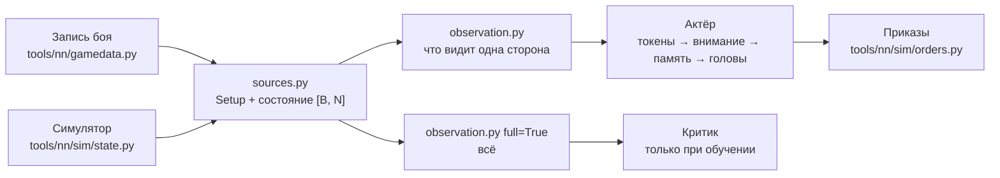
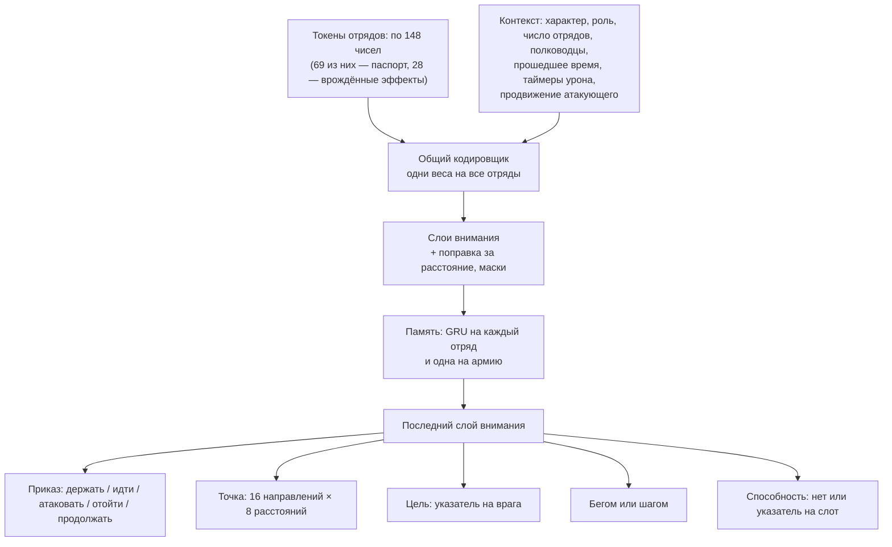

# Вход и устройство сети

[← Назад](README.md) · [Документация](../README.md) › [Данные для обучения](README.md) › Вход и устройство сети · [English](../../en/training/model.md)

Что сеть получает на вход и как она устроена — в коде, по замыслу из
[модели сети](network.md). Обучения пока нет: веса случайные. Код — `tools/nn/model/` (PyTorch; сводка стороны
работает и на обычном numpy).

## Правило: ИИ видит только то, что видит человек

`observation.observe(state, setup, side, memory)` строит вход одной стороны. Один и тот же
код берёт запись боя и пачку боёв симулятора: у обоих поля записанного `nn_sample`
([что в записи](README.md#что-в-записи)).

- **Свои отряды** — всё, и точную мораль тоже.
- **Вражеские отряды** — только пока видны: место, направление, скорость, бойцы и здоровье,
  что делают, и **состояние** морали. Точный процент морали на вход не попадает никогда
  (это проверяет тест).
- **Враг не виден** — последнее место, где его видели, и сколько секунд назад. Ни разу не
  виден — только его паспорт (армию врага показывают до боя).
- **Своя система координат.** Начало — центр карты; «вперёд» — от своей армии к армии врага
  в начале боя; «вбок» — вправо. Если повернуть мир на 180° и поменять стороны местами, вход
  не изменится (это проверяет тест). Поэтому одна сеть играет за обе стороны.
- **Видимость.** Симулятор даёт `vis` (виден другой стороне). В записях видимости нет: карта
  ровная и пустая, поэтому все отряды считаются видимыми.

### До боя (не меняется)

| Вход | Кто видит | Масштаб |
|---|---|---|
| Паспорт каждого отряда, своего и чужого ([паспорта](units.md)): бойцы, здоровье, масса, скорости, атака, защита, натиск, урон и бонусы оружия, броня, щит, лидерство, защита от урона, стрельба (дальность, снаряды, урон, перезарядка, меткость; с 02.10.2026 в конце: настильный огонь, разброс, скорость снаряда), цена, каста, размер, свойства (несокрушимый, стрельба на ходу, …) | обе стороны | ~0–1; широкие числа (здоровье, масса, цена, урон) в логарифме; каста, размер, свойства — 0/1 |
| Ранг опыта | обе стороны | ранг / 9 |
| Характер фракции (5 чисел, `config/nn/factions.json`) | своя сторона | 0–1 как записано |
| Роль: атака или оборона | своя сторона | 0/1 |
| Уровень лорда, своего и чужого | обе | уровень / 50 |
| Размер карты | обе | м / 2000; у каждого отряда ещё расстояние до края впереди, сзади, справа и слева (м / 1000) |

Числа характера — **заглушки** (Империя и скавены); окончательные выбирает автор по лору.

### В бою (каждый отряд, каждое решение)

| Вход | Свой отряд | Враг виден | Враг не виден | Масштаб |
|---|---|---|---|---|
| Место (вперёд, вбок) | да | да | последнее известное | м / 500 |
| Направление | да | да | — | cos, sin угла к «вперёд» |
| Скорость (вперёд, вбок) | да | да | — | м/с / 5, по двум решениям |
| Бойцы, здоровье | да | да | — | доля от начала |
| Состояние морали: стоит, колеблется, бежит, разбит | да | да | — | 0/1 |
| В рукопашной, идёт, бежит бегом, стреляет | да | да | — | 0/1 |
| Расстояние до краёв карты | да | да | от последнего места | м / 1000 |
| Точная мораль (`MoralePercent`) | да | **нет** | — | / 2, не больше ±1,5 |
| Подробное состояние морали 1–7 | да | **нет** | — | 0/1 |
| Стрелы, убито врагов | да | нет | — | доля от начала; убитые / 200 |
| Усталость (6 состояний), известна ли | да | нет | — | 0/1 |
| Точка приказа, есть ли приказ, есть ли цель | да | нет | — | м / 500; 0/1 |
| Угроза левому флангу, правому, тылу | да | нет | — | 0/1 |
| Свой или чужой, виден сейчас, виден хоть раз, давность | да | да | да | 0/1; давность с / 60, не больше 1 |
| Недавно дрался в рукопашной, недавно бежал | да | да (если тогда был виден) | — | 1 сейчас, к 0 за 120 с; 0 — не было |

Состояния морали игры 1–4 (рвётся в бой … дрогнул) у врага все — «стоит»: иначе по ним
можно узнать точную мораль.

Ещё на каждое решение — контекст стороны:

| Вход (контекст) | Масштаб |
|---|---|
| Число своих живых отрядов и известных вражеских | / 20 |
| Убит ли свой полководец и как давно; вражеский так же | 0/1; 1 сейчас, к 0 за 120 с |
| Сколько идёт бой (точные часы для первых минут) | log(1 + с / 30) / log(21): 0,23 на 30 с, 0,59 на 150 с, 1 с 10 минут |
| Наносили ли мы уже урон; сколько секунд с нашего последнего урона | 0/1; с / 300, не больше 1 (0 до первого) |
| Наносил ли нам урон враг; сколько секунд с его последнего урона | 0/1; с / 300, не больше 1 (0 до первого) |
| Продвижение атакующего (видят обе стороны): темп его урона; достигал ли он 0,05; сколько секунд с тех пор, как был не ниже 0,05 | темп / 0,05, не больше 4; 0/1; с / 300, не больше 1 (0 до того) |

Игра объявляет гибель полководца, поэтому о вражеском сеть знает, даже если его не видела.

Ничто на входе (и на входе критика) не говорит о пределе времени боя: в кампании его может не
быть. Даётся только прошедшее время; прежний столбец `t / 3600` (тот же предел в 60 минут,
только скрытый) убран.

Таймеры урона (`observation.TIMERS`) — то, что видит игрок: свои отряды в бою, счётчики убитых
и полосу соотношения сил. Сторона нанесла урон, если какой-то отряд другой стороны потерял
здоровье (`hp` упало) с прошлого решения: любые отряды, видимые и нет (полоса показывает итог);
отряд с неизвестным здоровьем (NaN) ничего не даёт, пока его снова не узнают. Память хранит
прошлое здоровье (`Memory.prev_hp`) и время последнего урона каждой стороны (`Memory.hit_t`),
поэтому симулятор, записанные бои (замеры раз в секунду) и компаньон (состояния, которые шлёт
игра) считаются одним правилом. В обучении это тот же урон атакующего, что и в награде
(`reward.struck`, `rollout.Battles.last_hit`: здоровье защитника упало за шаг): атакующий видит
его как «мы нанесли», защитник — как «враг нанёс».

Продвижение атакующего (`observation.PROGRESS`) — это часы штрафа за простой в награде при
`--idle-rate` ([обучение](training.md)): актёр и критик видят то состояние, от которого этот
штраф зависит. Темп урона атакующего — золото, потерянное защитником (`observation.gold_lost`:
цена отряда × доля потерянного здоровья; бегущий отряд теряет ещё половину оставшегося, убитый,
рассеянный или ушедший с карты — всё; сплочение — не урон), в доле бюджета (среднего из цен двух
армий) за минуту, экспоненциальное среднее за 30 с; на входе этот темп / 0,05 (1 на пороге),
достигал ли он уже 0,05 и сколько секунд с последнего раза (`last_hit` награды: по нему растёт
множитель простоя m). Видят обе стороны. Считается по здоровью и состоянию всех отрядов (отряд с
неизвестным здоровьем ничего не даёт, пока его снова не узнают) и цене из паспортов
(`Setup.cost`), с временем между наблюдениями, в памяти (`Memory.prev_gold`, `rate`, `rate_t`):
наблюдение симулятора и компаньона (состояния игры; ушедший с карты отряд там без бойцов, в
симуляторе — `gone`) — одно правило. Это часы награды, пока `--idle-rate`, `--idle-window` и доля
бегущего — 0,05, 30 с и 0,5 (`observation.RATE_MIN`, `RATE_WINDOW`, `ROUT_SHARE`); иначе
`rollout.Battles` предупреждает.

Контрольная точка, записанная до этих входов (со столбцом `t / 3600`), загружается как есть
(`encoder.TokenEncoder`): веса этого столбца отбрасываются, веса новых входов вначале нулевые,
и сеть действует ровно так же, как раньше при времени боя 0. Записанная до входов продвижения
загружается с нулевыми весами для них (они вставлены после таймеров урона; характер врага у
критика сохраняет свои веса) и действует ровно так же. Что меняет отказ от настоящего
`t / 3600` (01.10.2026, 24 боя в симуляторе против `ai_like`, 20 минут, жадный выбор каждого
отряда, который принимает приказы, раз в 5 с, у каждой сети своя память): у
`test5/t0_gold30/m20.pt` вид приказа совпал в 99,92% (35 487 выборов), цель атаки в 99,92%,
точка движения в 99,96%; у `runs/long_ai/best.pt` — 99,93%, 99,93%, 99,92%; меньше всего по минутам боя
99,7% (m20, 6-я минута).

Вход критика (`full=True`) заполняет все поля у всех отрядов, без видимости, и добавляет
характер врага. Он только для обучения.

### Способности (каждый отряд, каждый его слот способности)

Способность известна по тому, что она делает, а не по имени: её **паспорт**
(`config/nn/abilities.json`, пишет `py -3.14 -m tools.nn.abilities` из базы игры; признаки —
`tools/nn/model/abilities.py`). Новой способности нового лорда нужен паспорт, а не новая сеть. У
отряда до 3 слотов (`tools/nn/sim/abilities.py` `slot_keys`, те же в симуляторе): сначала
активные, потом пассивные, достающие до других отрядов, потом остальные, в группе — по ключу.
Генерал: Foe Seeker, Stand Your Ground, Hold the Line; Варлорд: Verminous Valour, Deadly
Onslaught, Rally.

| Вход (на слот, `Obs.abil` [B, N, 3, 114]) | Свой | Враг виден | Враг не виден | Масштаб |
|---|---|---|---|---|
| Есть | да | да | да | 0/1 |
| Готова сейчас | да | нет | нет | 0/1 |
| Секунд до готовности | да | нет | нет | с / 60, до 3 |
| Секунд действия осталось | да | нет | нет | с / 30, до 2 |
| Действует сейчас | да | да | нет | 0/1 |
| Паспорт: пассивная, время действия и перезарядки, число применений, радиус, на себя, сколько своих / врагов задевает, цели (себя, своих, врагов) | да | да | да | с / 60, с / 120, м / 100, 0/1 |
| Паспорт: эффекты на своих (владельца и его соседей) и на врагов: 28 параметров базы (скорость, скорость натиска, атака и защита в ближнем бою, урон и бронебойный урон, бонус натиска, боевой дух, броня, сопротивления, урон стрелков, перезарядка, точность, дальность, бонус против больших / пехоты, масса, …) и 15 атрибутов (несокрушимый, иммунитет к психологии, вызывает страх, …) | да | да | да | множители как значение − 1; прибавки / 50 или / 100; атрибуты 0/1 |
| Паспорт: когда (02.10.2026, в конце): игра включает само (`auto`), при проигрыше рукопашной / в рукопашной, выключено вне рукопашной / ниже половины морали / когда не колеблется / ниже половины здоровья, другое условие | да | да | да | 0/1 |

Почему у врага: игрок видит карточки вражеской армии до боя (способности на них), а в бою
игра рисует эффект действующей способности на отряде и перечисляет её среди действующих эффектов
отряда (CCO `ActiveEffectList`, его читает мост). Таймеры врага нигде не показаны — их не даём.
`Obs.abil_ok` [B, N, 3]: свои способности, которые сеть может применить сейчас — есть, активная
(не пассивная), на себя (на владельца, цель выбирать не надо), готова (не действует, перезаряжена)
и отряд принимает приказы (жив, не бежит). Без таймеров в состоянии (записи) готового нет.

### Врождённые эффекты (каждый отряд, каждый эффект каталога)

Каждое свойство и пассивная или включаемая игрой способность отряда — врождённый эффект одного
каталога (`config/nn/effects.json`, [паспорта отрядов](units.md#врождённые-эффекты)); токен
кончается парой входов на эффект в порядке каталога `order`, который только дописывается
(14 эффектов, 28 входов; `tools/nn/model/effects.py`):

| Вход (на эффект) | Свой отряд | Враг виден | Враг не виден | Шкала |
|---|---|---|---|---|
| Есть | да | да | да | 0/1 |
| Действует сейчас (условия выполнены: «Сила в числе» выше половины здоровья, «Удирай!» при колебании, Frenzy выше половины морали, 20 с Penitent, свойство — всегда) | да | да | нет | 0/1 |

«Есть» — на карточке отряда (карточки обеих армий видны до боя); действующие эффекты видимого
отряда игра перечисляет (CCO `ActiveEffectList`). В симуляторе «действует» — его `fx_on`; в
записанном бою и в игре (компаньон) — выводится из полей самого токена по тем же условиям
(здоровье, состояние морали, рукопашная; своя мораль — для половины морали), а эффект с временем,
чей таймер неизвестен (Penitent), считается выключенным. Новый эффект дописывает свою пару в конец
токена: старая сеть грузится с нулевыми весами для неё (`encoder.pad_inputs`) и действует как
раньше.

## Устройство

- **Токены.** Один токен на отряд, свой и чужой, с одним кодировщиком: новый отряд сеть
  понимает по паспорту, а не по названию. Контекст (характер, роль, таймеры) прибавляется к
  каждому токену и сам — отдельный токен. Каждый слот способности проходит через одну общую
  маленькую сеть (`AbilityEncoder`); сумма по слотам, которые у отряда есть, прибавляется к его
  токену, так что порядок слотов не важен. Её последний слой вначале нулевой: актёр, обученный
  до способностей, видит ровно то же, что видел.
- **Внимание** (3–4 слоя): каждый отряд «смотрит» на остальных. Маски: пустые места, свои
  погибшие отряды и враги, которых видели уничтоженными, не видны никому. Выученная поправка
  по расстоянию между двумя отрядами (16 корзин, от 0 до ~1500 м) на каждую голову внимания
  помогает понять, кто рядом. Невидимые враги остаются во внимании с последним местом.
- **Память: GRU на каждый токен**, перед последним слоем внимания. Обучение прогоняет её через
  куски по 64 решения (64 с боя при ритме игры — решение в секунду; до 03.10 — 32 с) ([обучение](training.md)). Выбрана вместо внимания
  к прошлым кадрам: цена решения не растёт с памятью; состояние — один вектор на отряд, его
  легко хранить между решениями, и оно одинаково на всех компьютерах в коопе; горизонт
  10–20 с (20–80 решений при 2–4 в секунду) сеть выучивает сама, а не задаёт буфер.
- **Головы** для каждого своего отряда, который принимает приказы (живой, не бежит):
  - вид приказа; «атаковать» — только если есть видимый живой враг; «продолжать» — нового
    приказа нет, действующий идёт дальше (сеть не дёргает отряд каждое решение);
  - точка для «идти» и «отойти»: одно из 16 направлений в системе стороны (0 — к врагу) ×
    8 расстояний от отряда, 10–400 м в логарифме, внутри карты. Корзины, а не нормальное
    распределение: у выбора может быть несколько пиков («левый фланг или правый»), он
    переживает int8, а лучшая корзина находится без случайности;
  - цель: указатель на видимого живого врага (запрос отряда против ключа каждого врага), как
    в AlphaStar;
  - бегом или шагом;
  - способность: «нет» или указатель на один из слотов отряда (запрос отряда против ключа из
    состояния и паспорта каждого слота), только слоты из `abil_ok`. Не зависит от вида приказа
    (лорд может идти и применить способность сразу). Перестановка слотов переставляет выбор;
    невиданная раньше способность тоже получает правильный выбор (тесты). Выбирается только по
    просьбе (`heads.sample(..., abilities=True)`; `decide.act` просит): пока обучение не знает
    эту голову, `Action.ability` = `None`, и `log_prob` её не считает.
- **Загрузка старого актёра.** `Actor.load_state_dict` принимает состояние без частей для
  способностей (`policy.ABILITY_PARAMS`): они начинаются заново — кодировщик ничего не добавляет,
  голова выбирает случайно среди готовых способностей.
- **Добавки LoRA** на пару «фракция + роль» в слоях внимания и прямых слоях (`lora_rank`,
  по умолчанию выключены). Добавка вначале ничего не меняет; `lora.freeze_base` оставляет
  для обучения только добавки.
- **Критик** (только обучение): свой кодировщик и внимание на полном входе; средние по своим
  и по чужим отрядам и токен контекста → ценность боя для стороны.

Приказы выходят в формате симулятора (`tools/nn/sim/orders.py`): `kind`, `x`, `z`, `target`,
`run` [B, N] по местам состояния и `ability` [B, N] (слот, который применить сейчас, −1 — нет;
необязательно: у приказов без него везде −1). Отряды другой стороны, погибшие и бегущие —
«держать» и ничего не применяют.

**В обучении** (`tools/nn/train/rollout.py`, `ppo.py`; [обучение](training.md#способности-полководца-01102026)):
ученик и прошлая версия выбирают способности (`heads.sample(..., abilities=True)`), прогон хранит
`Action.ability`, обновление учитывает его в логарифме вероятности; флаг `ai` = true только у
сторон скриптовых соперников (`tools/nn/sim/abilities.py` `set_rule`, снова после каждого
перезапуска: строки банка приносят умолчание `scenario.build` — сторону 2); LiveSetup несёт
`abil`, `abil_owned`, `abil_use`. Сохранённый переход держит только состояние слотов (5 чисел) и
строку банка боя; `rollout.full_obs` возвращает паспорта для обновления.

## Размер

`tools/nn/model/config.py`, подсчёт — `bash tools/nn/dock.sh tools.nn.model.bench`:

| Вариант | Ширина | Слоёв внимания | Актёр | Критик (только обучение) | Одна добавка LoRA, ранг 8 |
|---|---:|---:|---:|---:|---:|
| `small` | 128 | 3 | 0,84 млн | 0,69 млн | 0,05 млн |
| `target` | 512 | 4 | 15,49 млн | 20,30 млн (6 слоёв) | 0,26 млн |

## Скорость

Одно решение одной стороны, 20 на 20 отрядов, случайные веса, медиана из 50
(`bash tools/nn/dock.sh tools.nn.model.bench`, 30.09.2026). «Решение» = сводка + сеть +
выбор + приказы; «сеть» — только сама сеть.

| Где | `small`: решение / сеть | `target`: решение / сеть |
|---|---:|---:|
| Процессор, 1 поток | 3,5 / 1,4 мс | 16,9 / 14,6 мс |
| Процессор, 4 потока | 3,2 / 0,9 мс | 7,6 / 5,2 мс |
| Видеокарта RTX 5070 Ti, 1 бой | 13,3 / 2,0 мс | 12,8 / 4,6 мс |
| Видеокарта, 256 боёв сразу (обучение) | 13,0 мс (51 мкс на бой) | 28,8 мс (113 мкс на бой) |

- В игре бой один: видеокарта не быстрее процессора, она ждёт запуска множества мелких
  операций. Сеть `target` на 4 потоках процессора — ~8 мс на решение: при 4 решениях в
  секунду это ~3% времени этих потоков, видеокарта не нужна. На видеокарте та же нагрузка —
  ~5% времени, и даже тогда она почти простаивает: с большим запасом в бюджете ≤ 20%.
- При обучении видеокарта окупается: 256 боёв за 29 мс.

## Одинаковые решения в коопе: int8

В коопе каждый компьютер должен получить точно такой же приказ
([модель сети](network.md#кооператив)). Выгрузка актёра в int8 выглядит выполнимой; пока не
сделана:

- основная работа — умножения матриц (линейные слои, внимание, GRU): веса и значения в int8,
  суммы в int32 дают одинаковый результат на любом процессоре;
- LayerNorm, softmax, GELU, sigmoid и tanh нужны в целых числах (таблицы или многочлены, как
  в I-BERT, Kim и др., 2021). Это главная работа;
- головы дискретные (вид приказа, корзина точки, указатель, бег), поэтому маленькая разница
  округления меняет выбор только при точной ничьей; ничья — в пользу меньшего номера;
- случайность: выбор по целым логитам с зерном из `bm:random_number()`;
- память (состояние GRU) тоже должна храниться в целых, иначе за долгий бой она разойдётся
  между компьютерами.

## Тесты

- `tests/tools/test_nn_observation.py` (numpy, работает в `.venv`): система координат,
  масштабы, пустые места; точная мораль врага не попадает на вход; у невидимого врага только
  последнее место; симметрия сторон; порядок отрядов; записанные бои; способности: своя
  панель, у врага только «действует» и только видимого, без таймеров и у бегущего лорда
  готового нет; таймеры урона: начинаются заново с каждым уроном, отдельно для каждой стороны и
  каждого боя, рост или неизвестное здоровье — не урон, новая память пуста, запись даёт те же
  таймеры, что и те же состояния по одному; контекст не зависит от времени, кроме точных часов
  (предела нет); продвижение атакующего: цена — из паспортов, темп следует золоту, потерянному
  защитником (удары, бегство, сплочение, неизвестное здоровье, гибель и рассеяние), его видят
  обе стороны, удары защитника не считаются.
- `tests/tools/test_abilities.py` (numpy): чтение таблиц способностей, паспорта, сверка с
  карточками, сохранённые числа, признаки и слоты.
- `tests/tools/test_nn_model.py` (torch; в `.venv` пропускается, запускается в контейнере):
  numpy и torch дают одинаковый вход; цель — только видимый живой враг; перестановка отрядов
  переставляет выходы; память; добавки; логарифмы вероятностей; точки внутри карты; критик;
  размеры вариантов; записанные бои и состояние симулятора → приказы; голова способностей:
  только готовые свои, перестановка слотов переставляет выбор, невиданный паспорт даёт
  правильный выбор, логарифм вероятности только при выборе, старый актёр загружается; таймеры
  урона на numpy и torch; сети со старым контекстом (столбец `t / 3600`) загружаются и дают те же
  логиты, жадные действия, память и ценности, в том числе обученные `test5/t0_gold30/m20.pt` и
  `runs/long_ai/best.pt` (без них тест пропускается); сети, сохранённые до входов продвижения (и
  `test5/r1_idleprog/m15.pt`), грузятся и дают те же выходы; врождённые эффекты: «есть» — как в каталоге,
  numpy и torch одинаковы, «действует» следует условиям и для врагов показано, только пока они
  видны, `fx_on` симулятора и наблюдаемые поля согласны, сети, сохранённые до них (и
  `test5/it5/m20.pt` цепочки), грузятся и дают те же выходы, те же и с обнулёнными входами
  эффектов, а новые входы получают градиент.
- `tests/tools/test_nn_train.py`: в симуляторе строка атакующего видит `rollout.last_hit` как
  «мы нанесли», строка защитника — как «враг нанёс», для каждого боя, со сбросом при перезапуске;
  строки обеих сторон видят продвижение атакующего как `rollout.Battles.hit_rate` / `last_hit` при
  `--idle-rate` 0,05 (удары, царапины, бегство, сплочение, уход отряда с карты, перезапуски), и
  компаньон на тех же состояниях, что строки игры, считает то же; обучение продолжается с `m20.pt` (одно обновление PPO).

В образе `snake-ai-trainer` нет pytest. Тесты torch запускали с pytest из `.venv` (чистый
Python), подключённым через `PYTHONPATH` в контейнере.
