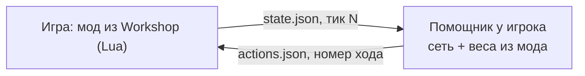

# Модель нейросети для боя

[← Назад](README.md) · [Документация](../README.md) › [Данные для обучения](README.md) › Модель сети · [English](../../en/training/network.md)

Исследование и решения автора проекта от 30.09.2026. Сети пока нет. Здесь описано,
какой она будет, где будет работать и как мы поймём, что она готова.

## Цель

Интересный ИИ, который зависит от фракции и её лора. Например, орки идут вразнобой
и срываются в атаку, а высшие эльфы двигаются слаженно и держат ровные ряды.
Сеть — **общая основа** для всех фракций плюс **добавка на каждую пару «фракция +
роль»** (атака или оборона). Различия задают характер фракции и добавки.

## Где работает сеть



- Сеть работает **вне игры**, в программе-помощнике. Игрок один раз ставит её вдобавок
  к подписке в Workshop. Маленькой запасной сети на Lua не будет: не стоит усилий
  (решение автора).
- Обмен идёт через файлы: Lua в бою умеет читать и писать их (`io.open`, см.
  `src/apps/telemetry/adapter.lua`). Помощник пишет во временный файл и переименовывает
  его, поэтому Lua не прочитает файл наполовину.
- Веса лежат в самом моде Workshop, помощник берёт их из папки подписки. Новая сеть
  приходит обычным обновлением мода. Размер мода — не ограничение: 1–5 ГБ допустимо
  (решение автора).
- **Бюджет:** до ~20% видеокарты допустимо, если ИИ работает как задумано; ~50% — точно
  нет. Реальную нагрузку меряем тестами.

Для сравнения: чистый Lua 5.1 (тот же интерпретатор, что в наших тестах) тратит
на одно решение сети с одним слоем внимания ~2 мс при 7 на 7 отрядов и ~20 мс при 20 на 20
(~33 тыс. весов). С помощником сеть может быть в сотни раз больше.

## Устройство сети

Вход и слои в коде, с размерами и временем: [вход и устройство сети](model.md).

```
каждый отряд (свой и чужой) → признаки: место, здоровье, мораль, усталость, стрелы
   + характеристики из базы игры (лидерство, скорость, натиск, броня, дальность, перезарядка)
      ↓ общий кодировщик (одни веса на все отряды)
      ↓ 3–4 слоя внимания: отряд «смотрит» на остальных
      ↓ память о последних 10–20 с боя
      ↓ + характер фракции (5–6 чисел) и роль (атака / оборона)
      ↓ + добавка LoRA для пары «фракция + роль»
для каждого своего отряда: держать / идти в точку / атаковать отряд N / отойти, темп
```

- **Основа и добавки.** Основа знает бой: рукопашную, мораль, стрельбу, фланги.
  Добавка LoRA — несколько процентов весов поверх основы, своя у каждой пары
  «фракция + роль» (орки-атака, орки-оборона, эльфы-атака…). Для игрока это две
  сети на фракцию, но основы боя учатся один раз на всех. Один бой учит сразу
  три вещи: основу и добавки обеих сторон.

- **Вход по отрядам с общими весами** подходит к любому составу армии. Новый отряд сеть
  понимает по его характеристикам из [базы игры](../game/database.md), а не по названию.
- **Внимание** позволяет понять, кто рядом, кто угрожает и кого выгодно бить. Цель
  выбирается указателем на вражеский отряд, как в AlphaStar (DeepMind, StarCraft II).
- **Память** нужна для стиля: «дождаться линии и ударить вместе» или «сорваться,
  заметив слабину».
- Размер: 5–20 млн весов, 2–4 решения в секунду. Это порядка 1–3% видеокарты.
  Остаток бюджета можно отдать «обдумыванию»: сеть проигрывает в уме несколько
  вариантов и выбирает лучший.
- **Обучение:** PPO с большим критиком, который видит всё поле. Критик нужен только
  при обучении, в игру он не попадает (схема MAPPO, Yu и др., 2021). Армия играет
  против своих прошлых версий. Обучение идёт в контейнере `snake-ai-trainer`.
- Тонкий слой на Lua только переводит решение сети в приказы игры. Своей тактики
  в нём нет.

### Отброшенные варианты

| Вариант | Почему нет |
|---|---|
| Сеть на Lua внутри игры | Мала для хорошего ИИ; запасная версия не стоит усилий |
| Обычная сеть с входом фиксированного размера | Ломается при другом числе отрядов |
| Отдельные сети на фракцию и роль | Основы боя каждая учит заново; добавки LoRA дают ту же специализацию |
| Учиться только в игре | ~30 боёв в час, а нужны сотни тысяч |
| Только копировать ИИ игры | Нет стиля, повторяет его ошибки ([штатный ИИ игры](../game/game-ai.md)) |

## Характер фракции

Характер работает на трёх уровнях.

1. **Числа на входе сети.** Их можно менять без переобучения. Значения ниже
   примерные, окончательные выбирает автор по лору:

   | Черта | Орки | Империя | Высшие эльфы |
   |---|---|---|---|
   | Держать строй (линия отрядов) | 0.2 | 0.6 | 0.95 |
   | Синхронность (начинать вместе) | 0.1 | 0.5 | 0.9 |
   | Агрессия | 0.9 | 0.5 | 0.4 |
   | Терпение | 0.1 | 0.5 | 0.8 |
   | Своеволие (случайные рывки) | 0.7 | 0.2 | 0.05 |

2. **Награда за стиль при обучении.** Каждую награду можно измерить. Эльфам — ровная
   линия (отклонение в метрах), одновременный удар (все вступили в бой за N с),
   ровные промежутки. Оркам — ранний натиск, штраф за ожидание и отход. Главная
   награда у всех — победа и потери врага, стиль идёт добавкой. Так же учили
   гоночный ИИ GT Sophy (Sony, 2022): он ездил «вежливо» и всё равно побеждал.
3. **Случайность выбора.** Орки выбирают «горячее» и чаще срываются сами. Эльфы
   почти всегда берут лучший вариант.

Часть различий даёт сама игра: у орков ниже лидерство, поэтому они быстрее бегут.
Эти числа берём из базы игры.

## Армии и правила боя

Сеть должна быть очень гибкой, поэтому армии случайные. Тот же генератор строит
и проверочные бои с ИИ игры.

- **Размер:** 1 лорд и от 0 до 19 отрядов. Подкреплений пока нет.
- **Равный бюджет.** Обе стороны получают одинаковую сумму по цене отрядов
  (`multiplayer_cost` из базы игры, разница ±5%). Число и состав отрядов при этом
  разные. Иначе одна сторона часто сильнее, и победа ничего не говорит о сети.
  Тиры не нужны: цену уравнивает бюджет.
- **Одна фракция на армию:** отряды только из её списка найма.
- **Без «дум-стаков».** Доли пехоты, стрелков, кавалерии и монстров берём из того,
  как набирает армии ИИ кампании (таблицы в базе игры, у каждой фракции свои).
  Армии получаются разумными и «по лору». Какие таблицы — ещё проверить.
- **Сначала маленькие армии:** 1–5 отрядов, потом рост до 20.
- **Пул отрядов растёт по шагам** вместе с симулятором: сначала 1–2 фракции без
  магии, полёта и артиллерии; каждая новая категория — после сверки с игрой.
- **Лимит боя — 60 минут.** По истечении атакующий проигрывает (правило игры:
  по времени побеждает защитник). Атакующему невыгодно тянуть.
- **Расстановка.** `tools/nn/scenario.py` пока ставит только арену 7 на 7. Его надо
  научить ставить 1–20 отрядов.

## Кооператив

Кооп закладываем сразу. По скриптам самой игры (`data_script.pack`, кооперативные
«Выживания» CA, проверено 30.09.2026):

- в сетевом бою скрипт выполняется **на каждом компьютере**, игроки не пересылают
  приказы (lockstep). Если у одного выйдет другой приказ, игра рассинхронизируется;
- общие для всех машин только время модели боя (`bm:callback`, `bm:repeat_callback`)
  и `bm:random_number()`. `math.random` и `os.clock` у каждого свои;
- канала «хост рассылает всем» в бою нет: `CampaignUI.TriggerCampaignScriptEvent`
  есть только на карте кампании.

Значит, **каждый компьютер сам должен получать точно такой же приказ**.

| Откуда расхождение | Решение |
|---|---|
| Дробные числа на разном железе | Сеть считает в целых числах (int8/int16, сумма в int32): такая сумма одинакова на любом процессоре и видеокарте |
| Случайность (своеволие) | Зерно из `bm:random_number()` или номера тика |
| Разное время ответа | Состояние снимается на тике N, приказ отдаётся строго на тике N + 0.5 с игрового времени. Если ответа нет, Lua ждёт: кадр подвиснет, но рассинхрона не будет |
| Разные веса | Веса из мода, в кооп-лобби мод одинаковый |
| «Обдумывание» | Фиксированное число вариантов, без лимита по реальному времени |

Помощник нужен у каждого игрока. Проверку «помощник жив, версия весов та» делаем
на расстановке, до боя. Сейчас сетевые бои в коде отключены: `is_multiplayer` —
в списке неподдерживаемых (`src/apps/battle/adapter.lua`).

**Не проверено в игре:** `io.open` в сетевом бою, ожидание на тике без вылета по
таймауту, проверка модов в кооп-лобби, какие бои в коопе достаются ИИ. Для проверки
нужны два компьютера или две учётки Steam.

## Путь

1. **Новый симулятор** по правилам [базы игры](../game/database.md), сверенный с
   записанными боями ([данные](README.md)). Без него обучения не будет.
   Версия 1 готова: [симулятор боя](simulator.md) (шаг 1 — [паспорта отрядов](units.md),
   шаг 2 — [замеры](measurements.md)).
2. По желанию — разгон сети по записям боёв ИИ игры. Это лишает проверку против
   ИИ игры независимости (см. «Готовность»), поэтому по умолчанию не делаем.
3. Обучение PPO в симуляторе: армия против своих прошлых версий, с характером.
   Сначала основа, потом добавки LoRA.
4. **Один бой на запуск игры** (стандартный вариант, ~30 боёв в час). Серию боёв за
   одну загрузку проверили и убрали: «Переиграть» повторяет те же армии, а запас армий
   в одной сцене меняет бой ([исследование](../research/launch/test-stand.md)).
5. Проверка в игре против ИИ игры (см. ниже).

## Готовность

Предложение, окончательно решает автор. Сеть готова, когда выполнено всё:

1. **Побеждает ИИ игры в ≥ 97% боёв** на [нормальной сложности](../game/difficulty.md).
   Проверка идёт ночью, ~8 часов, это ~200 боёв (погрешность ±2.4%); на границе
   добираем вторую ночь. Армии — из генератора с отложенными зёрнами, которых сеть
   не видела. Ничья и выход времени у атакующего — не победа. Разбивку по размеру
   армии, фракции, атаке и обороне смотрим как подсказку, где слабое место: при
   200 боях порог на каждую группу ничего не докажет. Учитываем и цену победы:
   наши потери.
2. **Стиль виден в цифрах:** у эльфов линия ровнее и удар одновременнее, чем у орков,
   с разницей, заданной характером.
3. **ИИ игры — независимая проверка.** Сеть учится только против себя, ИИ игры в
   обучении не участвует. Чтобы так и осталось:
   - не разгоняем сеть по записям боёв ИИ игры (шаг 2 пути), иначе проверка
     перестанет быть независимой;
   - если выбираем версию сети или её настройки по результату против ИИ игры,
     держим отдельный набор условий (карты, составы), который видим только
     в финальной проверке.

   ИИ игры слабый: он стоит под обстрелом и не водит собравшиеся отряды
   ([штатный ИИ игры](../game/game-ai.md)). Поэтому 90% против него — нижняя
   планка «не плохо», а не «сильно». Верхнюю планку проверяем игрой с автором.
4. **Симулятор не врёт:** итоги боёв в симуляторе и в игре близки.
5. **Ресурсы ≤ 20% видеокарты.**
6. **Кооп без рассинхрона** на двух компьютерах.
