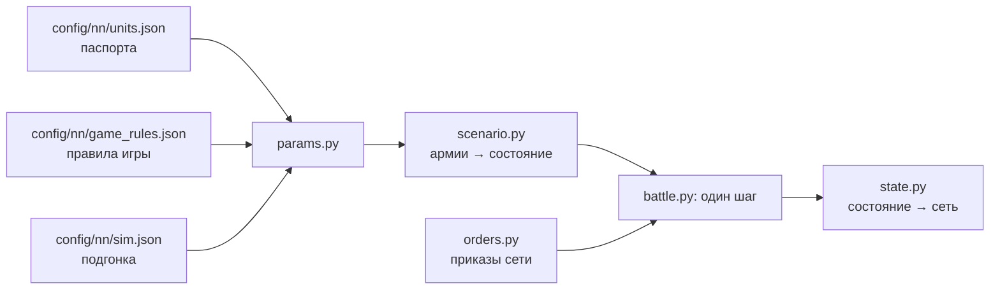

# Симулятор боя

[← Назад](README.md) · [Документация](../README.md) › [Данные для обучения](README.md) › Симулятор боя · [English](../../en/training/simulator.md)

Шаг 3 пути ([модель сети](network.md)): симулятор боя игры, в котором будет учиться сеть.
Он играет тысячи боёв сразу на видеокарте. Каждый отряд — один объект (бойцы, здоровье,
место, направление, мораль, усталость, снаряды), а не каждый солдат. Числа взяты из
[паспортов отрядов](units.md) и [правил игры](../game/database.md); где игра ведёт себя
иначе, они подогнаны под [замеры](measurements.md). Версия 1, 30.09.2026: семь отрядов v1,
ровная пустая карта.

## Как запустить

```bash
bash tools/nn/dock.sh tools.nn.sim.check                     # все сверки с игрой (процессор и видеокарта)
bash tools/nn/dock.sh tools.nn.sim.check --device cuda --only battles
.venv/Scripts/python -m pytest -q tests/tools/test_sim_layout.py   # без torch
```

- Код — `tools/nn/sim/` (PyTorch). Нужен torch: он есть в контейнере `snake-ai-trainer`, а в
  `.venv` проекта его нет, поэтому `tests/tools/test_sim.py` там пропускается. В образе нет
  pytest: чтобы запустить тесты в нём, положите копию pytest (из `.venv`) в `PYTHONPATH` и
  выполните `python -m pytest -q tests/tools/test_sim.py`.
- Сверка пишет `build/nn-sim/check.json` (не в Git).

```python
from tools.nn.sim import battle, replay, scenario

st = scenario.build([scenario.from_arena("whole_emp_v_skv", "attack")] * 1024, device="cuda")
battle.run(st, replay.nearest_attack)        # policy(состояние) -> приказы, пока все бои не кончатся
st.winner, st.t, st.observation()            # [B], [B], словарь [B, N]
```

## Что хранит симулятор



**Состояние** (`tools/nn/sim/state.py`, единственный источник правды): тензоры `[B, N]` —
B боёв, N мест под отряды обеих сторон (сторона 1 в первой половине, сторона 2 во второй,
лорд стороны первым; `side` = 0 — пустое место). Три группы:

- *наблюдаемые* — те же поля и имена, что в записи `nn_sample`
  ([что в записи](README.md#что-в-записи)): `x`, `z`, `b`, `men`, `hp`, `mp`, `ms`, `r`, `s`,
  `w`, `m`, `mv`, `f`, `a`, `fire`, `target` (это `t` записи), `fat` (состояние усталости
  0–5), `k`, `ox`, `oz`, `lf`, `rf`, `bf`, `vis`; время боя — `t` `[B]`. Поэтому записанные
  бои и симулятор кормят сеть одинаково;
- *постоянные* — паспорт: бойцы, здоровье, скорости, атака, защита, оружие, броня, щит,
  лидерство, снаряды, дальность, перезарядка, цена;
- *внутренние* — то, что нужно только симулятору: очки морали и усталости, таймеры.

**Приказы** (`tools/nn/sim/orders.py`): на каждый отряд и шаг решения `kind` — держать (0),
идти (1), атаковать (2), отойти (3), продолжать (4: нового приказа нет, действующий идёт
дальше; отряд без приказа стоит); точка `x`, `z` для «идти» и «отойти» (центр отряда); `target` —
место врага для атаки; `run` — бегом или шагом. Всё `[B, N]`. Приказ «идти» не выводит отряд
из рукопашной: для этого есть «отойти» (отряд выходит из боя, а враги в контакте бьют его в
спину).

## Один шаг (0,5 с)

1. Принять приказы (бегущие отряды их не слушают).
2. Контакты: прямоугольники отрядов (фронт × глубина рядов, которые заполняют бойцы) касаются.
3. Удары в рукопашной и выстрелы.
4. Здоровье, бойцы, убитые.
5. Мораль: колебание, бегство, сбор, разгром.
6. Усталость.
7. Движение: к точке приказа или к цели, бегущие — прочь; край карты.
8. Кончен ли бой: сторона без стоящих отрядов проигрывает; через 60 минут побеждает защитник.

## Механика и откуда числа

«БД» — правила игры или паспорт; «замер» — [замеры](measurements.md) и записи; «подгонка» —
число, подобранное так, чтобы симулятор повторял игру (все они в `config/nn/sim.json` с
причиной).

| Механика | Как | Откуда |
|---|---|---|
| Скорость | шаг, бег, разгон, торможение из паспорта; бегущие с поля — 0,9 от бега | БД; скорость бегства — замер (медиана 0,80–0,96) |
| Строй | фронт заданной ширины, ряды через 1,5 м; лорд — круг своего радиуса | замер: 120 копейщиков, 30 м, 6 рядов |
| Контакт | края ближе 1 м (у уже дерущихся — ещё на 2 м) | замер: расстояние центров в первом контакте |
| Разворот | идущий отряд смотрит, куда идёт, но шаг меньше 10 м к своей точке делает не разворачиваясь; строй в рукопашной поворачивается не быстрее 2° в секунду (лорд — сразу) | замер: пехота в рукопашной поворачивается на 1°/с (медиана; среднее 2,3), свободный отряд, ударенный во фланг, — на 8° за 5 с (медиана) |
| Точка приказа | игра пишет центр фронта; симулятор ведёт к центру отряда, на полглубины позади | замер (копейщики 3,3–4,8 м, рабы 6,5–6,9 м) |
| Сколько бьют | 0,75 рядов фронта в контакте; на каждую сторону строя (фронт, левый и правый фланг, тыл) отряд выставляет не больше, чем она вмещает; вокруг лорда не больше 8 | подгонка; по сторонам — замер: уже дерущийся отряд бьёт новичка на своём фланге в 2,2 раза сильнее правила за первые 15 с (симулятор с одним общим фронтом давал 1,2); 8 — замер ([рукопашная](../game/units/melee.md)) |
| Шанс попасть | 35 + 0,1 × (атака − защита), в пределах 8–90 %; защита ×0,6 с фланга, ×0,3 с тыла; потерянная защита идёт с весом 2,0 от правила с фланга и 0,25 с тыла (против лорда — правило) | числа БД; веса — подгонка (см. ниже и [фланги](#фланг-тыл-и-натиск-в-целых-боях)) |
| Урон удара | бронебойный + обычный × (1 − 0,75 × броня/100), не больше здоровья бойца | БД (броня держит случайные 50–100 %) |
| Время между ударами | `attack_interval_s` паспорта | БД |
| Удар лорда | задевает до `splash` (4) бойцов | БД; сходится с замеренными 0,36 убитых в секунду |
| Натиск | бонус натиска к атаке и урону, спадает за 13 с; отряд, встретивший врага на бегу, бьёт ×(1 + 1,5 × доля его скорости) эти 13 с; не бежавший вводит бойцов в бой за 20 с. Упор: отряд с `charge_reflection` (копейщики, клановые крысы), стоящий на месте (медленнее 0,5 м/с), встречает натиск пехоты в пределах `bracing_attack_angle` (80°) от фронта как натиск той же скорости | БД (13 с, 80°, свойство); 1,5 — подгонка по первым 15 с целых боёв и пар, 20 с — по парам; упор — замер (целые бои: стоящий отряд под натиском в лоб теряет 0,8 от потерь атакующего) |
| Потери бойцов | не убивший удар ранит: доля бойцов = max(1 − g × (1 − доля здоровья), доля здоровья), g = (ударов до смерти)^−0,5 | подгонка: бойцы против здоровья в парах |
| Стрельба | только стоя; первый выстрел через 3,3 с (стрелы) / 4,3 с (праща) после остановки; выстрел на бойца раз в 11,0 / 11,5 с; дальность от края строя | замер |
| Попадания | 0,42 стрелы, 0,47 праща на краю дальности; ×1,29 на 70 м, ×1,12 на 90 м | замер; множитель по дальности — с полигона |
| Щит, стойкость | щит держит свою долю в пределах 60° от фронта; стойкость к стрелам из паспорта | БД |
| Лорд как цель | 0,43 от правила отряда | замер: ~33 тыс. выстрелов по лордам, пока лорд весь полёт вне рукопашной (генерал от стрел ~0,5, от пращи ~0,37, военачальник от стрел ~0,32) |
| Огонь по своим | из попаданий, пущенных в отряд в рукопашной, 0,26 (стрелы) / 0,56 (праща) достаются своим отрядам стрелка в контакте с ним, по числу их бойцов | замер: HP, которые эти отряды теряют сверх правила рукопашной, пока их сторона стреляет (1,5 тыс. + 1,3 тыс. секунд) |
| Разлёт | из попаданий, пущенных в отряд, каждый отряд его стороны вне рукопашной получает 0,115 ближе 30 м, 0,034 на 30–60 м, 0,015 на 60–90 м | замер: HP отрядов, в которые никто не стреляет, рядом с обстреливаемым (15,6 тыс. секунд) |
| Цель «по своему выбору» | цель приказа, если в дальности, иначе ближайший стоящий враг | как в игре ([урон стрелами](../game/units/missile-damage.md)) |
| Мораль | очки: лидерство + эффекты; MoralePercent = очки / лидерство; сдвиг — 1 очко или 15 % разрыва за 0,5 с | БД; шаг — замер (+2 очка в секунду во всех записях) |
| Эффекты морали | лорд ближе 70 м +4; лорд погиб −16, потом −10; сосед ближе 120 м +5; потери −2…−74; недавние потери −6…−80 (за 30 с, от всего здоровья); выигрывает / проигрывает рукопашную +3/+6/+8, −3/−8 (отношение урона 1,5 / 2,5 / 4); удар во фланг −1, в тыл −2; открытые фланги (враг угрожает слева, справа или сзади: `lf`, `rf`, `bf`) −3, два и больше −6; бегущие свои −3 каждый; бегущие враги +2,5 каждый; под обстрелом −5; очень устал −2, измотан −6; более сильный враг ближе 70 м −3 | очки БД; окно и отношения — подгонка; удар во фланг и тыл — замер ([фланги](#фланг-тыл-и-натиск-в-целых-боях)) |
| Фракция | скавены +6 очков в начале | замер: до контакта они на 6 очков выше Империи в том же положении |
| Состояния | колебание ниже 16 очков, бегство при 0, разгром на третьем бегстве, 10 с после сбора без бегства | БД |
| Сбор | пока ни одного стоящего врага ближе 90 м, бегущий получает 2 очка в секунду; собирается при MoralePercent 0,23 | замер: 0,23 и 90 м (365 сборов); 2 очка — подгонка (медиана сбора 44 с) |
| Усталость | натиск +34, рукопашная +19, стрельба +18, бег +4, шаг −1, стоя −7, ×5 в секунду; состояния по порогам БД | БД; ×5 подобрано по 1315 записанным сменам состояния |
| Карта | квадрат ±1020 м; бегущий отряд, пересёкший край, уходит из боя | замер |
| Видимость | видно всё (`vis` оставлен на будущее) | ровная пустая карта |

**Почему шанс попасть почти плоский.** По правилу БД четырём парам нужно от 13 до 43 бойцов,
бьющих разом, а лорду ~38 ([замеры](measurements.md)). С плоскими ~35 % те же потери дают
12–17 бойцов на фронте 30 м во всех парах и ~8 вокруг лорда: одно число подходит всем. Поэтому
атака − защита идёт с весом 0,1 от правила. Фланг и тыл, которые пары не проверяют, подогнаны
по целым боям (ниже).

## Фланг, тыл и натиск в целых боях

Замер 01.10.2026 по 28 целым боям (18 зеркальных, 10 Империи со скавенами) и по их переигровкам
в симуляторе без обратной связи тем же кодом (`build/nn-sim/flank/flank.py`, не в Git).
Контакт — стоящий в рукопашной враг, край строя которого (прямоугольники симулятора по
записанным местам, направлениям и бойцам) ближе 3 м; его сторона — угол его центра от
направления отряда (фронт до 60°, тыл за 120°), как считает симулятор. Потеря здоровья
сравнивается с правилом рукопашной симулятора для того же контакта в лоб.

| Пехота в рукопашной, один контакт, не под обстрелом | Игра | Симулятор до | Сейчас |
|---|---:|---:|---:|
| Секунды, где худший контакт в лоб / во фланг / в тыл | 58 / 31 / 11 % | 78 / 18 / 4 % | 72 / 23 / 6 % |
| Потеря HP с фланга, × от потери в лоб (10–90 % по боям) | 1,74 (1,56–1,89) | 1,20 | 1,55 |
| Потеря HP с тыла, × от потери в лоб | 1,31 (1,19–1,42) | 2,04 | 1,50 |
| Очки морали, пока бьют с фланга / с тыла (регрессия*) | −1,0 / −1,8 | −1,0 / −14,5 | −0,8 / −4,0 |
| … поднят один / два и больше из `lf`, `rf`, `bf` | −3,9 / −8,1 | — | −4,3 / −7,0 |

\* Очки − лидерство против потерянного здоровья (и его квадрата), фланга, тыла, 2+ контактов,
признаков угрозы, обстрела; секунды пехоты в рукопашной (игра 30 тыс., симулятор 97 тыс.).

Новые контакты (пехоту i бьёт пехота j): HP, которые i теряет за первые 15 с, к HP, которые теряет j.

| | Контактов в игре | Игра | До | Сейчас |
|---|---:|---:|---:|---:|
| j бежит, i стоит, в лоб | 102 | 0,82 | 2,69 | 1,44 |
| j бежит, i бежит навстречу | 104 | 0,90 | 0,98 | 0,91 |
| j бежит во фланг или тыл свободному i | 206 | 1,11 | 2,65 | 1,65 |
| j бежит во фланг или тыл уже дерущемуся i | 24 | 1,30 | 3,30 | 2,22 |
| j входит шагом во фланг или тыл уже дерущемуся i | 77 | 1,23 | 2,00 | 1,34 |
| Очки морали i через 15 с после натиска на стоящего | 102 | −6,5 | −17,5 | −11,3 |

- **В игре натиск даёт мало.** Отряд, принявший натиск стоя, теряет не больше атакующего
  (0,82); копейщики в упоре (`charge_reflection`, 87 из 102) — 0,80, отряды без него — примерно
  так же (1,02, 15 контактов). Симулятор давал атакующему 2,7×, поэтому в нём проигрывал любой
  отряд, оставшийся стоять под натиском. Теперь: упор и удар натиска 1,5 вместо 2,5 (пары в
  пределах 20 %: 51 из 54).
- **В игре строй в рукопашной не разворачивается** (1°/с): враг на фланге или в тылу там и
  остаётся. В симуляторе отряд сразу поворачивался к ближайшему противнику, и удар во фланг
  свободному отряду длился один шаг. Теперь в рукопашной — 2°/с.
- **По этому счёту фланг дороже тыла** (1,74 против 1,31), вопреки защите ×0,6 / ×0,3 из БД.
  Секунды «в тыл» — вероятно, часто отставшее записанное направление; симулятор подогнан под
  замер (flank_slope 2,0, rear_slope 0,25).
- **«Удар во фланг / в тыл» в записях мал**: −1 / −2 очка, а не −6 / −14 из БД (симулятор с
  очками БД показывает −14,5 за тыл). «Открытые фланги» — как в БД: −3,9 / −8,1 против −3 / −6.
- Ещё сильнее, чем в игре: натиск во фланг или тыл (1,65–2,22 против 1,1–1,3) и падение морали
  после натиска (−11 против −6,5). `lf` / `rf` / `bf` поднимаются в 1,3–3 раза чаще признаков
  игры (у игры они шумные: 0,3–0,7 при враге ближе 60 м с той стороны).

Перебор тактик против `nearest` (скрипты обучения, `build/nn-sim/flank/scan.py`: 48 боёв на
армию, роль и сторону; победы тактики; Империя / скавены — тактика играет этой армией в бою
Империи со скавенами):

| Тактика | Зеркало: до / сейчас | Империя: до / сейчас | Скавены: до / сейчас |
|---|---:|---:|---:|
| сам `nearest` | 47 / 49 % | 60 / 26 % | 58 / 82 % |
| все отряды на одну цель | 47 / 32 % | 5 / 1 % | 43 / 65 % |
| стрелки стоят и стреляют | 0 / 1 % | 1 / 1 % | 77 / 88 % |
| полководец ждёт 2 минуты | 11 / 18 % | 3 / 1 % | 80 / 80 % |
| атака шагом | 0 / 0 % | 0 / 0 % | 0 / 0 % |
| сначала враги, уже занятые рукопашной | 36 / 32 % | 17 / 3 % | 24 / 46 % |
| запас ждёт, пока враг ввяжется | 6 / 3 % | 0 / 0 % | 1 / 7 % |
| `hold_shoot` | 19 / 34 % | 3 / 5 % | 48 / 70 % |
| **фланг**: пехота идёт на врага, уже дерущегося с нашими, через точку сбоку от его фланга | **61 / 69 %** | 27 / 17 % | 32 / 79 % |
| фланг с запасом | 6 / 15 % | 0 / 1 % | 18 / 51 % |

Теперь бой Империи со скавенами выигрывают скавены (`nearest` против `nearest`: 26 % у Империи,
82 % у скавенов; в игре скавены выиграли все 10 записанных). Фланговая тактика бьёт `nearest` в
зеркале (69 %) и больше не наказана на других армиях (скавены 79 % против 82 % у самого
`nearest`; до — 32 % против 58 %). Ожидание (запас, шаг) по-прежнему проигрывает: ждущая
сторона дерётся в меньшинстве.

## Сверка с игрой

`python -m tools.nn.sim.check`: каждый записанный бой переигрывается в симуляторе с
записанного начала по записанным приказам (без обратной связи: `tools/nn/sim/replay.py`: цель,
с которой дрался или по которой стрелял, → атаковать её; в рукопашной без записанной цели →
атаковать ближайшего врага (планировщик CA оставляет цель пустой в ~70 % секунд рукопашной, ИИ
игры — в ~6 %); иначе → идти в точку приказа), записывается раз в секунду как запись игры и
меряется тем же кодом, что и игра (`tools/nn/measure.py`). Считаются только бои планировщика CA
против ИИ игры (не бои самой сети). Переигровка пары или стрельбы идёт по последним записанным
приказам, пока отряд не побежит; целый бой останавливается, когда кончилась его запись, и
сравнивается в этот момент (если он не кончился, победителем считается сторона, у которой
больше здоровья в стоящих отрядах). Итоги на 30.09.2026 (третья версия, той же ночью):

### Механика: 51 из 54 чисел в пределах 20 %

| Случай | Игра | Симулятор |
|---|---|---|
| Копейщики — рабы: бой, с | 232 (208–252) | 260 |
| … рабы теряют HP/с / копейщики | 22,7 / 12,4 | 23,3 / 14,1 |
| … рабы колеблются / бегут, с | 195 / 232 | 181 / 260 |
| Копейщики — клановые крысы: бой, с | 275 (219–353) | 290 |
| … копейщики теряют / крысы HP/с | 25,7 / 20,6 | 22,1 / 19,5 |
| … копейщики колеблются / бегут, с | 251 / 275 | 269 / 290 |
| Генерал — клановые крысы: бой, с | 348 (340–357) | 335 |
| … генерал / крысы теряют HP/с | 8,2 / 21,8 | 6,9 / 22,9 |
| … крысы колеблются / бегут, с | 254 / 348 | 254 / 335 |
| Военачальник — копейщики: бой, с | 309 (264–338) | 264 |
| … военачальник / копейщики теряют HP/с | 5,5 / 21,2 | 5,4 / 25,3 |
| … копейщики колеблются / бегут, с | 277 / 309 | 229 / 264 |
| Победитель каждой пары | 12 из 12 | 12 из 12 |
| Лучники → рабы: перезарядка, с / попадания / HP/с | 11,0 / 0,42 / 66 | 11,6 / 0,43 / 62 |
| … первый выстрел после остановки, с | 3,3 | 3,7 |
| … цель колеблется / бежит после первого выстрела, с | 39 / 71 | 41 / 74 |
| Пращники → копейщики: перезарядка, с / попадания / HP/с | 11,5 / 0,47 / 36 | 11,5 / 0,47 / 37 |
| … цель колеблется / бежит, с | 154 / 177 | 160 / 183 |

Вне 20 % (01.10.2026, с флангами, упором и разворотом): потеря HP за первые 15 с контакта
(натиск) в трёх местах: клановые крысы против генерала (−28 %) и против копейщиков (−33 %),
военачальник (−22 %) — натиск шумный и в игре (до: в четырёх местах, −28 %… +107 %).

### Целые бои: тот же победитель в 18 из 26 (69 %)

| | Боёв с победителем | Тот же победитель: v1 | v2 (огонь по своим, разлёт) | v3 (стоп в конце записи) | сейчас (фланги) |
|---|---:|---:|---:|---:|---:|
| Империя против скавенов | 10 | 10 | 9 | 8 | 8 |
| Зеркальная арена (Империя против Империи) | 16 | 11 | 8 | 9 | 10 |

Каждый записанный бой играется 8 раз с начал, сдвинутых до 2 м; победитель симулятора — по
большинству. Два зеркальных боя кончились на нашем пределе 900 с без победителя и не считаются.

| | Игра | v1 | v2 | v3 | сейчас |
|---|---|---|---|---|---|
| Империя потеряла HP через 60 / 120 / 180 с после первого контакта | 0,25 / 0,41 / 0,53 | 0,27 / 0,48 / 0,61 | 0,27 / 0,45 / 0,58 | 0,27 / 0,45 / 0,58 | 0,29 / 0,49 / 0,63 |
| Скавены потеряли HP через 60 / 120 / 180 с после первого контакта | 0,21 / 0,34 / 0,42 | 0,14 / 0,23 / 0,29 | 0,19 / 0,32 / 0,41 | 0,19 / 0,32 / 0,41 | 0,20 / 0,34 / 0,44 |
| Зеркальная арена: потеря HP стороны 1 / стороны 2 к концу | 0,74 / 0,75 | 0,85 / 0,73 | 0,88 / 0,76 | 0,81 / 0,68 | 0,83 / 0,72 |
| Бегств / сборов за бой | 22,5 / 13,0 | 24,4 / 15,5 | 29,2 / 18,8 | 21,7 / 14,6 | 22,2 / 14,8 |
| Сбор длится (медиана), с | 44 | 47 | 44 | 47 | 44 |
| Бой длится (среднее), с | 613 | 716 | 737 | 590 (остановлен в конце записи) | 579 |
| Не кончился к концу записи | — | — | — | 80 % | 72 % |

**Почему v1 склонялся к скавенам.** Правило рукопашной, приложенное к записанным секундам
(записанные места, бойцы и контакты), показывает: в целых боях пехота скавенов теряла в 2–3 раза
больше правила, пехота Империи — около 1×, а в парах обе ~1×. Это объясняют два эффекта
стрельбы, которых нет в парах: *огонь по своим* — пехота скавенов в рукопашной теряет 3,2×
правила в секунды, когда свои пращники стреляют во врага, с которым она дерётся, и 1,5× в
остальные (пехота Империи на зеркальной арене — 2,2× и 1,15×); и *разлёт* — выстрелы по отряду
задевают соседей (пехотный отряд в целом бою теряет за выстрел в него ~1,3× того, что одинокая
мишень на арене стрельбы). С ними кривые потерь обеих сторон сходятся с игрой в пределах ~10 %.
Зеркальные бои лучше не стали (см. «Чего нет»).

**Бои сети против ИИ игры** (проверка: созданные армии, `own_ai` «net»), переигровка записанных
приказов обеих сторон, — отдельно: тот же победитель в 4 из 6 (01.10.2026). Нападающий
записанного боя берётся из ролей манифеста (`scenario.attacker_of`); раньше в боях, где играла
сеть, нападающей считалась сторона 2.

### Скорость

| Где | Боёв сразу | Боёв в секунду |
|---|---:|---:|
| Видеокарта RTX 5070 Ti (`torch.compile`) | 4096 | ~900 (v1 без огня по своим и разлёта: 1200–1560) |
| Процессор в контейнере (без компиляции) | 1024 | 8 |

Бой здесь — бой Империи со скавенами (40 мест) до конца, 430–620 с времени игры. На
видеокарте шаг компилирует `torch.compile` (примерно в 10 раз быстрее); для компиляции на
процессоре в контейнере нет компилятора C++.

## Чего нет

- **Зеркальные бои**: в игре защитник выигрывает 15 из 16; симулятор угадывает 9 из 16. Его
  сторона 1 (планировщик CA) теряет слишком много (0,81 здоровья к концу записи против 0,75):
  её лучники застревают в рукопашной на 70 с за бой (в игре 21 с).
- **В игре бои прерываются, в симуляторе нет.** В зеркальных боях и боях Империи со скавенами
  отряд выходит из рукопашной (на 4 с и дольше, оба стоят) 0,013 раза в секунду (пехота), 0,030
  (лорды), 0,033 (стрелки); схватки короткие (медиана 17 с, у генерала 9 с; в симуляторе
  21–112 с). В парах один на один такого почти нет (2 раза за 4,9 тыс. секунд). Приказ «идти» —
  не причина: пехота с точкой приказа в 10 м и дальше от врагов выходит из боя так же часто,
  как пехота, которой велено стоять (0,013 против 0,011 в секунду; она смещается ~2 м/с вместе
  с боем и теряет в 1,2 раза больше здоровья); чаще выходят только лорды (0,066 против 0,025) и
  стрелки (0,038 против 0,027). Поэтому в симуляторе остаётся правило «приказ „идти“ не выводит
  отряд из рукопашной». Выход из боя с замеренной частотой и 10 с неуязвимости из базы
  (`melee_breakoff_total_immunity_secs`) опробован и убран: он сломал пары (бои вдвое дольше) и
  не помог зеркальным боям. Что вызывает его в игре — не известно.
- **Бои в симуляторе кончаются позже**: 72 % не кончились к концу своей записи (до флангов 80 %).
- **Лорды в рукопашной теряют слишком много**: 16 HP/с против 12,4 в игре в целых боях, 11,5
  против 8,2 в боях проверки сети. При одном вражеском отряде в контакте близко (проверка 6,1
  против 6,6), но в симуляторе на лорде чаще висят 2–3 отряда, и тогда он теряет 15–21 HP/с
  (в игре 8–16). Под обстрелом вне рукопашной — как в игре (9,5 против 10,3 HP/с).
- **Переигровка без обратной связи**: записанные приказы не отвечают на бой, пошедший иначе.
- **Усталость** совпадает с записанным состоянием точно в 43 % замеров (в среднем мимо на 0,86
  состояния). Что усталость делает с атакой, защитой и скоростью, в базе нет и не моделируется.
- **Не моделируется**: рельеф, скорость разворота вне рукопашной (идущий отряд сразу смотрит,
  куда идёт), кавалерия, монстры, магия, полёт, артиллерия, способности, ранги опыта,
  «сильный враг рядом» по силе (только −3).
- `vis` всегда истина: линия видимости не моделируется.

## Неожиданности

- Лорд теряет ~0,43 от правила отряда (его броня, щит, стойкость) за снаряд, пущенный в него,
  пока он весь полёт вне рукопашной (~33 тыс. выстрелов). В v1 было 0,9: её окна потерь по 2 с
  перекрывались и считали каждую потерю дважды.
- Стрелки бьют своих: из попаданий, пущенных во врага, который дерётся с их пехотой, 0,26
  (стрелы) и 0,56 (праща) достаются своим. Пращники скавенов, стреляющие через свою линию, —
  причина, почему скавены в целых боях теряют больше, чем обещают пары.
- Урон стрелы вблизи на арене (~25 HP на 34 м) больше всего урона стрелы (19): туда
  примешаны потери в рукопашной; множитель по дальности симулятор берёт с полигона.
- Бегущие отряды бегут медленнее своего бега: у Империи 0,80–0,86, у скавенов 0,85–0,96.
