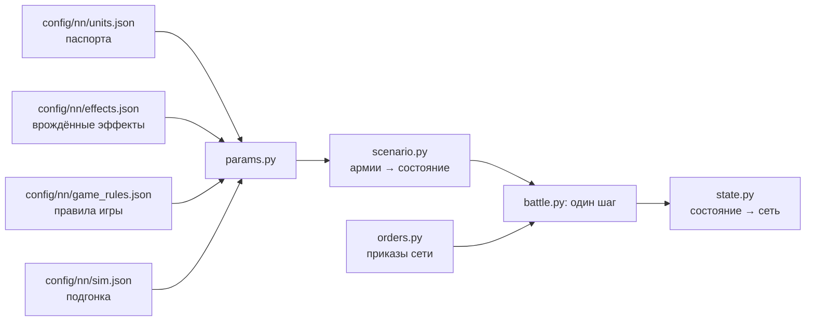

# Симулятор боя

[← Назад](README.md) · [Документация](../README.md) › [Данные для обучения](README.md) › Симулятор боя · [English](../../en/training/simulator.md)

Шаг 3 пути ([модель сети](network.md)): симулятор боя игры, в котором учится сеть.
Он играет тысячи боёв сразу на видеокарте. Каждый отряд — один объект (бойцы, здоровье,
место, направление, мораль, усталость, снаряды), а не каждый солдат. Числа взяты из
[паспортов отрядов](units.md) и [правил игры](../game/database.md); где игра ведёт себя
иначе, они подогнаны под [замеры](measurements.md). Он охватывает отряды пулов обучения на
ровной пустой карте.

## Как запустить

```bash
bash tools/nn/dock.sh tools.nn.sim.check                     # все сверки с игрой (процессор и видеокарта)
bash tools/nn/dock.sh tools.nn.sim.check --device cuda --only battles
.venv/Scripts/python -m pytest -q tests/tools/test_sim_layout.py   # без torch
```

- Код — `tools/nn/sim/` (PyTorch). Нужен torch: он есть в контейнере `snake-ai-trainer`, а в
  `.venv` проекта его нет, поэтому `tests/tools/test_sim.py` там пропускается. В образе нет
  pytest: чтобы запустить тесты в нём, положите копию pytest (из `.venv`) в `PYTHONPATH` и
  выполните `python -m pytest -q tests/tools/test_sim.py`.
- Сверка пишет `build/nn-sim/check.json` (не в Git).

```python
from tools.nn.sim import battle, replay, scenario

st = scenario.build([scenario.from_arena("whole_emp_v_skv", "attack")] * 1024, device="cuda")
battle.run(st, replay.nearest_attack)        # policy(состояние) -> приказы, пока все бои не кончатся
st.winner, st.t, st.observation()            # [B], [B], словарь [B, N]
```

## Что хранит симулятор



**Состояние** (`tools/nn/sim/state.py`, единственный источник правды): тензоры `[B, N]` —
B боёв, N мест под отряды обеих сторон (сторона 1 в первой половине, сторона 2 во второй,
лорд стороны первым; `side` = 0 — пустое место). Три группы:

- *наблюдаемые* — те же поля и имена, что в записи `nn_sample`
  ([что в записи](README.md#что-в-записи)): `x`, `z`, `b`, `men`, `hp`, `mp`, `ms`, `r`, `s`,
  `w`, `m`, `mv`, `f`, `a`, `fire`, `target` (это `t` записи), `fat` (состояние усталости
  0–5), `k`, `ox`, `oz`, `lf`, `rf`, `bf`, `vis`; время боя — `t` `[B]`. Поэтому записанные
  бои и симулятор кормят сеть одинаково;
- *постоянные* — паспорт: бойцы, здоровье, скорости, атака, защита, оружие, броня, щит,
  лидерство, снаряды, дальность, перезарядка, цена; врождённые эффекты отряда (`fx` — битовая маска
  по порядку `config/nn/effects.json`; `fxt0`, `fxt1` — его эффекты с временем) и их флаги правил;
- *внутренние* — то, что нужно только симулятору: очки морали и усталости, таймеры (способностей и
  эффектов с временем), `fx_on` (врождённые эффекты, действующие на конец шага).

**Приказы** (`tools/nn/sim/orders.py`): на каждый отряд и шаг решения `kind` — держать (0),
идти (1), атаковать (2), отойти (3), продолжать (4: нового приказа нет, действующий идёт
дальше; отряд без приказа стоит); точка `x`, `z` для «идти» и «отойти» (центр отряда); `target` —
место врага для атаки; `run` — бегом или шагом; `ability` — слот способности отряда, которую
применить сейчас (−1 — нет; необязательно: у приказов без него −1; не зависит от `kind`). Всё
`[B, N]`. Отряд выходит из рукопашной по приказу «отойти» или «идти» к точке в 10 м и дальше
(`contact.leave_m`, любой отряд), если точка лежит в сторону от каждого врага, которого он касается (больше 90°
от направления на его центр, `contact.leave_away_only`): он никого не бьёт, а враги в контакте продолжают его бить.
Приказ «идти» к точке сквозь врага (так даёт приказы планировщик CA: точка в 55–60 м) — не выход: отряд дерётся
дальше (с долей «идти» в касании). Проба P3 (`build/probes7`): копейщики, идущие к точке в 60 м сквозь
атакующих кланкрыс-копейщиков, нанесли 213 / 317 / 521 HP за 0–5 / 5–15 / 15–30 с (симулятор считал их уходящими: 0 / 0 / 98). Стрелков
сначала держат на месте 5 с (`contact.pin_s`: стоят в контакте, под ударами), потом они выходят. Отряд без
стрел держат 2 с (`contact.pin_melee_s`, проба `fatleave`: игра 1,5 / 4,6 / 9,3 м за 2 / 4 / 6 с, двойник 0 / 3,4 /
9,3 м; [ближний бой](../game/mechanics/melee.md)), лорда не держат; потом он разворачивается кругом и уходит, если за
ним не гонятся. **Погоня**
(`contact.chase`): отряд с приказом атаки на уходящего, который его касается, не стоит в касании, а идёт
следом (не быстрее своего бега) и бьёт его; так догоняемый остаётся в касании, пока окно 24 с (ниже) не
снимет его приказ. Пока уходящий отряд в контакте, урон по нему ×1,25 (без стрел) и ×0,55 (стрелки) —
`contact.leave_taken` (замер: ×1,23 и ×0,62 от урона отряда того же класса в атаке). Проба выхода из боя
(`build/movelords`): без погони отряд разворачивается за ~1,5 с и вне касания через ~4 с после приказа
(потерял 22 HP); с погоней догоняющие бегут в 10–15 м за ним (центр — центр), уходящий теряет ~22 HP/с и
24–26 с не бьёт. 46 эпизодов боёв сети (`build/open_battle/leave2.py`): уходящий движется и с погоней, и
без (10–14 м за 6 с); догоняемый в рукопашной все первые 6 с (1,00), без погони — 0,75 через 4 с и 0,58
через 6 с. Прежний замер «стоит на месте ~21 с» (163 боя сети) — от коротких эпизодов: сеть меняет приказ
за 1–2 с. Раньше симулятор давал уходящему отряду драться в полную
силу, и сеть научилась этим пользоваться ([замеры](measurements.md#выход-из-рукопашной)). Окно выхода — 24 с
(`contact.breakoff`, ключ БД `melee_breakoff_secs`): отряд, который через 24 с после начала выхода всё ещё в
контакте (часы `exit_s` идут и через разрывы касания, пока он уходит), бросает приказ (со следующего шага
«стоять») и снова бьётся (проба выхода из боя, `build/movelords`). Отряд без
стрелкового оружия (строй), стоящий в рукопашной под приказом «стоять» (без приказа атаки), бьёт с долей
`contact.hold_rate` 0,5 своего темпа — каждого врага, которого касается: зонд рукопашной — держащие отряды
бьют на 0,49–0,52 правила, отряды сети — 0,80 убийств того же отряда в атаке; правила темпа нет, число
подобрано. Так же бьёт строй под приказом «идти», который ещё в касании и не уходит (точка ближе 10 м;
`contact.hold_move`): прижатые врагом бойцы не заходят в просветы (зонд: полосы с приказом движения — 0,70
того же отряда в атаке; цель за 5–15 с теряла в симуляторе 345 HP, теперь 173, игра 180). Первый удар
стоящего и удары упёршегося отражателя долей не режутся (ниже, «Сколько бьют», «Натиск»). Лорд под «стоять»
бьёт целиком (в игре лорд без приказа бьёт по правилу). Раньше «стоять» в
рукопашной било в полную силу, и сеть стояла в 76 % своих секунд рукопашной. Приказ способности применяет готовую способность на
себя один раз (не пассивную, не действующую, перезаряженную); иначе ничего не происходит. Таймеры
способностей сеть читает из `State.observation()` (`ab{k}_on`, `ab{k}_cd` [B, N], с), а действующие
врождённые эффекты — оттуда же (`fx_on`).

## Один шаг (0,5 с)

1. Принять приказы (бегущие отряды их не слушают).
2. Контакты: прямоугольники отрядов (фронт × глубина рядов, которые заполняют бойцы) касаются.
3. Врождённые эффекты (свойства, пассивные, включаемые игрой с временем) и применённые
   способности: их статы и флаги правил держатся на этот шаг.
4. Удары в рукопашной и выстрелы.
5. Здоровье, бойцы, убитые.
6. Мораль: колебание, бегство, сбор, разгром.
7. Усталость.
8. Движение: к точке приказа или к цели, бегущие — прочь; край карты.
9. Кончен ли бой: сторона без стоящих отрядов проигрывает; через 60 минут побеждает защитник.

## Механика и откуда числа

«БД» — правила игры или паспорт; «замер» — [замеры](measurements.md) и записи; «подгонка» —
число, подобранное так, чтобы симулятор повторял игру (все они в `config/nn/sim.json` с
причиной).

| Механика | Как | Откуда |
|---|---|---|
| Скорость | шаг, бег, разгон, торможение из паспорта; бегущие с поля — 0,985 от бега с усталостью (до врождённых эффектов: бегство скавенов ×1,1 от «Удирай!») | БД; скорость бегства — замер: бегущие / бег, делённые на множитель усталости БД, — Империя 0,989–1,000 во всех 6 состояниях усталости, скавены 0,977 ([врождённые эффекты](#врождённые-эффекты)) |
| Строй | фронт заданной ширины: рядов = floor(ширина / h), фронт = ряды × h, глубина = ceil(бойцы / ряды) × v; h, v — шаг шаблона строя отряда из БД (`unit_spacings`: Империя и лорды 1,48 × 1,6 м, кланкрысы, флагелланты, ополчение 1,6 × 1,7, рабы 1,6 × 1,8, большие мечи 1,7 × 1,75, штурмкрысы 1,8 × 1,9, лучники 2,0 × 2,1, пращники и ночные бегуны 2,2 × 2,8); `formation.spacing_m` — только для отряда без шаблона; лорд — круг своего радиуса | БД; сверено с ростером (6 отрядов, 15–80 м): фронт игры (ряды − 1) × h с точностью 1,3 % (медиана), глубина (шеренги − 1) × v — 14 % (`build/meleecore/spacing_check.py`) |
| Контакт | свои стоящие строи могут стоять друг в друге, не расталкиваются (`contact.friend_push` false; записи: центры своих ближе 2 м — 0,2–0,3 % пар-секунд, стоящие вне рукопашной ближе 4 м за 5 с не расходятся — медиана 0,00 м); строи касаются, когда заходят друг в друга на 2,5 м (`contact.reach_m` −2,5); лорд — у края строя, ближе 1 м (`contact.lord_reach_m`); у уже дерущихся — ещё на 2 м; отряд выходит из рукопашной по «отойти» или по «идти» к точке в 10 м и дальше (никого не бьёт, враги в контакте бьют его ×1,25, стрелков ×0,55); стрелков до выхода держат на месте 5 с, отряд без стрел и лорда не держат; отряд с приказом атаки на уходящего идёт за ним (не быстрее своего бега) и бьёт его (погоня, `contact.chase`); кто через 24 с после начала выхода всё ещё в касании, бросает приказ и снова дерётся (`contact.breakoff`, ключ БД `melee_breakoff_secs`); часы рукопашной (`contact_s`) идут дальше через выходы из касания короче 10 с (`contact.reset_s`) | замер: в первую секунду контакта строи игры заходят друг в друга на 2,5–4,8 м (расстояние центров в парах против полусуммы глубин по шагу из БД: −2,1 / −2,9); выход и погоня — проба выхода из боя и 46 эпизодов боёв сети (выше, «Приказы»); стрелков 5 с — замер (254 эпизода; держит ли их погоня — открыто); 10 с — выходы на 4–7 с в игре не начинают бой заново (`build/cyclecharge`); 24 с — проба выхода из боя (`build/movelords`): догоняемые мечники и копейщики 24–26 с не бьют, потом бьются дальше |
| Разворот | отряд, идущий к точке не по фронту, разворачивается к ней со скоростью поворота своих бойцов из БД (`battle_entities` turn_rate: пехота и Генерал 120°/с, лучники и Варлорд 180, ополчение 240) и бежит только туда, куда смотрит: скорость к точке × cos угла между фронтом и путём, дальше 90° — стоит (`turn.move_turn`); строй разворачивается кругом на месте (первая шеренга становится последней); шаг меньше 10 м к своей точке строй делает не разворачиваясь; строй в рукопашной поворачивается не быстрее 2° в секунду (лорд — сразу); вне рукопашной стоящий строй разворачивается на месте не быстрее `turn.formation_deg_s` 80°/с, лорд — со своей скоростью поворота из БД | замер: пехота в рукопашной поворачивается на 1°/с (медиана; среднее 2,3), свободный отряд, ударенный во фланг, — на 8° за 5 с (медиана); стоящие стрелки вне рукопашной, у которых цель движка появилась в 60° и больше от их направления, смотрят на неё (в пределах 20°) через 1 с (медиана; в среднем 1,6 с при 60–120°, 1,7 с при 120–180°; ≥ 64°/с при посекундных замерах), развороты стоящих лордов — 40°/с (медиана 440, посекундно; прежняя подгонка `single_deg_s`); проба разворота (`build/movelords`, 0,25 с, места бойцов): копейщики, посланные бегом на 150 м назад, разворачиваются кругом на месте (корреляция мест по фронту −0,98) и выходят на бег через 2 с; Генерал на приказе движения поворачивается ~120°/с, Варлорд ~200°/с, оба трогаются через 1,2 с |
| Точка приказа | игра пишет центр фронта; симулятор ведёт к центру отряда, на полглубины позади | замер (копейщики 3,3–4,8 м, рабы 6,5–6,9 м) |
| Сколько бьют | 0,5 рядов фронта в контакте (ряды — длина касания / шаг отряда: h через фронт и тыл, v через фланг); на каждую сторону строя (фронт, левый и правый фланг, тыл) отряд выставляет не больше, чем она вмещает; и отряды, бьющие цель через одну её сторону, делят длину этой стороны (каждый занимает своих бьющих × свой шаг / 0,5 м, вместе не больше стороны или самого длинного одиночки; `melee.target_face_cap`; записи: двое в куче бьют цель 26,5 HP/с — как один 26,9, двое порознь 32,5, трое 29,0 / 39,4; двойник it5 с правилом 25,0 / 23,4 / 31,7 / 32,4 / 38,6); лорда бьют всего не больше 6,5 бойцов, сколько бы ни было отрядов, их темпы складываются; собираются они вокруг него за 20 с от касания (`contact.lord_gather_s`), только если лорд сам вбежал в их строй, а набежавшая на стоящего лорда пехота бьёт сразу целиком; когда на нём и вражеский лорд, пехота с долей 0,35; отряд, атакующий другого врага, бьёт лорда, которого касается, с долей 0,4; строй ближнего боя под приказом «стоять» или «идти» в касании (не уходящий) — с долей 0,5 (лорд — целиком); **первый удар**: отряд, вошедший в бой на ходу или натиском, бьёт один раз сразу каждым бойцом в касании, дальше обычный темп; так же стоящий под «стоять» отряд, до которого дошли, — бойцами в касании, смотрящими на врага (в пределах `contact.front_deg` 45° от фронта; `contact.stand_first_strike`); первый удар долей 0,5 не режется (`contact.first_strike_full`: бьёт каждый боец в досягаемости); бегущего бьют все бойцы контакта с долей 0,43 правила, сзади, без натиска; побежавший из рукопашной первые 7 с остаётся в касании и его бьют с долей 0,83 (`contact.rout_pin_s`, [ниже](#выход-бегущего-из-боя)) | подгонка по парам (0,5, 6,5, 20 с); «стоять» — замер зонда рукопашной (0,49–0,52) и убийств отрядов сети в боях ворот (выше, «Приказы»); «идти» в касании — зонд (0,70 от атаки, бойцов в 2,5 м 0,73); первый удар — правило игры (интервал идёт только после удара, CA Feature Focus #2; зонд: залп в первые 0,5–1 с; атакующий теряет в первую секунду 106–194 HP о копейщиков в упоре, 120 о мечников, 0 о цель спиной; ошибка первой секунды ударенной стороны 1,05 → 0,41); сбор вокруг лорда только при его входе — зонд «лорд в окружении» (первые 15 с 1,11 × установившегося); по сторонам — замер: уже дерущийся отряд бьёт новичка на своём фланге в 2,2 раза сильнее правила за первые 15 с (симулятор с одним общим фронтом давал 1,2); сумма — замер ([лорд в окружении](../game/units/lord-swarm.md)); 0,35, 0,4 — целые бои (ниже, «Лорда бьют несколько отрядов»); бегущий — замер (ниже, «Преследование», «Выход бегущего из боя») |
| Шанс попасть | 35 + атака + бонус натиска × остаток натиска + бонус против типа − защита × сторона, в пределах 8–90 % (вес 1); защита ×0,6 с фланга, ×0,3 с тыла (против лорда — нет, замер); фланг — центр врага дальше 45° от фронта, тыл — дальше 135° (`contact.front_deg`, `rear_deg`); попаданий в секунду у бойца строя p / (p × интервал + 0,5): интервал идёт после попадания, промах стоит 0,5 с (`melee.miss_s`); лорд по лорду — p / интервал | БД и CA (Feature Focus #2); секторы — CA (форум 10108: четверть ударенного, фронт ±45°, тыл дальше 135°); записи (135 тыс. секунд, один стоящий строй против одного): урон растёт плавно от ~45° до ~85° (0–45° 0,93–0,97 среднего пары, 45–60° 1,07, 60–75° 1,23, 75–120° 1,34–1,39, 120–180° 1,27–1,30), ступени на 60° нет; у CA правило по каждому бойцу, у нас ступень для отряда — OPEN; 0,5 с — подбор по 121 записанному бою строй на строй (`build/hitchance`); лорд по лорду — поединки ([лорды](#лорды)) |
| Урон удара | бронебойный целиком + обычный × (1 − средний бросок брони: 0,75 × броня/100 до 100, выше — 2 − 100/A − A/400), потом стойкость (≤ 90 %); урон сверх здоровья бойца пропадает — сглаженно: отряд теряет за удар hp / E[ударов на бойца], первый удар точно, дальше среднее (`melee.per_hit`); одиночка (лорд) — без перебора; то же у снарядов | БД, CA (бросок 50–100 %, перебор); сглаживание — 121 бой (`build/damage/spec.md` D3) |
| Время между ударами | `attack_interval_s` паспорта, после попадания (выше) | БД |
| Удар лорда | делится на `splash` (4), задевает в среднем 2,07 бойца (`contact.lord_splash_struck`), каждый получает ¼, потом броня и перебор; по одиночке — весь удар | БД, CA 5.1.0 (делится); 2,07 — замер, 506 ударов зонда «лорд в окружении» |
| Натиск | приказ атаки и разбег ≥ 10 м на ≥ 0,75 бега (`charge.min_runup_m`, `min_speed_share`; приказ атаки в первые 2 с касания тоже, если разбег был) дают полный бонус натиска: + к атаке (вес 1) и к урону в доле бронебойности, до 0 за 13 с на своих часах от первого удара (выход из касания их не останавливает); больше ничего. Разбег считает только скорость к цели атаки (без неё — к ближайшему врагу), бег прочь не считается (`charge.runup_towards`). Упёршийся отряд с `charge_reflection` (медленнее 0,5 м/с) бьёт атакующего натиском в пределах 80° от фронта ×2, пока его натиск ≥ 0,7 (3,9 с); эти удары долей «стоять» 0,5 не режутся (`contact.hold_reflect_full`). **Рывок натиска**: с любым приказом атаки (бегом или шагом) последние 30 м до цели (лорд 35; `charge_distance` паспорта) отряд идёт на скорости натиска — это натиск; рывка и натиска нет, если цель атаки уже в рукопашной с другим нашим отрядом — тогда подход на беге (`charge.free_target_only`) | БД и CA (13 с, 80°, ×2, 0,7; расстояние и скорость натиска — `battle_entities`); разбег и доля бега — наши (игра: «разбег, чтобы сыграть анимацию»; лорды после < 20 м или шагом всплеска не дают; Варлорд, отбежавший на ~10 м, вернулся на 1,5 м/с и ударил обычным ударом); отражение целиком — зонд (копейщики в упоре 52 HP/с за 1–5 с после натиска = правило ×2, держащие мечники 12 HP/с); рывок — зонд рукопашной (бег 3,0 → последние 30 м 3,65–3,88 м/с, атака шагом тоже); цель уже в бою — CA (WH2: натиска нет, если путь перекрыт своим отрядом); записи 221 боя: за 2 с до касания 1,09–1,12 бега в свободную цель своего приказа, 0,79–0,86 в уже дерущуюся; даёт ли вход в чужую схватку бонус натиска — открыто (проба) |
| Потери бойцов | рукопашная — **пул раненых** (`kills.wound_pool`): раненые среди живых W = бойцы × здоровье бойца − здоровье отряда не больше W* = свои бойцы в касании × (здоровье бойца − удар бьющих его, средний по здоровью) (отряд, который не отвечает, — бойцы врага, бьющие его); здоровье, потерянное сверх пула, — целые бойцы; снаряды — **равномерные попадания** (`kills.missile_uniform`): попадания на бойца пуассоновские, живых Q(K, τ), K = здоровье бойца / урон попадания, τ — из раненых отряда (`melee.shot_kills`); лорд — один пул здоровья | CA: у каждой модели своё здоровье, лишний урон пропадает; пул — ряды здоровья зонда рукопашной (флагелланты → кланкрысы: раненых на 4–7 бойцов, пока гибнут 87; рабы 10–20): убитые за 15–30 с 1,00 → 1,10 от игры, за 60–90 с 0,82 → 1,15 (ошибка 0,30 → 0,23); снаряды — проба P1 (`build/open2/poisson_test.py`): с попаданиями игры правило даёт её бойцов (180 рабов на 41 / 80 / 120 с: 146 / 70 / 16 против 133 / 68 / 22); двойник пробы после 720 стрел 42–44 бойца против 47–49 (было 86) |
| Стрельба | только стоя; первый выстрел через 3,3 с (стрелы) / 4,3 с (праща) после остановки; новый приказ (другой вид или другая цель атаки) заставляет целиться заново (`missile.aim_reset_on_order`); **дальность от центра до центра** (`missile.range_centre`; стрелок под приказом атаки идёт, пока центр цели не в дальности); у прямого огня (пистоли) — **по шеренгам** (`missile.per_man_range_direct`, `missile.rank_share`): весь отряд стреляет, пока центр цели в дальности от его первой шеренги, дальше — только шеренги, от которых до ближних бойцов цели не больше дальности; **дуга огня у каждого бойца**: боец стреляет, если часть цели в его секторе ±30° (ополчение ±35°; `battle_entities`, `missile.arc_share`), так что широкий строй по цели сбоку стреляет ближним крылом; стреляя по готовности, отряд держит своё направление, к цели приказа атаки дальше 45° (`missile.stand_fire_arc_deg`) поворачивается (Разворот), пока она не окажется в 10° (`missile.turn_done_deg`); цель держит, пока та в дальности и стоит (`missile.sticky_target`), иначе берёт ближайшую в 45°, потом ближайшую; новая цель — 3 с без стрельбы (`missile.retarget_s`), и цель, взятая, когда цели не было (`missile.retarget_from_none`); бойцы перезаряжаются всё время (и на ходу), а отряд стреляет, когда заряжены все (`missile.volley_load` 1): залпы раз в 10,0 с лучники (= база), 11,5 с праща (база 9), ночные бегуны 10,2, ополчение 10,8 (когда отряд стреляет, перезаряжаться начинают все, и те, чья линия закрыта или вне дуги; флаг `fire` между залпами горит); **флаг `fire`** (вход сети, как `IsFiringMissiles` игры) горит и пока стоящий отряд целится во взятую цель (`missile.fire_flag_aiming`; цель показывается с ним), сам выстрел так же ждёт aim_s — в записях игры флаг загорался через ~1,5 с после остановки, за 4,5 с до первого выстрела, и новый приказ почти не гасил его; **перецеливание** (`missile.reaim`): боец держит своего бойца-цель, а если тот погиб после его выстрела, целится заново (aim_s) — залп отряда ждёт aim_s × долю бойцов, чья цель погибла (поле `late`), так что интервал = перезарядка + aim_s × эта доля; по одиночке (лорду) — только перезарядка | [проба стрельбы](../game/units/missile-probe.md): перецеливание — по лорду залп целый весь бой (0,8 бойцов сразу, остальные за 1,5 с), по строю с первых смертей переходит в поток; выстрелов модель / игра к концу дорожек без него: стрелы 1,18–1,39, праща 1,05–1,13, бегуны 1,03–1,16, с ним 1,10–1,26 / 0,99–1,02 / 0,96–1,05 (стрелы ещё на ~10 % выше — открыто); первый снаряд по цели, вбежавшей в дальность, — через 1,5–2,5 с; интервалы залпов 10,0 / 11,5 / 10,5 / 11,0 с, первая стрела в 129–131 м между центрами при любой глубине цели; ополчение (дальность 90, 7 шеренг) по рабам — полные залпы на 85–90 м и 0,94–0,99 на 94,5 м (первая шеренга в 89,4 м от центра цели), на 97,6 м — ровный поток 0,54 от полного темпа 200 с (правило шеренг: 4 из 7 = 0,57; от центра — ни выстрела), доля бойцов в залпе по цели в 35° — 0,42 (узкая) и 0,93 (широкая), в 50° — 0,06, без поворота; записи: 3 с без стрельбы после смены цели, 99 % залпов в 45° от направления на цель; в бою остановка даёт 0,55–0,76 снаряда на бойца за 12 с |
| Попадания | модель разброса из базы без подгонки (`missile.hit_chance`, `missile.accuracy.plane`): снаряд целит в середину случайного бойца цели и ложится с гауссовым смещением в плоскости поперёк линии огня у цели: σ² = зона калибровки × (d / дистанция калибровки)² × (1 − (точность + меткость) / 100); на земле разброс вдоль линии σ / sin(угол падения), точка прицела на h / (2 tg угла) за ногами бойца; боец задет в радиусе или в «тени» h / tg угла; бойцы строя стоят не точно в затылок: снаряд над n шеренгами на высоте головы встречает бойца с вероятностью 1 − (1 − 2r / шаг по фронту)^n; строй — по своим рядам и шеренгам с шагом из базы (рыхлый и поредевший ловит меньше); `accuracy.units` "rates" возвращает строям прежние доли 0,42 / 0,47 / 0,5 × множитель дальности | зона калибровки — площадь в м² (моддеры: «valuated in square meters»; Empire: «area of calibration target in square metres»; точность «режет площадь на свой процент»); площадь как σ × σ — наше прочтение (круг в 1 σ даёт ошибку 0,273); закон σ ~ d подходит лучше других; проба, 27 дорожек стоящих полных целей, ошибка (среднее модуля логарифма модель / игра): 0,096 (стрелы 0,101, пистоли 0,104, праща 0,050, бегуны 0,121) против 0,171 у прежней модели на земле с подогнанным k 1,1; лучники на 50 м 0,88 (игра 0,90); открыто — поредевшая цель (проба P1), бегущая на стрелка цель ×1,2 (P3) |
| Щит, стойкость | щит держит свою долю снарядов стрелкового оружия (arrow, musket, sling, javelin, axe) в пределах 60° от фронта, и в рукопашной; от снаряда — стойкость к снарядам и физическая вместе, не больше 90 % (`missile.physical_resist`; защита `damage_mod_all` — в физической) | БД; правило — CA (Feature Focus «Damage»); проба: щит 35 % лицом пропускает 0,66, боком и спиной не работает |
| Лорд как цель | вне рукопашной — модель разброса для одиночки (круг радиуса бойца и его тень); в рукопашной его доля попаданий пропадает (`missile.single_entity_in_melee` 0), доля огня по своим идёт своим отрядам стрелка в контакте с ним, перелёт — по геометрии разброса, как у отряда | проба: Вождь от стрел 0,13 на выстрел (модель 0,13), Генерал от пращи 0,09 (0,08); в рукопашной — переигровка ворот ([лорды](#лорды)) |
| Огонь по своим | из попаданий, пущенных в отряд в рукопашной, 0,26 (стрелы) / 0,56 (праща) достаются своим отрядам стрелка в контакте с ним, по числу их бойцов (лорду среди них ×0,43, как одиночной цели) | замер: HP, которые эти отряды теряют сверх правила рукопашной, пока их сторона стреляет (1,5 тыс. + 1,3 тыс. секунд) |
| Разлёт | из той же модели разброса, что и попадания (`missile.spill_geometry`): выстрел, пущенный в случайного бойца цели, ложится с гауссовым смещением поперёк (σ) и вдоль линии (σ / sin угла падения) и последние рост / tg угла метров летит ниже головы; попадает в первого бойца на пути — цели или любого другого отряда её стороны (шеренги в этой полосе: 1 − (1 − 2r / шаг)^шеренг); отряд, чьи бойцы в полосе ближе к стрелку, берёт выстрел первым, перемешанные делят; так цель в куче получает меньше, а соседи — свою долю | без подгонки: модель разброса из базы; Монте-Карло реальных бойцов (`build/routgap/spill_mc.py`) и формула (`spill_analytic2.py`) — сосед в 4 / 11 / 18 / 26 / 37 м получает 0,76–0,90 / 0,44–0,69 / 0,23–0,52 / 0,09–0,32 / 0,01–0,14 от цели; игра (`spill_game.py`, все честные записи, вне рукопашной): 0,85 / 0,54 / 0,28 / 0,15 / 0,069 на 0–8 / 8–15 / 15–22 / 22–30 / 30–45 м; двойник 8 боёв it5 с правилом 0,86 / 0,67 / 0,36 / 0,16 / 0,13; прежние таблицы (0,115 ближе 30 м …, `missile.spill`) давали 0,24 / 0,30 / 0,18 / 0,09 / 0,064 |
| Разлёт в рукопашной (без `spill_geometry`) | из попаданий, пущенных в отряд в рукопашной, каждый отряд его стороны, тоже в рукопашной, получает 0,19 ближе 15 м, 0,047 на 15–30 м, 0,035 на 30–60 м (между центрами) | замер (`build/nn-sim/flank/spill_melee.py`): HP отрядов в рукопашной, в которые не стреляют и чья сторона не стреляет в их противников, регрессия на правило рукопашной и на попадания, пущенные в их соседей в рукопашной (74 тыс. секунд, 15 тыс. с обстреливаемым соседом; 28 боёв с ИИ игры 0,23 / 0,09, запуски сети 0,19 / 0,05) |
| Цель «по своему выбору» | цель приказа, если в дальности; иначе прежняя, пока она в дальности и стоит; иначе ближайший стоящий враг | как в игре ([урон стрелами](../game/units/missile-damage.md)) |
| Линия огня (настильный огонь) | только для настильного (прямого) огня, `missile.direct` паспорта (траектория `low`: пистоли Free Company Militia); люди стрелка целят в центр цели, свой отряд между ними (ближе края цели) перекрывает линии, проходящие через его ширину поперёк линии; перекрытые люди не стреляют; когда перекрыт весь отряд, он берёт следующую цель в дальности или не стреляет. Стрелы и пращи бьют навесом через своих; враги на линии не мешают; стрельбы через своих с возвышенности нет (карта ровная) | БД с модом True Sight, с которым идут все бои: `projectile_friendly_fire_man_radius_coefficient` 1,0 (без мода 2,2), `unit_firing_line_of_sight_considered_obstructed_ratio` 1,0 (без мода 0,75); `config/nn/game_rules.json` `_mods`; база знаний ([стрельба](../game/mechanics/missiles.md)); геометрия наша, не замерена |
| Стрельба на ходу | отряд с `mounted_fire_move` (ополчение) целится и стреляет на ходу — по целям в пределах `missile.move_fire_arc_deg` 90° от направления движения | атрибут БД; сектор — замер (наше ополчение на ходу: 0,52 полного темпа к врагу, 0,31 вбок, 0,16 от врага) |
| Пистоли | попадание — та же модель разброса; перезарядка 10,8 с, первый выстрел 3,8 с | проба: интервал залпов 10,5–11,5 с; попадания 0,87 / 0,63 / 0,53 / 0,47 на 41 / 60 / 82 / 98 м, модель 0,71 / 0,58 / 0,49 / 0,45 (настильный выстрел теряет ошибку по высоте над головами); стреляли и на 97,5 м при дальности 90, и с первого залпа потоком — дальность по каждому бойцу открыта (проба P2) |
| Мораль | очки: лидерство + эффекты; MoralePercent = очки / лидерство; сдвиг — 1 очко или 15 % разрыва за 0,5 с | БД; шаг — замер (+2 очка в секунду во всех записях) |
| Эффекты морали | лорд +4 ближе 70 м, угасая до 0 к 105 м (своим отрядам, не себе: `morale.lord_own_aura`); лорд убит (здоровье 0): остальным −16 на 45 с, потом −10 до конца; бежал за край карты: −16 на 120 с; сломлен или бежит, но на поле: только его аура (`lord_fall`); фланги прикрыты +5: ни одного стоящего врага ближе 146 м (от центра до центра) или свои отряды (не лорды) ближе 40 м с обеих сторон, и ни один фланг не под угрозой (`morale.secure`); потери −2…−74; недавние потери −6…−80 (потерянное за последние 4 с, от всего здоровья); долгие потери −4…−60 (за последние 60 с); выигрывает / проигрывает схватку +3/+6/+8, −3/−8 по отношению урона в рукопашной и стрельбой (1,5 / 2,5 / 4), пока отряд в рукопашной, стреляет или по нему стреляет враг; проигрыш — только когда отряд потерял 10 % здоровья, выигрыш — когда столько потерял враг, с которым он бьётся (`morale.combat_lost`); одиночная сущность в рукопашной — всегда −3 (`morale.single_combat`); атакован с фланга −6, с тыла −14 — пока бьют с этой стороны; натиск +15 блоками по 6 с от стойки натиска (приказ атаки, цель ближе `charge_pose` — 25 м, у лордов 30 м, из БД), второй блок сразу за первым, если отряд ещё бежит на цель или его натиск дошёл (`morale.charge`); армия разбита целиком (сила врага ≥ 2,6× своей, своя ≤ 0,22 начальной) −120; открытые фланги (враг угрожает слева, справа или сзади: `lf`, `rf`, `bf`) −3, два и больше −6; бегущие свои −3 каждый (бегущий расходный пугает только расходных); бегущие враги +2,5 каждый; под обстрелом −5 (ещё 15 с после последнего попадания); очень устал −2, измотан −6; враг, который дороже в 3 раза и больше (стоимость × здоровье), ближе 70 м −3 (`morale.strong_ratio`); у бегущего нет «прикрытых флангов», схватки, фланга / тыла, открытых флангов и натиска | очки БД; окна 4 и 60 с — БД, 15 с «под обстрелом» — пробы ([ниже](#окна-потерь-и-под-обстрелом)); когда действуют фланг / тыл, прикрытые фланги, натиск, перевес стрельбой и порог 10 % — проба морали в игре ([ниже](#мораль-по-правилам-игры-проба-морали)); пороги отношения перевеса — подгонка; падение лорда — замер ([лорды](#лорды)) |
| Состояния | колебание ниже 16 очков, бегство при 0; разгром (`morale.shatter_rules`): на третьем бегстве; когда очки дошли до дна −50 (`ums_broken_threshold_lower`) — с разгромом армии или без; бегущий на 1-м бегстве — при здоровье меньше 0,05 начального, на 2-м — меньше 0,10; несокрушимых — никогда; 10 с после сбора без обычного бегства | БД (`shatter_after_first_rout_if_casulties_higher_than` 0,05, `…_second_…` 0,1, `use_hitpoints_instead_of_casualties` 1 — по здоровью), гайд Goumin по kv_rules WH3; записи 221 боя (1-е и 2-е бегства пехоты и стрелков, волны разгрома армии исключены): все 92 + 61 разгрома на бегу выполнили одно из условий (дно 0,75 / 0,54, здоровье 0,46 / 0,84), собравшиеся — 0,000–0,003 из 3205; ниже −50 игра не опускает (разбитые стоят на −48…−50); повтор ворот (5 ворот, 28 боёв × 4): разбитых до последних 15 с 3,5 → 5,1 за бой (игра 5,2) |
| Сбор | мораль бегущего идёт к своей цели, как у всех; сбор — когда мораль выше 0, отряд бежит не меньше 18 с (`morale.rally_after_s`), ни одного живого врага — и бегущего тоже — ближе 95 м (`morale.rally_free_m`, `rally_any_enemy`, от центра до центра), нет разгрома армии; сразу, без ожидания (`morale.rally_wait_s` 0) | проба морали в игре: сбор, когда враг дальше 94–96 м, и не раньше 18,5 с от бегства ([ниже](#мораль-по-правилам-игры-проба-морали)); проба rally2 (`build/probes7`, 5 дорожек): враг в 118–130 м — сбор ровно через 18,5 с от бегства (условия держались с 15 с), враг шёл следом в 82–95 м — сбор в 21,0 с, как только он оказался в 92–96 м; записи (`build/open_battle/rally.py`): рядом с бегущим врагом ближе 95 м собрались за 1 с 0,9 % из 4285 таких секунд, без врага — 12,6 % из 17 319; от первой подходящей секунды до сбора медиана 7 с (p25 4, p75 12) — в пробе этого ожидания нет; что задерживает сбор в целых боях — OPEN |
| Усталость | Калибровка включена (`fatigue.calibration.on=true`): 10 тиков/с, пороги БД; рукопашная утомляет только по приказу атаки (одиночка +19 за тик из БД, натиск +34 — только первые 2 с контакта; отряд 13,7); Foe-Seeker, пока действует, снимает 1 % максимума в секунду (−300 очков/с, БД `fatigue_change_ratio` −0,01), движение по флагу бега приказа (бег +4, шаг −1), бегство +4, стрельба 7,5, отдых −18 без стоящего врага ближе 80 м, иначе готовность −7 | Подгонка отряда по занятиям в 204 записях; доли измотанных как в игре ([ниже](#калибровка-усталости)); одиночка и Foe-Seeker — БД, проверено пробой ([лорды](#лорды)) |
| Умения лордов | сторона, за которую играет ИИ игры (`ai`, по умолчанию сторона 2), применяет активные умения своего лорда по правилу; сторона сети — по приказу (`Orders.ability`; у стороны сети `ai` должен быть false); пассивные — врождённые эффекты (ниже). Все числа — паспорт способности (`config/nn/abilities.json`, база; `sim.json` abilities — какие моделируются и когда их применяет ИИ); эффекты на владельца (цель фазы — сам), на своих в радиусе и на врагов в радиусе: скорость, скорость натиска, атака и защита, урон, бронебойный урон, бонус натиска, мораль. Вождь: «Смертельный натиск» (31 с, снова готов через 90 с после: урон и бронебойный урон ×1,25, бонус натиска ×1,6) — ИИ никогда; «Крысиная доблесть» (17 с / 60 с: скорость ×1,25, +8 очков морали; её взрыв 25 м без урона отбрасывает бойцов вокруг Вождя — в симуляторе отброса нет, OPEN: проба T-E3 — через 2 с после каста в 6 м никого, снова в касании через ~8 с) в рукопашной; «Сплотиться» (14 с / 60 с: +16 своим в 35 м; аура, идущая за лордом: каждый шаг на своих в 35 м, пришедший получает, ушедший теряет) в рукопашной, если в 35 м не меньше двух своих отрядов. Генерал: «Стоять насмерть» (18 с / 90 с: защита +24, +16 в 35 м; накладывается один раз при касте на своих в 35 м и держится у них 18 с, куда бы они ни ушли, пришедшие позже не получают — поле базы `update_targets` 0, у «Сплотиться» и «Держать строй!» 1; записи: получившие и ушедшие дальше 40 м — 494 с включено из 498, пришедшие позже — 0 из 768) в рукопашной, если в 35 м есть свой отряд (`abilities.friends_min`; в поединке один на один — никогда); «Искатель врага» (25 с / 60 с: скорость и скорость натиска ×1,25) в рукопашной. Каждое — снова, как только готово, пока условие держится. Запускает только стоящий лорд; действующая способность продолжается, если он побежал (записи: «Сплотиться» и «Стоять насмерть» от бегущего лорда включены все секунды, как «Держать строй!»). В начале боя способность на перезарядке `initial_s` паспорта (база, `initial_recharge`: у активных лордов 0, «Сила кающегося» 3 с) | база (`config/nn/sim.json` abilities; чем владеют — по снимку ростера игры); когда ИИ их применяет — замер: 139 боёв ворот (926 применений лордов ИИ) и поединки лордов ([ниже](#лорды)) |
| Врождённые эффекты | каждое свойство и пассивная или включаемая игрой способность отряда (`config/nn/effects.json`), один механизм: действует, пока выполнены условия; его статы на владельце (у ауры ещё на своих в радиусе), его правила на шаг. Несокрушимые (флагелланты: мораль не ниже лидерства, не колеблются и не бегут), Расходные (их бегство пугает только расходных), Воодушевление (аура лорда), Отражение натиска (упор), Стрельба на ходу; «Сила в числе» (пехота скавенов: +6 лидерства, +8 к защите, скорость ×0,9, пока здоровья ≥ 50 %), «Удирай!» (скорость ×1,1 при колебании и бегстве), «Держать строй!» (+5 к защите, +4 лидерства своим в 35 м от живого Генерала — и бегущего, и на бегущих своих: записи 1 312 из 1 312 с и 2 017 из 2 017 с), Frenzy (+10 к атаке, ×1,1 урон, бронебойность и натиск, пока мораль ≥ половины лидерства), Strength of the Penitent (игра включает сама, как только готово, в рукопашной: 20 с +14 к защите, +15 % физической стойкости, кончается вне рукопашной; 3 с перезарядки стоят, только пока отряд в рукопашной выигрывает — контекст перезарядки базы `losing_melee_combat`, как его применяет игра: не выигрывает, и вне рукопашной тоже; начальные 3 с — всегда; записи: включено 70 % секунд рукопашной, перерывы ровно 3 с в 92 %; повтор записей в симуляторе 0,64 — до правки 0,13). «Раны» (Single Entity, лорды): через 5 с (начальная перезарядка из БД) после того, как здоровье впервые упало ниже 25 %, скорость ×0,9, урон и бронебойность ×0,8 до конца боя. Только схема (сеть их видит): защита от натиска больших, авангард, укрытие в лесу, Immune to Psychology | БД: паспорта, `special_ability_to_auto_deactivate_flags`, `special_ability_to_recharge_contexts`; правила свойств — база знаний; замер: скорость бегства и бега, падение морали на 50 % здоровья ([ниже](#врождённые-эффекты)); «Раны» — записи: эффект появляется через 5–6 с после 25 % у 170 из 170 лордов и держится до конца, карточка: урон ×0,80, скорость ×0,90 |
| Карта | квадрат ±1020 м; бегущий отряд, пересёкший край, уходит из боя | замер |
| Видимость | видно всё (`vis` оставлен на будущее) | ровная пустая карта |

**Почему шанс попасть почти плоский.** По правилу БД четырём парам нужно от 13 до 43 бойцов,
бьющих разом, а лорду ~38 ([замеры](measurements.md)). С плоскими ~35 % те же потери дают
12–17 бойцов на фронте 30 м во всех парах и ~8 вокруг лорда: одно число подходит всем. Поэтому
атака − защита идёт с весом 0,1 от правила. Фланг и тыл, которые пары не проверяют, подогнаны
по целым боям (ниже).

## Калибровка усталости

Усталость считается по калибровке `fatigue.calibration` (включена, `on=true`): доли измотанных отрядов как в игре. Прежняя модель (5 тиков/с, очки БД, рукопашная +19 у каждого отряда в рукопашной, готовность −7 как отдых, мёртвые и ушедшие слоты тоже считаются) осталась только для `on=false`. Пороги и эффекты БД — в обеих. Геометрия угроз включена (`threat.calibration.on=true`).

Правило (10 тиков/с, каждый отряд в одном занятии):
- рукопашная стоит очков только при приказе атаки: одиночный персонаж (`men0` ≤ 1) +19 за тик из БД ([лорды](#лорды)), отряд 13,7 (замер; усталость не считается по бойцам: отряды, у которых в касании 1–2 % или 20 % бойцов, устают одинаково — `build/movelords/fat`; отряд игры набирает ~110–120 очков/с первые ~50 с, потом ~210/с — почему, открыто);
- способность с бодростью (Foe-Seeker: `special_ability_phases` fatigue_change_ratio −0,01) снимает эту долю максимума (30 000) в секунду, пока действует, сверх занятия; в рукопашной без приказа атаки — шаг, если движется, иначе отдых −18;
- натиск +34 только с приказом атаки и только первые 2 с после первого удара натиска, у всех (`charge_s`; после касания бегом отряды игры выходят из «свежих» через 17 с — медиана 456 касаний; +34 на все 13 с натиска давало ~8 с);
- движение стоит по флагу бега приказа, какой бы ни была скорость: бег +4, шаг −1 (БД); бегущий с поля +4;
- стрельба 7,5; стоящий без незавершённого движения, атаки и прицеливания — отдых −18, если ни один стоящий враг не ближе 80 м, иначе готовность −7; мёртвые и ушедшие заморожены.

Откуда числа. Занятие каждого отряда в каждую секунду 204 честных записей разложено по классам, и очки классов подобраны так, чтобы накопление по тем же занятиям давало записанные состояния игры (`build/fat/opus/classes.py`). Рукопашная отряда с целью — 13,86 за тик, стрельба 7,15; бутстрэп 25 выборок: 13,6–14,5 / 6,5–7,6. Лорд в рукопашной соответствовал +19 БД, пока натиск лорда стоил +34 все 13 с (теперь 15 и натиск 2 с: время до первой усталости и доли «измотан» лордов ближе к игре, [лорды](#лорды)); отряды в рукопашной без цели восстанавливаются; бегство — 5,1 за тик (бег +4). Шаг: в чистых отрезках шага отрядов ИИ игры под приказом шага (2925 с) 0 переходов вверх и 6 вниз — шаг восстанавливает на −1 БД; подогнанные прежде +3,4 давали движения под приказом бега на малой скорости (`build/fat/opus/gate_check/walk_noflag.py`). Отдых рядом с врагом: стоящие отряды сети в игре восстанавливаются на 0,48 / 0,62 / 0,79 / 1,00 от отдыха −18 при ближайшем стоящем враге в 40 / 40–80 / 80–150 / 150–300 м, в симуляторе без этого правила — на 0,9–1,1 (`build/agent_fatv3/near2.py`); граница 80 м — по этому замеру, в БД её нет.

Повтор в симуляторе: оба потока записанных приказов, одна копия, без сдвига, конец на времени игры (`build/agent_fatv3`).

| Доля измотанных, % | Игра | Калибровка (сейчас) | Прежняя ×5 |
|---|---:|---:|---:|
| свои, все 204 записи | 17,34 | 17,06 | 5,66 |
| враг, все 204 записи | 28,61 | 29,05 | 9,17 |
| свои, ≥240 с | 30,29 | 29,07 | 10,05 |

Поздно в бою (ворота 20261005-161910: сеть `s6_fatigue/m20` против `ai_like` с четырёх стартов ворот, 4 копии; живые свои отряды) измотанных меньше, чем в игре, и часть успевает отдохнуть до свежих. Доли, % (измотаны / свежие):

| Время | Игра | Калибровка | Шаг +3,4, без бегства и близкого врага |
|---|---:|---:|---:|
| 0–120 с | 0,0 / 60,5 | 0,0 / 55,0 | 0,0 / 55,0 |
| 120–240 с | 2,0 / 1,6 | 5,6 / 0,5 | 6,5 / 0,1 |
| 240–360 с | 51,8 / 0,1 | 37,0 / 3,6 | 43,8 / 1,9 |
| 360+ с | 79,8 / 0,0 | 59,8 / 7,4 | 56,8 / 11,3 |

Скорость отдыха стоящих отрядов в симуляторе та же, что в игре (переходов вниз за 100 с при начальном состоянии 2–5: 2,0–2,6 против игровых 1,9–2,8), но поздно в бою наши отряды в симуляторе стоят дольше: 23 % секунд после 180 с против 13 % в записях сети из игры (отрезки стояния 120 с и дольше: в симуляторе начинаются в среднем с состояния 3,4, в игре — с 1,2). Это разница траекторий боя (кто и сколько ждёт), а не правила усталости. Повтор записанных приказов тех же четырёх боёв даёт 24,1 / 25,8 % измотанных в 240–360 / 360+ с против игровых 51,8 / 79,8 % (до правила 23,4 / 22,5 %).

Копейщики пары `pair_warlord_v_spear` изматываются на 231/232/232 с (игра 226/229/230 с; прежняя модель их не изматывала).

Сверка с игрой сейчас (замороженный набор записей, больше — лучше): механика 51/54, победители ИИ игры 23/26, бои сети 96/132 (с шагом +3,4 по скорости: 51/54, 22/26, 96/132); у прежней модели было 51/54, 20/26, 100/132. В боях сети 6 исходов потеряно и 2 получено; у большинства изменившихся доля большинства копий 0,5–0,75. Обмен на конце игры на всех четырёх воротах чуть дальше от игры (таблица ниже). Это цена калибровки; взамен усталость теперь копится как в игре (прежняя модель изматывала втрое реже).

При прежнем испытании усталости (контактная доля, «Пробовали и отказались») и включённых угрозах доли флагов в рукопашной в автономной игре сети (левый/правый/тыл): свои 0,205/0,189/0,054, противник 0,213/0,200/0,050; игра 0,181/0,259/0,072 и 0,154/0,190/0,044. Те же три контрольные точки и 18 стартов, одна копия на старт; знаменатель — стоящие не-лорды своей траектории, взвешенные временем.

Доли измотанных, %. Первый столбец — все свои входы 204 записей; второй — ещё стоящие в игре отряды `sol56` (18 боёв ворот 230630/031306/071054). Именно второй знаменатель даёт 16,7%; для стоящих во всех 204 записях игра даёт 11,5%.

| Модель | Все входы | Стоящие sol56 |
|---|---:|---:|
| game | 17.34 | 16.66 |
| final | 6.21 | 5.26 |
| incoming10 | 42.35 | 29.44 |
| contact_ready | 10.54 | 13.04 |
| contact_walk | 14.74 | 16.72 |
| clock6 | 13.45 | 9.25 |
| clock7 | 21.66 | 14.94 |
| приказ атаки, шаг +3,4 по скорости | 16.83 | — |
| приказ атаки, движение по флагу бега (калибровка) | 17.06 | — |

Распределение по состояниям во времени, %. В ячейке **игра / входящий ×10 / контакт+шаг / итоговый ×5**. Повтор обоих потоков приказов, одна копия, без сдвига, конец на времени игры; маски и секунды одинаковы, завершённый повтор сохраняет последний кадр.

| Время | Свежий | Активный | Запыхался | Устал | Очень устал | Измотан |
|---|---:|---:|---:|---:|---:|---:|
| <120 s | 76.8 / 58.9 / 59.7 / 73.9 | 19.2 / 18.1 / 22.3 / 21.1 | 3.9 / 16.9 / 17.3 / 5.0 | 0.1 / 6.1 / 0.7 / 0.0 | 0.0 / 0.1 / 0.0 / 0.0 | 0.0 / 0.0 / 0.0 / 0.0 |
| 120–240 s | 28.1 / 4.7 / 6.4 / 6.8 | 19.5 / 3.2 / 9.1 / 16.3 | 23.0 / 14.0 / 53.9 / 52.6 | 17.7 / 21.9 / 17.9 / 22.3 | 10.3 / 38.4 / 10.1 / 1.9 | 1.4 / 17.8 / 2.7 / 0.0 |
| ≥240 s | 17.0 / 4.2 / 5.7 / 3.3 | 8.8 / 1.2 / 3.4 / 2.6 | 10.4 / 3.7 / 15.2 / 14.3 | 13.5 / 5.0 / 20.0 / 29.0 | 20.0 / 17.5 / 30.5 / 39.6 | 30.3 / 68.4 / 25.1 / 11.0 |
| all | 32.5 / 16.3 / 17.7 / 19.6 | 13.4 / 5.3 / 8.8 / 9.7 | 11.7 / 8.8 / 24.1 / 20.6 | 11.5 / 8.9 / 15.3 / 21.2 | 13.5 / 18.2 / 19.4 / 22.7 | 17.3 / 42.4 / 14.7 / 6.2 |

Замороженная проверка, больше — лучше. Входящий ×10 без контактного взвешивания: 49/54, 22/26, 101/132; исходный ×5: 51/54, 23/26, 99/132. Для contact_walk отдельно проверены механика и игровой ИИ; для выбранной геометрии угроз дополнительно проверены 132 боя сети. Совместное включение описано выше.

| Модель | Механика | Игровой ИИ | Сеть |
|---|---:|---:|---:|
| contact_walk | 49/54 | 22/26 | — |
| угрозы ON, прежняя усталость | 51/54 | 20/26 | 100/132 |
| угрозы OFF, прежняя усталость | 51/54 | 23/26 | 99/132 |
| приказ атаки, шаг +3,4 по скорости | 51/54 | 22/26 | 96/132 |
| приказ атаки, движение по флагу бега (калибровка, сейчас) | 51/54 | 23/26 | 96/132 |

Обмен на момент конца игры: положительный лучше для нашей стороны; четыре копии, seed 1, оба потока записанных приказов.

| Ворота | Игра | Входящий ×10 | Контакт+шаг | Угрозы ON, прежняя усталость | Итог OFF | Приказ атаки (сейчас) |
|---|---:|---:|---:|---:|---:|---:|
| 20261004-230630 | -0.306 | -0.075 | -0.081 | -0.067 | -0.069 | -0.047 |
| 20261004-071805 | -0.260 | -0.092 | -0.090 | -0.083 | -0.091 | -0.052 |
| 20261003-204730 | -0.407 | -0.289 | -0.276 | -0.271 | -0.255 | -0.243 |
| 20261005-031306 | -0.329 | -0.097 | -0.120 | -0.093 | -0.100 | -0.088 |

## Калибровка флагов угрозы

`lf/rf/bf` — нативные `is_left_flank_threatened/is_right_flank_threatened/is_rear_flank_threatened`, переданные без изменений через companion. Симулятор использует те же три входа и те же флаги для −3/−6 за открытые фланги. События удара во фланг/тыл −6/−14 отдельно зависят от направления первого контакта, а не от флагов угрозы.

Проверены 48 сочетаний радиуса, секторов и направления врага на 18 записанных боях и исходных траекториях повтора. Кандидат: 45 м, передняя граница 60°, задняя 150°, враг смотрит на отряд в пределах 60°; геометрия после движения и поворота. Никакого случайного прореживания наблюдений. Включение не меняет адаптер игры.

Доли флагов в автономной игре сети: **левый / правый / тыл**. Исходные 108 повторов (6 на старт), кандидат 18 (1 на старт), те же три контрольные точки и 18 стартов, CPU.

| Сторона / рукопашная | Игра | До | Кандидат ON |
|---|---|---|---|
| 1/1 | 0.181 / 0.259 / 0.072 | 0.370 / 0.347 / 0.319 | 0.250 / 0.196 / 0.049 |
| 2/1 | 0.154 / 0.190 / 0.044 | 0.327 / 0.340 / 0.306 | 0.195 / 0.187 / 0.047 |
| 1/0 | 0.036 / 0.035 / 0.034 | 0.024 / 0.019 / 0.061 | 0.010 / 0.008 / 0.025 |
| 2/0 | 0.031 / 0.037 / 0.018 | 0.026 / 0.022 / 0.093 | 0.016 / 0.015 / 0.038 |

Включена только геометрия угроз: она устраняет основную ошибку тыловых входов (0,319/0,306 → 0,049/0,047 при игре 0,072/0,044). Это выбор по прямому измерению, а не утверждение о полной калибровке: механика остаётся 51/54, победители ИИ 23 → 20/26. Порог «в пределах шума» не достигнут: на исходных траекториях наш правый фланг в рукопашной 0,177 против игрового 95% интервала 0,226–0,291; вне рукопашной левый/правый 0,011/0,008 против 0,029–0,041 / 0,025–0,049. Интервалы получены бутстрэпом по боям. Артефакты: `build/agent-fatigue2`, совместная проверка и разбор ошибок — `build/agent-fatigue3`. Неизвестное поведение отдельных бойцов и вывод цели при отсутствии записанной цели остаются ограничениями; протокол повтора не изменён.

## Разгром армии

`morale.army_collapse` применяет −120 очков `ume_concerned_army_destruction`, когда
сила врага ≥ 2,6× своей и своя ≤ 0,22 начальной силы. Оба порога взяты из БД.
Сила отряда — его боевой потенциал из БД, как записанный `unit:strategic_value()`:
(`main_units.melee_cp` + потенциал его способностей + `missile_cp` × 1/(1 + e^(−14 × (доля
снарядов − 0,25)))) × доля HP (`morale.collapse.strength` "cp"). Генерал 600 + 350 = 950,
Варлорд 550 + 350 = 900, копейщики 325 при стоимости 300, лучники 100 + 250; без снарядов
лучники стоят 107. Бегущие учитываются в сумме стороны с весом 0,5; сломленные, погибшие и
ушедшие с карты — нет. Сверка (`build/movelords/cp`, 89 записанных боёв, 1,06 млн
отряд-секунд): в начале боя потенциал совпадает с записанным у всех 15 отрядов; дальше
ошибка 0,01 % (рукопашные), 0,00 % (лорды), 0,04 % (стрелки; линейная доля снарядов
ошиблась бы на 11 %). Пороги БД на этой силе ловят начало разгрома в 0,94 случаев в ту же
секунду (прежняя подгонка 0,89), в пределах 1 с — 0,90 (была 0,69), без ложных. Подгонки
`lord_value_scale` 1,65 и полы колчана 0,32 / 0,57 убраны. Параметры и обоснование —
`sim.json morale.collapse`; время конца записи и победитель в правиле не участвуют.
Открыто: в повторе записей разгром к концу боя наступает в 0,15 боёв против 0,96 в игре при
любой формуле силы — проигрывающая армия в повторе теряет здоровье слишком медленно в
последние две минуты (на начало разгрома в игре у неё в повторе ещё 0,23 силы, в игре 0,15).

Источник: 175 завершённых честных боёв (28 ИИ–ИИ, 147 сети), из них 69 с новыми
CCO-полями. В 65 сторонах `MoraleGreatestEffect` показывает «Потери армии».
На всех 350 сторонах падение MoralePercent ≥0,4 у 60% стоящих отрядов за 3 с
найдено в 135 случаях; фактическое бегство/разгром 60% за 3 с — в 80.
Детектор требует хотя бы два стоящих отряда и полное трёхсекундное окно.
Сумма strategic_value с весом бегущих 0,5 воспроизводит BalanceOfPowerPercent
со средней абсолютной ошибкой 0,00041 (полный вес: 0,0121). Пороги БД на этой силе
находят 64/65 начал в пределах 5 с, медиана ошибки 0 с; приближение симулятора —
58/65, без пропущенных начал, медиана 0 с. Три дополнительных срабатывания —
только в последнем кадре после бегства последнего стоящего отряда.
Среди 275 стоявших перед началом отрядов 271 получает этот эффект, медиана задержки
0 с. Медиана числа бегущих нерасходных друзей в 100 м — 0: это общий эффект
армии, а не распространение через соседей. Локальное бегство сохраняет свои −3
за друга, максимум четыре, радиус 100 м.

Бегущие продолжают терять мораль при разгроме армии и не собираются вдали от
врага. Отряд, чьи очки дошли до дна −50 (`ums_broken_threshold_lower`), становится сломленным
независимо от числа бегств — при разгроме армии и без него (`morale.shatter_rules`, строка
«Состояния» в [таблице механики](#механика-и-откуда-числа)): при разгроме армии этот порог пересекли все 274
записанных разгрома от «Потерь армии» до третьего бегства. Несокрушимость сохраняется. (Одно дно −50 без
разгрома армии меняло размен трёх ворот не больше чем на 0,001 — шум; правило взято по записям.)
Бегство лорда снимает только его ауру (`lord_fall`) и не заменяет разгром армии.

**Проверка на воротах** (`build/collapse`, CPU, 4 копии, seed 1, сдвиг до 2 м,
оба записанных потока приказов, состояние на времени конца игры). Потери золота —
наихудшее состояние каждого отряда до этого времени, делённое на бюджет; trade =
потери ИИ минус свои. В каждой ячейке: **игра / до / после**.

| Ворота | Trade | Свои потери | Потери ИИ |
|---|---:|---:|---:|
| 20261004-230630 | -0.306 / -0.090 / -0.094 | 0.941 / 0.747 / 0.751 | 0.635 / 0.657 / 0.657 |
| 20261004-071805 | -0.260 / -0.080 / -0.088 | 0.920 / 0.787 / 0.794 | 0.660 / 0.707 / 0.706 |
| 20261003-204730 | -0.407 / -0.252 / -0.246 | 0.957 / 0.856 / 0.857 | 0.550 / 0.604 / 0.611 |

Средняя абсолютная ошибка trade по трём воротам 0,18356 → 0,18137, но третьи
ворота ухудшились: требование сближения на всех трёх **не выполнено**. Одновременное
бегство ≥60% стоящих отрядов за 3 с (минимум два стоящих): игра 52/176 сторон,
симулятор 8/176 → 10/176. Средняя абсолютная ошибка времени среди пар с обнаруженным
событием 55,8 → 28,1 с; таких пар лишь 6 → 8, поэтому это не полная оценка времени.
По более широкому признаку падения MoralePercent ≥0,4: игра 64/176, симулятор
11/176 → 11/176. 176 — 22 боя × 4 копии × 2 стороны, записи игры повторены по копиям.
Уже к концу игры сила симулятора часто иная: в первых копиях только 3/22 своих
армий достигают найденных условий. Правильный триггер на записанном состоянии не
устраняет накопленное расхождение боя. Новое правило не использует время конца игры.
`tools.nn.sim.check` на неизменном наборе записей прежней проверки, CPU, 8 копий,
seed 0, сдвиг до 2 м:

| Проверка | До | После |
|---|---:|---:|
| Тот же победитель: ИИ игры | 23/26 | 23/26 |
| Тот же победитель: сеть | 98/132 | 99/132 |
| Механика в пределах 20% | 51/54 | 51/54 |

CPU-обвязка пропускает уже завершённые строки батча: равенство всех полей проверено
на каждом из 400 шагов, все 28 строк базовой проверки ИИ совпали с обычным исполнением.
Записи и начальные сдвиги одинаковы до/после; новые записи текущего gate не добавлялись.
105 тестов симулятора прошли. Изменение морали меняет версию симулятора и ключ кеша базовых оценок.

## Врождённые эффекты

`tools/nn/sim/effects.py`: один механизм для каждого свойства и каждой пассивной или включаемой
самой игрой способности отряда. Каталог — `config/nn/effects.json` (`python -m tools.nn.effects`,
из паспортов; [паспорта отрядов](units.md#врождённые-эффекты)): у каждого эффекта его статы,
правила, условия, таймеры и действует ли он в симуляторе (`modelled`). Ничто в симуляторе не знает
отряд или эффект по ключу.

- **Чем владеет.** `params.static` даёт каждому отряду `fx` — битовую маску эффектов, которые
  каталог связывает с ним, `fxt0` / `fxt1` (его эффекты с временем) и флаги правил его безусловных
  эффектов.
- **Условия** (каждый шаг, по состоянию на его начало): `in_melee` / `out_of_melee` (в контакте со
  стоящим врагом), `losing_melee` (контекст базы `losing_melee_combat`, как его применяет игра: не выигрывает
  рукопашную — вне рукопашной тоже; «выигрывает» = баланс боя морали прошлого шага > 0: `cmb`, очки
  из `morale.combat_points` — то же правило, что в морали, с его порогами и воротами 10 % потерь), `morale_below_half` (очков < половины лидерства), `not_wavering`,
  `hp_below_half` (< 50 % начального), `hp_below_quarter`. Эффект действует, пока выполнены все его
  `needs` и ни одно из `off_when`; свойство — всегда.
- **С временем** (Strength of the Penitent): включается сам у стоящего отряда, как только готов и ни
  одно `off_when` не выполнено (то есть в рукопашной: записи — первый запуск у 53 из 54 отрядов при
  касании, и без потерь), длится `active_s`, сразу кончается, пока выполнено `off_when`. После
  запуска его `recharge_s` убывает только на шагах, где выполнены все `recharge_needs` (контекст
  перезарядки базы: `losing_melee`; хотфикс CA 6.2.2 «перезаряжается, когда проигрывает»; «проигрывает» база называет `losing_melee_combat`; игра ведёт себя так: перезарядка стоит, только пока отряд в рукопашной выигрывает (баланс боя морали > 0), и идёт, когда он проигрывает, идёт вровень и вне рукопашной (проба T-E1: выигрывающие стоят 70 с, проигрывающие и равные — ровно 3 с; записи: 249 из 270 перерывов в непрерывной рукопашной ровно 3 с, 21 длинный — при перевесе по урону; после конца из-за выхода из рукопашной следующий запуск ровно через 3 с и вне рукопашной, 17 из 17)). Начальная перезарядка (`initial_s`) идёт всегда (`fxt{j}_used` — уже
  запускался). Слот панели способностей с его способностью (`ab{k}_on`, `ab{k}_cd`) показывает те
  же таймеры, так что наблюдение читает его как раньше. Не моделируем: движок начинает «схватку» за
  1–5 с до нашего касания — там Penitent включается раньше (в симуляторе — с касания).
- **Действие.** Пока эффект действует: множители умножаются, добавки складываются (атака, защита,
  урон, бронебойный урон, натиск, скорость и скорость натиска, очки морали, физическая стойкость до
  предела 90 %) на владельце, а у ауры (`range_m` > 0, статы на своих: «Держать строй!») — на своих в
  радиусе живого владельца, бегущего тоже, и на бегущих своих (записи: от бегущего Генерала 1 312 из
  1 312 с, на бегущих 2 017 из 2 017 с; аура лорда +4 морали — другое правило, её бегущий лорд
  теряет). Флаги правил (`unbreakable`, `expendable`, `encourages`, `reflect`,
  `fire_move`, `fatigue_immune`) держатся на шаг; их читают мораль, аура, упор, стрельба и усталость.
  Эффект лежит на живом отряде, бегущем тоже («Удирай!» ускоряет бегство). В конце шага всё
  снимается, как у применяемых способностей и усталости.
- **`fx_on`** (вход сети): эффекты, чьи условия выполнены сейчас, действуют они в симуляторе или нет
  (укрытие в лесу считается действующим: в игре так). Шаг действует по условиям на своё начало, а
  `fx_on` считается заново по итоговому состоянию шага (в рукопашной = `m`), так что сеть видит то
  же, что дают поля записи в тот же момент (отряд, дрогнувший на этом шаге, показывает «Удирай!»
  сразу, а не шагом позже).
- **Только схема** (`modelled` false, причина в файле): защита от натиска больших (больших отрядов в
  пулах нет), авангард (места даёт генератор армий), укрытие в лесу (лесов нет), Immune to
  Psychology (страха и ужаса нет). `sim.json` effects.off отключает эффект, который каталог мог бы
  моделировать (переключатель подгонки с причиной): Single Entity, чьих «скорость ×0,9, урон ×0,8
  ниже 25 % здоровья» (наше прочтение его контекста перезарядки) в записях не видно (лорды бегом вне
  рукопашной — 0,84–0,85 от бега в каждой полосе здоровья). Новый эффект, чьи статы, правила и условия у симулятора есть,
  работает без кода (тест даёт копейщикам Perfect Vigour одним каталогом).

**Проба эффектов** (06.10.2026, 2 боя, нормальная сложность: `python -m tools.nn.morale_probe run --plan
penitent,aura`; список действующих эффектов `ActiveEffectList` каждые 0,5 с; близнецы в симуляторе на тех же местах,
`build/effectsimpl/compare.md`). Игра / симулятор до / после:
- T-E1, Strength of the Penitent, доля секунд рукопашной включён: флагелланты бьют рабов в тыл (выигрывают) —
  0,19 / 0,00 / 0,22 (в игре один запуск при касании и 70 с без повтора: перезарядка стоит); на них нападают
  штурмкрысы и кланкрысы (проигрывают) — 0,88 / 0,88 / 0,88, перерывы ровно 3 с; штурмкрысы спереди — 0,88 / 0,88 /
  0,88; без врага — никогда. В игре первый запуск у выигрывающих за 3 с до нашего касания (схватка движка) — не
  моделируем.
- T-E2, ауры: шесть отрядов копейщиков вокруг Генерала, лицом и боком. «Держать строй!» — на 32,7 и 34,8 м да, на
  40,1 (боком, ближние бойцы в ~25 м), 40,7, 45,5, 46,1 м нет — во всех трёх; край — центр — центр. «Стоять насмерть»:
  ушедший с 34 на 65 м держит — 1,0 / 0,04 / 1,0; пришедший на 23 м не получает — 0 / 0,70 / 0. «Сплотиться» (аура):
  на 35,5 и 35,9 м не получают — во всех трёх; пришедший получает — 0,47 / 0,47 / 0,47. Близнецы аур стартуют с мест
  на 3 с (строй в игре оседает на 1–4 м назад за первые 2 с после телепорта) без сдвига копий: край в пределах метра.
- T-E3, взрыв «Крысиной доблести» (`python -m tools.nn.charge_probe run --plan vv`, 1 бой; контроль — Вождь на
  мечников из плана `charge`): через 2 с после каста в 6 м от Вождя 0 мечников (до каста 35), ближний в 6,5–8,6 м,
  снова в касании через ~8 с; Вождь 12 с без потерь (контроль за те же 8 с −71 HP). Отброса в симуляторе нет
  (сила взрыва в `battle_vortexs` не разобрана) — MISSING.

**Замер** (все честные записи с ключами отрядов; скорость по шагам в 1 с, не раньше
3 с бегства): бегущие отряды Империи бегут на 0,865 от бега (115 тыс. с), скавены — на 0,945 ниже
половины здоровья (186 тыс. с) и на 0,866 выше (14 тыс. с); бег по приказу без колебания выше
половины здоровья: Империя 0,97, скавены 0,88. ×1,1 «Удирай!» и ×0,9 «Силы в числе» (выше половины
здоровья) дают ровно эти отношения, но это бегущие с усталостью; делённые на множитель усталости БД, бегущие бегут на 0,98–1,0 бега, поэтому `morale.rout_speed` 0,985 от бега с усталостью ([ниже](#скорость-бегства)). Переходя 50 %
здоровья, отряды скавенов теряют за следующие 3 с на 2,3 очка морали больше, чем отряды Империи
(7,7 против 5,5 на 1 039 и 951 переходах; на 40 % и 60 % одинаково): там отключаются +6 «Силы в
числе». Прежний стартовый бонус скавенов (`morale.faction_bonus` +6, подогнанный) и был «Силой в
числе»: теперь он 0.

## Фланг, тыл и натиск в целых боях

Замер по 28 целым боям (18 зеркальных, 10 Империи со скавенами) и по их переигровкам в симуляторе
без обратной связи тем же кодом (`build/nn-sim/flank/flank.py`, не в Git). Контакт — стоящий в
рукопашной враг, край строя которого (прямоугольники симулятора по записанным местам,
направлениям и бойцам) ближе 3 м; его сторона — угол его центра от направления отряда (фронт до
60°, тыл за 120° — прежние границы симулятора, сейчас 45° / 135°). Потеря здоровья сравнивается с правилом рукопашной
симулятора для того же контакта в лоб.

| Пехота в рукопашной, один контакт, не под обстрелом | Игра | Симулятор |
|---|---:|---:|
| Секунды, где худший контакт в лоб / во фланг / в тыл | 58 / 31 / 11 % | 72 / 23 / 6 % |
| Потеря HP с фланга, × от потери в лоб (10–90 % по боям) | 1,74 (1,56–1,89) | 1,55 |
| Потеря HP с тыла, × от потери в лоб | 1,31 (1,19–1,42) | 1,50 |
| Очки морали, пока бьют с фланга / с тыла (регрессия*) | −1,0 / −1,8 | −0,8 / −4,0 |
| … поднят один / два и больше из `lf`, `rf`, `bf` | −3,9 / −8,1 | −4,3 / −7,0 |

\* Очки − лидерство против потерянного здоровья (и его квадрата), фланга, тыла, 2+ контактов,
признаков угрозы, обстрела; секунды пехоты в рукопашной (игра 30 тыс., симулятор 97 тыс.).

Новые контакты (пехоту i бьёт пехота j): HP, которые i теряет за первые 15 с, к HP, которые теряет j.

| | Контактов в игре | Игра | Симулятор |
|---|---:|---:|---:|
| j бежит, i стоит, в лоб | 102 | 0,82 | 1,44 |
| j бежит, i бежит навстречу | 104 | 0,90 | 0,91 |
| j бежит во фланг или тыл свободному i | 206 | 1,11 | 1,65 |
| j бежит во фланг или тыл уже дерущемуся i | 24 | 1,30 | 2,22 |
| j входит шагом во фланг или тыл уже дерущемуся i | 77 | 1,23 | 1,34 |
| Очки морали i через 15 с после натиска на стоящего | 102 | −6,5 | −11,3 |

- **В игре натиск даёт мало.** Отряд, принявший натиск стоя, теряет не больше атакующего
  (0,82); копейщики в упоре (`charge_reflection`, 87 из 102) — 0,80, отряды без него — примерно
  так же (1,02, 15 контактов). (Симулятор в таблице — с прежними подгонками: удар натиска 1,5 и «упёршийся встречает натиск натиском»; теперь натиск и отражение — по правилу CA, целые бои этим замером не перемерены.)
- **В игре строй в рукопашной не разворачивается** (1°/с): враг на фланге или в тылу там и
  остаётся. Симулятор поворачивает отряд в рукопашной на 2°/с.
- **По этому счёту фланг дороже тыла** (1,74 против 1,31), вопреки защите ×0,6 / ×0,3 из БД;
  прежде симулятор был подогнан под него (веса потерянной защиты 2,0 / 0,25), теперь — правило БД с весом 1: одиночный атакующий в записях даёт 1,53× / 1,92× (ниже), как в БД.
- **Одиночный атакующий с фланга или с тыла, отдельно**
  ([замеры](measurements.md#фланг-и-тыл-одиночный-атакующий): только пехота, никто не стреляет,
  контакту больше 10 с) снимает 1,53× (фланг) и 1,92× (тыл) от одиночного лобового; симулятор даёт
  0,94× / 0,99× (атакующий во фланг выставляет бойцов по короткой стороне цели, её глубине: ~4,5
  бойца против 15 при фронте 30 м). Исправление [ожидает](#ожидающие-изменения).
- **«Удар во фланг / в тыл» в записях мал**: −1 / −2 очка за контакт; −6 / −14 из БД — это один
  тик 0,5 с при первом ударе с этой стороны (так его и даёт симулятор). «Открытые фланги» — как в
  БД: −3,9 / −8,1 против −3 / −6.
- Ещё сильнее, чем в игре: натиск во фланг или тыл (1,65–2,22 против 1,1–1,3) и падение морали
  после натиска (−11 против −6,5). `lf` / `rf` / `bf` поднимаются в 1,3–3 раза чаще признаков
  игры (у игры они шумные: 0,3–0,7 при враге ближе 60 м с той стороны).

Перебор тактик против `nearest` (скрипты обучения, `build/nn-sim/flank/scan.py`: 48 боёв на
армию, роль и сторону; победы тактики; Империя / скавены — тактика играет этой армией в бою
Империи со скавенами):

| Тактика | Зеркало | Империя | Скавены |
|---|---:|---:|---:|
| сам `nearest` | 49 % | 26 % | 82 % |
| все отряды на одну цель | 32 % | 1 % | 65 % |
| стрелки стоят и стреляют | 1 % | 1 % | 88 % |
| полководец ждёт 2 минуты | 18 % | 1 % | 80 % |
| атака шагом | 0 % | 0 % | 0 % |
| сначала враги, уже занятые рукопашной | 32 % | 3 % | 46 % |
| запас ждёт, пока враг ввяжется | 3 % | 0 % | 7 % |
| `hold_shoot` | 34 % | 5 % | 70 % |
| **фланг**: пехота идёт на врага, уже дерущегося с нашими, через точку сбоку от его фланга | **69 %** | 17 % | 79 % |
| фланг с запасом | 15 % | 1 % | 51 % |

Бой Империи со скавенами выигрывают скавены (`nearest` против `nearest`: 26 % у Империи, 82 % у
скавенов; в игре скавены выиграли все 10 записанных). Фланговая тактика бьёт `nearest` в зеркале
(69 %). Ожидание (запас, шаг) проигрывает: ждущая сторона дерётся в меньшинстве.

## Лорды

- **Лорда бьют несколько отрядов** ([проба роя вокруг лорда](../game/units/lord-swarm.md), 3 боя в
  игре). Лорд в кольце из 1–4 отрядов копейщиков теряет одинаково HP/с, сколько бы их ни было
  (генерал 7,8 / 8,3 / 8,7 / 7,4, военачальник 6,2 / 5,8 / 5,1 / 4,8); в 2,5 м от него стоят 4–5
  вражеских бойцов; спина и фланги ничего не добавляют. Поэтому лорда бьют всего не больше
  `lord_max_attackers` (6,5 при шансе по базе) бойцов, с суммой; собираются вокруг него за `lord_gather_s` 20 с, только когда лорд сам вбежал в строй (набежавшая на стоящего лорда пехота бьёт сразу целиком: в зонде первые 15 с = 1,11 × установившегося; симулятор за первые 15 с 7,1–8,8 HP/с, игра 4,9–9,7, со сбором было 2,6–3,0); `lord_direction` 0; вражеский лорд среди атакующих
  сохраняет свой удар; когда на лорде вражеский лорд, пехота идёт с `lord_rival_others` 0,35;
  отряд, которому велено атаковать другого врага, бьёт лорда, которого только касается, с
  `lord_incidental` 0,4 (целые бои: 1,7 HP/с против 4,1, когда лорд его цель), а вражеский отряд,
  которого только касается, — с `unit_incidental` 1,0. Коэффициент выбран заново с
  синхронизацией фаз контакта (проверки ниже); прежняя подгонка 0,3 отклонена. Переигровка проб (`python -m tools.nn.lord_swarm --sim`; игра /
  симулятор): один отряд копейщиков 7,8 / 7,7 и 6,2 / 6,1; четыре 7,4 / 8,0 и 4,8 / 6,3; алебарды
  21,5 / 17,1 и 11,2 / 11,7; другой лорд и три отряда 29,8 / 21,8 и 27,6 / 22,4; средняя ошибка по
  24 раскладкам 18 %.
- **Лорд против лорда**: одиночка бьёт одиночку по формуле попадания из БД (35 + атака − защита), удар раз в
  интервал (p / интервал; формула БД теперь у всех ударов, промах строя стоит 0,5 с). Замер —
  поединки двух лордов одного типа одних на поле ([ИИ игры в поединке](../game/game-ai.md#лорд-ии-игры-в-поединке),
  28 боёв, удары посчитаны по скачкам здоровья, `build/lordduel/hits.py`): Генерал по Генералу — 0,103 удара
  в секунду по 245 HP (ровно паспорт: 140 бронебойного + 290 × (1 − 0,75 × 85 %)), то есть попадает 41 %
  ударов раз в 4 с (по БД 40 %: атака 55 против защиты 45 + 5 «Держать строй!»); Вождь по Вождю — 0,047
  удара по 223 HP, попадает 19 % (по БД 30 % свежим, с усталостью по карточке ~22 %). При наклоне 0,1 оба
  попадали ~35 %, и разницы типов (в игре темп Генерала в 2,4 раза выше) не было; общий множитель 0,73 её
  дать не может. Темп (% здоровья за секунду дуэли, по нашему / по чужому), игра — до — после:

  | Поединок | Игра | До (0,1 и ×0,73) | После |
  |---|---|---|---|
  | Генерал, чужой под ИИ (6 боёв) | 0,71 / 0,60 | 0,40 / 0,38 | 0,54 / 0,51 |
  | Генерал, оба под приказом (8) | 0,59 / 0,61 | 0,39 / 0,37 | 0,50 / 0,50 |
  | Вождь, чужой под ИИ (6) | 0,26 / 0,28 | 0,36 / 0,33 | 0,33 / 0,31 |
  | Вождь, оба под приказом (8) | 0,25 / 0,25 | 0,35 / 0,33 | 0,31 / 0,31 |

  Остаток: Генерал ×0,8 (дуэль в симуляторе 165–180 с против 105–125 в игре, к концу её лорды
  симулятора устают и бьют слабее, а Генерал ИИ в игре остаётся свежим: усталость 1,3–1,5 против 2–3,4),
  Вождь ×1,2 (попадает реже, чем по БД, причина не найдена — возможно, его цикл удара длиннее 4 с). Натиск
  лорда (+40 / +35 к атаке) при наклоне 1 даёт первые 5 с темп ×1,5–2; в игре такого всплеска у Генерала нет,
  у Вождя он меньше — пока оставлен.

  Вместе с правилом способностей ИИ (ниже) сверка на процессоре до / после: механика 51 / 51 из 54; бои
  ИИ игры 22 / 20 из 26 (seed 0; при seed 1 и 2 — 21 / 21 и 21 / 21: два боя на грани, доля победителя
  0,5–0,75), каждое правило отдельно тоже 20; бои сети 122 / 125 из 163. Карточка ворот 20261006-052934
  (8 копий; игра — до — после): обмен −0,241 — +0,006 — +0,021, свой лорд теряет за секунду рукопашной
  0,0068 — 0,0108 — 0,0100, чужой 0,0039 — 0,0036 — 0,0044, свой лорд погиб 0,50 — 0,42 — 0,46, чужой
  0,17 — 0,06 — 0,12, бегств на отряд свои / враг 1,48 / 0,96 — 1,11 / 1,10 — 1,15 / 1,21; всё в пределах
  шума.
- **Лорд хрупкий, как в игре** (четыре правила, у каждого переключатель в `config/nn/sim.json` с причиной).
  1. **Своя аура лорду не достаётся** (`morale.lord_own_aura` false): +4 получают его отряды, не он сам.
     Замер: лорд при полном здоровье, спокойный, со своим отрядом ближе 120 м стоит на MoralePercent 1,129
     (генерал Империи, 106 боёв: без своей ауры (70 + 4 «Держать строй» + 5) / 70 = 1,129, с ней 1,186) и
     1,083 (военачальник скавенов, 54 боя: 65 / 60 = 1,083 против 1,150).
  2. **Одиночка в рукопашной всегда «проигрывает»** (`morale.single_combat` "losing"): −3 из БД, как бы ни
     шёл размен здоровьем. Замер: мораль лордов игры в рукопашной за вычетом остальных слагаемых — −3,8 очка
     (95 % ДИ −4,7…−3,0), не зависит от размена; правило по отношению урона давало лорду +4 / +5 почти всю
     его рукопашную.
  3. **В рукопашной снаряды по лорду его не ранят** (`missile.single_entity_in_melee` 0; доля огня по своим
     и перелёт остаются). Замер (`build/shotgap/lord_shot.py`, `lord_shot_where.py`; записи игры наборов
     it3 / it4 / it5): наш лорд, у которого центр врага ближе 15 м, в секунды, когда ИИ игры тратит по нему
     снаряды, теряет −0,03 / 0,00 / +0,02 HP на выстрел сверх таких же секунд без выстрелов (по 438–612 секунд,
     22–35 выстрелов в каждой; вне контакта — 0,10–0,18 HP на выстрел); двойник с прежней 1 — 0,24 на выстрел,
     42–65 % его потерь в контакте (игра 18–33 % — это рукопашная в те же секунды). Прибавка в эти секунды
     уходит на наши отряды в 40 м и на его противников — и в игре, и в двойнике. Прежняя 1 была замерена по
     секундам, когда в него целятся стрелки (переигровка ворот: 0,62 / 0,82 % здоровья в секунду против 0,47),
     а это и самые жаркие секунды его схватки.
  4. **Усталость лорда — по БД** (с 06.10.2026: +19 за тик, подгонка `single_combat` 15 убрана; натиск +34
     только первые 2 с контакта). Подгонка 15 прикрывала пропущенную бодрость Foe-Seeker: он снимает 1 %
     максимума в секунду (БД `fatigue_change_ratio` −0,01). Проба (`build/movelords`): Генерал рубит
     кланкрыс, Foe-Seeker через 50 с после касания — «запыхался» на 19,5 с, «устал» на 91,5 с; правило
     (+190/с, −300/с на 25 с) даёт 90,5 с, без бодрости было бы ~51 с. Одиночные лорды в рукопашной в пробах
     набирают 186–200 очков/с (= +19 за тик). Прежде (подгонка 15 и натиск 2 с,
     а не все 13 с, пока длится натиск): Замер: лорды игры
     впервые устают через 62 / 60 с рукопашной (наш / ИИ, медиана по воротам), симулятор до правила — через
     37 / 47 с, с правилом — 55 / 72 с. Повтор 204 записей, доля секунд лорда «измотан» (наш / ИИ): игра 22,0 / 22,9 %, до правила
     24,1 / 41,8 %, только натиск 2 с — 17,3 / 34,1 %, и 12 за тик — 8,5 / 15,9 %, и 15 — 13,6 / 25,3 %
     («устал и хуже»: игра 46,0 / 48,4 %, до 49,7 / 64,6 %, с 15 — 45,7 / 59,5 %). Взято 15: наименьшая сумма
     ошибок. Лорд ИИ в переигровке остаётся более усталым, чем в игре, при любом темпе (он больше дерётся).
     Доля измотанных всех отрядов в том же повторе сдвинулась: свои / враг 14,9 / 25,8 % (до 16,4 / 28,2 %,
     игра 17,3 / 28,6 %) — это лорды и косвенно отряды без лордов: 15,6 / 26,8 → 15,1 / 25,9 % (игра
     16,9 / 29,2 %; сдвиг отрядов дают правила 1–3, не усталость лорда).
  5. **«Раны» включены** (Single Entity, с 06.10.2026): через 5 с после того, как здоровье лорда впервые
     упало ниже 25 %, его скорость ×0,9, урон и бронебойность ×0,8 до конца боя (`effects.py`
     `quarter_delay`, состояние `low_s`). Записи (`build/movelords/lords`, 301 лорд ниже 25 %): эффект в
     списке активных у 170 из 170 лордов, проживших ещё 6 с, через 5 с (154) или 6 с (16), никогда выше
     25 %, держится до смерти или ухода с карты; карточка: урон ×0,800 (3 из 3), скорость ×0,90.
  6. **Первый удар Генерала не запаздывает.** В пробе рукопашной он бьёт в том же отсчёте, в котором
     начался контакт (60–118 HP, 1–2 бойца), дальше раз в 4,0–4,5 с; «0 HP за 0–1 с» в прежней сверке —
     окно начиналось с отсчёта контакта и пропускало этот удар (теперь окно с отсчёта до него).
  7. **Остальные подгонки лорда остаются замерами**: `lord_max_attackers` 6,5, `lord_gather_s` 20,
     `lord_reach_m` 1, `lord_incidental` 0,4, `lord_rival_others` 0,35, `lord_direction` 0 — правила игры
     не нашлось ни в сети, ни в БД (`sim.json contact.why`).

  Вместе на переигровке ворот наш лорд бежит хотя бы раз в 0,44 боёв (до 0,30, игра 1,00), убит к концу
  записи в 0,06 (до 0,02, игра 0,14), здоровья к концу 0,30 (до 0,35, игра 0,11). Сверка: механика 51 / 54 (как
  была), бои ИИ игры 21 → 22 из 26, бои сети 114 → 118 из тех же 157 (теперь записей 163: 122 / 163).
  Карточка ворот 20261005-161910 (8 копий): обмен +0,078 → +0,037 (игра −0,385), бегств на отряд свои /
  враг 0,91 / 1,15 → 1,04 / 1,08 (игра 1,52 / 0,58), свой лорд погиб 0,25 → 0,22 (игра 0,75; шум 0,25).
- **Падение лорда** (`morale.lord_fall`). Аура уходит при любом падении. **Убит** (здоровье 0):
  остальные отряды его армии получают «лорд недавно погиб» (−16 из БД) на 45 с (`recent_s`), потом
  «лорд мёртв» (−10) до конца боя. **Бежал за край карты** (ушёл живым): «лорд недавно бежал» (−16 из
  БД) на 120 с (`fled_s`), потом ничего. **Сломлен или бежит, но на поле**: только аура (`routed` 0). Замер в игре
  ([lord_fall](../apps/entries.md#lord_fall), 15 боёв): отряды вне ауры и вдали от врага при гибели
  теряют −3 / −7 / −13,5 / −16 очков через 1 / 2 / 5 / 10 с, держат −16, в 45,5–46 с эффект
  сменяется на «лорд мёртв», с ~50 с до конца записи стоят на −10 — у всех трёх фракций одинаково;
  нарастание — это сам шаг морали, поэтому очки — ступенька. При бегстве (Империя, скавены) те же
  отряды не теряют ничего; во всех 75 записанных падениях в честных боях лорд был сломлен при
  2–50 % здоровья (ни один не убит), и его стоящие отряды теряли −3 / −4,7 / −4,8 очка через
  2 / 6 / 10 с — примерно ауру. Уход за край — по записанным боям (`build/prespec/specs.md`, раздел 1):
  сломленный лорд, ушедший с карты (4 случая), даёт «лорд недавно бежал», стоящие отряды −14…−17 очков
  за 10 с, эффект держится ~120 с (2 случая с замеренным концом — уверенность средняя), «лорд мёртв» за
  ним не следует. Бежавший лорд Графов-вампиров рассыпается и гибнет через 8–8,5 с, и
  армия получает удар гибели: `rout_death_s` 8 у фракции (в данных симулятора Графов-вампиров нет —
  только настройка). Те же бои в симуляторе (`build/lorddeath/sim_fall.py`, Империя и скавены), очки
  через 1 / 2 / 5 / 10 / 20 / 40 / 60 с после гибели:

  | | 1 | 2 | 5 | 10 | 20 | 40 | 60 |
  |---|---:|---:|---:|---:|---:|---:|---:|
  | вне ауры: игра | −3 | −7 | −13,5 | −16 | −16 | −16 | −10 |
  | вне ауры: симулятор | −4,4 | −7,6 | −14 | −16 | −16 | −16 | −10 |
  | вне ауры: симулятор до правила | 0 | 0 | 0 | 0 | 0 | 0 | 0 |
  | в ауре, в рукопашной, минус контроль: игра | −6,4 | −9,3 | −16,5 | −16 | −16,9 | −19,1 | −13,5 |
  | то же: симулятор | −5,5 | −9,6 | −16 | −20 | −20 | −20 | −14 |
  | то же: симулятор до правила | −2 | −4 | −4 | −4 | −4 | −4 | −4 |

  Обвал армии — дело [правила разгрома армии](#разгром-армии), а не лорда.
- **Умения лордов** (`tools/nn/sim/abilities.py`). Когда их применяет ИИ игры — замер по активным эффектам
  (`nn_effects`) 139 боёв ворот (85 Генералов, 54 Вождя, 926 применений; `build/lordduel/abilities/`):
  «Искатель врага» и «Крысиная доблесть» — в рукопашной (правило совпало с 218 из 318 и 182 из 245
  применений, ложных секунд 19 / 13; прежнее «враг ближе 60 м» — 160 / 119, ложных 2050 / 1537 с): ~30 %
  при контакте, ~40 % сразу, как снова готовы, остальное за несколько секунд до контакта (медиана 12 м);
  «Стоять насмерть» — в рукопашной со своим отрядом в 35 м (136 из 206; без отряда — 116, ложных 3014 с);
  «Сплотиться» — в рукопашной с двумя своими в 35 м (69 из 157 — подходит хуже всех: дрогнувший рядом был
  лишь при 27 % применений; прежнее «кто-то дрогнул» — 24); «Смертельный натиск» — ни разу (условие
  «в рукопашной» было верно 10 588 готовых секунд в 53 из 54 боёв). В поединках один на один ИИ применяет
  только скоростные умения: при контакте и снова через 77–86 с. Здоровье лорда ни на одно не влияет.
  Планировщик CA на стороне 1 записанных целых боёв активных умений не получает. Сторона сети применяет
  их по приказу.
- **Выстрелы по лорду в толпе.** Пращники ИИ игры стреляют в генерала, дерущегося среди своих
  копейщиков, и промахи падают на этих копейщиков: разлёт достаётся и отрядам цели в рукопашной
  (таблица выше). Один записанный рой, переигранный 8 раз: наши потеряли 12,2 тыс. HP (в игре
  14,7 тыс.), военачальник 2,5 тыс. (в игре 1,6 тыс.).

## Преследование, бегство и окна потерь

Восемь правил, замеренных по записям игры (`build/prespec/batch2.md`, `build/prespec/specs.md` п. 2 и 3, `build/routgap`).
Каждое — переключатель в `config/nn/sim.json` с причиной.

### Преследование

Отряд, который касается только бегущих врагов, раньше не наносил им **никакого** урона: часы
контакта считают только стоящих врагов, поэтому доля введённых бойцов оставалась 0. Теперь по
бегущему бьют все бойцы контакта с долей `contact.pursuit_rate` **0,43** правила, сзади, без натиска.
Замер в игре (171 бой): цель, за которой гонится один отряд (центры ближе 12 м), теряет бегущей 18,1 HP/с
(6 090 с), стоящей в рукопашной — 28,4 (54 292 с): 0,64 (95 % ДИ 0,56–0,75); первые 5 с погони бьют так же,
как дальше (17,9 против 18,2), то есть всплеска натиска нет. Число подобрано той же мерой на боях
ворот в симуляторе (8 копий, со всеми правилами этого раздела): доля 0,35 / 0,65 → 0,55 / 0,90 от
стоящей цели, между ними линейно, 0,43 даёт 0,64. При прежней скорости бегства 0,86 те же 0,64 давала
доля 0,65: теперь бегущие убегают почти так же быстро, как бегут преследователи, и секунды в 12 м — чаще
первые секунды бегства. Доля — относительно своей рукопашной (стоящая цель в симуляторе теряет 33 HP/с
против 28,4 в игре); в абсолютных HP/с игре (18,1) отвечает уже 0,35.

### Выход бегущего из боя

Отряд (не лорд), побежавший из рукопашной, ещё `contact.rout_pin_s` **7 с** остаётся в касании: проверка
касания не считает путь, который он пробежал с начала бегства (`rpin_d`). Враги, с которыми он дрался,
продолжают его бить — с долей `contact.rout_pin_rate` **0,83** правила (сзади, без натиска), и он считается в
рукопашной (флаг `m`). Скорость он набирает по `contact.rout_pin_speed`: доля своей свободной скорости бегства
по секундам 0,41 / 0,66 / 0,77 / 0,81 / 0,87 / 0,92 / 0,97 / 1,0. Через 7 с — обычное бегство и преследование
(0,43, выше).

Замер (`build/routgap/rout_exit_game.py`, `contact_after*.py`, `flag_rate*.py`; все честные записи — 216 боёв,
3 987 бегств из рукопашной): в игре флаг рукопашной у бегущего держится после начала бегства p10 / 25 / 50 / 75 /
90 = 2 / 5 / 7 / 12 / 25 с (среднее 11,8; 0 с — 7 %), и без погони тоже (763 бегства, за которыми никто не
гонится первые 5 с: медиана 6 с, 4 с и дольше — 0,73). 7 с — медиана: длинный хвост (19 % дольше 15 с) — это
погони, а их симулятор держит касанием самих преследователей. Пока флаг держится, бегущий теряет 0,239 %
здоровья в секунду — 0,77 от потерь стоящего отряда в рукопашной (0,311 %/с); 0,83 — доля, при которой двойник 8
боёв it3 даёт те же 0,77 (0,43 → 0,54, 0,61 → 0,63, 0,90 → 0,81, между ними линейно). Скорость — та же выборка
(2 013 бегств): 1,43 / 2,25 / 2,60 / 2,80 / 2,97 / 3,01 / 3,14 / 3,19 м/с по секундам от начала, доли своей
свободной скорости (с 15–30 бегства, врагов ближе 40 м нет) — выше. Первую секунду симулятор медленнее игры
(0 против 0,41: бегущий сперва разворачивается — `turn.move_turn`), с 3-й секунды совпадает. До правила
бегущий выходил из касания за 1 с (флаг p90 1 с), за первые 5 с терял 0,005–0,007 здоровья против 0,014 в игре.

### Скорость бегства

Бегущий отряд бежит на `morale.rout_speed` **0,985** своего бега — бега **с усталостью**. Прежние 0,86
были медианой бегущих из записей, а бегущие почти все устали: усталость считалась дважды. Делённые
на множитель усталости БД, бегущие Империи бегут на 0,989 / 1,000 / 0,994 / 0,997 / 0,992 / 0,990 от
бега в каждом состоянии усталости (от свежих до измотанных, 13–49 тыс. с каждое), скавены — 0,977
от «бег × «Удирай!» × «Сила в числе» × усталость» (132 тыс. с).

**Бегущий в толпе** (`morale.rout_crowd`). Бегущий отряд среди других отрядов тормозится их бойцами — мягкое
столкновение моделей (в базе числа нет): его скорость бегства × доля по числу стоящих отрядов (и лордов), чьи центры
ближе 15 м: своих 0 / 1 / 2+ — 1 / 0,73 / 0,46, вражеских — 1 / 0,84 / 0,55; берётся меньшая; не в выходе из боя
(у того свой разгон). Замер (`build/routgap/router_crowd.py`, все честные записи, бегущие на 3–30 с бегства, скорость /
бег по карточке, медиана): никого рядом — 0,93 / 0,94, один свой — 0,68, два и больше — 0,43, один вражеский — 0,79,
два и больше — 0,51; доли — эти числа, делённые на свободные 0,93 / 0,94. До правила двойник наборов it3–it5 давал
0,91 / 0,83 (свои) и 0,84 / 0,79 (враги): бегущие сети в толпе были 28–35 % времени в игре и 13–14 % в двойнике,
собирались через 54 с (скавены, медиана) против 31 с, враг ближе 95 м — 79 % времени после 18 с бегства против 48 %
(`build/routgap/rally_an.py`).

### Окна потерь и «под обстрелом»

- **Недавние потери** — HP, потерянные ровно за последние `morale.casualties_s` **4 с**; **долгие
  потери** — за последние `extended_s` **60 с** (скользящие окна, `casualties_window` "sliding": состояние
  хранит потери каждого шага за 60 с, `lost_hist`). Очки — из БД (недавние 6 / 10 / 15 / 33 / 50 % → −6 …
  −80, долгие 10 / 15 / 33 / 50 / 80 % → −4 … −60).
- **«Под обстрелом»** (−5) держится `morale.under_fire_s` **15 с** после последнего попадания.

Пробы в игре (посекундно): флаг игры «атакован снарядами» гаснет ровно через 15 с после последней
потери здоровья в 9 обстрелах из 9, и мораль начинает расти в ту же секунду; «потеряно недавно» после
залпа держится 3 выборки и падает в 0 — ровное окно ~4 с, как пишет БД. Прежнее одно затухающее окно
30 с подгоняли, пока «под обстрелом» горел 2 с, и оно его заменяло. Только вместе правила держат
стрельбу: мишень лучников колеблется после первого выстрела через 46 с (игра 39), только с 15 с — через
25 с; мишень пращников — 173 с (игра 154).

### Расходные, стойкость, сильный враг

- **Расходные** (рабы скавенов): бегущий расходный пугает (−3, «бегущие свои») только других расходных
  в 100 м (`morale.expendable_scares_expendable`), обычных — нет. Описание свойства в БД; записи:
  расходный, рядом с которым побежал расходный, −3,0 очка за 4 с (медиана, 350 случаев), обычный — 0,0 (178).
- **Физическая стойкость против снарядов** (`missile.physical_resist`): урон снаряда режут стойкость к
  снарядам и физическая вместе, не больше 90 % (CA: физическая — от любого немагического урона).
  Сейчас это ночные бегуны (20 %) и «Сила кающегося» (+15 %).
- **«Сильный враг ближе 70 м»**: −3 из БД (`enemy_morale_penalty_value_min`), если стоящий враг ближе 70 м
  дороже отряда в `morale.strong_ratio` 3 раза и больше (стоимость × здоровье); скорость не нужна. Проба
  морали: лучники рядом с Вождём (1,5×) и ночными бегунами (1,3×), копейщики рядом с крысами (1,2×) — 0; рабы
  рядом с мечниками (3×) −3 / −4, рядом с Генералом (4,8×, он медленнее рабов) −7 на 65 м и −9 на 45 / 30 м.
  Шкала до −24 по «боевой силе» 4…32 и действие дальше 70 м (у Генерала с ~120 м) не моделируются: формулы
  нет (искали 06.10.2026).

### Мораль по правилам игры (проба морали)

Пачка морали 06.10.2026 (`morale.py` `terms`, `battle.py`; числа и «почему» — `sim.json` morale): каждый член морали
— когда он действует в игре, по пробе морали (7 боёв, нормальная сложность, `tools/nn/morale_probe.py`,
[мораль](../game/units/morale.md#проба-морали-в-игре)); у каждой дорожки — близнец в симуляторе с теми же местами и
приказами (`python -m tools.nn.morale_probe report --sim`). Убраны подгонки `attacked_event`, `attacked_flank`,
`attacked_rear`, `rally_rule`, `rally_mp`, `rally_rate`, `rally_gap_mp`, `rally_target_min_mp`, `rout_floor_mp`,
`strong_enemy_points` ([«Пробовали и отказались»](#пробовали-и-отказались)). Новые замеры: `secure` 146 / 40 м,
`charge` 6 с × 2, `combat_lost` 0,1, `rally_free_m` 95, `rally_after_s` 18, `strong_ratio` 3; из БД — `charge_pose`
(`charge_distance_adopt_charge_pose`, паспорт отряда).

| Проба (очки = MoralePercent × лидерство) | Игра | Симулятор до | После |
|---|---|---|---|
| Копейщики в рукопашной до удара во фланг (5–18 с) / то же с двумя своими по бокам | 58–60 / 65 | 54 / 59 | 60 / 65 |
| Удар в тыл: очки через 8 с / перед отходом / через 20 с после | 28 / 28–33 / 47 | 43 / 41 / 44 | 29 / 27 / 44 |
| Удар во фланг: через 8 с / перед отходом | 36 / 36 | 43 / 43 | 37 / 37 |
| Натиск: начало до касания, длина | −4,5…−6,5 с, 12 с | нет | −5,5…−7,5 с, 12 с |
| Лучники стреляют без ответа, 15–30 с / 30–40 с / 40–50 с | 56–58 / 53 / 50 | 50 / 50 / 50 | 58 / 52 / 50 |
| Копейщики под пращами, 15–30 с / 30–40 с | 48 / 45 | 49 / 44 | 43 / 42 |
| «Прикрыты»: враг 150 м / 130 м; один сосед сбоку при 130 м | 65 / 60; 60 | 60 / 60; 65 | 65* / 60; 60 |
| Бегущий через 10 с после бегства; сбор через … с от бегства | +5…+9; 18,5–24,5 | −12; 23–35 | −5; 27–28 |
| Сильный враг: Генерал у рабов (4,8×) / мечники (3×) / Вождь у лучников (1,5×) | −9 / −3…−4 / 0 | −3 / −3 / −3 | −3 / −3 / 0 |

\* в близнеце враг встаёт на 144 м (в игре на 150 м): +5 там уже нет; правило — 146 м.

Сверка (тот же набор записей): механика 29 → 24 из 54, бои ИИ игры 18 → 16 из 26, бои сети 132 → 132 из 165;
бегств / сборов за бой 19,6 / 11,9 → 16,8 / 9,4 (игра 22,5 / 13,0), сбор (медиана) 40 → 35 с (игра 44); потери
здоровья через 60 / 120 / 180 с после касания: Империя 0,253 / 0,419 / 0,528 (игра 0,246 / 0,413 / 0,528; было
0,259 / 0,424 / 0,543), скавены 0,197 / 0,339 / 0,435 (игра 0,212 / 0,342 / 0,421; было 0,202 / 0,353 / 0,453).
Переигровка ворот (4 ворот × 6 копий, отряды ИИ): снова бегут через 10 / 20 / 30 / 45 с после сбора 0,11 / 0,18 /
0,28 / 0,40 (игра 0,07 / 0,13 / 0,16 / 0,23; было 0,37 / 0,41 / 0,44 / 0,49), сборов / повторных бегств на отряд
0,61 / 0,45 (игра 0,61 / 0,42; было 0,61 / 0,47), здоровье при сборе 0,33 (игра 0,32; было 0,24), MoralePercent
через 0 / 5 / 10 / 20 с после сбора 0,18 / 0,23 / 0,29 / 0,30 (игра 0,17 / 0,22 / 0,29 / 0,35).

**Пачка движения, лордов, разгрома, усталости и выхода из боя (06.10.2026, `build/movelords`).** Сверка (тот же
набор записей, видеокарта): механика 24 → 24 из 54, бои ИИ игры 16 → 15 из 26 (одна арена с ничьей копий 0,5 → 0,62
за другую сторону), бои сети 132 → 137 из 165 (9 перевернулись: 7 к игре, 2 от неё); бегств за бой 16,8 → 17,0
(игра 22,5), длина боя 542 → 516 с (игра 613); потери через 60 / 120 / 180 с: Империя 0,250 / 0,414 / 0,534,
скавены 0,192 / 0,339 / 0,439 (игра 0,246 / 0,413 / 0,528 и 0,212 / 0,342 / 0,421). Близнецы проб — в отчёте
пачки: разворот кругом копейщиков (доля бега за 1-ю / 2-ю с: игра 0,26 / 0,88, было 0,75 / 1,0, стало 0,25 / 1,0),
Генерал назад (0,20 / 0,58 / 0,93; было 0,44 / 0,94 / 1,0; стало 0,15 / 0,74 / 1,0), выход из боя с погоней
(удары уходящего мечника за 26–50 с: игра 5 убитых / 538 HP, было 0 / 0, стало 3,7 / 384), Foe-Seeker (от
«запыхался» до «устал»: игра 72 с, было 40, стало 71).

Открыто (не подгонять): в паре копейщики — клановые крысы без прежних −3 «сильного врага» копейщики колеблются на
313 с (игра 251), крысы бегут на 343 (в игре не бегут) — проба показала, что игра этих −3 не даёт (копейщики рядом
с крысами 0, в рукопашной 60 очков ровно до 10 % потерь), причина в другом; мишень лучников колеблется через 21 с
(игра 39, было 32): −8 «проигрыша» под обстрелом верное, но урон лучников в симуляторе в 1,5 раза выше игры (открыто в
стрельбе); уровень проигрыша (в одной дорожке игра −8 при отношении 0,32, правило −3 выше 1 / 4); шкала сильного
врага до −24 и его действие дальше 70 м; рабы в пробе сбора бегут позже, чем в игре (247 против 179–212 с), и
теряют больше здоровья (70 против 61 %), отчего их цель при бегстве ниже (−5 против +9).

### Переигровка: пауза флага рукопашной

У отрядов планировщика CA и ИИ игры (не «уходящих», не лордов) пауза флага рукопашной до
`replay.MELEE_GAP` 20 с, пока отряд стоит в пределах `replay.STAY_M` 10 м от места, где флаг погас,
считается рукопашной: переигровка даёт «атаковать ближнего», а не «идти» к далёкой точке. В паре
копейщики — клановые крысы флаг гаснет на 18 с и 1 с, а копейщики стоят на месте с точкой приказа
в 23–26 м (та же точка весь бой). Раньше переигровка уводила их из боя и вводила обратно с натиском;
с удержанием 20 с они стояли бы не нанося ударов (урон крысам 13,7 HP/с, игра 20,6). С правилом — 18,9.
Лорды выходят из боя по-настоящему: их паузы остаются (иначе военачальник терял 6,8 HP/с против 5,5 в
игре).

### Что изменилось в сверке

Тот же набор записей до и после (26 боёв ИИ игры, 157 решённых боёв сети), процессор:

| | До | После | Игра |
|---|---|---|---|
| Механика: в пределах 20 % | 51 / 54 | 51 / 54 | |
| Тот же победитель: бои ИИ игры | 23 / 26 | 21 / 26 | |
| Тот же победитель: бои сети | 114 / 157 | 114 / 157 | |
| Копейщики — клановые крысы: крысы теряют, HP/с | 16,9 | 18,9 | 20,6 |
| Мишень лучников колеблется / бежит после первого выстрела, с | 35 / 69 | 46 / 69 | 39 / 71 |
| Мишень пращников колеблется / бежит, с | 154 / 184 | 173 / 184 | 154 / 177 |
| Карточка ворот 20261005-161910: бегств на отряд, свои / враг | 0,95 / 1,12 | 0,91 / 1,15 | 1,52 / 0,58 |
| … обмен золотом | +0,062 | +0,078 | −0,385 |
| … бегущий теряет здоровья за бегство, свои / враг | 0,075 / 0,085 | 0,068 / 0,075 | 0,11 / 0,14 |
| … бегущий / стоящий от одного преследователя | 0,15 | 0,70 | 0,64 |

На карточке разрыва всё в пределах шума (шум бегств на отряд 0,3–0,4): эти правила убирают то, чем
сеть пользовалась в симуляторе бесплатно (уход из рукопашной, неуязвимость бегущих), а разрыв по
бегствам — в другом месте (ниже, «Чего нет»: сбор и новое бегство). Подгонки (`hold_rate`, `unit_incidental`)
не меняли: механика держится без них.

## Сверка с игрой

Сравнение вариантов синхронизации ниже выполнено до добавления стратегической силы армии.
Проверка коллапса до изменения усталости — [«Разгром армии»](#разгром-армии);
текущая сверка — [«Калибровка усталости»](#калибровка-усталости).

`python -m tools.nn.sim.check`: каждый записанный бой переигрывается в симуляторе с записанного
начала по записанным приказам (`tools/nn/sim/replay.py`: цель, с которой дрался
или по которой стрелял, → атаковать её; в рукопашной без записанной цели → атаковать ближайшего
врага (планировщик CA оставляет цель пустой в ~70 % секунд рукопашной, ИИ игры — в ~6 %), а отряд сети —
стоять (у её приказа атаки цель движка записана в 97 % секунд рукопашной, так что без цели он под её
«стоять»); иначе →
идти в точку приказа), записывается раз в секунду как запись игры и меряется тем же кодом, что и
игра (`tools/nn/measure.py`). Переигровка пары или стрельбы идёт по последним записанным приказам,
пока отряд не побежит; целый бой останавливается, когда кончилась его запись, и сравнивается в
этот момент (если он не кончился, победителем считается сторона, у которой больше здоровья в
стоящих отрядах). Каждый записанный бой играется 19 раз с начал, сдвинутых до 2 м; победитель
симулятора — по большинству копий (ничья — половина совпадения); главный счёт — доля значений игры
внутри 90 % интервала копий ([ниже](#счёт-сверки-симулятор-как-прогноз)). Отряд в рукопашной без записанной цели, чья записанная точка в 10 м и
дальше, идёт туда (выходит из боя), только если эта точка — действующий приказ «идти»: отряды сети
и стрелки; отряды ближнего боя планировщика CA и ИИ игры дерутся дальше. Бои сети против ИИ игры
(ворота: созданные армии) считаются отдельно; нападающий записанного боя берётся из ролей манифеста
(`scenario.attacker_of`).

**Синхронизация контакта.** У каждого отряда и каждой копии боя свои часы записи. Бег или
атака перед записанным контактом продолжаются до фактической рукопашной в симуляторе; после
начала бега его признак не снимается до контакта. До ожидаемого контакта сохраняется записанный
маршрут. Если контакт опаздывает, отряд идёт к противнику, определённому по записанной схватке,
вместо остановки у его прежнего места. Цель атаки сохраняется на протяжении этой фазы и
записанной схватки, пока противник стоит. Обычная стрельба не ждёт рукопашной. **Лорды** (одиночки)
этих часов не держат: их записанные приказы идут по записанному времени, без ожидания касания и
разделения (`replay.LORD_PHASES` False). Лорды игры выходят из боя 1,3 раза в минуту и меняют цели; лорд,
чьи часы ждали, ещё исполнял старый приказ по другому отряду в 0,28 секунд, когда в игре вражеский лорд
бился с нашим. Это правило переигровки (инструмент сверки), не симулятора.

**Стрелок, чья цель побежала только в симуляторе** (`missile.replay_router_release` 1, тоже правило переигровки):
записанный приказ «атаковать» стрелка по отряду, который бежит в симуляторе, а в записи в эту секунду стоял,
снимается — стрелок стреляет по своему выбору («стоять»: ближайший стоящий враг в досягаемости, иначе бегущий).
В игре (`build/midfight/router_fire.py`, 170 боёв сети, 2430 бегств обстреливаемой цели) стрелок через 1 с после
бегства своей цели уже на другой цели в 42 % случаев, через 3 с — в 60 %, на ней остаются 17–21 %; ИИ игры
стреляет по бегущему при стоящем враге в досягаемости в 11 % таких секунд (621 из 5799). Где цель бежала и в
записи (стрелять по бегущему решил командир), приказ остаётся. Раньше бегущих врагов в боях сети обстреливали
в 1,9–4,8 раза дольше игры (0–180 с после первого контакта: 888 / 1603 / 1332 с против 184 / 525 / 682). Сверка
(19 копий): бои ИИ игры 39 → 43 % / навык −41 → −37 %, бои сети 40 % / +24 → +23 % (тот же победитель 137 → 134
из 169), механика та же (22 % / −65 %). Избыток боёв сети на 60–180 с это не убрало: стрелок, отпущенный с
бегущего, бьёт стоящих — урон переходит к ним, а не пропадает.

Записанный выход удерживается до фактического разделения. Правило `leave_m` не меняется:
далёкая точка в записанной рукопашной означает выход только для отрядов сети и стрелков;
для прочей пехоты ИИ это всё ещё атака. Приказ идти, впервые записанный после выхода,
тоже ждёт разделения, но не пропускает дальнейший маршрут. Отменённый до выхода приказ
движения не считается фазой выхода. Бегство или потеря отряда, недоступность цели снимают
фиксацию. Контакт здесь — признак `m` симулятора, включая случайного противника; положения,
здоровье и результаты из игры в состояние симулятора не подставляются.

Обычные приказы сохраняют длительность относительно этих часов. Для сравнения используется
исходное время конца игры; в длинной переигровке через 120 с после конца записи включается
атака ближайшего врага, даже если фаза застряла. `check` по-прежнему обрывает целые бои в конце
записи; пары продолжаются по последним приказам. Старые массивы приказов без метаданных фаз
читаются по общим часам, как раньше.

Контроль на трёх воротах (`build/gap5/replay_task`): обе стороны по записи, по 4 копии боя,
одинаковые смещения начала до 2 м, seed 1, прежние правила способностей и 120 с до атаки
ближайшего после конца записи. Размен — потерянное золото врага минус наше, делённое на бюджет;
потеря каждого отряда берётся по худшему состоянию до измеряемого момента (включая бегство),
как в воротах. Положительный размен выгоднее нам; для точности нужна близость к игре.
В ячейках **на времени конца игры / на конце симуляции**:

| Ворота | Игра | Прежний replay, 0,3 | Фазы, 0,3 | Фазы, 0,6 | Фазы, 1,0 |
|---|---:|---:|---:|---:|---:|
| 20261004-230630, 6 боёв | −0,306 | −0,010 / −0,043 | −0,036 / −0,081 | −0,057 / −0,095 | −0,090 / −0,152 |
| 20261004-071805, 8 боёв | −0,260 | −0,060 / −0,032 | +0,054 / +0,089 | −0,034 / −0,038 | −0,080 / −0,086 |
| 20261003-204730, 8 боёв | −0,407 | −0,190 / −0,254 | −0,156 / −0,174 | −0,209 / −0,235 | −0,252 / −0,280 |

На первых шести боях ИИ игры: входы с разбега / контакты на секунду рукопашной (суммарные
числитель и знаменатель по всем боям): игра **97,8 % / 0,0300**; прежний replay
**86,1 % / 0,0241**; фазы при 0,3 **86,2 % / 0,0275**, при 0,6 **87,1 % / 0,0298**,
при 1,0 **85,1 % / 0,0300**. При 1,0 на времени конца игры — **84,2 % / 0,0308**.
Среднее превышение длительности на этих боях: прежде 243 с, при фазах и 0,3 — 263 с,
при 0,6 — 267 с, при 1,0 — 238 с. Требование 98 % входов с разбега **не выполнено**:
при 1,0 из 165 входов без разбега 114 уже имели приказ бежать, 85 были встречены стоя.
Одной фиксации приказа недостаточно; это не подтверждение устранения расхождения с игрой.

Текущий коэффициент `contact.unit_incidental` — **1,0**: он ближе к игровому размену на
всех трёх воротах и проходит общую проверку лучше прежнего. Сравнение через `sim.check`:
по 8 копий, seed 0, смещения до 2 м, бои на CUDA, механика на CPU. Выборка сети зафиксирована
по `build/p3/check_after_battles.json` (132 решённых боя); последующие записи не добавлены.
Контроль старого replay воспроизводит исходные 22/26 и 81/132.

| Replay / unit_incidental | Тот же победитель: ИИ | Сеть | Механика в пределах 20 % |
|---|---:|---:|---:|
| Прежний / 0,3 | 22/26 | 81/132 | 51/54 |
| Фазы / 0,3 | 22/26 | 78/132 | 51/54 |
| Фазы / 0,6 | 22/26 | 91/132 | 51/54 |
| **Фазы / 1,0** | **23/26** | **98/132** | **51/54** |

Средняя абсолютная ошибка размена по трём воротам на конце игры / симуляции:
прежний replay 0,238 / 0,215; фазы при 0,3 — 0,278 / 0,269, при 0,6 — 0,225 / 0,202,
при 1,0 — **0,184 / 0,151**. Это выбор коэффициента по совокупности проверок, а не
подтверждение восстановления игрового движения или выполнения требования 98 %.
Изменение replay и коэффициента меняет версию симулятора и кеш базовых оценок.

### Счёт сверки: симулятор как прогноз

**Главное.** Симулятор совпадает с игрой, если игра ведёт себя как ещё одна копия переигровки. Мера —
доля значений игры внутри 90 % интервала копий: у симулятора, совпадающего с игрой (вместе с её шумом),
она 90 %. Сейчас механика — 22 %, бои ИИ игры — 38 %, бои сети — 38 %, ворота — 80 %
([счёт по правкам](#счёт-по-правкам-стрельбы-рукопашной-и-целого-боя)); до правил стрельбы, рукопашной и
целого боя было 20 % (14–26), 35 % (30–41), 40 % (38–43), 80 % (76–84) (в скобках 95 % доверительный
интервал; таблица ниже — тот счёт). Главная причина недобора — копии слишком похожи друг на друга: их разброс
втрое меньше их промаха (в механике в сто раз: сдвиг начала на 2 м пару один на один почти не меняет).
Игра шумит, а симулятор считает средние, поэтому игра часто выходит за все копии сразу.

**Как считается** (`tools/nn/simskill.py`; `sim.check` печатает в конце, по семействам и с 10 худшими
величинами; `python -m tools.nn.simskill build/nn-sim/check.json [--all]` пересчитывает сохранённые
случаи без симулятора):

- Каждый записанный бой переигрывается 19 раз со сдвигом начала до 2 м. 19 копий — прогноз симулятора,
  запись игры — исход. Величины целого боя: победил ли свой (да/нет), потеря HP каждой стороной к концу
  и через 60 / 120 / 180 с после первого контакта, доля отрядов стороны, бежавших хотя бы раз, бегства и
  сборы на отряд, время первого контакта. Пара: длина боя, победитель, урон натиска и установившийся
  темп каждой стороны, время до колебания. Стрельба: время до первого выстрела, выстрелы на человека в
  секунду, меткость по всем выстрелам, урон в секунду, колебание и бегство мишени. Ворота — числа
  карточки разрыва (`tools/ops/gapcard.py`, 8 копий; там сеть играет сама против ai_like).
- **Попадание в 90 %.** Место игры среди копий: сколько копий ниже неё. Если игра — как ещё одна копия,
  все 20 мест среди 19 копий равновероятны, и крайней (ниже или выше всех) она бывает с вероятностью
  2 / 20. Значит, при совпадении с игрой она внутри размаха копий в 90 % случаев — это непараметрический
  интервал предсказания по порядковым статистикам, в прогнозе погоды — гистограмма рангов (Hamill 2001).
  Равные значения (да/нет, счётчики) делят место поровну — рандомизированный PIT (Czado, Gneiting,
  Held 2009); так ожидание точно 90 % при любом числе копий (у ворот их 8). Отдельно печатается, как
  часто игра ниже 5 % копий (симулятор завышает) и выше 95 % (занижает): у совпадающего по 5 %.
- **Навык (CRPSS).** CRPS — строго правильная оценка прогноза (Gneiting, Raftery 2007): она награждает и
  верный центр, и честный разброс, и её не обмануть, растянув копии. CRPS копий — «честный» (fair,
  Ferro 2014: без смещения при малом числе копий); для да/нет это оценка Брайера. Навык = 1 − CRPS
  симулятора / CRPS «типичного значения игры» (значения той же величины в других боях семейства), так
  считает ECMWF. 100 % — точно, 0 — не лучше типичного значения, ниже нуля — хуже. Навык семейства —
  медиана по величинам: среднее решает одна величина, которую игра почти не меняет (доля около 1 в каждом
  бою даёт −700 … −1300 % за малую ошибку). Даже идеальный симулятор шумной игры не дойдёт до 100 %,
  поэтому мера соответствия — попадание, а навык — мера пользы и защита от растянутых копий.
- **Разброс / промах.** Разброс копий, делённый на промах их среднего (Fortin и др. 2014): 1 у честного
  прогноза, меньше 1 — копии слишком похожи (тогда игра выходит за них с обеих сторон).
- **Доверительный интервал.** 95 % бутстреп по боям (Efron, Tibshirani 1993): бои вытягиваются с
  повторением, все величины боя — вместе (они связаны).
- Проверка на синтетике (`tests/tools/test_nn_simskill.py`): прогноз из того же распределения, что исход,
  даёт 90 % ± 2; суженный втрое — меньше 60 %, промахи поровну с обеих сторон; сдвинутый — с одной
  стороны; растянутый втрое — больше 95 %, но навык падает.

Счёт до правил стрельбы, рукопашной и целого боя (main 6a19a52; после них — [ниже](#счёт-по-правкам-стрельбы-рукопашной-и-целого-боя)):

| Семейство | Боёв | Внутри 90 % (95 % ДИ) | Ниже / выше | Навык, медиана (95 % ДИ) | Разброс / промах | Прежний счёт |
|---|---:|---:|---:|---:|---:|---:|
| Механика: пары и стрельба | 18 | 20 % (14–26) | 41 / 40 % | −69 % (−108…−7) | 0,01 | 25 / 54 в пределах 20 % (без повторов 23 / 48) |
| Бои ИИ игры (планировщик CA) | 28 | 35 % (30–41) | 33 / 32 % | −52 % (−67…−18) | 0,34 | тот же победитель 16 / 26 |
| Бои сети против ИИ игры | 170 | 40 % (38–43) | 26 / 34 % | 24 % (15–31) | 0,33 | тот же победитель 139 / 169 |
| Ворота (2 карточки разрыва) | 10 | 80 % (76–84) | 11 / 9 % | 7 % (−11…33) | 0,66 | — |

Хуже всего совпадали до этих правил (игра вне копий; в скобках игра / симулятор):

- Механика: копии одинаковы, поэтому вне почти всё. Смещения в одну сторону: стрельба сильнее игры
  (выстрелов на человека в секунду 0,089 / 0,108, меткость 0,50 / 0,61, урон 51 / 75 HP/с: игра ниже
  всех копий в 100 % записей), мишень стрелков колеблется и бежит раньше (96 / 69 и 124 / 90 с), пары
  кончаются раньше (291 / 262 с), проигравший пары теряет быстрее (21,6 / 25,0 HP/с).
- Бои ИИ игры: свои (планировщик CA) теряют больше через 60 / 120 / 180 с (0,21 / 0,25, 0,35 / 0,43,
  0,47 / 0,56; игра ниже копий в 86–89 %); враг бежит реже (бежавших отрядов 0,76 / 0,41, бегств на отряд
  1,45 / 1,10) и теряет меньше к концу (0,74 / 0,63).
- Бои сети: потери через 60–120 с — среднее верно (0,25 / 0,25), но копии разбросаны в 4–5 раз уже
  промаха, внутри 14–30 %; бегств на отряд меньше (1,30 / 1,02, игра выше копий в 58 %), своих бежавших
  отрядов меньше (0,87 / 0,68).
- Ворота: золото своих к концу (0,94 / 0,69), размен (−0,30 / +0,04), стояние на месте (0,02 / 0,09).

### Счёт по правкам стрельбы, рукопашной и целого боя

Три пачки правил игры (каждое правило — переключатель в `config/nn/sim.json` с причиной):

- **A — стрельба:** разброс в плоскости поперёк линии огня без подгонки k, перецеливание после гибели
  цели бойца, 3 с без стрельбы и при цели, взятой, когда цели не было.
- **B — рукопашная:** первый удар стоящего, первый удар и отражение натиска без доли «стоять», «идти» в
  касании с долей 0,5, разбег только к цели, пул раненых.
- **C — целый бой:** разгром отряда по правилам базы, погоня вместо удержания уходящего 20 с, нет натиска
  в цель, которая уже дерётся с нашими, секторы 45° / 135°, сбор — при любом враге дальше 95 м и через 7 с.

Та же сверка, тот же набор записей, 19 копий. В ячейке: **доля значений игры внутри 90 % интервала копий
/ навык CRPSS** (медиана по величинам).

| Семейство | До (main 6a19a52) | После стрельбы (A) | После всех (A + B + C) | Всё + повтор лордов |
|---|---:|---:|---:|---:|
| Механика: пары и стрельба | 20 % / −69 % | 21 % / −69 % | 22 % / −70 % | 22 % / −68 % |
| Бои ИИ игры | 35 % / −52 % | 39 % / −47 % | 38 % / −32 % | 37 % / −31 % |
| Бои сети против ИИ игры | 40 % / +24 % | 42 % / +25 % | 38 % / +21 % | 37 % / +22 % |
| Ворота | 80 % / +7 % | не пересчитаны (без симулятора) | 80 % / +7 % | 80 % / +7 % |

«Повтор лордов» — правка инструмента сверки, не симулятора (`tools/nn/sim/replay.py` `LORD_PHASES`): приказы лорда идут по записанному времени, его часы не ждут касания и выхода из касания (раньше вражеский лорд в повторе 0,28 секунд поединка игры ещё исполнял старый приказ по другому отряду).

Прежние счёты, до → после всех → с повтором лордов: механика в пределах 20 % — 25 → 28 → 28 из 54; тот же
победитель в боях ИИ игры — 16 → 17 → 16 из 26, в боях сети — 139 → 135 → 139 из 169.

Хуже всего после всех правок (в скобках — доля игры внутри 90 %):

- Механика: меткость лучников по рабам — 0,73 попадания на выстрел против 0,50 в игре (было 0,61):
  поредевшую цель симулятор бьёт слишком легко (OPEN, проба P1 стрельбы); урон в секунду, пока стреляют
  (`hp_per_s_while_shooting`).
- Бои ИИ игры: время первого контакта (`first_contact_s`, 6 %); свои потери через 180 с
  (`own.hp_lost_180s`, 11 %); бегств на отряд (`routs_per_unit`, 30 %, было 38 %; симулятор 1,06, игра 1,45).
- Бои сети: свои потери к концу (`own.hp_lost_end`, 29 %, было 41 %; симулятор 0,66, игра 0,73); бегств на
  отряд (`routs_per_unit`, 30 %, было 40 %; симулятор 0,95, игра 1,30). Откуда: без правил морали C1 и C5
  бои сети те же 38 % (бегств 0,99), бои ИИ игры 40 % / −26 % — эти два правила по игре снижают бегства и
  сборы, которых в симуляторе и так меньше игры (сборы на отряд 0,56–0,60 против 0,70–0,83); падение боёв
  сети с 42 % (после A) идёт от рукопашной B и C2–C4 (OPEN: какое именно; одна из причин — уходящий в
  симуляторе выходит из касания через ~2 с, в игре через 4–4,5 с: след строя при развороте кругом).

### Ошибки прежнего счёта

Исправлены в `tools/nn/sim/check.py` и `tools/nn/measure.py` (правила боя не менялись):

1. **Ничья копий шла стороне 1.** `max((1, 2), key=votes.count)` при 4 : 4 даёт 1: бой 20261006-053128
   (копии 4 : 4, игра — сторона 2) считался промахом. Теперь ничья — половина совпадения; у 19 копий
   ничьих нет.
2. **Числа «симулятора» в строке боя — из одной копии.** Потери, бегства, кривые потерь, сборы брались
   из первой копии с победителем большинства — выборка, подобранная по победителю. Теперь — среднее
   всех копий.
3. **Натиск пары не видел первого удара симулятора.** Окно «первые 15 с» начиналось с первой записи с
   флагом рукопашной, а удар симулятора приходит в ту же секунду: за секунду касания симулятор отнимает
   103 HP (Генерал — крысы), 154 HP (Военачальник — копейщики), 84 HP (копейщики — рабы), игра 0 / 0 / 42.
   Теперь урон натиска считается от записи перед касанием (`measure.melee_pair`, новое поле
   `contact_s_hp_lost`), времена — как раньше. Натиск по копейщикам Военачальника: симулятор 445 → 599 HP
   при игре 459 (было «в пределах 3 %», стало +31 %); по рабам 423 → 507 при игре 675 → 717.
4. **Повторы в счёте механики.** `implied_reload_s` = 1 / `shots_per_man_per_s` (2 строки) и время бегства
   проигравшего пары = длина боя (4 строки): 6 из 54 строк считают одно число дважды. Счёт печатается и
   без них. В новой мере повторов нет (и «колебался ли» в парах — это снова победитель).
5. **Запись разбиралась до 4 раз.** Чтобы узнать арену, фильтр семейств разбирал запись целиком
   (механика — все 221 ради 18). Теперь арена и роль — из манифеста, каждая запись разбирается раз.
6. **Партия ждала самого длинного боя.** Все бои семейства шли одной партией до конца самого длинного:
   бой сети на 190 с ждал 1347 с, бой с двумя отрядами на сторону считался в 20 местах. Теперь партии —
   по числу отрядов и длине, примерно равной цены, в 8 процессах по одному потоку (операция torch меньше
   ~32 000 чисел всё равно идёт в один поток).
7. **«Тот же победитель» — шум округления.** Тот же код на видеокарте и на процессоре дал в целых боях
   5 / 10 и 4 / 10, на арене 10 / 16 и 11 / 16; другое разбиение на партии меняет 9 из 70 чисел (почти все
   меньше чем на 0,1 %, одно — на 5 %: долгий бой растит ошибку округления в другой ход). Счёт по
   большинству у боёв-монеток — шум; новая мера берёт долю копий.
8. **Скрытая:** строка `hit_rate` брала последний интервал дальности отдельно у игры и у симулятора —
   могли сравниться разные дальности. У всех 6 записей интервал один (110–140 м), на числа не влияло;
   новая мера берёт меткость по всем выстрелам.

Не исправлено: 5 боёв сети на постоянных аренах не входят ни в одно семейство; `check.ahead` при
равенстве отдаёт победу стороне 1; длина боя не сравнивается (копия обрезается концом записи игры, её
длина была бы игровой по построению); переигровка идёт по записанным приказам и после того, как бой в
симуляторе разошёлся с игрой; у симулятора нет шума игры (бросков попадания), поэтому попадание в 90 %
смешивает «неверное среднее» и «нет шума» — разделить можно, замерив разброс игры на повторах одного боя.

**Скорость сверки** (механика + бои + ворота, процессор, 8 ядер, рядом шло обучение): 709 с при 19
копиях (механика 32 с, бои ИИ игры 115 с, бои сети 561 с), пик памяти ~5 ГБ. Прежняя сверка при 8 копиях
за 1923 с не дошла до конца: после боёв ИИ игры (4 мин) она 27 мин считала бои сети одной партией и
умерла без вывода, контейнер занимал 8,3 ГБ и рос (запись каждой секунды всех полей всех 1360 боёв;
теперь пишутся только нужные поля, по партиям). На одну переигровку — в 7 раз быстрее (1,2 с → 0,17 с).

### Механика: пары и стрельба

Подробности за счётом механики (замерено до правила залпа; залп сдвигает колебание мишени лучников
после первого выстрела на 22 с):

| Случай | Игра | Симулятор |
|---|---|---|
| Копейщики — рабы: бой, с | 232 (208–252) | 208 |
| … рабы теряют HP/с / копейщики | 22,7 / 12,4 | 25,7 / 10,7 |
| … за первые 15 с: рабы / копейщики, HP | 675 / 84 | 423 / 171 |
| … рабы колеблются / бегут, с | 195 / 232 | 175 / 208 |
| Копейщики — клановые крысы: бой, с | 275 (219–353) | 320 |
| … копейщики теряют / крысы HP/с | 25,7 / 20,6 | 20,5 / 22,0 |
| … за первые 15 с: копейщики / крысы, HP | 567 / 764 | 441 / 403 |
| … копейщики колеблются / бегут, с | 251 / 275 | 280 / 320 |
| Генерал — клановые крысы: бой, с | 348 (340–357) | 272 |
| … генерал / крысы теряют HP/с | 8,2 / 21,8 | 7,7 / 24,8 |
| … за первые 15 с: генерал / крысы, HP | 38 / 500 | 48 / 396 |
| … крысы колеблются / бегут, с | 254 / 348 | 198 / 272 |
| Военачальник — копейщики: бой, с | 309 (264–338) | 230 |
| … военачальник / копейщики теряют HP/с | 5,5 / 21,2 | 6,8 / 27,9 |
| … за первые 15 с: военачальник / копейщики, HP | 45 / 459 | 46 / 446 |
| … копейщики колеблются / бегут, с | 277 / 309 | 207 / 230 |
| Победитель каждой пары | 12 из 12 | 12 из 12 |
| Лучники → рабы: перезарядка, с / попадания / HP/с | 11,0 / 0,42 / 66 | 11,6 / 0,43 / 62 |
| … первый выстрел после остановки, с | 3,3 | 3,7 |
| … цель колеблется / бежит после первого выстрела, с | 39 / 71 | 41 / 74 |
| Пращники → копейщики: перезарядка, с / попадания / HP/с | 11,5 / 0,47 / 36 | 11,5 / 0,47 / 37 |
| … цель колеблется / бежит, с | 154 / 177 | 160 / 183 |

Сверка сейчас (ядро рукопашной 2): механика 37 из 54 в пределах 20 %, тот же победитель в боях ИИ игры 18 из 26,
в боях сети 132 из 165 (ядро рукопашной: 37 / 21 / 127; с подгонками до него: 51 / 20 / 126). Бои ИИ игры потеряли
три целых боя Скавенов против Империи из-за рывка натиска (без него 8 из 10 целых, с ним 5; в боях сети рывок ничего
не меняет, первый удар даёт +2). Вне 20 %: (1) первые 15 с касания строя — цель теряет в игре 499–764 HP, по
правилу 396–446 (подогнанный удар натиска 1,5 их покрывал); первый удар в парах срабатывает, но сверка его не
видит: «первые 15 с» считаются от первой записанной секунды с флагом рукопашной, а залп уже в ней (у симулятора
весь, у игры часть) — исправлено: натиск считается от записи перед касанием ([«Ошибки прежнего счёта»](#ошибки-прежнего-счёта), п. 3; с правкой механика 25 / 54); рабы в игре отвечают копейщикам в первые
15 с вдвое слабее установившегося (84 против 171); (2) лорды по одному отряду бьют на 13 / 31 % сильнее игры (2,07 задетых — замер на 1–4 отрядах
вокруг), их пары кончаются на 22–26 % раньше; военачальника пехота бьёт на 24 % сильнее (6,5 бойцов на лорде —
середина между Генералом и Вождём); (3) рабы-мишень лучников колеблются на 22 % позже (перебор урона: стрелы по
50 HP; `missile.hit_rate` подогнан без перебора, перекалибровка — в пачке стрельбы). Ответ на (1) и (2) — опыты
в игре (`build/charge/spec.md` раздел 7, `build/damage/spec.md` раздел 4).

### Целые бои

| | Игра | Симулятор |
|---|---|---|
| Империя потеряла HP через 60 / 120 / 180 с после первого контакта | 0,25 / 0,41 / 0,53 | 0,25 / 0,43 / 0,55 |
| Скавены потеряли HP через 60 / 120 / 180 с после первого контакта | 0,21 / 0,34 / 0,42 | 0,19 / 0,34 / 0,44 |
| Зеркальная арена: потеря HP стороны 1 / стороны 2 к концу | 0,74 / 0,75 | 0,83 / 0,72 |
| Бегств / сборов за бой | 22,5 / 13,0 | 18,6 / 11,7 |
| Сбор длится (медиана), с | 44 | 39 |
| Бой длится (среднее), с | 613 | 556 (остановлен в конце записи) |

(Потери и бегства — с ядром рукопашной; зеркальная арена — замер до правил выхода из рукопашной и залпа. До ядра рукопашной Империя теряла 0,32 / 0,51 / 0,63.)

**Огонь по своим и разлёт** — причина, почему целые бои обходятся скавенам дороже, чем обещают
пары. Правило рукопашной, приложенное к записанным секундам, показывает: в целых боях пехота
скавенов теряет в 2–3 раза больше правила, пехота Империи — около 1×, а в парах обе ~1×. Пехота
скавенов в рукопашной теряет 3,2× правила в секунды, когда свои пращники стреляют во врага, с
которым она дерётся, и 1,5× в остальные (пехота Империи в зеркале — 2,2× и 1,15×); выстрелы по
отряду задевают соседей (пехотный отряд в целом бою теряет за выстрел в него ~1,3× того, что
одинокая мишень на арене стрельбы). С обоими эффектами кривые потерь обеих сторон сходятся с игрой
в пределах ~10 %.

### Скорость

| Где | Боёв сразу | Боёв в секунду |
|---|---:|---:|
| Видеокарта RTX 5070 Ti (`torch.compile`) | 4096 | ~590 |
| Процессор в контейнере (без компиляции) | 1024 | 8 |

Бой здесь — бой Империи со скавенами (40 мест) до конца, 430–620 с времени игры. На
видеокарте шаг компилирует `torch.compile` (примерно в 10 раз быстрее); для компиляции на
процессоре в контейнере нет компилятора C++.

## Ожидающие изменения

Замерено, готово как переключатель, но не в `config/nn/sim.json`:

- **Атакующий во фланг / тыл по своему фронту** (`melee.flank_face` "striker"; веса `flank_slope` 3,8 /
  `rear_slope` 5,5 из `build/sim-pending/flank.json` больше не существуют — фланг и тыл по БД с весом 1, перепроверить; переключатель и его тест — в коде, по
  умолчанию "min": старое правило). Отряд, бьющий через фланг цели, выставляет бойцов по своему
  фронту, а не по глубине цели; переигровка даёт тогда 1,62× / 1,94× для одиночного атакующего с
  фланга / тыла (в игре 1,53× / 1,92×). Поверх нынешних правил: бои с ИИ игры 22 → 20 из 26 (зеркало
  12 → 10), бои сети 47 → 52 из 93, механика 51 → 51, но потеря HP через 60 с после контакта стала
  на ~40 % менее точной (бои сети 0,043 → 0,061, бои с ИИ игры 0,049 → 0,071: симулятор из
  медленнее на 0,01 стал быстрее на 0,02–0,03), а учение `counter` перестало держаться (наивная игра
  выигрывала 0,66). Не взято, пока с ним не поправлен ранний размен; оно нужно учению `pincer`.

## Чего нет

- **Сбор и новое бегство.** С правилом сбора из пробы морали (мораль бегущего идёт к цели; сбор при морали
  выше 0, через 18 с бегства и без стоящего врага ближе 95 м; замер до правил «любой враг» и «7 с подряд»)
  переигровка ворот (обе стороны по записи, 4 ворот × 6
  копий) даёт: снова бегут через 10 / 20 / 30 / 45 с после сбора 0,10 / 0,18 / 0,25 / 0,37 (игра 0,07 /
  0,13 / 0,16 / 0,23; было 0,40 / 0,43 / 0,46 / 0,51), MoralePercent через 0 / 5 / 10 / 20 с после сбора
  0,15 / 0,22 / 0,29 / 0,32 (игра 0,17 / 0,22 / 0,29 / 0,35). Остаток: поздние повторные бегства чаще, чем в
  игре; сбор в целых боях раньше (медиана 33 с, игра 44 с).
- **Армия штатного ИИ бежит чаще, чем в игре.** На 8 боях ворот 20261004-071805 отряд ИИ бежит в игре
  0,92 раза, в симуляторе — 1,9 (обе стороны повторяют приказы из игры) и 1,65 (против сети n3). Не
  мораль: надбавки морали ИИ на Нормальной нет (ИИ против ИИ при равном здоровье сторона 2 держит
  мораль на 0,15–0,2 выше, и симулятор без всякой надбавки даёт то же; на воротах мораль ИИ при равном
  здоровье в симуляторе как в игре: 0,73 / 0,91 против 0,72 / 0,90 при здоровье 0,4–0,6 / 0,6–0,8).
  Лишнее — здоровье: за время записи ИИ теряет в рукопашной 0,45 своего здоровья против 0,38 в игре
  (24,5 против 21,3 HP за секунду рукопашной; в боях планировщика CA 20,2 против 22,9) — больше всего
  один на один с нашим отрядом (+77 %) и когда его же стрелки бьют в эту рукопашную (+30–55 %; дружеский
  огонь и разлёт в рукопашной). При этом наших бойцов симулятор убивает на четверть меньше, чем игра, при
  том же здоровье (раненых больше).
- **Стрелки в бою стреляют медленнее, чем на стрельбище.** Стоя в зоне досягаемости 20 с и дольше,
  стрелки игры дают 0,05–0,07 снаряда на бойца в секунду (стрелы 0,06–0,074, праща ~0,06), симулятор —
  стрельбищные 0,087–0,091; первый выстрел после остановки в бою — через 4–6 с (на стрельбище 2–3 с при
  том же посекундном счёте). Моделируется частично: дуга огня у каждого бойца, без поворота при стрельбе по готовности, 3 с без стрельбы после смены цели и при цели, взятой, когда цели не было, дальность от центра, перецеливание после гибели цели бойца (за весь бой в игре 12–15 с на бойца при интервале залпов 10–11,5; [проба](../game/units/missile-probe.md)). ai_like не охотится за
  стрелками, как штатный ИИ (в игре вдвое чаще), а ополчение штатного ИИ на ходу не стреляет вовсе
  (наше стреляет; симулятор даёт обоим).
- **Вражеский лорд ломается слишком легко:** в симуляторе в 97% этих боёв (в игре 25%); стрелков
  догоняют в 57% случаев (в игре 32%).
- **Задержка приказов** в игре 0,6–0,8 с игрового времени в малых боях; в симуляторе фиксировано 0,36 с.
- **Вторая волна Империи и волна скавенов не сверены с игрой.** Флагелланты, двуручники, ополчение
  Free Company, скавенрабы, кланкрысы со щитами и ночные бегуны работают по своим паспортам и правилам БД;
  меткость пистолетов — оценка; линия огня — наша геометрия; отряд, которому закрыли линию, не
  отходит в сторону ради чистого выстрела; враг на пути выстрелов не ловит; меткость при стрельбе на
  ходу не падает. Нужны записи: [отряды](units.md#флагелланты-двуручники-ополчение-free-company).
- **Лорды падают слишком рано** (бои сети: на 130–145 с раньше, при 4 % здоровья против 16 % в игре,
  в рукопашной 53 % своего времени против 45 %: лорды игры выходят из боя и ломаются с запасом
  здоровья). В боях сети на воротах лорд, которого бьют вражеский лорд и один отряд, теряет 20,9 HP/с
  против 13,5 в игре: не пехота, отчасти разлёт стрельбы; остальное не найдено.
- **Обвал армии.** [Правило разгрома](#разгром-армии) использует приближение стратегической силы
  игры и пороги БД. На записанном состоянии оно находит 58 из 65 начал «Потерь армии» в пределах
  5 с; остальные наступают с большей ошибкой времени. В свободном воспроизведении время зависит также от уже накопленной
  ошибки HP, расхода снарядов и предыдущих бегств.
- **Мораль у контакта**: отряды, вбегающие в контакт, в игре набирают ~3 очка за последние 6 с и
  быстро теряют их после; симулятор там продолжает падать (−2). До контакта отряды симулятора стоят
  на 6–10 очков ниже, чем в игре (его признаки открытого фланга срабатывают в 1,5–3 раза чаще: в
  рукопашной `lf` / `rf` / `bf` 0,33 / 0,34 / 0,25 против 0,22 / 0,25 / 0,09; ни одно простое правило
  по расстоянию и сектору не повторяет признаки игры, F1 ≤ 0,46).
- **Зеркальные бои**: в игре защитник выигрывает 15 из 16; симулятор угадывает 10 из 16. Его сторона
  1 (планировщик CA) теряет слишком много: её лучники застревают в рукопашной на 70 с за бой (в игре
  21 с).
- **В игре бои прерываются, в симуляторе нет.** В целых боях отряд в рукопашной выходит из неё (на
  4 с и дольше, оба стоят) 0,013 раза в секунду (пехота), 0,030 (лорды), 0,033 (стрелки); схватки
  короткие (медиана 17 с, у генерала 9 с; в симуляторе 21–112 с). В парах один на один такого почти
  нет. Приказ «идти» у пехоты не причина (0,013 против 0,011 в секунду у тех, кому велено стоять);
  что запускает выход — неизвестно.
- **Бои в симуляторе кончаются позже**: 54–72 % не кончились к концу своей записи.
- **Открыто после правил стрельбы, рукопашной и целого боя** (нужны короткие пробы в игре):
  - стрельба: поредевшая цель — в игре её бьют меньше, чем перестроенную полную (между «перестроилась» и
    «дыры на месте убитых»: убитых заменяют не сразу); с разбросом в плоскости поредевшую цель симулятор
    бьёт слишком легко (лучники по рабам 0,73 на выстрел, игра 0,50, было 0,61) — проба P1; цель, бегущая на
    стрелка, — ×1,2 на выстрел в игре (P3); дальность пистолей по каждому бойцу и их стрельба потоком с
    первого залпа (P2); множители линии огня мимо своих с модом True Sight (P4); стрелы с перецеливанием ещё
    на ~10 % чаще игры;
  - рукопашная: «Стоять насмерть» (игра ×0,24 урона за 5–15 с, правило ×0,62 — проба P1); бои с
    флагеллантами — обе стороны бьют ×1,4–2 правила (P2); пара копейщиков планировщика CA — обмен за 60–120 с в
    игре вдвое выше симулятора (P3); новый удар каждым бойцом после паузы в ударах не моделируется;
  - целый бой: свои часы сбора в игре (длина бегства до сбора — пики на 18–19 и 36–37 с; `broken_finish_base_timeout`
    180 = 18 с, если тик 0,1 с — догадка; проба морали T-E); даёт ли вход в чужую схватку бонус натиска
    (проба); правило секторов у CA — по каждому бойцу (доля ударов с фланга растёт с углом, тыл переходит во
    фланг, когда бойцы разворачиваются), у нас ступень для отряда; держит ли стрелков 5 с погоня (`contact.pin_s`);
    уходящий в симуляторе вне касания через ~2 с после приказа (игра ~4–4,5 с): строй при развороте кругом
    поворачивается как прямоугольник; правки рукопашной и целого боя снизили бегства и сборы в боях сети
    (бегств на отряд 0,93 против 1,30 в игре) — причина меряется.
- **Переигровка без обратной связи**: записанные приказы не отвечают на бой, пошедший иначе.
- **Усталость:** калибровка (×10, рукопашная по приказу атаки) повторяет доли измотанных игры, но в
  сверке боёв сети даёт 96/132 против 100/132 у прежней модели, а обмен на воротах чуть дальше от игры
  ([выше](#калибровка-усталости)). Подъём в гору не моделируется.
- **Не моделируется**: рельеф, разворот на ходу (идущий отряд сразу смотрит, куда
  идёт), кавалерия, монстры, магия, полёт, артиллерия, ранги опыта, шкала «сильный враг рядом»
  (только −3 при враге дороже в 3 раза: формулы боевой силы нет), `broken_finish_base_timeout` 180 и `charge_timeout` 60 из БД (смысл не найден).
- `vis` всегда истина: линия видимости не моделируется.

## Пробовали и отказались

| Что | Результат | Почему нет |
|---|---|---|
| Сбор через 7 с после того, как условия держатся (`morale.rally_wait_s` 7: медиана записей целых боёв) | медиана бегства до сбора в повторе ворот 34 → 44 с (игра 44) | проба rally2 (`build/probes7`, 5 дорожек, один враг): сбор сразу — 18,5 с от бегства при враге в 118–130 м, 21,0 с, как только враг в 92–96 м; это число — подгонка под целые бои, а не правило; что держит сбор в целых боях — OPEN |
| Выход из рукопашной по любому приказу «идти» дальше 10 м (`contact.leave_m` без направления) | копейщики под приказом «идти» к точке сквозь врага в симуляторе не били (0 / 0 / 98 HP за 0–5 / 5–15 / 15–30 с) | проба P3: в игре они дерутся (213 / 317 / 521); теперь выход — только к точке в сторону от врага (`contact.leave_away_only`) |
| Держать любого уходящего из рукопашной 20 с (`contact.pin_melee_s` 20; 163 боя сети: в рукопашной через 4 / 10 / 20 с 0,94 / 0,84 / 0,51, медиана выхода 21 с) | проба выхода из боя (`build/movelords`): без погони отряд в игре вне касания через ~4 с и теряет 22 HP, с удержанием 20 с — 22 с и 375 HP; 46 эпизодов боёв сети: без погони в рукопашной 0,75 через 4 с, 0,58 через 6 с | в игре держит только погоня; «стоит 21 с» — от коротких эпизодов (сеть меняет приказ за 1–2 с); теперь погоня (`contact.chase`) |
| Не держать уходящего, но догоняющий в касании стоит | окно 24 с почти не срабатывает (касание рвётся): удары уходящего после 26 с 0,2 убитых, 17 HP (игра 5 и 538) | в игре догоняющие бегут за уходящим в 10–15 м (центр — центр); теперь идут следом |
| Сбор при MoralePercent 0,23 (`morale.rally_rule` "fixed", `rally_mp`), +2 очка в секунду вдали от врага (`rally_rate`), мораль в начале бегства не выше −0,3 лидерства (`rout_floor_mp`) | переигровка ворот: снова бегут через 10 / 20 / 30 / 45 с после сбора 0,40 / 0,43 / 0,46 / 0,51 (игра 0,07 / 0,13 / 0,16 / 0,23); мораль после сбора 0,23 → 0,09 за 5 с (игра 0,17 → 0,29) | подгонки: мораль бегущего стояла, сбор при одном числе; проба морали показала правило игры (мораль идёт к цели, сбор по расстоянию и времени бегства) |
| «Фланги прикрыты» при любом стоящем своём (и лорде) ближе 120 м (`neighbour_effect_range`) | +5 почти всегда, в рукопашной тоже; согласие с подписью игры в записях 73 % | проба морали: прикрывают только свои с обеих сторон или враг дальше 146 м (по записям 87 %) |
| Удар во фланг / в тыл −6 / −14 на один тик 0,5 с при первом ударе (`morale.attacked_event`) | падение на 1,5 / 1,9 очка за 1–2 с | проба морали: «Атакованы с тыла» держится, пока бьют (29 с), при отходе +19 очков; теперь −6 / −14 всё время удара |
| «Сильный враг» −3 при любом более дорогом враге ближе 70 м (`morale.strong_enemy_points`) | почти всё время в рукопашной | стоял вместо +5 «прикрыты», которые старое правило давало в рукопашной; проба: враг дороже в 1,2–1,5 раза — 0; теперь — враг дороже в 3 раза |
| Вес атаки − защиты 0,1 у строя, веса потерянной защиты с фланга / тыла 2,0 / 0,25, удар натиска `impact` 1,5, ввод бойцов `ramp_s` 20 с, `contact.lord_hit_slope` / `lord_v_lord` | механика 51 / 54, ИИ игры 20 / 26, сеть 126 / 165; но каждая надбавка к атаке и защите работала в 10 раз слабее, тыл дешевле фланга, всплеск после касания 5,6–8,3× (игра 1,3–2,2×), цикл «вышел — вошёл» 2,1–2,6× (игра 1,0×), Империя теряла в целых боях 0,32 / 0,51 / 0,63 (игра 0,25 / 0,41 / 0,53) | не правила игры: заменены формулами CA и базы (ядро рукопашной) |
| Сбор вокруг лорда в каждом бою (до ядра рукопашной 2) | зонд «лорд в окружении», первые 15 с: симулятор 2,6–3,0 HP/с, игра 4,9–9,7 (1,11 × установившегося) | набежавшая на стоящего лорда пехота бьёт сразу целиком; сбор — только когда лорд вбегает сам (теперь 7,1–8,8) |
| Держащий отряд в полную силу (без `hold_rate`; `build/melee2/spec.md` 3) | держащие строи зонда бьют вдвое сильнее игры (кланкрысы теряют о копейщиков в упоре / копейщиков спиной / мечников 23 / 20 / 35 HP/с, игра 12 / 10 / 17) | в игре держащий строй бьёт на 0,49–0,52 правила; целиком бьёт только лорд без приказа |
| Без рывка натиска (`charge.rush_m` 0, выключатель, выключен до ядра рукопашной 2) | атака шагом шла шагом и без натиска (касание на 63 с, игра 48; первая секунда 35 HP, игра 248) | в целых боях рывка не видно (0,90–0,98 бега, 3 729 + 2 801 подходов), но там приказы смешаны; зонд с приказом атаки на цель рывок показывает |
| Ядро рукопашной без сбора вокруг лорда (`lord_gather_s` 0) | лорд за первые 15 с пары теряет 130 / 119 HP (игра 38 / 45) | пехота окружает лорда не сразу |
| Отражение натиска без лордов (только против строя) | первые 15 с лорда 45 / 44 против 48 / 46 HP с ним (игра 38 / 45) | разница мала; правило БД не делает исключения |
| `contact.reach_m` −3,5 (из `build/mass/spec.md`) и одно касание для всех | лорды почти не касались пехоты: их пары 0,35–2,9 HP/с против 5,5–8,2 | лорд останавливается у края строя (`lord_reach_m` 1,0); строи — −2,5 по полусумме глубин с шагом из БД (−3,5 и −2 пары не различают) |
| `melee.fighting_files` 0,55 / 0,6 | 38 / 34 из 54; копейщики против кланкрыс −13 / −5 % и +18 / +28 %, против рабов −6 / +1 % и +25 / +36 % (свои потери / потери врага) | при 0,5 ошибки ровнее: −20 / +7 %, −14 / +13 % |
| `contact.lord_max_attackers` 5,5 | Генерал теряет −20 %, Вождь +5 % (при 6,5: −6 / +24 %) | одно число на обоих лордов; 6,5 — середина |
| Шаг строя из `build/mass/spec.md` (Империя 1,65 × 1,75, рабы 1,8 × 1,8, лучники 2,5 × 2,4) | глубина Империи по ростеру ×0,77–0,92, лучников при узком фронте ×0,67–0,81 | числа соседней строки `unit_spacings`: в строке девять чисел стоят до ключа (так таблица читается до последнего байта) |
| Сбор у цели морали (`morale.rally_rule` "target", выключено, выше «Чего нет») | переигровка ворот, отряды ИИ: снова бегут через 10 / 20 / 30 / 45 с после сбора 0,06 / 0,14 / 0,20 / 0,29 (игра 0,07 / 0,13 / 0,16 / 0,23; сейчас 0,40 / 0,43 / 0,46 / 0,51), в пределах 60 с 0,41 (игра 0,39; сейчас 0,62); на отряд сборов / повторных бегств / бегств 0,27 / 0,16 / 0,55 (игра 0,42 / 0,24 / 0,61; сейчас 0,46 / 0,35 / 0,74); у наших бегств 0,93 (игра 1,57; сейчас 1,09); механика 51 / 54; карточка ворот 20261005-161910: бегств на отряд свои / враг 0,85 / 0,84 (игра 1,52 / 0,58; сейчас 1,04 / 1,08), обмен +0,022 (игра −0,385; сейчас +0,037); вся сверка: бегств / сборов за бой 13,0 / 5,9 (игра 22,5 / 13,0; сейчас 18,1 / 10,9), тот же победитель ИИ 21 / 26 (сейчас 22), сеть 123 / 163 (сейчас 122) | сборов на треть меньше, чем в игре, в целых боях — вдвое; зазор 0,10 / 0,25 и «не позже 0,23» почти ничего не меняют |
| То же, но собираться и при цели до −0,17 лидерства | сборов / повторных / бегств на отряд ИИ 0,35 / 0,24 / 0,63 (как в игре), но снова бегут через 10 с 0,29 (игра 0,07), в пределах 60 с 0,58; карточка: бегств 1,02 / 0,92, обмен +0,009 | возвращает обрыв на 10-й секунде |
| Одиночка в рукопашной без бонуса за выигрыш (очки рукопашной не выше 0) вместо «всегда −3» | механика 51 / 54 | замер в рукопашной −3,8 (ДИ −4,7…−3,0) при любом размене: ближе −3 |
| Лорд целиком под снарядами и вне рукопашной (первый образец правила) | — | вне рукопашной замерены 0,43 (~33 тыс. выстрелов): правило только для рукопашной |
| Усталость лорда: 12 за тик (с натиском 2 с) | доля «измотан» лордов наш / ИИ 8,5 / 15,9 % (игра 22,0 / 22,9 %); впервые устают через 67 / 86 с рукопашной (игра 62 / 60) | недобирает к концу боя; взято 15 (13,6 / 25,3 %) |
| Калибровка с шагом −1 и стрельбой +18 из БД | Измотаны свои/враг 20,26/35,19% против 17,34/28,61% | слишком много измотанных |
| Шаг +3,4 по скорости (движение медленнее бега) | подгонка по занятиям; в чистых отрезках шага ИИ игры под приказом шага 0 переходов вверх и 6 вниз; поздно на воротах 20261005-161910 свежих 1,9 / 11,3 % в 240–360 / 360+ с против игровых 0,1 / 0,0 | +3,4 давали движения под приказом бега на малой скорости; движение теперь по флагу бега |
| Рукопашная утомляет и без приказа атаки (отряд 13,7, одиночка +19) | повтор 204 записей: измотаны свои/враг 29,83/35,29% против 17,34/28,61% | слишком много измотанных |
| Контактная доля ×10 (`F.sum / men` бойцов +19, остальные готовы / идут) | Измотаны 10,54/14,74% против 17,34%; стоящие sol56 13,04/16,72% против 16,66%; с угрозами: механика 49/54, ИИ 22/26, сеть 100/132; копейщики пары с лордом остаются активными (игра: измотаны на 226–230 с), потери лорда 7,13 HP/с против игровых 5,50; зеркальный бой `20260930-131314` переворачивается | предел девяти бьющих — не доля устающих |
| Общие ×6 / ×7 с отдыхом | Все входы 13,45/21,66%; стоящие sol56 9,25/14,94% | обе доли одновременно не совпадают; чистые режимы требуют ×10 |
| Считать ×10 достаточной калибровкой усталости формаций | Все свои входы: измотаны 42,4% против игровых 17,3%; поздний sol56 55,3% против 54,8% | совпадение суммарной доли ворот не проходит проверку всего набора |
| Задержка конца боя ради дополнительного разгрома бегущих | у всех 172 измеренных проигравших сторон конец записи совпадает с первым состоянием без стоящих отрядов: задержка 0 с | дополнительные послебоевые тики не подтверждены записями |
| Полный вес бегущих в стратегической силе | ошибка полоски сил 0,0121 вместо 0,00041 при весе 0,5; trade ворот −0,090/−0,081/−0,244 вместо исходных −0,090/−0,080/−0,252 | попадание в 59/65 времён зачастую следовало за разгромом, а не предсказывало его |
| Линейная потеря силы с расходом боеприпасов | средняя ошибка strategic_value / начальное значение 0,0240 против 0,00186 у сигмоиды (точные начальные значения) | записанный strategic_value нелинеен по боеприпасам |
| Сила = стоимость × HP, без стоимости лорда и боеприпасов | 41/65 начал в пределах 5 с, 2 ложных срабатывания, 11 пропусков | стратегическая сила учитывает оба вклада |
| `unit_incidental` 0,3 / 0,6 с синхронизацией контакта | средняя ошибка размена на конце игры 0,278 / 0,225 против 0,184 при 1,0; на конце симуляции 0,269 / 0,202 против 0,151; сеть 78 / 91 против 98 из 132 | выбран 1,0; прежние 19,6 HP/с в игре против 33,9 при 1 и 22,3 при 0,3 получены с несинхронизированным replay и могли компенсировать его ошибки |
| Атакующий во фланг / тыл по своему фронту (ожидает, выше) | одиночный атакующий с фланга / тыла верен (1,62× / 1,94×), бои сети 47 → 52 из 93 | ранний размен на ~40 % менее точен (0,043 → 0,061), бои с ИИ игры 22 → 20, учение `counter` сломано |
| Выход из рукопашной с замеренной частотой, с 10 с неуязвимости из БД (`melee_breakoff_total_immunity_secs`) | схватки в парах вдвое длиннее | сломал пары, зеркалу не помог; что запускает выход — неизвестно |
| Окна потерь из БД (4 с и 60 с, затухающие) при «под обстрелом» 2 с | 4 с: мишень лучников колебалась на 90 % позже, мишень пращников — никогда; 30 с + 60 с: пары колебались слишком рано | взяты скользящими и вместе с 15 с «под обстрелом» ([выше](#окна-потерь-и-под-обстрелом)) |
| «Под обстрелом» 15 с с прежним окном 30 с | мишень лучников колеблется через 25 с после первого выстрела (игра 39), сверка механики 50 из 54; с затухающими 4 с и 60 с — 66 с (50 из 54) | только вместе со скользящими окнами 4 с и 60 с |
| «Сильный враг ближе 70 м» 0 (записи вне рукопашной: медиана 0 на 3 244 случаях) | вместе с остальными правилами сверка механики 51 → 50 из 54: в паре копейщики — клановые крысы копейщики колеблются на 287 с (игра 251; с −3 — 253) и бегут на 302 (игра 275; с −3 — 291), крысы колеблются на 295 с, чего в игре нет | оставлено −3 из БД (`morale.strong_enemy_points`); в рукопашной −3 (или то, что оно заменяет) видно |
| Не моделировать +15 морали за натиск (БД `charge_bonus` 15 / `charge_timeout` 60) | после 3343 записанных натисков мораль в следующие 1–4 с падает так же, как после 1500 контактов, встреченных стоя | ошибка вывода: +15 начинается за 4–6 с до касания и сглаживается (проба морали: блоки 6 + 6 с); теперь моделируется |
| Секторы фланга и тыла 60° / 120° (`contact.front_deg` / `rear_deg`, подгонка под прежнее ядро рукопашной) | записи (135 тыс. секунд, один стоящий строй против одного): урон растёт плавно от ~45° до ~85°, ступени на 60° нет; с 45° / 135° бои ИИ игры 15 → 17 из 26 того же победителя, механика та же | у CA четверть ударенного — фронт ±45°, тыл дальше 135° (форум 10108); взяты 45° / 135° |
| Модель разброса на земле с подогнанным k 1,1 (σ = 1,1 × зона калибровки × d / дистанция калибровки × √(1 − точность / 100); подогнан по 62 тыс. записанных выстрелов) | проба, 27 дорожек стоящих полных целей: ошибка 0,171 (теперь 0,096); пистоли почти ровно по дистанции (0,68 → 0,65 против игры 0,87 → 0,47); лучники на 50 м 0,67 (игра 0,90) | k из определения не следует; зона калибровки — площадь в м², разброс — в плоскости поперёк линии огня (`missile.accuracy.plane`) |
| Убитые в рукопашной по показателю (`kills.exponent` 0,5: доля бойцов = max(1 − g × (1 − доля здоровья), доля здоровья), g = ударов до смерти^−0,5) | ряды здоровья зонда рукопашной: убитые за 15–30 с 1,00 от игры, за 60–90 с 0,82 (ошибка 0,24 / 0,30): в долгом бою раненые остаются ранеными навсегда, бойцов убито мало | в игре раненых среди живых не больше пула (флагелланты → кланкрысы: на 4–7 бойцов, пока гибнут 87); пул раненых даёт 1,10 / 1,15 (0,20 / 0,23) |
| Убитые от снарядов по показателю (`kills.exponent` 0,5, подгонка по парам рукопашной) | проба P1 (лучники по 180 скавенрабам): после 720 стрел в симуляторе 86 бойцов при 8 % здоровья, в игре 47–49 при 15 %: на ту же потерю здоровья гибнет вдвое меньше, раненые копятся без конца | в игре стрела бьёт одного бойца, попадания ложатся по живым поровну (шаги здоровья 19 / 12); `kills.missile_uniform` — 42–44 бойца, без подгонки |
| Лорд против лорда при плоском наклоне 0,1 с общим множителем `lord_v_lord` 0,73 (подогнан по целым боям 02.10: Генерал 14,6 HP/с от лорда в игре, Вождь 10,0) | поединки лордов: Генерал 0,39–0,40 / 0,37–0,38 %/с (игра 0,59–0,71 / 0,60–0,61), Вождь 0,35–0,36 / 0,33 (игра 0,25–0,26 / 0,25–0,28) | один множитель на всех лордов не даёт разницы типов: она в атаке против защиты, которую плоский наклон стирает; теперь `lord_hit_slope` 1 |
| Мораль падения лорда из БД (−16, потом −10 каждому отряду) при любом падении, и при бегстве | симулятор обращал в бегство 39 % армии за 10 с после падения (игра 21 %); отряды игры теряют −3…−4,8 очка — все записанные падения были бегством | бегство на поле — только аура; −16 / −10 — только при гибели, −16 на 120 с — при уходе за край (`lord_fall`, замер в игре) |
| Постоянный «удар во фланг / в тыл» −1 / −2 (`attacked_flank` / `attacked_rear`) | записи показывают падение на 1,5 / 1,9 очка за 1–2 с | регрессия по нашему геометрическому флагу, а не правило; теперь −6 / −14 из БД, пока бьют (проба морали) |
| Удар натиска 2,5 и мгновенный разворот в рукопашной | отряд, принявший натиск стоя, терял 2,7× атакующего (игра 0,82), удар во фланг свободному отряду длился один шаг | проигрывал любой отряд, оставшийся стоять под натиском; теперь 1,5, упор и 2°/с |
| Правило лорда «темп сильнейшего атакующего + 0,35 остальных» (выведено из сумм по отрядам) | лорд, лорд и три отряда снимали половину того, что один лорд | замеренный предел в 9 бойцов |
| Стартовый бонус морали скавенов (`faction_bonus` +6, подгонка) | это была «Сила в числе» под видом бонуса (скавены теряют на 2,3 очка больше, переходя 50 % здоровья) | её моделирует эффект; бонус 0 |
| «Скорость ×0,9, урон ×0,8 ниже 25 % здоровья» одиночки (Single Entity) | лорды, бегущие из рукопашной, держат 0,84–0,85 своего бега при любом здоровье | не взято (`effects.off`) |
| Лорд как мишень с 0,9 от правила отряда | его 2-секундные окна потерь перекрывались и считали каждую потерю дважды | 0,43 по ~33 тыс. выстрелов |
| Выход из рукопашной только для стрелков | отряды сети под приказом «идти прочь» дрались в полную силу (в игре: ~6 % темпа атаки) | `contact.leave_m` 10 м для любого отряда |
| «Стоять» в рукопашной с замеренной долей 0,75 (один на один: 0,66–0,80) | n3 против ai_like на 8 боях ворот +0,19 → +0,07 (игра −0,27), но удерживаемые отряды всё ещё убивали 0,26–0,27 в секунду против 0,17 в игре (касаются 2,3 врагов и бьют каждого), повтор обеих сторон −0,100 → −0,065 | 0,5: убийства 0,18, n3 −0,08, повтор −0,089 (тот же победитель 7 из 8 и там и там) |
| Удерживать 5 с любой отряд, выходящий из рукопашной (и отряды ближнего боя), по 8 боям одних ворот | отряды ближнего боя через 3 с ещё в рукопашной 0,94 (в игре 0,81; без удержания 0,82), выход 0,029 в секунду (в игре 0,041, без удержания 0,048) | пересчитано на 163 боях сети: в игре 0,96 через 3 с, медиана выхода 21 с — взято удержание 20 с (`contact.pin_melee_s`; позже заменено погоней, выше) |
| Пауза флага рукопашной в переигровке до 3 с у всех не-уходящих (и лордов), без проверки места | военачальник терял 6,8 HP/с (игра 5,5), сверка механики 48 из 54; длинная пауза копейщиков (18 с) осталась «идти» | до 20 с, только строй, который стоит на месте (выше, «Переигровка») |

## Неожиданности

- Лорд теряет ~0,43 от правила отряда (его броня, щит, стойкость) за снаряд, пущенный в него,
  пока он весь полёт вне рукопашной (~33 тыс. выстрелов).
- Стрелки бьют своих: из попаданий, пущенных во врага, который дерётся с их пехотой, 0,26
  (стрелы) и 0,56 (праща) достаются своим. Пращники скавенов, стреляющие через свою линию, —
  причина, почему скавены в целых боях теряют больше, чем обещают пары.
- Урон стрелы вблизи на арене (~25 HP на 34 м) больше всего урона стрелы (19): туда
  примешаны потери в рукопашной; множитель по дальности симулятор берёт с полигона.
- Бегущие отряды бегут медленнее своего бега (у Империи 0,80–0,86, у скавенов 0,85–0,96) из-за
  усталости: делённые на её множитель, они бегут на 0,98–1,0 бега.
