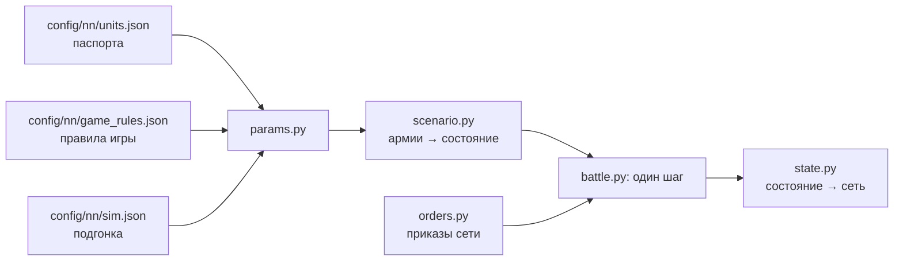

# Симулятор боя

[← Назад](README.md) · [Документация](../README.md) › [Данные для обучения](README.md) › Симулятор боя · [English](../../en/training/simulator.md)

Шаг 3 пути ([модель сети](network.md)): симулятор боя игры, в котором будет учиться сеть.
Он играет тысячи боёв сразу на видеокарте. Каждый отряд — один объект (бойцы, здоровье,
место, направление, мораль, усталость, снаряды), а не каждый солдат. Числа взяты из
[паспортов отрядов](units.md) и [правил игры](../game/database.md); где игра ведёт себя
иначе, они подогнаны под [замеры](measurements.md). Версия 1, 30.09.2026: семь отрядов v1,
ровная пустая карта.

## Как запустить

```bash
bash tools/nn/dock.sh tools.nn.sim.check                     # все сверки с игрой (процессор и видеокарта)
bash tools/nn/dock.sh tools.nn.sim.check --device cuda --only battles
.venv/Scripts/python -m pytest -q tests/tools/test_sim_layout.py   # без torch
```

- Код — `tools/nn/sim/` (PyTorch). Нужен torch: он есть в контейнере `snake-ai-trainer`, а в
  `.venv` проекта его нет, поэтому `tests/tools/test_sim.py` там пропускается. В образе нет
  pytest: чтобы запустить тесты в нём, положите копию pytest (из `.venv`) в `PYTHONPATH` и
  выполните `python -m pytest -q tests/tools/test_sim.py`.
- Сверка пишет `build/nn-sim/check.json` (не в Git).

```python
from tools.nn.sim import battle, replay, scenario

st = scenario.build([scenario.from_arena("whole_emp_v_skv", "attack")] * 1024, device="cuda")
battle.run(st, replay.nearest_attack)        # policy(состояние) -> приказы, пока все бои не кончатся
st.winner, st.t, st.observation()            # [B], [B], словарь [B, N]
```

## Что хранит симулятор



**Состояние** (`tools/nn/sim/state.py`, единственный источник правды): тензоры `[B, N]` —
B боёв, N мест под отряды обеих сторон (сторона 1 в первой половине, сторона 2 во второй,
лорд стороны первым; `side` = 0 — пустое место). Три группы:

- *наблюдаемые* — те же поля и имена, что в записи `nn_sample`
  ([что в записи](README.md#что-в-записи)): `x`, `z`, `b`, `men`, `hp`, `mp`, `ms`, `r`, `s`,
  `w`, `m`, `mv`, `f`, `a`, `fire`, `target` (это `t` записи), `fat` (состояние усталости
  0–5), `k`, `ox`, `oz`, `lf`, `rf`, `bf`, `vis`; время боя — `t` `[B]`. Поэтому записанные
  бои и симулятор кормят сеть одинаково;
- *постоянные* — паспорт: бойцы, здоровье, скорости, атака, защита, оружие, броня, щит,
  лидерство, снаряды, дальность, перезарядка, цена;
- *внутренние* — то, что нужно только симулятору: очки морали и усталости, таймеры.

**Приказы** (`tools/nn/sim/orders.py`): на каждый отряд и шаг решения `kind` — держать (0),
идти (1), атаковать (2), отойти (3), продолжать (4: нового приказа нет, действующий идёт
дальше; отряд без приказа стоит); точка `x`, `z` для «идти» и «отойти» (центр отряда); `target` —
место врага для атаки; `run` — бегом или шагом. Всё `[B, N]`. Приказ «идти» не выводит отряд
из рукопашной: для этого есть «отойти» (отряд выходит из боя, а враги в контакте бьют его в
спину).

## Один шаг (0,5 с)

1. Принять приказы (бегущие отряды их не слушают).
2. Контакты: прямоугольники отрядов (фронт × глубина рядов, которые заполняют бойцы) касаются.
3. Удары в рукопашной и выстрелы.
4. Здоровье, бойцы, убитые.
5. Мораль: колебание, бегство, сбор, разгром.
6. Усталость.
7. Движение: к точке приказа или к цели, бегущие — прочь; край карты.
8. Кончен ли бой: сторона без стоящих отрядов проигрывает; через 60 минут побеждает защитник.

## Механика и откуда числа

«БД» — правила игры или паспорт; «замер» — [замеры](measurements.md) и записи; «подгонка» —
число, подобранное так, чтобы симулятор повторял игру (все они в `config/nn/sim.json` с
причиной).

| Механика | Как | Откуда |
|---|---|---|
| Скорость | шаг, бег, разгон, торможение из паспорта; бегущие с поля — 0,9 от бега | БД; скорость бегства — замер (медиана 0,80–0,96) |
| Строй | фронт заданной ширины, ряды через 1,5 м; лорд — круг своего радиуса | замер: 120 копейщиков, 30 м, 6 рядов |
| Контакт | края ближе 1 м (у уже дерущихся — ещё на 2 м) | замер: расстояние центров в первом контакте |
| Точка приказа | игра пишет центр фронта; симулятор ведёт к центру отряда, на полглубины позади | замер (копейщики 3,3–4,8 м, рабы 6,5–6,9 м) |
| Сколько бьют | 0,75 рядов фронта в контакте; отряд делит между врагами не больше, чем вмещает его фронт; вокруг лорда не больше 8 | подгонка; 8 — замер ([рукопашная](../game/units/melee.md)) |
| Шанс попасть | 35 + 0,1 × (атака − защита), в пределах 8–90 %; защита ×0,6 с фланга, ×0,3 с тыла, потеря защиты — в полную силу БД | числа БД; вес 0,1 — подгонка (см. ниже) |
| Урон удара | бронебойный + обычный × (1 − 0,75 × броня/100), не больше здоровья бойца | БД (броня держит случайные 50–100 %) |
| Время между ударами | `attack_interval_s` паспорта | БД |
| Удар лорда | задевает до `splash` (4) бойцов | БД; сходится с замеренными 0,36 убитых в секунду |
| Натиск | бонус натиска к атаке и урону, спадает за 13 с; отряд, встретивший врага на бегу, бьёт ×(1 + 2,5 × доля его скорости) эти 13 с; не бежавший вводит бойцов в бой за 20 с | БД (13 с); 2,5 и 20 с — подгонка по первым 15 с пар |
| Потери бойцов | не убивший удар ранит: доля бойцов = max(1 − g × (1 − доля здоровья), доля здоровья), g = (ударов до смерти)^−0,5 | подгонка: бойцы против здоровья в парах |
| Стрельба | только стоя; первый выстрел через 3,3 с (стрелы) / 4,3 с (праща) после остановки; выстрел на бойца раз в 11,0 / 11,5 с; дальность от края строя | замер |
| Попадания | 0,42 стрелы, 0,47 праща на краю дальности; ×1,29 на 70 м, ×1,12 на 90 м | замер; множитель по дальности — с полигона |
| Щит, стойкость | щит держит свою долю в пределах 60° от фронта; стойкость к стрелам из паспорта | БД |
| Лорд как цель | 0,9 от правила отряда; в рукопашной ему достаётся 1/(1 + бьющих его) попаданий | замер (26,5 тыс. выстрелов); доля в рукопашной — подгонка по целым боям |
| Цель «по своему выбору» | цель приказа, если в дальности, иначе ближайший стоящий враг | как в игре ([урон стрелами](../game/units/missile-damage.md)) |
| Мораль | очки: лидерство + эффекты; MoralePercent = очки / лидерство; сдвиг — 1 очко или 15 % разрыва за 0,5 с | БД; шаг — замер (+2 очка в секунду во всех записях) |
| Эффекты морали | лорд ближе 70 м +4; лорд погиб −16, потом −10; сосед ближе 120 м +5; потери −2…−74; недавние потери −6…−80 (за 30 с, от всего здоровья); выигрывает / проигрывает рукопашную +3/+6/+8, −3/−8 (отношение урона 1,5 / 2,5 / 4); удар во фланг −6, в тыл −14; бегущие свои −3 каждый; бегущие враги +2,5 каждый; под обстрелом −5; очень устал −2, измотан −6; более сильный враг ближе 70 м −3 | очки БД; окно и отношения — подгонка |
| Фракция | скавены +6 очков в начале | замер: до контакта они на 6 очков выше Империи в том же положении |
| Состояния | колебание ниже 16 очков, бегство при 0, разгром на третьем бегстве, 10 с после сбора без бегства | БД |
| Сбор | пока ни одного стоящего врага ближе 90 м, бегущий получает 2 очка в секунду; собирается при MoralePercent 0,23 | замер: 0,23 и 90 м (365 сборов); 2 очка — подгонка (медиана сбора 44 с) |
| Усталость | натиск +34, рукопашная +19, стрельба +18, бег +4, шаг −1, стоя −7, ×5 в секунду; состояния по порогам БД | БД; ×5 подобрано по 1315 записанным сменам состояния |
| Карта | квадрат ±1020 м; бегущий отряд, пересёкший край, уходит из боя | замер |
| Видимость | видно всё (`vis` оставлен на будущее) | ровная пустая карта |

**Почему шанс попасть почти плоский.** По правилу БД четырём парам нужно от 13 до 43 бойцов,
бьющих разом, а лорду ~38 ([замеры](measurements.md)). С плоскими ~35 % те же потери дают
12–17 бойцов на фронте 30 м во всех парах и ~8 вокруг лорда: одно число подходит всем. Поэтому
атака − защита идёт с весом 0,1 от правила. Фланг и тыл, которые пары не проверяют, сохраняют
полный вес правила.

## Сверка с игрой

`python -m tools.nn.sim.check`: каждый записанный бой переигрывается в симуляторе с
записанного начала по записанным приказам (без обратной связи: `tools/nn/sim/replay.py`: цель,
с которой дрался или по которой стрелял, → атаковать её, иначе → идти в точку приказа),
записывается раз в секунду как запись игры и меряется тем же кодом, что и игра
(`tools/nn/measure.py`). Итоги на 30.09.2026:

### Механика: 49 из 54 чисел в пределах 20 %

| Случай | Игра | Симулятор |
|---|---|---|
| Копейщики — рабы: бой, с | 232 (208–252) | 251 |
| … рабы теряют HP/с / копейщики | 22,7 / 12,4 | 23,3 / 14,0 |
| … рабы колеблются / бегут, с | 195 / 232 | 173 / 251 |
| Копейщики — клановые крысы: бой, с | 275 (219–353) | 282 |
| … копейщики теряют / крысы HP/с | 25,7 / 20,6 | 22,1 / 19,5 |
| … копейщики колеблются / бегут, с | 251 / 275 | 269 / 282 |
| Генерал — клановые крысы: бой, с | 348 (340–357) | 335 |
| … генерал / крысы теряют HP/с | 8,2 / 21,8 | 6,9 / 22,9 |
| … крысы колеблются / бегут, с | 254 / 348 | 254 / 335 |
| Военачальник — копейщики: бой, с | 309 (264–338) | 263 |
| … военачальник / копейщики теряют HP/с | 5,5 / 21,2 | 5,4 / 25,3 |
| … копейщики колеблются / бегут, с | 277 / 309 | 229 / 263 |
| Победитель каждой пары | 12 из 12 | 12 из 12 |
| Лучники → рабы: перезарядка, с / попадания / HP/с | 11,0 / 0,42 / 66 | 11,8 / 0,43 / 59 |
| … первый выстрел после остановки, с | 3,3 | 3,3 |
| … цель колеблется / бежит после первого выстрела, с | 39 / 71 | 49 / 77 |
| Пращники → копейщики: перезарядка, с / попадания / HP/с | 11,5 / 0,47 / 36 | 12,0 / 0,47 / 35 |
| … цель колеблется / бежит, с | 154 / 177 | 168 / 192 |

Вне 20 %: цель лучников колеблется на 27 % позже; потеря HP за первые 15 с контакта (натиск)
в четырёх местах (−28 %… +35 %) — натиск шумный и в игре.

### Целые бои: тот же победитель в 21 из 26 (81 %)

| | Боёв с победителем | Тот же победитель |
|---|---:|---:|
| Империя против скавенов | 10 | 10 |
| Зеркальная арена (Империя против Империи) | 16 | 11 |

Каждый записанный бой играется 8 раз с начал, сдвинутых до 2 м; победитель симулятора — по
большинству (4 из 5 промахов — 7 или 8 из 8: не случайность). Два зеркальных боя кончились
на нашем пределе 900 с без победителя и не считаются.

| | Игра | Симулятор |
|---|---|---|
| Империя потеряла HP через 60 / 120 / 180 с после первого контакта | 0,25 / 0,41 / 0,53 | 0,27 / 0,48 / 0,61 |
| Скавены потеряли HP через 60 / 120 / 180 с после первого контакта | 0,21 / 0,34 / 0,42 | 0,14 / 0,23 / 0,29 |
| Бегств / сборов за бой | 22,5 / 13,0 | 24,4 / 15,5 |
| Сбор длится (медиана), с | 44 | 47 |
| Бой длится (среднее), с | 613 | 716 |

### Скорость

| Где | Боёв сразу | Боёв в секунду |
|---|---:|---:|
| Видеокарта RTX 5070 Ti (`torch.compile`) | 4096 | 1200–1560 |
| Процессор в контейнере (без компиляции) | 1024 | 8 |

Бой здесь — бой Империи со скавенами (40 мест) до конца, 430–620 с времени игры. На
видеокарте шаг компилирует `torch.compile` (примерно в 10 раз быстрее); для компиляции на
процессоре в контейнере нет компилятора C++.

## Чего нет

- **Целые бои склоняются к скавенам**: в симуляторе скавены за первые 3 минуты теряют на
  треть меньше HP, чем в игре, Империя — на шестую часть больше. Почему — не найдено; в игре
  отряды скавенов в рукопашной теряют в секунду ~на 50 % больше HP, чем в парах один на один,
  в симуляторе — примерно как в парах.
- **Бои длятся на 17 % дольше**, чем в игре.
- **Переигровка без обратной связи**: записанные приказы не отвечают на бой, пошедший иначе.
- Зеркальные бои: в игре защитник выигрывает 15 из 16; симулятор угадывает 11 из 16.
- **Усталость** совпадает с записанным состоянием точно в 43 % замеров (в среднем мимо на 0,86
  состояния). Что усталость делает с атакой, защитой и скоростью, в базе нет и не моделируется.
- **Не моделируется**: огонь по своим, рельеф, скорость разворота (отряд сразу смотрит, куда
  идёт), кавалерия, монстры, магия, полёт, артиллерия, способности, ранги опыта, «открытые
  фланги» (−3/−6: в записях не видно), «сильный враг рядом» по силе (только −3).
- `vis` всегда истина: линия видимости не моделируется.

## Неожиданности

- Лорд теряет ~0,9 от правила отряда за снаряд, пущенный в него вне рукопашной (26,5 тыс.
  записанных выстрелов), а не 0,02–0,1 урона копейщиков, как сказано в
  [уроне стрелами](../game/units/missile-damage.md).
- Урон стрелы вблизи на арене (~25 HP на 34 м) больше всего урона стрелы (19): туда
  примешаны потери в рукопашной; множитель по дальности симулятор берёт с полигона.
- Бегущие отряды бегут медленнее своего бега: у Империи 0,80–0,86, у скавенов 0,85–0,96.
