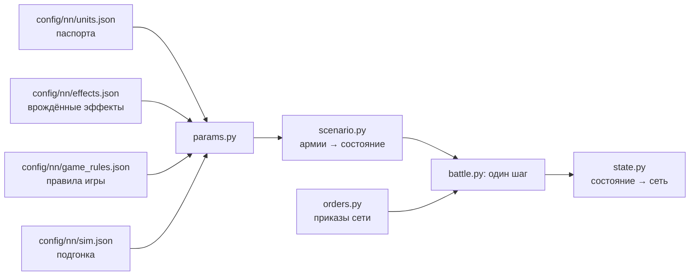

# Симулятор боя

[← Назад](README.md) · [Документация](../README.md) › [Данные для обучения](README.md) › Симулятор боя · [English](../../en/training/simulator.md)

Шаг 3 пути ([модель сети](network.md)): симулятор боя игры, в котором будет учиться сеть.
Он играет тысячи боёв сразу на видеокарте. Каждый отряд — один объект (бойцы, здоровье,
место, направление, мораль, усталость, снаряды), а не каждый солдат. Числа взяты из
[паспортов отрядов](units.md) и [правил игры](../game/database.md); где игра ведёт себя
иначе, они подогнаны под [замеры](measurements.md). Версия 1, 30.09.2026: семь отрядов v1,
ровная пустая карта.

## Как запустить

```bash
bash tools/nn/dock.sh tools.nn.sim.check                     # все сверки с игрой (процессор и видеокарта)
bash tools/nn/dock.sh tools.nn.sim.check --device cuda --only battles
.venv/Scripts/python -m pytest -q tests/tools/test_sim_layout.py   # без torch
```

- Код — `tools/nn/sim/` (PyTorch). Нужен torch: он есть в контейнере `snake-ai-trainer`, а в
  `.venv` проекта его нет, поэтому `tests/tools/test_sim.py` там пропускается. В образе нет
  pytest: чтобы запустить тесты в нём, положите копию pytest (из `.venv`) в `PYTHONPATH` и
  выполните `python -m pytest -q tests/tools/test_sim.py`.
- Сверка пишет `build/nn-sim/check.json` (не в Git).

```python
from tools.nn.sim import battle, replay, scenario

st = scenario.build([scenario.from_arena("whole_emp_v_skv", "attack")] * 1024, device="cuda")
battle.run(st, replay.nearest_attack)        # policy(состояние) -> приказы, пока все бои не кончатся
st.winner, st.t, st.observation()            # [B], [B], словарь [B, N]
```

## Что хранит симулятор



**Состояние** (`tools/nn/sim/state.py`, единственный источник правды): тензоры `[B, N]` —
B боёв, N мест под отряды обеих сторон (сторона 1 в первой половине, сторона 2 во второй,
лорд стороны первым; `side` = 0 — пустое место). Три группы:

- *наблюдаемые* — те же поля и имена, что в записи `nn_sample`
  ([что в записи](README.md#что-в-записи)): `x`, `z`, `b`, `men`, `hp`, `mp`, `ms`, `r`, `s`,
  `w`, `m`, `mv`, `f`, `a`, `fire`, `target` (это `t` записи), `fat` (состояние усталости
  0–5), `k`, `ox`, `oz`, `lf`, `rf`, `bf`, `vis`; время боя — `t` `[B]`. Поэтому записанные
  бои и симулятор кормят сеть одинаково;
- *постоянные* — паспорт: бойцы, здоровье, скорости, атака, защита, оружие, броня, щит,
  лидерство, снаряды, дальность, перезарядка, цена; врождённые эффекты отряда (`fx` — битовая маска
  по порядку `config/nn/effects.json`; `fxt0`, `fxt1` — его эффекты с временем) и их флаги правил;
- *внутренние* — то, что нужно только симулятору: очки морали и усталости, таймеры (способностей и
  эффектов с временем), `fx_on` (врождённые эффекты, действовавшие на последнем шаге).

**Приказы** (`tools/nn/sim/orders.py`): на каждый отряд и шаг решения `kind` — держать (0),
идти (1), атаковать (2), отойти (3), продолжать (4: нового приказа нет, действующий идёт
дальше; отряд без приказа стоит); точка `x`, `z` для «идти» и «отойти» (центр отряда); `target` —
место врага для атаки; `run` — бегом или шагом; `ability` — слот способности отряда, которую
применить сейчас (−1 — нет; необязательно: у приказов без него −1; не зависит от `kind`). Всё
`[B, N]`. Приказ «идти» не выводит отряд из рукопашной: для этого есть «отойти» (отряд выходит из
боя, а враги в контакте бьют его в спину). Приказ способности применяет готовую способность на
себя один раз (не пассивную, не действующую, перезаряженную); иначе ничего не происходит. Таймеры
способностей сеть читает из `State.observation()` (`ab{k}_on`, `ab{k}_cd` [B, N], с), а действующие
врождённые эффекты — оттуда же (`fx_on`).

## Один шаг (0,5 с)

1. Принять приказы (бегущие отряды их не слушают).
2. Контакты: прямоугольники отрядов (фронт × глубина рядов, которые заполняют бойцы) касаются.
3. Врождённые эффекты (свойства, пассивные, включаемые игрой с временем) и применённые
   способности: их статы и флаги правил держатся на этот шаг.
4. Удары в рукопашной и выстрелы.
5. Здоровье, бойцы, убитые.
6. Мораль: колебание, бегство, сбор, разгром.
7. Усталость.
8. Движение: к точке приказа или к цели, бегущие — прочь; край карты.
9. Кончен ли бой: сторона без стоящих отрядов проигрывает; через 60 минут побеждает защитник.

## Механика и откуда числа

«БД» — правила игры или паспорт; «замер» — [замеры](measurements.md) и записи; «подгонка» —
число, подобранное так, чтобы симулятор повторял игру (все они в `config/nn/sim.json` с
причиной).

| Механика | Как | Откуда |
|---|---|---|
| Скорость | шаг, бег, разгон, торможение из паспорта; бегущие с поля — 0,86 от бега (до врождённых эффектов: бегство скавенов ×1,1 от «Удирай!») | БД; скорость бегства — замер (Империя 0,865; скавены 0,945 ниже половины здоровья, 0,866 выше: [врождённые эффекты](#врождённые-эффекты)) |
| Строй | фронт заданной ширины, ряды через 1,5 м; лорд — круг своего радиуса | замер: 120 копейщиков, 30 м, 6 рядов |
| Контакт | края ближе 1 м (у уже дерущихся — ещё на 2 м) | замер: расстояние центров в первом контакте |
| Разворот | идущий отряд смотрит, куда идёт, но шаг меньше 10 м к своей точке делает не разворачиваясь; строй в рукопашной поворачивается не быстрее 2° в секунду (лорд — сразу) | замер: пехота в рукопашной поворачивается на 1°/с (медиана; среднее 2,3), свободный отряд, ударенный во фланг, — на 8° за 5 с (медиана) |
| Точка приказа | игра пишет центр фронта; симулятор ведёт к центру отряда, на полглубины позади | замер (копейщики 3,3–4,8 м, рабы 6,5–6,9 м) |
| Сколько бьют | 0,75 рядов фронта в контакте; на каждую сторону строя (фронт, левый и правый фланг, тыл) отряд выставляет не больше, чем она вмещает; лорда бьют всего не больше 9 бойцов, сколько бы ни было отрядов, их темпы складываются; когда на нём и вражеский лорд, пехота с долей 0,35; отряд, атакующий другого врага, бьёт лорда, которого касается, с долей 0,4 | подгонка; по сторонам — замер: уже дерущийся отряд бьёт новичка на своём фланге в 2,2 раза сильнее правила за первые 15 с (симулятор с одним общим фронтом давал 1,2); 9 и сумма — замер ([лорд в окружении](../game/units/lord-swarm.md)); 0,35, 0,4 — целые бои (ниже, «Лорда бьют несколько отрядов») |
| Шанс попасть | 35 + 0,1 × (атака − защита), в пределах 8–90 %; защита ×0,6 с фланга, ×0,3 с тыла; потерянная защита идёт с весом 2,0 от правила с фланга и 0,25 с тыла (против лорда — нет, замер) | числа БД; веса — подгонка (см. ниже и [фланги](#фланг-тыл-и-натиск-в-целых-боях)) |
| Урон удара | бронебойный + обычный × (1 − 0,75 × броня/100), не больше здоровья бойца | БД (броня держит случайные 50–100 %) |
| Время между ударами | `attack_interval_s` паспорта | БД |
| Удар лорда | задевает до `splash` (4) бойцов | БД; сходится с замеренными 0,36 убитых в секунду |
| Натиск | бонус натиска к атаке и урону, спадает за 13 с; отряд, встретивший врага на бегу, бьёт ×(1 + 1,5 × доля его скорости) эти 13 с; не бежавший вводит бойцов в бой за 20 с. Упор: отряд с `charge_reflection` (копейщики, клановые крысы), стоящий на месте (медленнее 0,5 м/с), встречает натиск пехоты в пределах `bracing_attack_angle` (80°) от фронта как натиск той же скорости | БД (13 с, 80°, свойство); 1,5 — подгонка по первым 15 с целых боёв и пар, 20 с — по парам; упор — замер (целые бои: стоящий отряд под натиском в лоб теряет 0,8 от потерь атакующего) |
| Потери бойцов | не убивший удар ранит: доля бойцов = max(1 − g × (1 − доля здоровья), доля здоровья), g = (ударов до смерти)^−0,5 | подгонка: бойцы против здоровья в парах |
| Стрельба | только стоя; первый выстрел через 3,3 с (стрелы) / 4,3 с (праща) после остановки; выстрел на бойца раз в 11,0 / 11,5 с; дальность от края строя | замер |
| Попадания | 0,42 стрелы, 0,47 праща на краю дальности; ×1,29 на 70 м, ×1,12 на 90 м | замер; множитель по дальности — с полигона |
| Щит, стойкость | щит держит свою долю в пределах 60° от фронта; стойкость к стрелам из паспорта | БД |
| Лорд как цель | 0,43 от правила отряда | замер: ~33 тыс. выстрелов по лордам, пока лорд весь полёт вне рукопашной (генерал от стрел ~0,5, от пращи ~0,37, военачальник от стрел ~0,32) |
| Огонь по своим | из попаданий, пущенных в отряд в рукопашной, 0,26 (стрелы) / 0,56 (праща) достаются своим отрядам стрелка в контакте с ним, по числу их бойцов (лорду среди них ×0,43, как одиночной цели) | замер: HP, которые эти отряды теряют сверх правила рукопашной, пока их сторона стреляет (1,5 тыс. + 1,3 тыс. секунд) |
| Разлёт | из попаданий, пущенных в отряд, каждый отряд его стороны вне рукопашной получает 0,115 ближе 30 м, 0,034 на 30–60 м, 0,015 на 60–90 м | замер: HP отрядов, в которые никто не стреляет, рядом с обстреливаемым (15,6 тыс. секунд) |
| Разлёт в рукопашной | из попаданий, пущенных в отряд в рукопашной, каждый отряд его стороны, тоже в рукопашной, получает 0,19 ближе 15 м, 0,047 на 15–30 м, 0,035 на 30–60 м (между центрами) | замер (01.10.2026, `build/nn-sim/flank/spill_melee.py`): HP отрядов в рукопашной, в которые не стреляют и чья сторона не стреляет в их противников, регрессия на правило рукопашной и на попадания, пущенные в их соседей в рукопашной (74 тыс. секунд, 15 тыс. с обстреливаемым соседом; 28 боёв с ИИ игры 0,23 / 0,09, запуски сети 0,19 / 0,05) |
| Цель «по своему выбору» | цель приказа, если в дальности, иначе ближайший стоящий враг | как в игре ([урон стрелами](../game/units/missile-damage.md)) |
| Линия огня (настильный огонь) | только для настильного (прямого) огня, `missile.direct` паспорта (траектория `low`: пистоли Free Company Militia); люди стрелка целят в центр цели, свой отряд между ними (ближе края цели) перекрывает линии, проходящие через его ширину поперёк линии, расширенную на 1,2 радиуса человека (свои считаются в 2,2 раза шире); перекрытые люди не стреляют; при 75 % перекрытых отряд берёт следующую цель в дальности или не стреляет. Стрелы и пращи бьют навесом через своих; враги на линии не мешают; стрельбы через своих с возвышенности нет (карта ровная) | БД (`projectile_friendly_fire_man_radius_coefficient` 2,2, `unit_firing_line_of_sight_considered_obstructed_ratio` 0,75, траектория); база знаний ([стрельба](../game/mechanics/missiles.md)); геометрия наша, не замерена |
| Стрельба на ходу | отряд с `mounted_fire_move` (ополчение) целится и стреляет на ходу | атрибут БД |
| Пистоли (оценка) | попадание 0,5 на краю дальности (×1,12–1,29 на 60–90 м), перезарядка 10,8 с, первый выстрел 3,8 с | оценка по зоне калибровки снаряда (2,0 м на 65 м против 3,7 м на 95 м у стрелы), не замер: `sim.json` missile.musket_why |
| Мораль | очки: лидерство + эффекты; MoralePercent = очки / лидерство; сдвиг — 1 очко или 15 % разрыва за 0,5 с | БД; шаг — замер (+2 очка в секунду во всех записях) |
| Эффекты морали | лорд +4 ближе 70 м, угасая до 0 к 105 м; лорд погиб или сломлен: только его аура (`lord_fall` 0 / 0); сосед ближе 120 м +5; потери −2…−74; недавние потери −6…−80 (за 30 с, от всего здоровья); выигрывает / проигрывает рукопашную +3/+6/+8, −3/−8 (отношение урона 1,5 / 2,5 / 4); первый удар во фланг −6, в тыл −14 на один тик 0,5 с; армия разбита целиком (сила врага ≥ 2,6× своей, своя ≤ 0,22 начальной) −120; открытые фланги (враг угрожает слева, справа или сзади: `lf`, `rf`, `bf`) −3, два и больше −6; бегущие свои −3 каждый; бегущие враги +2,5 каждый; под обстрелом −5; очень устал −2, измотан −6; более сильный враг ближе 70 м −3 | очки БД; окно и отношения — подгонка; удар во фланг и тыл — замер ([фланги](#фланг-тыл-и-натиск-в-целых-боях)); сломленный лорд считается потерянным: в игре вся его армия теряет 0,5–0,6 лидерства в ту же секунду и бежит за ~3 с (бои ворот 02.10.2026) |
| Состояния | колебание ниже 16 очков, бегство при 0, разгром на третьем бегстве, 10 с после сбора без бегства | БД |
| Сбор | пока ни одного стоящего врага ближе 90 м, бегущий получает 2 очка в секунду; собирается при MoralePercent 0,23 | замер: 0,23 и 90 м (365 сборов); 2 очка — подгонка (медиана сбора 44 с) |
| Усталость | натиск +34, рукопашная +19, стрельба +18, бег +4, шаг −1, стоя −7, ×5 в секунду; состояния по порогам БД; каждое состояние меняет скорость, атаку и защиту в рукопашной, броню, натиск, бронебойный урон и перезарядку (`unit_fatigue_effects_tables`) | БД; ×5 подобрано по 1315 записанным сменам состояния |
| Умения лордов | сторона, за которую играет ИИ игры (`ai`, по умолчанию сторона 2), применяет активные умения своего лорда по правилу; сторона сети — по приказу (`Orders.ability`; у стороны сети `ai` должен быть false); пассивные — врождённые эффекты (ниже). Все числа — паспорт способности (`config/nn/abilities.json`, база; `sim.json` abilities — какие моделируются и когда их применяет ИИ); эффекты на владельца (цель фазы — сам), на своих в радиусе и на врагов в радиусе: скорость, скорость натиска, атака и защита, урон, бронебойный урон, бонус натиска, мораль. Вождь: «Смертельный натиск» (31 с, снова готов через 90 с после: урон и бронебойный урон ×1,25, бонус натиска ×1,6) в рукопашной; «Крысиная доблесть» (17 с / 60 с: скорость ×1,25, +8 очков морали; её взрыв 25 м без урона) при враге ближе 60 м; «Сплотиться» (14 с / 60 с: +16 своим в 35 м), когда там кто-то дрогнул. Генерал: «Стоять насмерть» (18 с / 90 с: защита +24, +16 в 35 м) в рукопашной; «Искатель врага» (25 с / 60 с: скорость ×1,25) при враге ближе 60 м | база (`config/nn/sim.json` abilities; чем владеют — по снимку ростера игры); когда ИИ их применяет — предположение |
| Врождённые эффекты | каждое свойство и пассивная или включаемая игрой способность отряда (`config/nn/effects.json`), один механизм: действует, пока выполнены условия; его статы на владельце (у ауры ещё на своих в радиусе), его правила на шаг. Несокрушимые (флагелланты: мораль не ниже лидерства, не колеблются и не бегут), Расходные (их бегство никого не пугает), Воодушевление (аура лорда), Отражение натиска (упор), Стрельба на ходу; «Сила в числе» (пехота скавенов: +6 лидерства, +8 к защите, скорость ×0,9, пока здоровья ≥ 50 %), «Удирай!» (скорость ×1,1 при колебании и бегстве), «Держать строй!» (+5 к защите, +4 лидерства в 35 м от стоящего Генерала), Frenzy (+10 к атаке, ×1,1 урон, бронебойность и натиск, пока мораль ≥ половины лидерства), Strength of the Penitent (игра включает, когда отряд проигрывает рукопашную: 20 с +14 к защите, +15 % физической стойкости, кончается вне рукопашной, снова готово через 3 с). Только схема (сеть их видит): защита от натиска больших, авангард, укрытие в лесу, Immune to Psychology; отключён `sim.json` effects.off: Single Entity (лорды: скорость ×0,9, урон ×0,8 ниже 25 % здоровья; в записях такого падения скорости нет) | БД: паспорта, `special_ability_to_auto_deactivate_flags`, `special_ability_to_recharge_contexts`; правила свойств — база знаний; замер: скорость бегства и бега, падение морали на 50 % здоровья ([ниже](#врождённые-эффекты)) |
| Карта | квадрат ±1020 м; бегущий отряд, пересёкший край, уходит из боя | замер |
| Видимость | видно всё (`vis` оставлен на будущее) | ровная пустая карта |

**Почему шанс попасть почти плоский.** По правилу БД четырём парам нужно от 13 до 43 бойцов,
бьющих разом, а лорду ~38 ([замеры](measurements.md)). С плоскими ~35 % те же потери дают
12–17 бойцов на фронте 30 м во всех парах и ~8 вокруг лорда: одно число подходит всем. Поэтому
атака − защита идёт с весом 0,1 от правила. Фланг и тыл, которые пары не проверяют, подогнаны
по целым боям (ниже).

## Врождённые эффекты

`tools/nn/sim/effects.py`: один механизм для каждого свойства и каждой пассивной или включаемой
самой игрой способности отряда. Каталог — `config/nn/effects.json` (`python -m tools.nn.effects`,
из паспортов; [паспорта отрядов](units.md#врождённые-эффекты)): у каждого эффекта его статы,
правила, условия, таймеры и действует ли он в симуляторе (`modelled`). Ничто в симуляторе не знает
отряд или эффект по ключу.

- **Чем владеет.** `params.static` даёт каждому отряду `fx` — битовую маску эффектов, которые
  каталог связывает с ним, `fxt0` / `fxt1` (его эффекты с временем) и флаги правил его безусловных
  эффектов.
- **Условия** (каждый шаг, по состоянию на его начало): `in_melee` / `out_of_melee` (в контакте со
  стоящим врагом), `losing_melee` (в рукопашной и получил урона ≥ 1,5 × нанесённого за последнее
  время: порог правила морали), `morale_below_half` (очков < половины лидерства), `not_wavering`,
  `hp_below_half` (< 50 % начального), `hp_below_quarter`. Эффект действует, пока выполнены все его
  `needs` и ни одно из `off_when`; свойство — всегда.
- **С временем** (Strength of the Penitent): включается сам у стоящего отряда, когда выполнено его
  `fires_when` и он готов, длится `active_s`, сразу кончается, пока выполнено `off_when`, снова готов
  через `recharge_s` после конца. Слот панели способностей с его способностью (`ab{k}_on`,
  `ab{k}_cd`) показывает те же таймеры, так что наблюдение читает его как раньше.
- **Действие.** Пока эффект действует: множители умножаются, добавки складываются (атака, защита,
  урон, бронебойный урон, натиск, скорость и скорость натиска, очки морали, физическая стойкость до
  предела 90 %) на владельце, а у ауры (`range_m` > 0, статы на своих: «Держать строй!») — на своих в
  радиусе стоящего владельца. Флаги правил (`unbreakable`, `expendable`, `encourages`, `reflect`,
  `fire_move`, `fatigue_immune`) держатся на шаг; их читают мораль, аура, упор, стрельба и усталость.
  Эффект лежит на живом отряде, бегущем тоже («Удирай!» ускоряет бегство). В конце шага всё
  снимается, как у применяемых способностей и усталости.
- **`fx_on`** (вход сети): эффекты, чьи условия выполнены сейчас, действуют они в симуляторе или нет
  (укрытие в лесу считается действующим: в игре так).
- **Только схема** (`modelled` false, причина в файле): защита от натиска больших (больших отрядов в
  пулах нет), авангард (места даёт генератор армий), укрытие в лесу (лесов нет), Immune to
  Psychology (страха и ужаса нет). `sim.json` effects.off отключает эффект, который каталог мог бы
  моделировать (переключатель подгонки с причиной): Single Entity, чьих «скорость ×0,9, урон ×0,8
  ниже 25 % здоровья» (наше прочтение его контекста перезарядки) в записях не видно (лорды бегом вне
  рукопашной — 0,84–0,85 от бега в каждой полосе здоровья). Новый эффект, чьи статы, правила и условия у симулятора есть,
  работает без кода (тест даёт копейщикам Perfect Vigour одним каталогом).

**Замер** (02.10.2026, все честные записи с ключами отрядов; скорость по шагам в 1 с, не раньше
3 с бегства): бегущие отряды Империи бегут на 0,865 от бега (115 тыс. с), скавены — на 0,945 ниже
половины здоровья (186 тыс. с) и на 0,866 выше (14 тыс. с); бег по приказу без колебания выше
половины здоровья: Империя 0,97, скавены 0,88. ×1,1 «Удирай!» и ×0,9 «Силы в числе» (выше половины
здоровья) дают ровно эти отношения, поэтому `morale.rout_speed` — имперские 0,86. Переходя 50 %
здоровья, отряды скавенов теряют за следующие 3 с на 2,3 очка морали больше, чем отряды Империи
(7,7 против 5,5 на 1 039 и 951 переходах; на 40 % и 60 % одинаково): там отключаются +6 «Силы в
числе». Прежний стартовый бонус скавенов (`morale.faction_bonus` +6, подогнанный) и был «Силой в
числе»: теперь он 0.

## Фланг, тыл и натиск в целых боях

Замер 01.10.2026 по 28 целым боям (18 зеркальных, 10 Империи со скавенами) и по их переигровкам
в симуляторе без обратной связи тем же кодом (`build/nn-sim/flank/flank.py`, не в Git).
Контакт — стоящий в рукопашной враг, край строя которого (прямоугольники симулятора по
записанным местам, направлениям и бойцам) ближе 3 м; его сторона — угол его центра от
направления отряда (фронт до 60°, тыл за 120°), как считает симулятор. Потеря здоровья
сравнивается с правилом рукопашной симулятора для того же контакта в лоб.

| Пехота в рукопашной, один контакт, не под обстрелом | Игра | Симулятор до | Сейчас |
|---|---:|---:|---:|
| Секунды, где худший контакт в лоб / во фланг / в тыл | 58 / 31 / 11 % | 78 / 18 / 4 % | 72 / 23 / 6 % |
| Потеря HP с фланга, × от потери в лоб (10–90 % по боям) | 1,74 (1,56–1,89) | 1,20 | 1,55 |
| Потеря HP с тыла, × от потери в лоб | 1,31 (1,19–1,42) | 2,04 | 1,50 |
| Очки морали, пока бьют с фланга / с тыла (регрессия*) | −1,0 / −1,8 | −1,0 / −14,5 | −0,8 / −4,0 |
| … поднят один / два и больше из `lf`, `rf`, `bf` | −3,9 / −8,1 | — | −4,3 / −7,0 |

\* Очки − лидерство против потерянного здоровья (и его квадрата), фланга, тыла, 2+ контактов,
признаков угрозы, обстрела; секунды пехоты в рукопашной (игра 30 тыс., симулятор 97 тыс.).

Новые контакты (пехоту i бьёт пехота j): HP, которые i теряет за первые 15 с, к HP, которые теряет j.

| | Контактов в игре | Игра | До | Сейчас |
|---|---:|---:|---:|---:|
| j бежит, i стоит, в лоб | 102 | 0,82 | 2,69 | 1,44 |
| j бежит, i бежит навстречу | 104 | 0,90 | 0,98 | 0,91 |
| j бежит во фланг или тыл свободному i | 206 | 1,11 | 2,65 | 1,65 |
| j бежит во фланг или тыл уже дерущемуся i | 24 | 1,30 | 3,30 | 2,22 |
| j входит шагом во фланг или тыл уже дерущемуся i | 77 | 1,23 | 2,00 | 1,34 |
| Очки морали i через 15 с после натиска на стоящего | 102 | −6,5 | −17,5 | −11,3 |

- **В игре натиск даёт мало.** Отряд, принявший натиск стоя, теряет не больше атакующего
  (0,82); копейщики в упоре (`charge_reflection`, 87 из 102) — 0,80, отряды без него — примерно
  так же (1,02, 15 контактов). Симулятор давал атакующему 2,7×, поэтому в нём проигрывал любой
  отряд, оставшийся стоять под натиском. Теперь: упор и удар натиска 1,5 вместо 2,5 (пары в
  пределах 20 %: 51 из 54).
- **В игре строй в рукопашной не разворачивается** (1°/с): враг на фланге или в тылу там и
  остаётся. В симуляторе отряд сразу поворачивался к ближайшему противнику, и удар во фланг
  свободному отряду длился один шаг. Теперь в рукопашной — 2°/с.
- **По этому счёту фланг дороже тыла** (1,74 против 1,31), вопреки защите ×0,6 / ×0,3 из БД.
  Секунды «в тыл» — вероятно, часто отставшее записанное направление; симулятор подогнан под
  замер (flank_slope 2,0, rear_slope 0,25).
- **«Удар во фланг / в тыл» в записях мал**: −1 / −2 очка, а не −6 / −14 из БД (симулятор с
  очками БД показывает −14,5 за тыл). «Открытые фланги» — как в БД: −3,9 / −8,1 против −3 / −6.
- Ещё сильнее, чем в игре: натиск во фланг или тыл (1,65–2,22 против 1,1–1,3) и падение морали
  после натиска (−11 против −6,5). `lf` / `rf` / `bf` поднимаются в 1,3–3 раза чаще признаков
  игры (у игры они шумные: 0,3–0,7 при враге ближе 60 м с той стороны).

Перебор тактик против `nearest` (скрипты обучения, `build/nn-sim/flank/scan.py`: 48 боёв на
армию, роль и сторону; победы тактики; Империя / скавены — тактика играет этой армией в бою
Империи со скавенами):

| Тактика | Зеркало: до / сейчас | Империя: до / сейчас | Скавены: до / сейчас |
|---|---:|---:|---:|
| сам `nearest` | 47 / 49 % | 60 / 26 % | 58 / 82 % |
| все отряды на одну цель | 47 / 32 % | 5 / 1 % | 43 / 65 % |
| стрелки стоят и стреляют | 0 / 1 % | 1 / 1 % | 77 / 88 % |
| полководец ждёт 2 минуты | 11 / 18 % | 3 / 1 % | 80 / 80 % |
| атака шагом | 0 / 0 % | 0 / 0 % | 0 / 0 % |
| сначала враги, уже занятые рукопашной | 36 / 32 % | 17 / 3 % | 24 / 46 % |
| запас ждёт, пока враг ввяжется | 6 / 3 % | 0 / 0 % | 1 / 7 % |
| `hold_shoot` | 19 / 34 % | 3 / 5 % | 48 / 70 % |
| **фланг**: пехота идёт на врага, уже дерущегося с нашими, через точку сбоку от его фланга | **61 / 69 %** | 27 / 17 % | 32 / 79 % |
| фланг с запасом | 6 / 15 % | 0 / 1 % | 18 / 51 % |

Теперь бой Империи со скавенами выигрывают скавены (`nearest` против `nearest`: 26 % у Империи,
82 % у скавенов; в игре скавены выиграли все 10 записанных). Фланговая тактика бьёт `nearest` в
зеркале (69 %) и больше не наказана на других армиях (скавены 79 % против 82 % у самого
`nearest`; до — 32 % против 58 %). Ожидание (запас, шаг) по-прежнему проигрывает: ждущая
сторона дерётся в меньшинстве.

## Сверка с игрой

`python -m tools.nn.sim.check`: каждый записанный бой переигрывается в симуляторе с
записанного начала по записанным приказам (без обратной связи: `tools/nn/sim/replay.py`: цель,
с которой дрался или по которой стрелял, → атаковать её; в рукопашной без записанной цели →
атаковать ближайшего врага (планировщик CA оставляет цель пустой в ~70 % секунд рукопашной, ИИ
игры — в ~6 %); иначе → идти в точку приказа), записывается раз в секунду как запись игры и
меряется тем же кодом, что и игра (`tools/nn/measure.py`). Считаются только бои планировщика CA
против ИИ игры (не бои самой сети). Переигровка пары или стрельбы идёт по последним записанным
приказам, пока отряд не побежит; целый бой останавливается, когда кончилась его запись, и
сравнивается в этот момент (если он не кончился, победителем считается сторона, у которой
больше здоровья в стоящих отрядах). Итоги на 30.09.2026 (третья версия, той же ночью):

### Механика: 50 из 54 чисел в пределах 20 %

| Случай | Игра | Симулятор |
|---|---|---|
| Копейщики — рабы: бой, с | 232 (208–252) | 260 |
| … рабы теряют HP/с / копейщики | 22,7 / 12,4 | 23,3 / 14,1 |
| … рабы колеблются / бегут, с | 195 / 232 | 181 / 260 |
| Копейщики — клановые крысы: бой, с | 275 (219–353) | 290 |
| … копейщики теряют / крысы HP/с | 25,7 / 20,6 | 22,1 / 19,5 |
| … копейщики колеблются / бегут, с | 251 / 275 | 269 / 290 |
| Генерал — клановые крысы: бой, с | 348 (340–357) | 335 |
| … генерал / крысы теряют HP/с | 8,2 / 21,8 | 6,9 / 22,9 |
| … крысы колеблются / бегут, с | 254 / 348 | 254 / 335 |
| Военачальник — копейщики: бой, с | 309 (264–338) | 264 |
| … военачальник / копейщики теряют HP/с | 5,5 / 21,2 | 5,4 / 25,3 |
| … копейщики колеблются / бегут, с | 277 / 309 | 229 / 264 |
| Победитель каждой пары | 12 из 12 | 12 из 12 |
| Лучники → рабы: перезарядка, с / попадания / HP/с | 11,0 / 0,42 / 66 | 11,6 / 0,43 / 62 |
| … первый выстрел после остановки, с | 3,3 | 3,7 |
| … цель колеблется / бежит после первого выстрела, с | 39 / 71 | 41 / 74 |
| Пращники → копейщики: перезарядка, с / попадания / HP/с | 11,5 / 0,47 / 36 | 11,5 / 0,47 / 37 |
| … цель колеблется / бежит, с | 154 / 177 | 160 / 183 |

Вне 20 % (01.10.2026, с флангами, упором и разворотом): потеря HP за первые 15 с контакта
(натиск) в трёх местах: клановые крысы против генерала (−28 %) и против копейщиков (−33 %),
военачальник (−22 %) — натиск шумный и в игре (до: в четырёх местах, −28 %… +107 %).

С врождёнными эффектами («Сила в числе», «Удирай!», стартовый бонус скавенов 0, скорость бегства
0,86) вне допуска ещё одна строка: в паре копейщики — кланокрысы крысы колеблются на последнем тике
одной переигровки, когда копейщики бегут (в игре там крысы не колеблются никогда, хотя в одном
прогоне опускались до 13 очков, ниже порога колебания 16); их +6 «Силы в числе» ниже половины
здоровья выключены. Пара копейщики — рабы стала ближе (бой и бегство рабов 15 % → 0 %), кланокрысы
против Генерала колеблются на 13 % раньше (было 2 %); средняя ошибка та же (8,7 %). Целые бои: тот же
победитель в 22 из 26, как до эффектов (8 переигровок; при 32 переигровках 21 из 26, набор до
эффектов — 20).

### Целые бои: тот же победитель в 18 из 26 (69 %)

| | Боёв с победителем | Тот же победитель: v1 | v2 (огонь по своим, разлёт) | v3 (стоп в конце записи) | сейчас (фланги) |
|---|---:|---:|---:|---:|---:|
| Империя против скавенов | 10 | 10 | 9 | 8 | 8 |
| Зеркальная арена (Империя против Империи) | 16 | 11 | 8 | 9 | 10 |

Каждый записанный бой играется 8 раз с начал, сдвинутых до 2 м; победитель симулятора — по
большинству. Два зеркальных боя кончились на нашем пределе 900 с без победителя и не считаются.

| | Игра | v1 | v2 | v3 | сейчас |
|---|---|---|---|---|---|
| Империя потеряла HP через 60 / 120 / 180 с после первого контакта | 0,25 / 0,41 / 0,53 | 0,27 / 0,48 / 0,61 | 0,27 / 0,45 / 0,58 | 0,27 / 0,45 / 0,58 | 0,29 / 0,49 / 0,63 |
| Скавены потеряли HP через 60 / 120 / 180 с после первого контакта | 0,21 / 0,34 / 0,42 | 0,14 / 0,23 / 0,29 | 0,19 / 0,32 / 0,41 | 0,19 / 0,32 / 0,41 | 0,20 / 0,34 / 0,44 |
| Зеркальная арена: потеря HP стороны 1 / стороны 2 к концу | 0,74 / 0,75 | 0,85 / 0,73 | 0,88 / 0,76 | 0,81 / 0,68 | 0,83 / 0,72 |
| Бегств / сборов за бой | 22,5 / 13,0 | 24,4 / 15,5 | 29,2 / 18,8 | 21,7 / 14,6 | 22,2 / 14,8 |
| Сбор длится (медиана), с | 44 | 47 | 44 | 47 | 44 |
| Бой длится (среднее), с | 613 | 716 | 737 | 590 (остановлен в конце записи) | 579 |
| Не кончился к концу записи | — | — | — | 80 % | 72 % |

**Почему v1 склонялся к скавенам.** Правило рукопашной, приложенное к записанным секундам
(записанные места, бойцы и контакты), показывает: в целых боях пехота скавенов теряла в 2–3 раза
больше правила, пехота Империи — около 1×, а в парах обе ~1×. Это объясняют два эффекта
стрельбы, которых нет в парах: *огонь по своим* — пехота скавенов в рукопашной теряет 3,2×
правила в секунды, когда свои пращники стреляют во врага, с которым она дерётся, и 1,5× в
остальные (пехота Империи на зеркальной арене — 2,2× и 1,15×); и *разлёт* — выстрелы по отряду
задевают соседей (пехотный отряд в целом бою теряет за выстрел в него ~1,3× того, что одинокая
мишень на арене стрельбы). С ними кривые потерь обеих сторон сходятся с игрой в пределах ~10 %.
Зеркальные бои лучше не стали (см. «Чего нет»).

**Бои сети против ИИ игры** (проверка: созданные армии, `own_ai` «net»), переигровка записанных
приказов обеих сторон, — отдельно: тот же победитель в 4 из 6 (01.10.2026). Нападающий
записанного боя берётся из ролей манифеста (`scenario.attacker_of`); раньше в боях, где играла
сеть, нападающей считалась сторона 2.

### Скорость

| Где | Боёв сразу | Боёв в секунду |
|---|---:|---:|
| Видеокарта RTX 5070 Ti (`torch.compile`) | 4096 | ~900 (v1 без огня по своим и разлёта: 1200–1560) |
| Процессор в контейнере (без компиляции) | 1024 | 8 |

Бой здесь — бой Империи со скавенами (40 мест) до конца, 430–620 с времени игры. На
видеокарте шаг компилирует `torch.compile` (примерно в 10 раз быстрее); для компиляции на
процессоре в контейнере нет компилятора C++.

## Чего нет

- **Вторая волна Империи (02.10.2026) ещё не сверена с игрой.** Флагелланты, двуручники и
  ополчение Free Company берут числа из паспортов и правил БД; попадания пистолей — оценка; линия
  огня — наша геометрия (прицел в центр цели, свои как прямоугольники); перекрытый отряд не
  отходит в сторону ради чистой линии; враг на линии не ловит выстрелы; меткость на ходу не
  падает. Нужные записи: [паспорта](units.md#флагелланты-двуручники-ополчение-free-company).
- **Задача 20: противоречия базы знаний, исправленные одним набором (02.10.2026)**
  (`build/simacc/kb_eval.py`, `kb_events.py`, `kb_lords.py`, `collapse.py`, `fat_db.py`;
  [противоречия](../game/mechanics/README.md)). Каждое сверено с базой (`db.pack`) и записями
  (26 решённых боёв с ИИ игры, 71 бой сети), потом набор оценён целиком (8 повторов боя,
  победитель — большинства):

  | | Всё выключено (было) | Набор (стало) |
  |---|---:|---:|
  | Тот же победитель, бои с ИИ игры | 20 из 26 | 18 из 26 |
  | Тот же победитель, бои сети | 43 из 71 | 43 из 71 |
  | Пары и стрельба в пределах 20 % | 51 из 54 (средняя ошибка 8,8 %) | 51 из 54 (8,7 %) |
  | Ошибка кривой потерь 60/120/180 с, ИИ игры / сеть | 0,063 / 0,088 | 0,058 / 0,088 |
  | Не закончен к концу записи, ИИ игры / сеть | 66 / 81 % | 54 / 70 % |
  | Пало лордов (в игре 26 / 48) | 18,6 / 41,6 | 12,1 / 36,5 |
  | Падение лорда, симулятор − игра (медиана), ИИ игры / сеть | −29 / −129 с | −61 / −145 с |

  Включено: эффекты усталости (`unit_fatigue_effects_tables`, прочитано из `db.pack`: атака
  ×0,95…0,7, скорость ×0,95…0,85, броня, натиск, бронебойность, перезарядка); «удар во фланг /
  тыл» −6 / −14 как событие на один тик при первом ударе с этой стороны (БД; записи: отряд,
  впервые атакованный во фланг, за 1–2 с теряет на 1,5 очка больше, чем атакованный в лоб, в
  тыл — на 1,9: это один тик 0,5 с при −6 / −14; прежние постоянные −1 / −2 убраны); аура лорда
  угасает от 70 до 105 м (БД); разгром армии −120 (правило БД, сила = цена × доля здоровья не
  сломленных отрядов); урон по площади делится между целями (для нынешних отрядов без изменений:
  доля всё равно больше здоровья бойца); и три прежних переключателя (`lord_v_lord` 0,73,
  `lord_fall` 0 / 0, `missile_leave_m` 10). Поодиночке каждый снижал совпадения победителя; вместе
  они их держат (20 → 18 у боёв с ИИ игры — в пределах шума повторов: другие варианты набора
  дали 18–20), и больше боёв заканчивается, как в игре. Отброшено после проверки: окна недавних
  потерь 4 с и расширенных 60 с (описание БД) — цель лучников начинала колебаться на 90 % позже,
  цель пращников не колебалась вовсе (4 с), либо пары колебались слишком рано (30 с + 60 с):
  остаётся подогнанное одно окно 30 с; +15 морали за натиск (БД) — после 3343 записанных натисков
  мораль в следующие 1–4 с падает так же, как после 1500 встреч стоя, никаких +15 нет; наклон
  попадания 1, фланг ×0,6 / тыл ×0,3, секторы 45°/135°, интервал 1,8 м, упор ×2, удар натиска —
  оставлены наши замеренные числа (пары, целые бои). Не сделано: «сильный враг рядом» по шкале
  −3…−24 (боевой мощи нет в данных), таймер сбора (смысл неясен). Цели (83 %, +10 пунктов) не
  достигнуты: оставшиеся ошибки в другом. **Лорды падают слишком рано** (бои сети: на 130–145 с
  раньше, при 4 % здоровья против 16 % в игре, в рукопашной 53 % времени против 45 %: лорды игры
  выходят из боя и ломаются, ещё имея здоровье) и зеркальная арена (6–8 ошибок из 16, как и было).
  **Что записать** (мост, каждую секунду): `CCO BattleRoot.BalanceOfPowerPercent` (сила армии для
  правила разгрома), `unit:strategic_value()` каждого отряда и для каждого отряда
  `CCO PercentCasualtiesRecently`, `PercentHpLostRecently`, `MoraleGreatestEffect` (окна потерь и
  какой эффект ведёт к бегству).
- **Проход по точности 02.10.2026** (скрипты в `build/simacc/`, не в Git). Сверка тогда: пары
  51 из 54, тот же победитель 20 из 26 (Империя–скавены 9 из 10, зеркало 11 из 16), бои сети
  40 из 63. Три расхождения измерены на 28 боях с ИИ игры и 63 боях сети и заведены в
  `sim.json` переключателями; ни одно не подняло число угаданных победителей, поэтому все три
  выключены (поведение прежнее):
  - *Лорд против лорда* (`contact.lord_v_lord`, выкл. = 1): лорд, которого бьёт только вражеский
    лорд, теряет в игре 14,6 HP/с (генерал) и 10,0 (вождь), в симуляторе 19,4 / 15,0 (0,73 от
    него). Пехота по лорду в этих боях тоже сильнее игры (один отряд: 3,3 / 2,9 против 4,7 / 4,1),
    хотя проба «рой на лорда» и пары совпадают. При 0,73 бои сети упали с 40 до 36 из 63
    (ошибка баланса сторон 0,165 → 0,176): что-то другое компенсирует потери лордов.
  - *Падение лорда* (`morale.lord_fall`, сейчас из базы −16, потом −10): во всех 75 записанных
    падениях лорд «разбит» с 2–50 % здоровья (ни один не убит), а его стоящие отряды теряют −3 /
    −4,7 / −4,8 очка через 2 / 6 / 10 с (среднее по 167 случаям; медиана −3) — примерно его ауру;
    симулятор даёт −9 / −17 / −18 и обращает в бегство 39 % армии за 10 с после падения (игра
    21 %). То есть «в симуляторе падение морали идёт секунды, в игре ~1 с» наоборот: в симуляторе
    падение вчетверо больше. При 0 / 0 победители не изменились (20 из 26, 36 из 63), но больше
    боёв осталось нерешёнными к концу записи (76 % против 66 %).
  - *Стрелки выходят из рукопашной* (`contact.missile_leave_m`, выкл. = 0): в игре стрелки в
    рукопашной без цели, чья точка приказа в 10 м и дальше, двигаются 45–78 % этих секунд и
    выходят через 10–12 с (медиана); симулятор держит стрелков в рукопашной 284 с за бой против
    162 в игре (схватка 15 с против 8). При 10 м (и при повторе, где такие отряды идут к точке, а
    не бьют ближайшего) зеркало стало на 1–2 хуже.
- **Обвал армии** (главное оставшееся расхождение; видимо, поэтому переключатели выше не
  помогают): в игре проигрывающая армия ломается разом — в 68 из 182 записанных сторон 60 %
  стоящих отрядов теряют 0,4 MoralePercent или бегут за 3 с, ближе к концу, — а в симуляторе
  такого правила нет (66 % его боёв не кончены к концу записи). В базе оно есть:
  `ume_concerned_army_destruction` −120 при `army_destruction_enemy_strength_ratio` 2,6 и
  `…_alliance_strength_ratio` 0,22; с силой = стоимость × доля здоровья оно не попадает во
  время обвалов (8–11 из 58 в пределах 5 с), нужна мера силы самой игры (это решит запись игрового «баланса сил» каждую секунду).
- **Мораль у контакта**: отряды, вбегающие в контакт, в игре набирают ~3 очка за последние
  6 с (`charge_bonus` 15 / `charge_timeout` 60 из таблицы морали, не моделируется) и быстро
  теряют после; в симуляторе там мораль падает (−2). А до контакта отряды симулятора стоят на
  6–10 очков ниже игровых (его флаги открытого фланга срабатывают в 1,5–3 раза чаще: в рукопашной
  lf / rf / bf 0,33 / 0,34 / 0,25 против 0,22 / 0,25 / 0,09; простое правило «расстояние и
  сектор» флаги игры не описывает, F1 ≤ 0,46).

- **Зеркальные бои**: в игре защитник выигрывает 15 из 16; симулятор угадывает 9 из 16. Его
  сторона 1 (планировщик CA) теряет слишком много (0,81 здоровья к концу записи против 0,75):
  её лучники застревают в рукопашной на 70 с за бой (в игре 21 с).
- **В игре бои прерываются, в симуляторе нет.** В зеркальных боях и боях Империи со скавенами
  отряд выходит из рукопашной (на 4 с и дольше, оба стоят) 0,013 раза в секунду (пехота), 0,030
  (лорды), 0,033 (стрелки); схватки короткие (медиана 17 с, у генерала 9 с; в симуляторе
  21–112 с). В парах один на один такого почти нет (2 раза за 4,9 тыс. секунд). Приказ «идти» —
  не причина: пехота с точкой приказа в 10 м и дальше от врагов выходит из боя так же часто,
  как пехота, которой велено стоять (0,013 против 0,011 в секунду; она смещается ~2 м/с вместе
  с боем и теряет в 1,2 раза больше здоровья); чаще выходят только лорды (0,066 против 0,025) и
  стрелки (0,038 против 0,027). Поэтому в симуляторе остаётся правило «приказ „идти“ не выводит
  отряд из рукопашной». Выход из боя с замеренной частотой и 10 с неуязвимости из базы
  (`melee_breakoff_total_immunity_secs`) опробован и убран: он сломал пары (бои вдвое дольше) и
  не помог зеркальным боям. Что вызывает его в игре — не известно.
- **Бои в симуляторе кончаются позже**: 72 % не кончились к концу своей записи (до флангов 80 %).
- **Лорда бьют несколько отрядов** (01.10.2026; замер в игре
  [зондом «лорд в окружении»](../game/units/lord-swarm.md), 3 боя). Лорд, стоящий в кольце из
  1–4 отрядов копейщиков, теряет одинаково, сколько бы отрядов ни было (генерал 7,8 / 8,3 / 8,7 /
  7,4, военачальник 6,2 / 5,8 / 5,1 / 4,8); в 2,5 м от него стоят 4–5 вражеских бойцов, отряды их
  делят; спина и фланги ничего не добавляют; бронебойный отряд идёт по своей доле. Старое правило
  (темп сильнейшего нападающего и 0,35 остальных, выведенное из сумм по отрядам целых боёв)
  заменено: лорда бьют всего не больше `lord_max_attackers` (9) бойцов, их темпы складываются;
  `lord_direction` 0 (нет правила фланга и тыла против лорда); вражеский лорд среди нападающих
  сохраняет свой удар (раньше ограничение вытесняло его: лорд, которого бьют лорд и три отряда,
  терял вдвое меньше, чем от одного лорда); когда на нём и вражеский лорд, пехота идёт с долей
  `lord_rival_others` 0,35; отряд с приказом атаковать другого врага бьёт лорда, которого лишь
  касается, с долей `lord_incidental` 0,4 (целые бои: 1,7 HP/с против 4,1, когда лорд — его
  цель), а вражеский отряд, которого лишь касается, — с долей `unit_incidental` 0,3 (бои проверки со
  скавенами, повторённые без обратной связи: пехотный отряд, которого бьёт один вражеский отряд,
  когда в 35 м стоят и другие враги, терял в игре 19,6 HP/с, в симуляторе без правила 33,9, с ним
  22,3; без других врагов рядом 16,5 / 20,7; целые бои проверки: тот же победитель в 22 из 26
  против 18, пары без изменений). Попытки зонда в симуляторе (`python -m tools.nn.lord_swarm --sim`; игра / старое /
  новое): один отряд копейщиков 7,8 / 6,8 / 7,7 и 6,2 / 5,4 / 6,1; четыре 7,4 / 7,8 / 8,0 и 4,8 /
  6,7 / 6,3; алебарды 21,5 / 15,2 / 17,1 и 11,2 / 10,4 / 11,7; другой лорд и три отряда 29,8 / 9,8
  / 21,8 и 27,6 / 9,5 / 22,4; средняя ошибка по 24 раскладкам 22 % → 18 % (13 из 24 в 20 %, как и
  было). Пары — 51 из 54 (устойчивые потери лордов: генерал −17 % → −6 %, военачальник −2 % →
  +10 %; первые 15 с генерала теперь +27 %); тот же победитель в 19 из 26 (было 20; зеркальный бой,
  где было 4 : 4 из 8 повторов) и 17 из 27 боёв сети (было 18; бой, который 6 из 8 повторов угадывали, теперь 5 из 8 не угадывают). HP/с
  лорда в целых боях по контактам (игра / теперь): одна пехота 3,7 / 4,7, два отряда 4,6 / 4,9;
  вражеский лорд один 16,5 / 18,9, с отрядом 17,6 / 19,2. Всё ещё много в боях проверки сети:
  вражеский лорд и один отряд 13,5 против 20,9 — не пехота (с `lord_rival_others` 0 всё равно
  19,8), отчасти разлёт выстрелов по лорду (16,6 без него и без пехоты); остальное — собственный темп
  вражеского лорда в толпе, причина не найдена.
- **Умения лордов** (01.10.2026, `tools/nn/sim/abilities.py`, строка в таблице выше). Когда ИИ
  игры их применяет — предположение, не замер (в записях видна лишь скорость Вождя 5–6,5 м/с:
  «Крысиная доблесть» в ходу). Стороне 1 планировщика CA в 28 целых боях активные умения не
  даны (пользуется ли он ими — не известно). С ними: пары 51 из 54, как и было (в паре с Вождём
  он на стороне 1, активных умений нет; пассивное умение Генерала сдвинуло его пару с 6,92 на
  6,81 HP/с, в игре 8,19); тот же победитель в 19 из 26 (до 17: Империя-скавены 9 из 10, зеркало
  10 из 16), бои сети 19 из 27 (до 16); толпа в запуске 20261001-074420 (8 переигровок): наши
  потеряли 12,9 тыс. (до 12,2 тыс., в игре 14,7 тыс.), Вождь 2,5 тыс. (2,5 тыс., в игре 1,6 тыс.).
  Симулятор теперь даёт ~590 боёв/с на GPU (до ~675).
  Числа берутся из паспортов способностей, и сторона сети применяет способности по приказу.
  Пассивные — врождённые эффекты ([врождённые эффекты](#врождённые-эффекты)).
- **Выстрелы по лорду в толпе** (разлёт в рукопашной, 01.10.2026): пращники ИИ игры стреляют в
  Генерала сети, пока тот дерётся среди своих копейщиков, и промахи ложатся на копейщиков (запуск
  20261001-074420, с 127–240: четыре отряда копейщиков и Генерал на Вожде потеряли 14,7 тыс. HP,
  Вождь — 1,6 тыс.; обе пращи всё это время стреляли в Генерала). Раньше разлёт доставался только
  отрядам вне рукопашной, теперь и отрядам цели в рукопашной. Этот запуск, переигранный 8 раз:
  наши теряли 9,7 тыс. до, 12,2 тыс. теперь (в игре 14,7 тыс.); Вождь 2,4 / 2,5 тыс. (в игре
  1,6 тыс.). Проверка: пары 51 из 54, как и было; тот же победитель в 17 из 26 (до 18: зеркальная
  арена 9 из 16, до 10), бои сети 16 из 27 (до 17); HP, потерянные Империей через 60 / 120 / 180 с
  после контакта, 0,30 / 0,50 / 0,64 (до 0,29 / 0,49 / 0,64, в игре 0,25 / 0,41 / 0,53). Не
  замерено: получают ли отряды самого стрелка в этой рукопашной больше доли огня по своим.
- **Переигровка без обратной связи**: записанные приказы не отвечают на бой, пошедший иначе.
- **Усталость** совпадает с записанным состоянием точно в 43 % замеров (в среднем мимо на 0,86
  состояния). Что она делает с атакой, защитой и скоростью, есть в базе
  (`unit_fatigue_effects_tables`) и моделируется с задачи 20.
- **Не моделируется**: рельеф, скорость разворота вне рукопашной (идущий отряд сразу смотрит,
  куда идёт), кавалерия, монстры, магия, полёт, артиллерия, способности, ранги опыта,
  «сильный враг рядом» по силе (только −3).
- `vis` всегда истина: линия видимости не моделируется.

## Неожиданности

- Лорд теряет ~0,43 от правила отряда (его броня, щит, стойкость) за снаряд, пущенный в него,
  пока он весь полёт вне рукопашной (~33 тыс. выстрелов). В v1 было 0,9: её окна потерь по 2 с
  перекрывались и считали каждую потерю дважды.
- Стрелки бьют своих: из попаданий, пущенных во врага, который дерётся с их пехотой, 0,26
  (стрелы) и 0,56 (праща) достаются своим. Пращники скавенов, стреляющие через свою линию, —
  причина, почему скавены в целых боях теряют больше, чем обещают пары.
- Урон стрелы вблизи на арене (~25 HP на 34 м) больше всего урона стрелы (19): туда
  примешаны потери в рукопашной; множитель по дальности симулятор берёт с полигона.
- Бегущие отряды бегут медленнее своего бега: у Империи 0,80–0,86, у скавенов 0,85–0,96.
